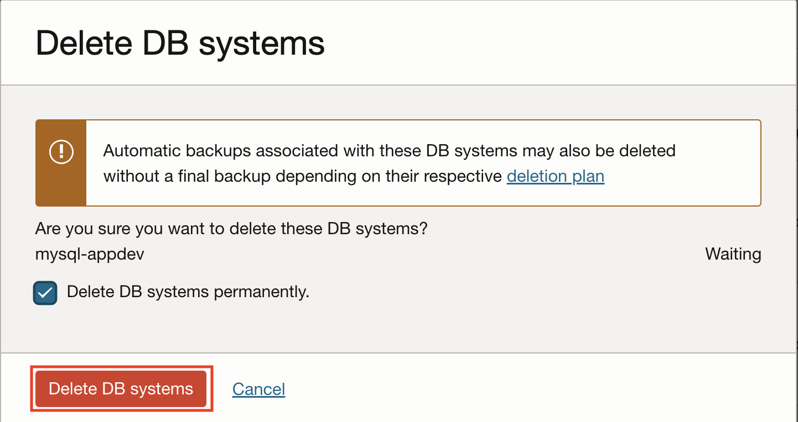
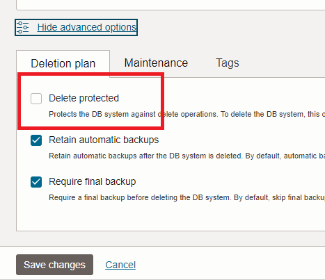
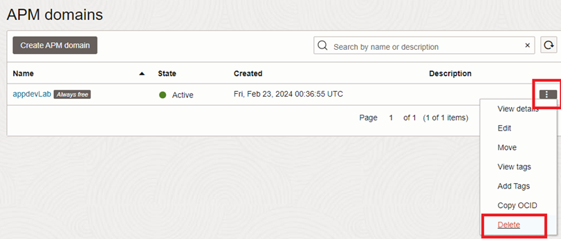
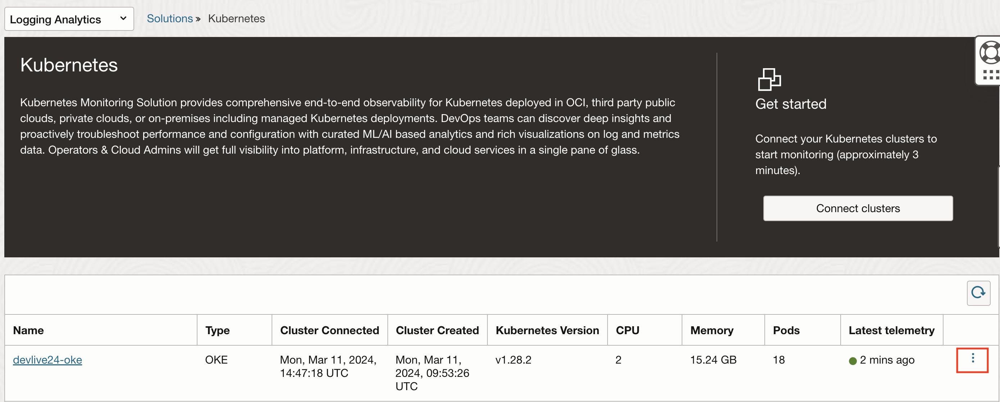
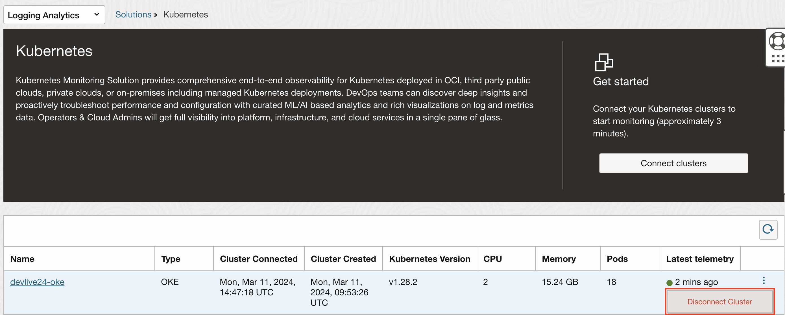
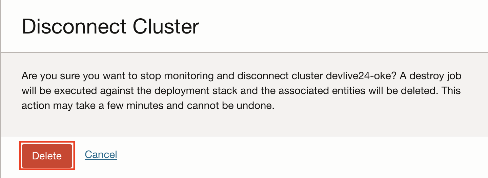
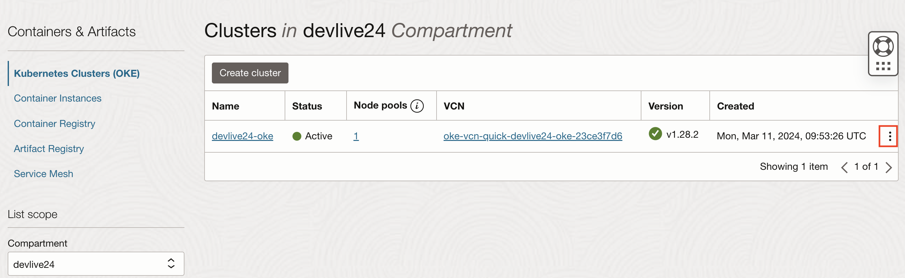
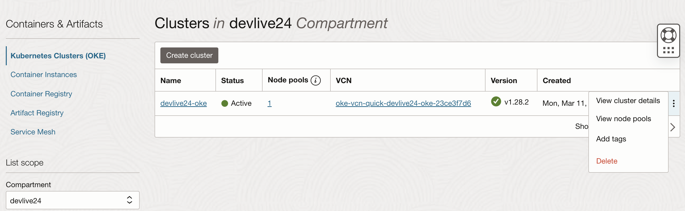
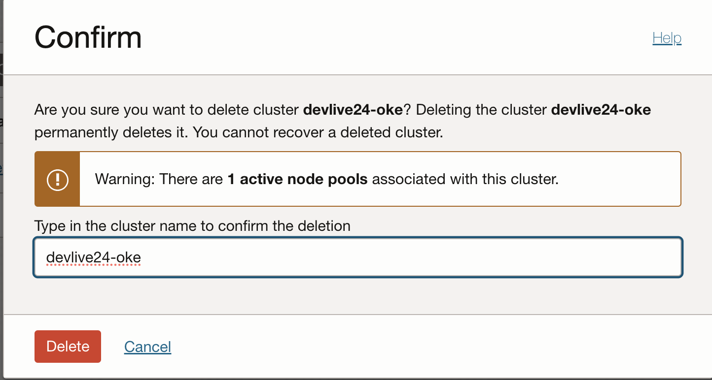

# Clean up the workshop environment

## Introduction

In this lab, you will clean up the workshop environment by running commands from the Cloud shell, also manually removing the Oracle cloud resources using the Oracle Cloud console.

Estimated time: 10 minutes

### Objectives

* Remove the lab configurations and resources

### Prerequisites

* Completion of preceding labs in this workshop.

## Task 1: Clean Up the application setup

To delete the workshop setup from your tenancy, follow the steps below using.

1. From the OCI menu, navigate to **Databases** -> **MySQL HeatWave** -> **DB Systems**

2. Click the name of the DB System created in Lab 1. Then click `[More actions]` and choose `[Delete]`.

3. When prompted, click the checkbox to "Delete DB System permanently." and click **`[Delete DB sysme]`**

    

    >**Note:** If Termination Protection is active, you will not be able to delete the DB System. You will instead need to Edit the DB System, locate the advanced settings, uncheck the **Termination Protection** box, and save. It will take a few minutes to update before you can then delete the resource.

    

4. When the resource has been deleted, open Cloud Shell and navigate to **sb-hol** directory. Then run the command to delete the Kubernetes deployments.

    ```bash
    <copy>
    cd ~/oci-devlive-2024/sb-hol
    kubectl delete -f wstore.yaml,admessage.yaml,apmnamespace.yaml,customapmresource.yaml
    </copy>
    ```

    - Allow a minute or so for the resources to be deleted.

5. Navigate to the the Terraform directory.

    ```bash
    <copy>
    cd ~/oci-devlive-2024/deployment/terraform
    </copy>
    ```

6. Run the following command to allow Terraform to destroy the remaining resources that were used in this workshop.

    ```bash
    <copy>
    terraform init
    terraform destroy -auto-approve
    </copy>
    ```

7. While the terraform destroy command is running (it may take about 10 minutes), you can minimize Cloud Shell. Using the OCI Menu, navigate to **Observability & Management** -> **Application Performance Monitoring** -> **Administration**

8. Use the menu to the right side of your APM domain to delete it.

    

9. Use the OCI Menu to navigate to  **Observability & Management** -> **Logging Analytics** -> **Solutions** -> **Kubernetes**. Locate the cluster created in lab 1. 

    

    

    


10. Use the OCI Menu to navigate to  **Developer Services** -> **Containers & Artifacts** -> **Kubernetes Clusters (OKE)** -> **Kubernetes**. Locate the cluster created in lab 1. 

    
    
    

## Acknowledgements

* **Author** - Anand Prabhu, Principal Member of Technical Staff, Enterprise and Cloud Manageability
- **Contributors** -
Yutaka Takatsu, Senior Principal Product Manager,  
Avi Huber, Vice President, Product Management
Eli Schilling, Developer Advocate
* **Last Updated By/Date** - Eli Schilling, February 2024
