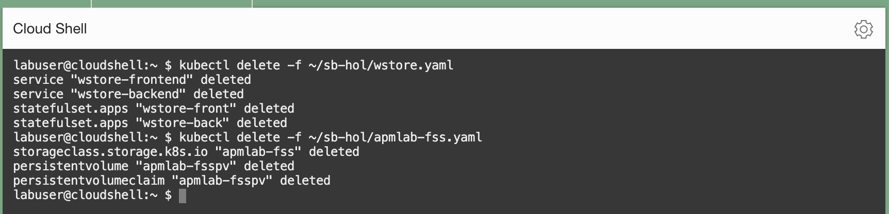
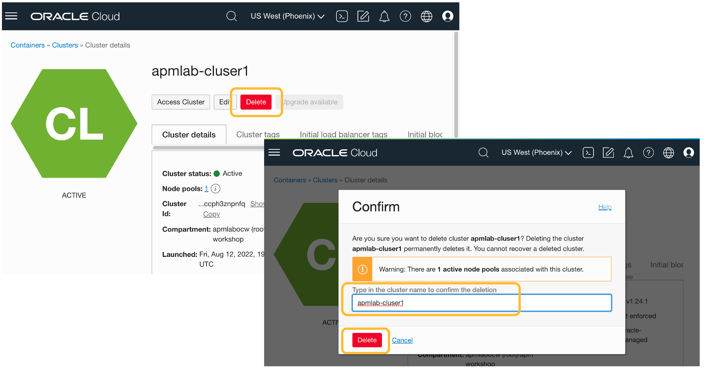
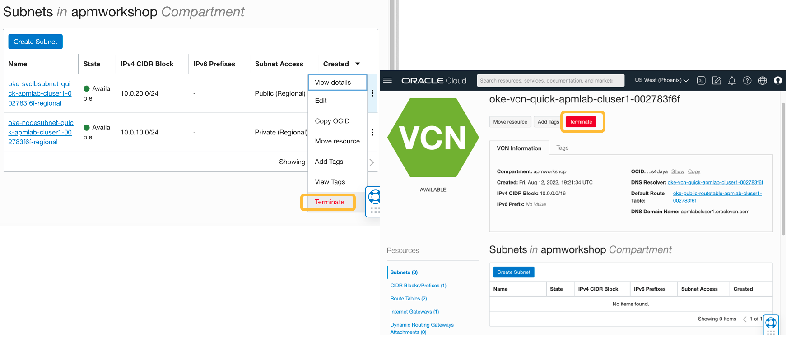

# Clean up the workshop environment

## Introduction

In this lab, you will clean up the workshop environment by running commands from the Cloud shell, also manually removing the Oracle cloud resources using the Oracle Cloud console.

Estimated time: 10 minutes

### Objectives

* Remove the lab configurations and setups

### Prerequisites

* Completion of preceding labs in this workshop.

## Task 1: Clean Up the application setup

To delete the workshop setup from your tenancy, follow the steps below.

1. Run the oci ce (Container Engine) command that you saved in Lab 3, Task 2, step 5.

2. Remove the application deployment.

    ``` bash
    <copy>
    kubectl delete -f ~/sb-hol/wstore.yaml
    </copy>
    ```

3. Remove the storage configuration from the cluster.

    a) If you created a file system, run the command below.
    ``` bash
    <copy>
    kubectl delete -f ~/sb-hol/apmlab-fss.yaml
    </copy>
    ```
    

    b) If you created block volumes, run the command below.

    ``` bash
    <copy>
    kubectl delete -f ~/sb-hol/apmlab-pvc.yaml
    </copy>
    ```


## Task 2: Remove the Target Mount and the File System

If you created a file system, complete steps 1 - 6 below. If you created block volumes instead, please proceed to the next Task.

1. From the navigation menu in the Oracle Cloud console, select **Storage** > **Mount Target**.
   Then click the link to the MountTarget configured in the workshop.

    

2. In the **Mount Target Details** page, click **Delete**. In the confirmation window, click **Delete**.

        

3. Deletion of the Mount Target starts and completes.

        

4. From the navigation menu in the Oracle Cloud console, select **Storage** > **File Systems**. Then click the link to the File System configured in the workshop.

           

5. In the **File System Details** page, click **Delete**. In the confirmation window, click **Delete**.

        

6. Deletion of the File System starts and completes.

        


## Task 3: Remove the container

1. From the navigation menu in the Oracle Cloud console, select **Developer Services** > **Kubernetes Container(OKE)**. Then click the link to the Cluster configured in the workshop.

           

2. In the **Cluster Details** page, click **Delete**. In the confirmation window, enter the name of the cluster, then click **Delete**.

        

3. Deletion of the File System starts and completes.

      

## Task 4: Remove the VCN

1. From the navigation menu in the Oracle Cloud console, select **Networking** > **Virtual Cloud Networks**. Then click the link to the VCN configured in the workshop.

           

2. In the **Virtual Cloud Network Details** page, scroll down to locate the **Subnets** section. Select one of the subnets and click the three-dot icon on the right-hand side of the row.

        

3. From the pulldown menu, select **Terminate**. In the confirmation window, click **Terminate**.

          

4. Repeat to terminate other subnets. Once all the subnets are deleted, from the upper side of the VCN details page, click **Terminate** to remove the VCN.

        

5. **Delete Virtual Cloud Network** dialog opens. Click **Scan**.


        


6. Click the **Terminate All** button when activated. Termination of the resources begins. Once the message **Virtual Cloud Network termination complete** shows, click **Close**.
        

## Task 5: Remove the workshop directory

1. Open the Oracle Cloud shell, and run the following commands to remove the files and the workshop directory.

    ``` bash
    <copy>
    cd ~; rm apm-java-agent-installer-*.jar; rm index.html; rm -r sb-hol;rm sb-hol.zip
    </copy>
    ```
      

## Task 6: Remove the APM domain and compartment

   1. From the navigation menu in the Oracle Cloud console, select **Observability & Management** > **Administration**. Then click the link to the APM domain which you created in the workshop.
      

   2. In the **Domain details** page, click **Delete**. In the confirmation window, enter the name of the APM domain, then click **Delete**.   
      

   3. Deletion of the APM domain starts and completes. This may take a few minutes. Refresh the screen periodically and check the status.
      

   4. From the navigation menu in the Oracle Cloud console, select **Identity & Security** > **Compartment**. Then click the link to the compartment which you created in the workshop.  
         

   5. In the **Compartment details** page, click **Delete**. In the confirmation window, click **Delete**.  
      

   6. Deletion of the compartment starts and completes. This may take a few minutes.   
         


## Acknowledgements

* **Author** - Anand Prabhu, Principal Member of Technical Staff, Enterprise and Cloud Manageability
- **Contributors** -
Yutaka Takatsu, Senior Principal Product Manager,  
Avi Huber, Vice President, Product Management
* **Last Updated By/Date** - Anand Prabhu, January 2024
