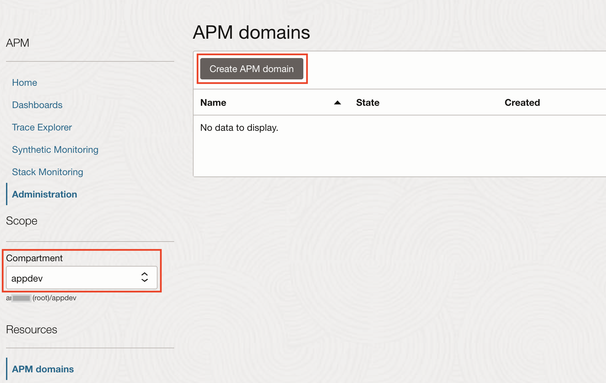

# Create an APM Domain and obtain Data Upload Endpoint and Private Data Key

## Introduction

In this lab, you will create an APM Domain. You will acquire a Data Upload Endpoint and a Private Data Key, which are needed to configure the APM Tracer in the application.

Estimated time: 5 minutes

### Objectives

*	Create an APM Domain
*	Obtain a Data Upload Endpoint and a Private Data Key

## Task 1: Create an APM domain

1.	From the OCI menu, select **Observability & Management**, then **Administration**.
	

2. Select the **appdev** compartment from the dropdown and click Create APM domain 
	

4.	Name your APM domain as **apm-appdev** and select **appdev** compartment from the dropdown. click **Create**.
  

5. Press the refresh button periodically to check the status. This may take a few minutes.
  

6.	Once the job is completed, the status turns to Active with a green icon.
  

## Task 2: Obtain Data Upload Endpoint and Private and Public Data Keys

To upload tracing data to an APM domain, Data Upload Endpoint and both Private and Public Data Keys must be configured in the application’s configuration files. 

1.	Click the link to the APM domain.
  

2. In the **APM Domain Information** tab, find **Data Upload Endpoint**
  - Under **Resources**, click **Data Keys**.
    - find **auto\_generated\_private_data\_key**. 
    - find **auto\_generated\_public_data\_key**. 

   Copy data upload endpoint and data keys (private and public) to a file to be used in later tasks in the workshop. 

  

  You may now proceed to the [next lab](#next).

## Acknowledgements

* **Author** - Anand Prabhu, Principal Member of Technical Staff, Enterprise and Cloud Manageability
- **Contributors** -
Yutaka Takatsu, Senior Principal Product Manager,  
Avi Huber, Vice President, Product Management
* **Last Updated By/Date** - Anand Prabhu, January 2024
