# Deploy a microservices application

## Introduction

This workshop uses Spring Boot-based Java microservices as a target application to configure and enable Open Telemetry instrumentation. In this lab, you will deploy the application to the Kubernetes cluster you created in Lab 1.

Estimated time: 10 minutes

### Objectives

* Deploy a microservices application with Open Telemetry Instrumentation 

### Prerequisites

* Completion of the preceding labs in this workshop

## Task 1: Verify OKE

1. Go back to the Kubernetes cluster page where you left Lab 1, and check the status of the cluster. Open the navigation menu from the top left corner (aka. hamburger menu) in the Oracle Cloud console, and select **Developer Services** > **Kubernetes Clusters (OKE)**.

   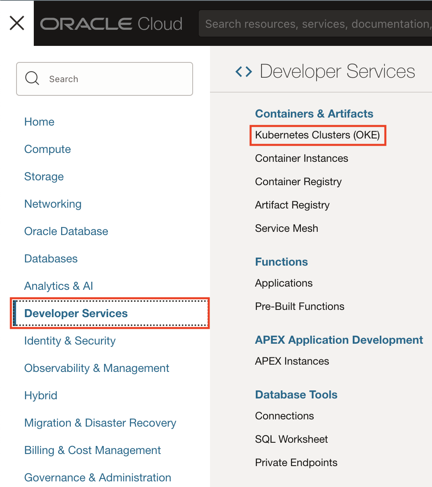

2. Click the **k8-appdev** link from the table.

   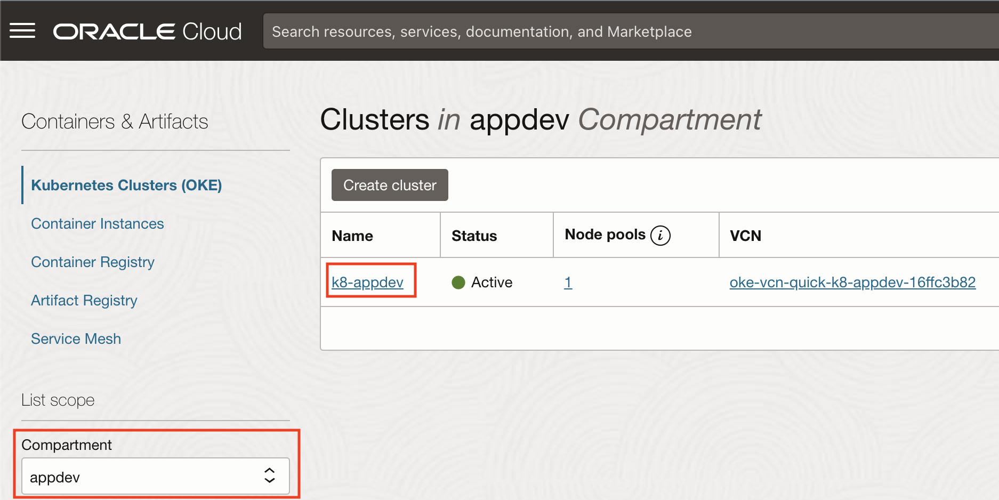

3. If the status of the cluster is **Active**, creation was successful. If it is still in a **Creating** status, it may take a few more minutes to complete. (Usually, it takes 7 to 10 minutes to finish the jobs to create a cluster).

   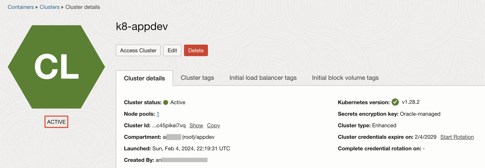

## Task 2: Access the OKE in the Oracle Cloud shell


1. Click **Access Cluster** on the cluster details page.

  

2. Make sure the **Cloud Shell Access** is selected. Click the **Copy** link from the command to access kubeconfig for the cluster.

  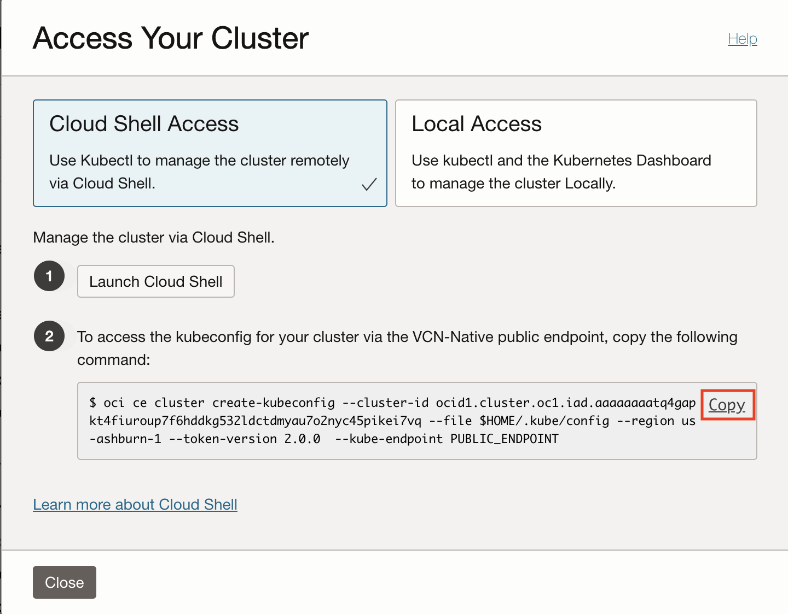

3. Then click **Launch Cloud Shell**.

  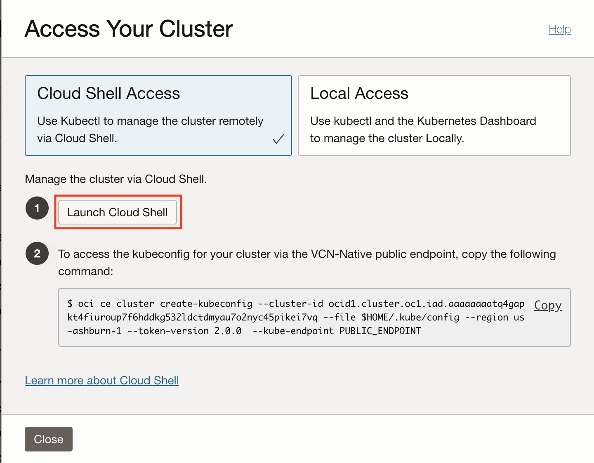

4. Oracle Cloud Shell window opens at the lower side of the browser screen and paste the copied command to the command shell prompt. Then hit enter.   

  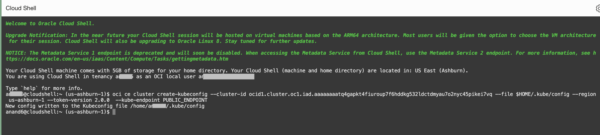

  >**Note:** Save the command to a text file on your laptop, and execute it whenever you start a new Cloud Shell session while working in the labs in this workshop.


## Task 3: Prepare Database for the application 

1. Install MySQL client to connect to the MySQL HeatWave Database from cloud shell 
    ```
    <copy>
    kubectl run mysql-client --image=iad.ocir.io/axfo51x8x2ap/load-mysql-data:latest -it --rm --restart=Never -- /bin/bash
    </copy>
    ```
    

2. Execute below command to connect to MySQL HeatWave Database using Private IP of the database and admin credentials provided during database creation. 
    ```
    <copy>
    mysql -h <mds-private-ip-address> -u <mds-admin-user> -p
    </copy>
    ```
    

3. Execute below command to create a "WINE" application database and tables required for the application 
    ```
    <copy>
    source insert_100_mysql.sql
    </copy>
    ```
    

4. Execute **exit** to exit from the mysql client and execute **exit** again to exit from mysql pod to kubectl session.

    

  >**Note:** Now the database is prepared with necessary tables and records. Please proceed to the next task.

## Task 4: Download configuration files

1. Download the zip file to the home directory in the Cloud Shell.

    ``` bash
    <copy>
    cd ~; wget https://objectstorage.us-phoenix-1.oraclecloud.com/n/axfo51x8x2ap/b/apmocw-bucket-2022/o/sb-hol.zip
    </copy>
    ```
    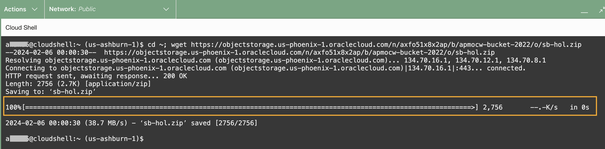

3. Unzip the file. This will create a directory **sb-hol**.

    ``` bash
    <copy>
    unzip ~/sb-hol.zip
    </copy>
    ```

  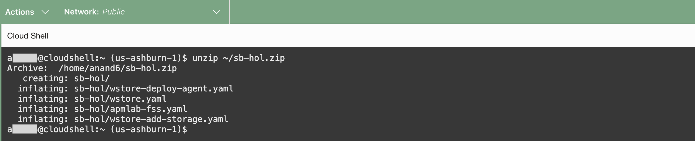

## Task 5: Deploy the application

1. Execute the following command from the Cloud Shell.

    ``` bash
    <copy>
    cd ~/sb-hol;ls
    </copy>
    ```
  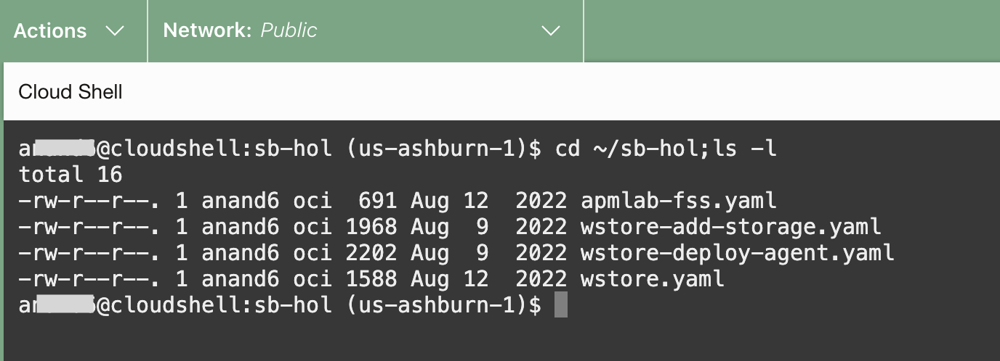

    >**Note:** Verify there are the following files in the folder.
    - apmlab-fss.yaml
    - wstore.yaml
    - wstore-add-storage.yaml
    - wstore-deploy-agent.yaml

2. create a new file wineapp.yaml to deploy the application to the Kubernetes Cluster

    ```
    <copy>
    vi wineapp.yaml
    </copy>
    ```
  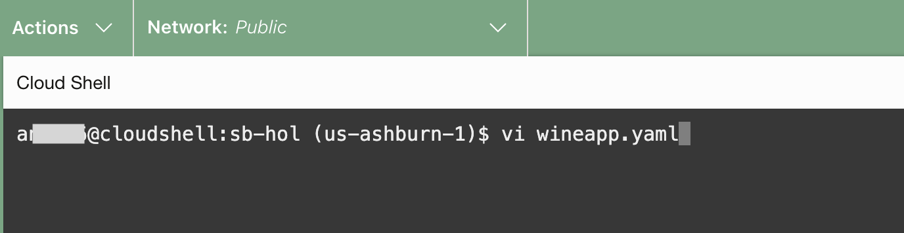
  Copy the below file content and 
   - modify **<apm-endpoint>** with APM endpoint saved in file in lab 4(line 53 and 86)
   - modify **<apm-private-data-key>** with APM private data key saved in file in lab 4(line 55 and 88)
   - modify **<mds-private-ip-address>** with MySQL HeatWave Database Private IP (line 81)

    ```
    <copy>
    apiVersion: v1
    kind: Service
    metadata:
      name: wstore-frontend
    spec:
      type: LoadBalancer
      selector:
        app: wstore-front
      ports:
        - protocol: TCP
          port: 80
          targetPort: 8080
      externalTrafficPolicy: Local
    ---
    apiVersion: v1
    kind: Service
    metadata:
      name: wstore-backend
    spec:
      type: NodePort
      selector:
        app: wstore-back
      ports:
        - protocol: TCP
          port: 8080
          targetPort: 8080
    ---
    apiVersion: apps/v1
    kind: StatefulSet
    metadata:
      name: wstore-front
    spec:
      serviceName: "wstore-frontend"
      replicas: 1
      selector:
        matchLabels:
          app: wstore-front
      template:
        metadata:
          annotations:
            instrumentation.opentelemetry.io/inject-java: "opentelemetry-operator-system/inst-apm-java"
          labels:
            app: wstore-front
        spec:
          containers:
          - name: wstore
            image: iad.ocir.io/axfo51x8x2ap/p-winestore:latest
            command: ["java", "-jar", "./wineStore.jar", "--spring.config.location=file:/spring/wstore.properties"]
            ports:
            - containerPort: 8080
            env:
              - name: com_oracle_apm_agent_data_upload_endpoint
                value: <apm-endpoint>
              - name: com_oracle_apm_agent_private_data_key
                value: <apm-private-data-key>
              - name: com_oracle_apm_agent_service_name
                value: wstore-front
          imagePullSecrets:
              - name: ocirsecret
    ---
    apiVersion: apps/v1
    kind: StatefulSet
    metadata:
      name: wstore-back
    spec:
      serviceName: "wstore-backend"
      replicas: 2
      selector:
        matchLabels:
          app: wstore-back
      template:
        metadata:
          annotations:
            instrumentation.opentelemetry.io/inject-java: "opentelemetry-operator-system/inst-apm-java"
          labels:
            app: wstore-back
        spec:
          containers:
          - name: wstore
            image: iad.ocir.io/axfo51x8x2ap/p-winestore:latest
            command: ["java", "-jar", "./wineStore.jar", "--spring.config.location=file:/spring/wstore.properties", "--wineStore.db.url=jdbc:mysql://<mds-private-ip-address>/wine", "--wineStore.db.password=O&Mdemo1", "--wineStore.checkout.checkout_report=false"]
            ports:
            - containerPort: 8080
            env:
              - name: com_oracle_apm_agent_data_upload_endpoint
                value: <apm-endpoint>
              - name: com_oracle_apm_agent_private_data_key
                value: <apm-private-data-key>
              - name: com_oracle_apm_agent_service_name
                value: wstore-back
          imagePullSecrets:
              - name: ocirsecret
    </copy>
    ```

  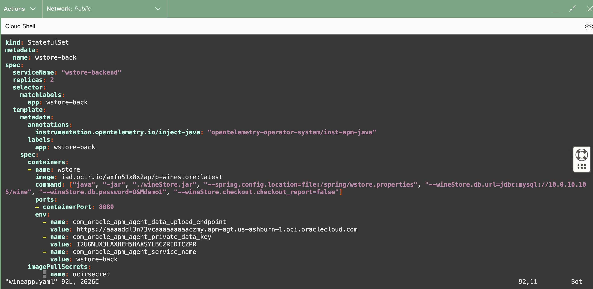

  create a new file **customResource.yaml** with the contents below to enable Open Telemetry instrumentation of the application

    ```
    <copy>
    apiVersion: opentelemetry.io/v1alpha1
    kind: Instrumentation
    metadata:
      name: inst-apm-java
      namespace: opentelemetry-operator-system
    spec:
      java:
        image: iad.ocir.io/axfo51x8x2ap/apm-java-agent-aio:1.11.1.7
    </copy>
    ```

  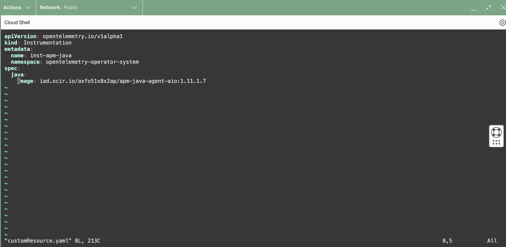


  Execute the command below to deploy the application to the cluster.
    ``` bash
    <copy>
    kubectl apply -f ~/sb-hol/wineapp.yaml --validate=false
    </copy>
    ```

## Task 6: Launch the application
1. Verify the 2 services and 2 stateful sets are created
  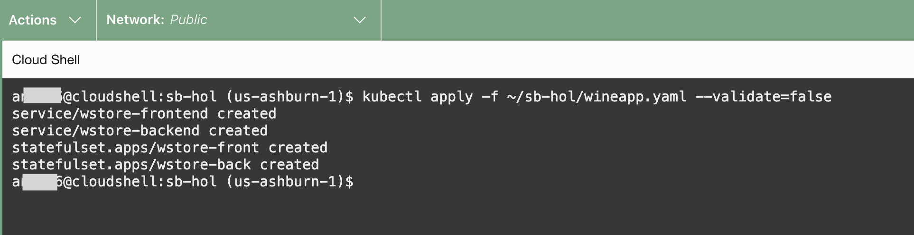
  
2. Run the kubectl command below to display the status of the pod creation. Wait until the statuses become 'Running'. This may take a few minutes.

    ``` bash
    <copy>
    kubectl get pods
    </copy>
    ```
  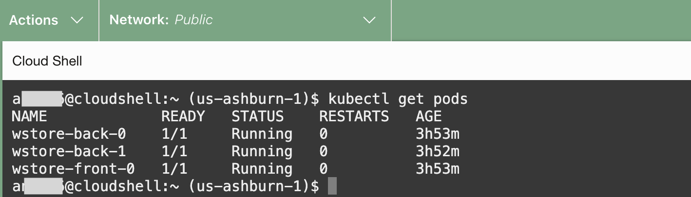

3. Run the kubectl command below to display the deployed services.

    ``` bash
    <copy>
    kubectl get svc
    </copy>
    ```

4. Copy the External IP of the wstore-frontend service
  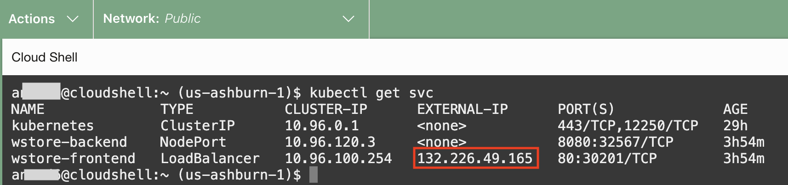

5. Refer to the below example and construct a URL, and paste it into a browser's address bar. If you see the WineCellar content as in the below screenshot, the deployment was successful.

    ``` bash
    <copy>
    http://<IP of the wstore-frontend service>/winestore/
    </copy>
    ```
  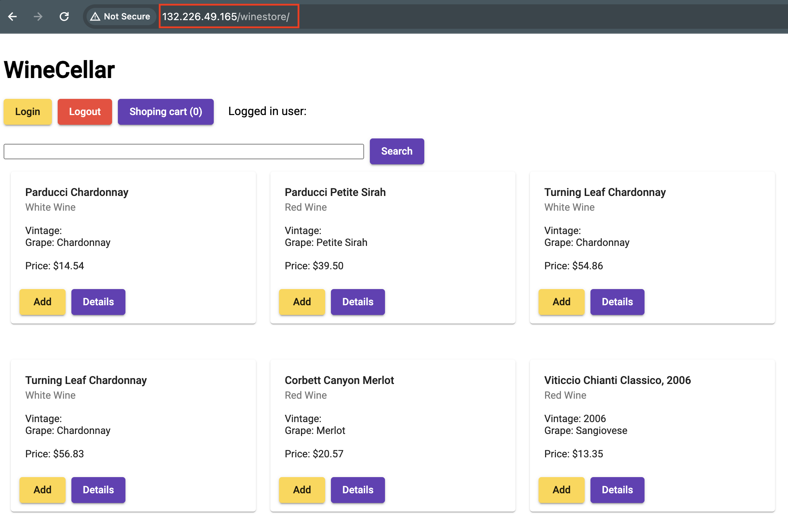

    >**Note:** It may take a few minutes to complete the deployment and start loading the page content on the screen for the first time.  


You may now **proceed to the next lab**.

## Acknowledgements

* **Author** - Anand Prabhu, Principal Member of Technical Staff, Enterprise and Cloud Manageability
- **Contributors** -
Yutaka Takatsu, Senior Principal Product Manager,  
Avi Huber, Vice President, Product Management
* **Last Updated By/Date** - Anand Prabhu, January 2024