#  Setting up Database Management for Oracle Autonomous Databases

## Introduction

In this lab, you will go through the steps to set up Database Management for Oracle Autonomous Databases.

Database Management service now also supports Oracle Autonomous Databases. You can use Database Management to monitor a single Autonomous Database or a fleet of Autonomous Databases and obtain meaningful insights from the metrics pushed to the Oracle Cloud Infrastructure Monitoring service.

Estimated Time: 30 minutes

### Objectives

Set up Database Management to monitor and manage Oracle Autonomous Databases.

### Prerequisites

This lab assumes you have completed the following labs:
* Lab 4 : Prerequisite: Create a dynamic group and policies for agent communication
* Oracle Autonomous Database - Please check documentation to [Create an Autonomous Database on Shared Exadata Infrastructure] ( https://docs.oracle.com/en-us/iaas/Content/Database/Tasks/adbcreating.htm).

## Task 1: Assign IAM permissions

1.  From the Oracle Cloud console navigation menu located in the upper left, click **Identity & Security**. Under **Identity**, click **Policies**.

    

2. Click the existing policy **Policy-for-dbmgmt-group**. On the **Policy Detail** page click **Edit Policy Statements**.

    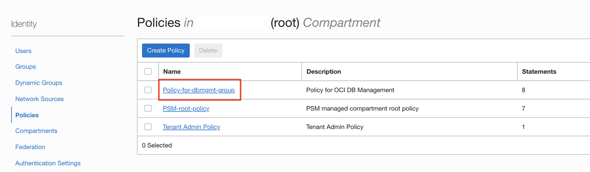

    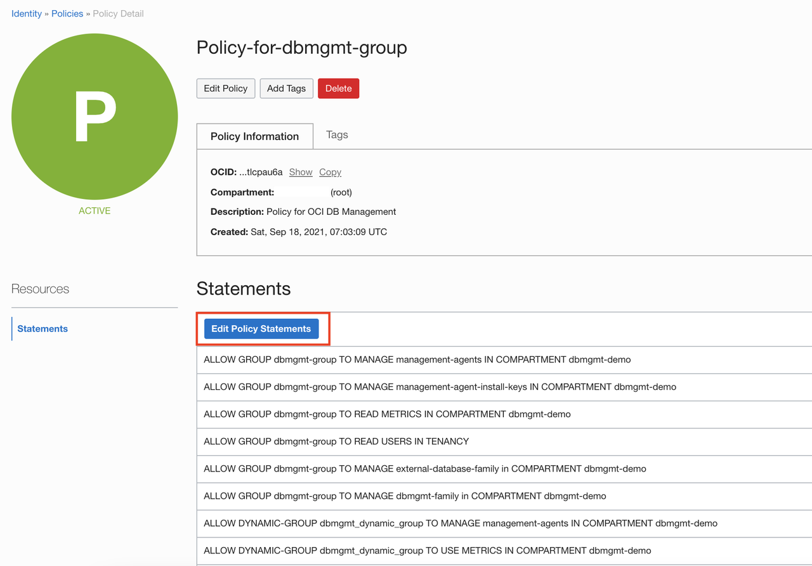

3. On the **Edit Policy Statements** page, click **+Another Statement**

    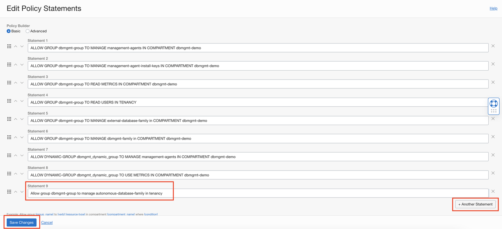

    Enter the statement

    ```
    <copy>
    Allow group dbmgmt-group to manage autonomous-database-family in tenancy
    </copy>
    ```

    Click **Save Changes**.

## Task 2: Enable Database Management for Oracle Autonomous Databases

1.  From the Oracle Cloud Console **Navigation menu** located in the upper left, click **Oracle Database**. Under **Overview**, click **Autonomous Database**.

    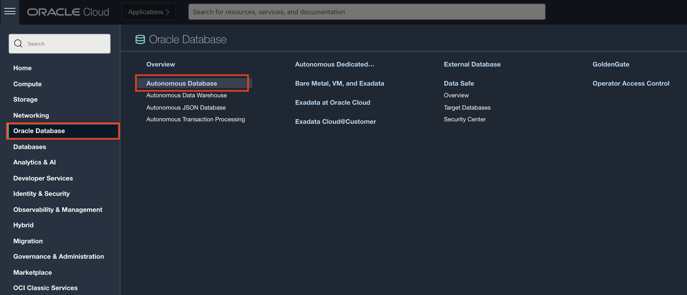

2.  On the **Autonomous Databases** page, click the Autonomous Database that was provisioned earlier or the Autonomous Database for which you want to enable Database Management.

    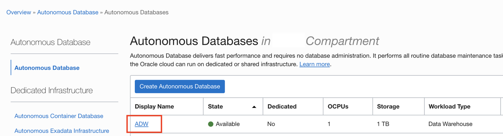

3.  On the **Autonomous Database Details** page, under **Associated Services**, click **Enable** next to **Database Management**.

    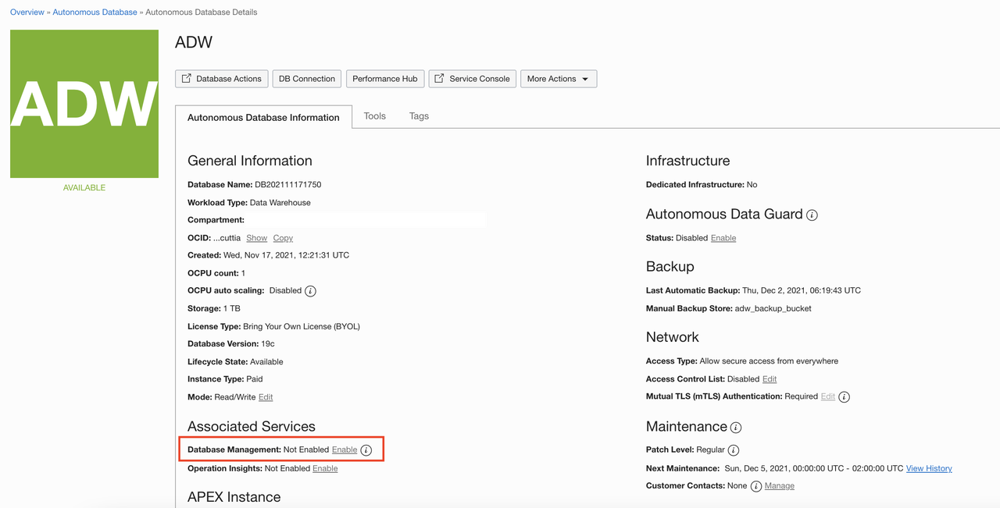

4.  In the **Enable Database Management** dialog, click **Enable**.

    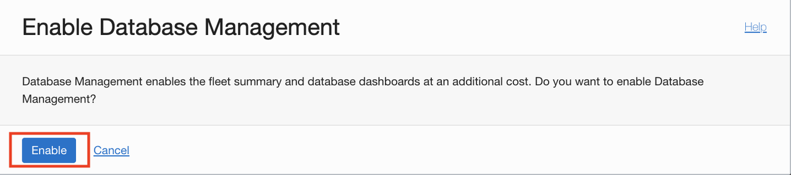

5.  After you enable Database Management, you can click the **Work Requests** on the left pane under **Resources** to monitor the progress of the work request.

6.  After Database Management is successfully enabled, the **Enable** option next to **Database Management** on the **Autonomous Database Details** page is replaced with **Enabled**. A **Disable** option is also displayed, which you can click to disable Database Management.

    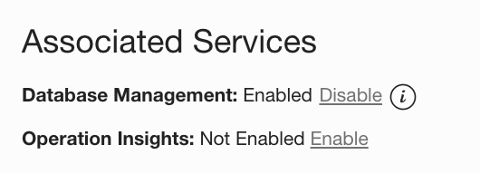

7.  From the Oracle Cloud Console **Navigation menu** located in the upper left, click **Observability & Management**. Click **Database Management**.

    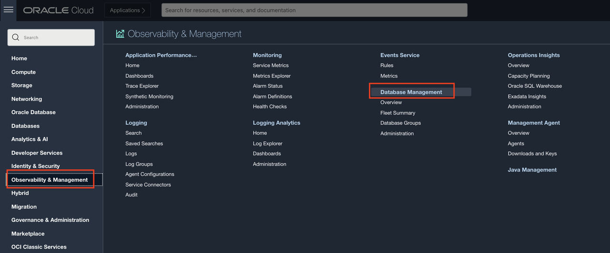

8.  On **Database Management** page, click **Fleet Summary** from **Database Management** pane on the left.

    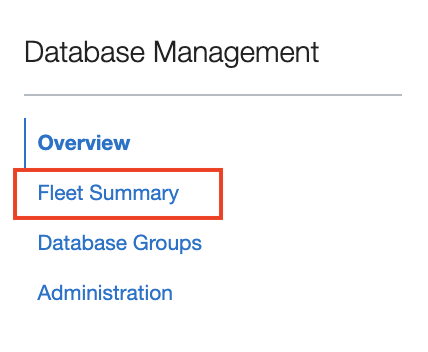

    This will display the list of all databases for which Database Management has been enabled.

9.  Click the Autonomous Database for which we just enabled Database Management to view **Managed Database Details**.

    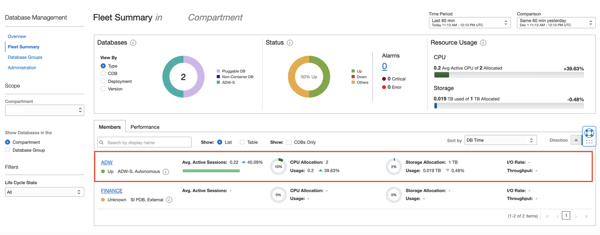

    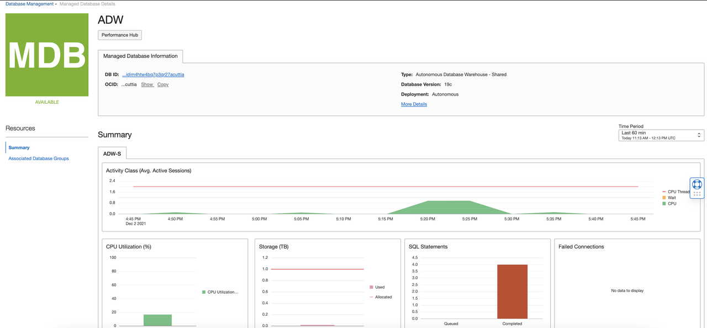

    For ASH Analytics & SQL Monitoring, click **Performance Hub** on the **Managed Database Details** page.

## Acknowledgements

- **Author** - Vivek Verma, Principal Cloud Architect, North America Cloud Engineering
- **Contributors** - Vivek Verma, Sriram Vrinda, Pratima Chennupati
- **Last Updated By/Date** - Vivek Verma, December 2021
