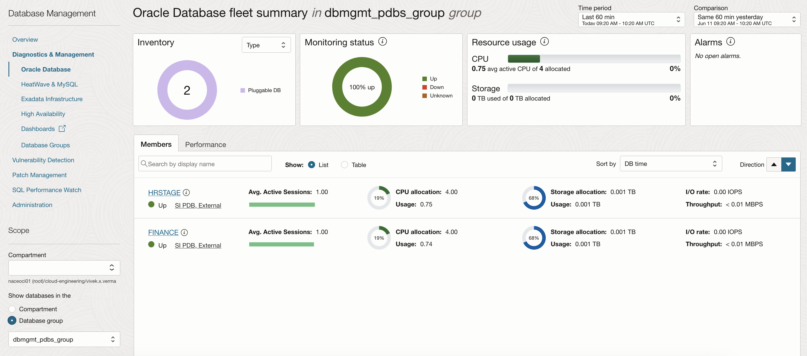
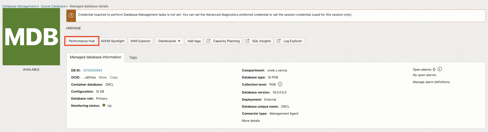

# Exploring Oracle Cloud Infrastructure Database Management

## Introduction

Database Management provides a single-pane-of-glass view of your fleet of on-premises and cloud databases in OCI, and enables you to detect issues across the fleet and respond to performance and configuration alerts. Here are some of the tasks you can perform using Database Management, which are categorized under database monitoring and management areas.

Fleet Monitoring and Management
-   Obtain an overview of your fleet of databases.
-   View the reports of the database fleet to obtain an insight into the overall health of the databases.
-   Automate database fleet management for enhanced operational efficiency.

Performance Diagnostics
-   Diagnose database performance issues quickly.
-   Explore database performance statistics for advanced diagnostics.

Database Administration
-   Enable SQL jobs to automate a scheduled database maintenance task across all databases in the fleet.

Estimated Time: 30 minutes

### Objectives

-   Use Oracle Cloud Infrastructure Database Management to manage fleet of Oracle Databases.

### Prerequisites

This lab assumes you have already completed the following:
- An Oracle Free Tier, Always Free, Paid or LiveLabs Cloud Account
- Create a SSH Keys pair

## Task 1: Getting Started with Database Management

1.  Login to the Oracle Cloud Console, click the **Navigation Menu** in the upper left, navigate to **Observability & Management**, and select **Database Management**.

     

     

2.  The **Databases** tile (on the **Overview** page) displays the total number of Oracle Databases in the compartment and the number of Oracle Databases for which Database Management is enabled.

## Task 2: Monitoring a Fleet of Databases

1.  On the left pane, click **Fleet Summary** to navigate to the **Fleet Summary** page. The dbmgmt-demo compartment is selected by default in the Compartment field.

     

2.  The following tiles are available on the **Fleet Summary** page:

    - Databases: Displays the number of Oracle Databases (PDB and Non-CDB) in the compartment. Note that this does not show the number of CDBs.
    - Status: Displays the availability status of the Oracle Databases. You can click the **Alarms** link to view the Alarm Status page of the Oracle Cloud Infrastructure Monitoring service.
    -  Resource Usage: Displays a summary of the overall CPU and Storage allocation and utilization and a change percentage that denotes the comparison of resource usage between the selected time and the comparison time period. *Note*: Use the menus at the top-right corner of the page to select two time periods to compare the performance and configuration metrics of the fleet of databases.
    -  Members: Displays a thumbnail view of your Oracle Databases with their name, status, and type. This view is useful if you have a smaller number of databases in your fleet. The **List** view is displayed by default on the Members tab, however, you can select the **Table** option to view the same information in a tabular format.

3.  On **Fleet Summary** page under **Members** tab, by default, you will see only PDBs and non-CDBs in the database fleet.

4.  On **Fleet Summary** page under **Members** tab, select the **Show CDBs Only** check box to view the CDBs in the database fleet.

     

    For each database including the CDB, the following metrics are displayed along with the change percentage that denotes the comparison of database metrics between the selected period and the comparison time period:
    - Avg. Active Sessions: Displays the average active sessions broken down by CPU, User I/O, and Others, which includes different categories within wait time such as System I/O and Commit.
    - CPU: Displays the CPU allocation and usage.
    - Storage: Displays the storage allocation and usage.
    - I/O: Displays the I/O rate and throughput.

5.  On **Fleet Summary** page, click the **Performance** tab. The Performance view displays a tree map of the performance of your Oracle Databases against various database metrics as seen in the **Members** tab. This view is more useful when you have a large number of databases in the fleet. The databases are displayed as a collection of rectangles in different sizes and colors, in which the size of a rectangle indicates the value of the selected metric and the color indicates the change percentage for the selected metric over the selected time period.

## Task 3: Working with Database Groups

1.  Login to the Oracle Cloud Console, click the **Navigation Menu** in the upper left, navigate to **Observability & Management**, and select **Database Management**. Under **Database Management**, click **Database Groups**.

2.  Click **Create Database Group**. In the **Create Database Group** dialog, enter the name you want to assign to the new Database Group ex. dbmgmt\_pdbs\_group, optionally add a description, and click **Create Group**.

     

3.  On the **Database Groups** page, click the group named **dbmgmt\_pdbs\_group**. On the **Database Group Details** page of the **dbmgmt\_pdbs\_group** group, click **Add Managed Database**.

     

4.  In the **Add Managed Database** dialog, select the **FINANCE** and **HRSTAGE** databases, and click **Add**.

     

5.  On the **Database Groups Details** page, click **Fleet Summary**.

     

6.  On the **Fleet Summary** page you will see the summary of databases added to **dbmgmt\_pdbs\_group** Group.

     

## Task 4: Creating and Monitoring Jobs

1.  On the **Database Group Details** page, under **Resources** on the left pane, click **Jobs**. Under **Jobs** click on the **Definitions** tab and then click **Create Job**.

     

2.  You can create a SQL job to perform administrative operations on a single Managed Database or a Database Group.
In the Create Job dialog:

    **Job Name:** Enter a unique name for the job, let us name it as **dbmgmt\_demo\_job**.

    **Job Description:** Optionally, enter a description for the job. Let us add “Query the inventory” as the description.

    **SQL Type:** Select **Query**

    **Compartment:** Let us select the dbmgmt-demo compartment to create the job resource.

    **Timeout:** Select the default value.

    **Provide Schedule Details:** Select the default value.

    **Specify credentials for the connection:** We have to use the same user account (common credential) for all the databases in the group. Let us enter the **dbsnmp** user name and password and select **Normal** in the Role drop-down list.

    **Oracle Object Storage for Job Results:** Select the Oracle Object Storage bucket in which the job results will be stored.

    **SQL Command:** Enter a sql statement to execute on both databases.

    Click **Create Job**.

     
     

3.  Our job is now created and displayed in the Jobs section of the Database Group. The status of the job is Active as it is being executed; we can also see Inactive jobs, which were already executed in the past. Click on the job name to go to **Job Details** page.

     

4.  Click on job runs to get to the **Job Execution Details** page and view the query results.

## Task 5: Monitoring and Managing Individual Databases

1.  On the left pane, click **Fleet Summary** to navigate to the Fleet Summary page. Scroll down to the **Members** tab on the Fleet Summary page.

     

2.  Click the **HRSTAGE** database in the **Members** tab. In the **Managed Database Details** page Scroll down to the **Summary** section.

     

3.  We can monitor database performance attributes in the **Summary** section, for the time period selected in the **Time Period** menu on the top of this page. Last 60 min is the default time period, and the visual representations or charts provide a quick insight into the health of the database during the selected time period.

     **Activity Class (Avg. Active Sessions):** Displays the average active sessions in the selected time period, broken down by CPU, User I/O, and Wait. The total CPU count is denoted by a red line and enables you to monitor average active sessions compared to the CPU count.

     **DB Time (Avg. Active Sessions):** Displays a summary of the average active sessions data broken down by CPU, User I/O, and Wait. The total CPU count is denoted by a red line.

     **I/O:** Displays the I/O Throughput in MBPS and I/O Rate in IOPS broken down by Read and Write operations.

     **Memory:** Displays memory usage in GB, broken down by the memory usage in various components.

     **Storage Usage:** Displays system storage and user data storage in TB. System storage is broken down by usage in system tablespaces and user data, and User Data storage is broken down by usage in the top five user tablespaces. The total storage allocation for the database is denoted by a red line and enables you to monitor storage usage compared to the total allocation.

4.  You can click one of the other options on the left pane under Resources to perform the following tasks:

     - Monitor the tablespaces and data files.
     - View and edit database parameters.
     - Create and manage Jobs and Job executions for the Managed Database.
     - View the Database Groups the Managed Database is a part of, if any.

## Task 6: Performing Database Performance Diagnostics

1.  On the left pane, click **Fleet Summary** to navigate to the **Fleet Summary** page. Scroll down to the **Members** tab and click the **HRSTAGE** database. On the top of the **Managed Database Details** page, click the **Performance Hub** button.

     

2.  This will launch the **Performance Hub** page. Performance Hub provides a single view of the database’s performance and enables you to perform the rapid diagnosis of its issues.

     

     Performance Hub provides holistic performance management capabilities providing a single view of the database performance using a varied set of features, such as Active Session History Analytics, Real-time SQL Monitoring, Automatic Database Diagnostics Monitoring (ADDM), Blocking sessions, and so on.

     **Active Session History Analytics (ASH) Analytics** allows you to analyze and resolve transient performance problems that can last for only a short period, such as why a particular job or session is not responding when the rest of the instance is performing as usual. It also allows you to perform scoped and targeted analysis by various dimensions and their combinations, such as time, session, module, action, or SQL identifier.

3.  Stay in **Performance Hub**, scroll down and click the **SQL Monitoring** tab.

     

     With Real-Time SQL Monitoring, you can perform complex run-time application SQL analysis, identity, and guide optimization of application calls in the data tier.

     Real-Time SQL Monitoring gives you the following capabilities:

     - Observe and analyze important SQL executions in progress (parallel and long-running queries)
     - Perform detailed and comprehensive execution analysis
     - Resource footprint per query plan step
     - Parallel plan skew across query workers
     - Visualize query plans interactively
     - Perform real-time and historical analysis

4.  Stay in **Performance Hub**, scroll down and click the **ADDM** tab.

     

     The statistical data needed for the accurate diagnosis of a problem is saved in the Automatic Workload Repository (AWR) of the Oracle Database. The Automatic Database Diagnostic Monitor (ADDM) analyzes the AWR data regularly, locates the root causes of the performance problems, provides recommendations for correcting any problems, and identifies non-problem areas of the system. You can use ADDM to analyze performance issues after the event, often saving the time and resources needed to reproduce a problem.

     ADDM gives you the following capabilities:

     - Identify the root cause of a problem, not symptoms
     - Get recommendations for treating the root causes of problems
     - Identify non-problem areas of the system

5.  Stay in **Performance Hub**, scroll down and click the **Blocking Sessions** tab.

     

     The **Blocking Sessions** tab displays the current blocking and waiting sessions in a hierarchical display. You can view detailed information about each blocking session and view the sessions blocked by each blocking session. You can also use the tab to inspect or perform deeper analysis of the SQL involved to determine the cause of the blocking. You can perform several operations in the tab, including stopping one or more of the listed sessions to resolve a waiting session problem.

## Acknowledgements

- **Author** - Vivek Verma, Principal Cloud Architect, North America Cloud Engineering
- **Contributors** - Vivek Verma, Sriram Vrinda, Pratima Chennupati
- **Last Updated By/Date** - Vivek Verma, September 2021
