# Explore Oracle Cloud Infrastructure Database Management Demo Mode

## Introduction

Oracle Cloud Infrastructure Database Management provides a single pane of glass to monitor Oracle Databases across cloud and on-premises environments. In this lab, you will use Demo Mode to explore Database Management before onboarding your own resources.

When Demo Mode is enabled, supported Database Management pages display a preconfigured demo environment, using the `dbmgmt` compartment as the primary demo scope. Demo Mode is safe for exploration: you can try supported workflows to see how they behave, but create, update, delete, onboarding, and administration actions are not committed to customer resources.

Demo Mode uses demo-environment data for workload-sensitive surfaces such as Performance Hub, AWR Explorer, and ADDM Spotlight, where available. Some supporting views, such as SQL tuning sets, secrets, credentials, tablespaces, and database parameters, may show curated demo data where live demo resources are not sufficient.

Estimated Time: 1 hour

### Objectives

In this lab, you will:

- Enable Database Management Demo Mode.
- Review the Demo Mode banner and demo environment context.
- Confirm the Demo Mode banner and compartment scope.
- Explore fleet-level database monitoring.
- Drill into managed database details.
- Explore Performance Hub, AWR Explorer, and ADDM Spotlight with demo-environment data, where available.
- Review how Demo Mode handles administration and write flows without committing changes.
- Disable Demo Mode and confirm that your original context is restored.

### Prerequisites

This lab assumes you have:

- Access to an Oracle Cloud Account or LiveLabs environment where Database Management Demo Mode is enabled.
- Required policies for Demo Mode. If policies are missing, the Demo Mode policy panel can guide an administrator through the read-only endorse policy. See **Task 2, step 4**.

No database setup is required for this lab.

## Task 1: Open Database Management

1. Log in to the Oracle Cloud Console.

2. Click the **Navigation menu** in the upper-left corner.

3. Navigate to **Observability & Management**, and then click **Database Management**.

     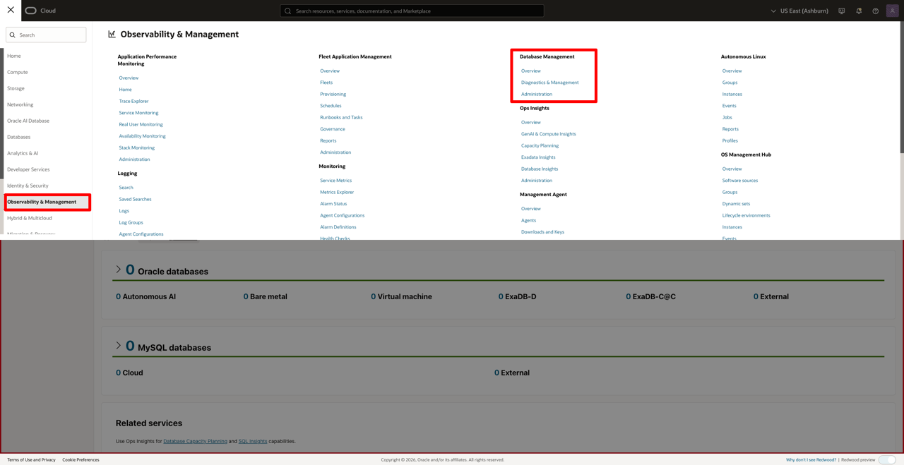

## Task 2: Enable Database Management Demo Mode

1. On the **Database Management** overview page, locate the Demo Mode entry point.

     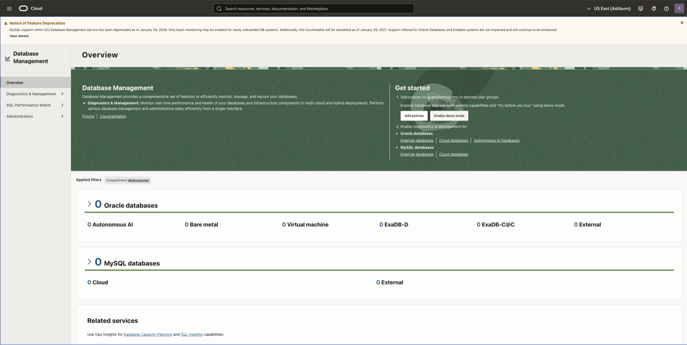

2. Click **Enable Demo Mode**.

3. If the required policies are already available, Demo Mode is enabled and the Demo Mode banner is displayed.

     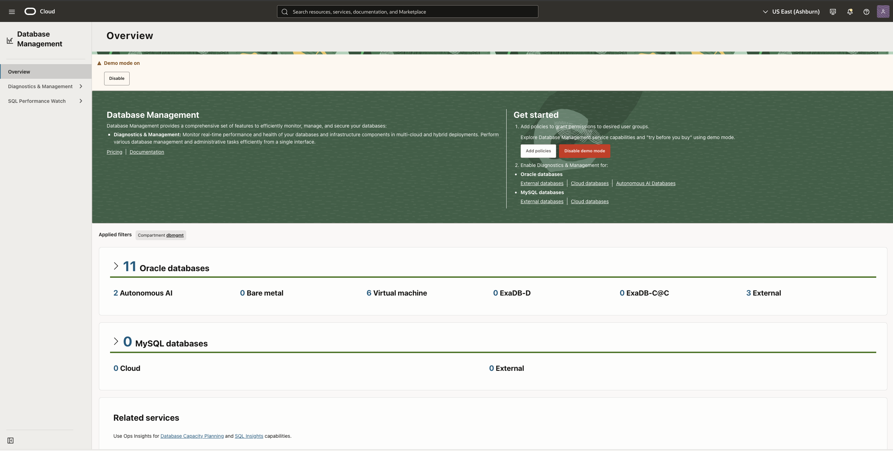

4. If the required policies are missing, review the policy panel. The panel shows the customer-side read-only endorse policy required to access the demo environment.

     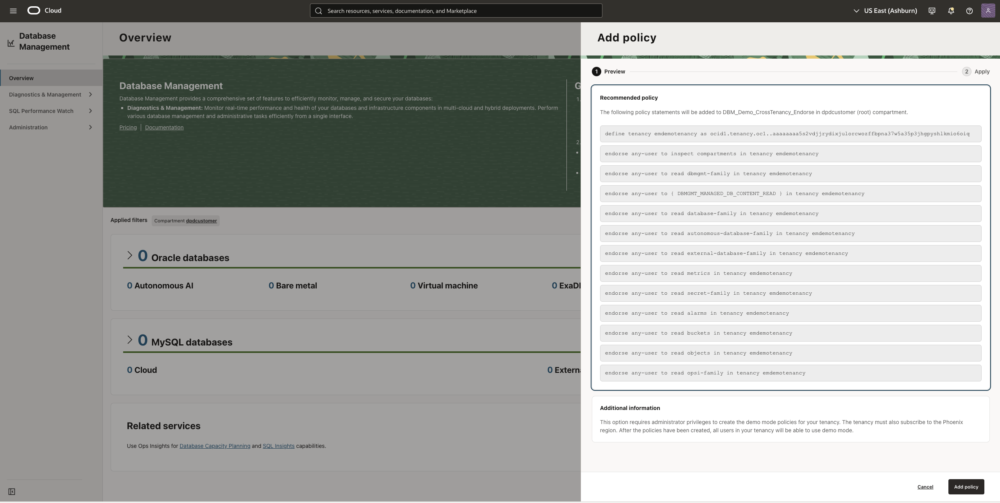

5. After the policies are created or validated, wait for the page to refresh and confirm that Demo Mode is enabled.

**Note:** The policy panel creates or validates the customer-side `DBM_Demo_CrossTenancy_Endorse` policy in the current customer tenancy. It does not create, update, or delete any databases.

## Task 3: Confirm Demo Mode Context

1. Confirm that the Demo Mode banner or indicator is visible.

     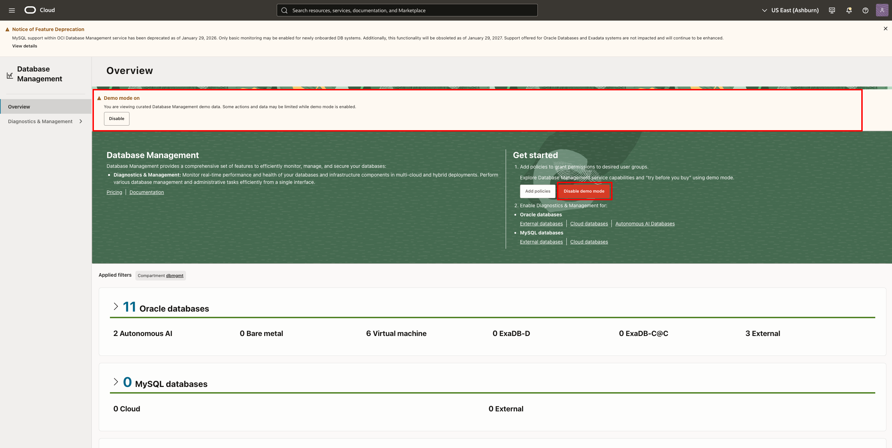

2. Confirm that the applied compartment filter shows `dbmgmt`.

3. Confirm that the compartment selector is hidden or locked while Demo Mode is active.

     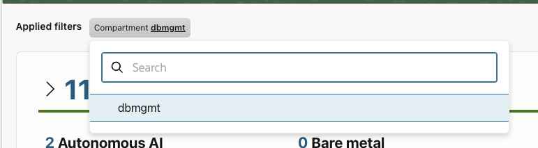

4. Review the Database Management overview cards and counts. The page should show demo-environment data.

     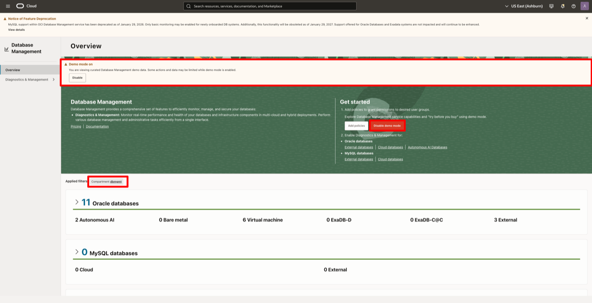

**Note:** The console region selector may continue to display your current region while Demo Mode is active. Continue the lab as long as the Demo Mode banner and `dbmgmt` compartment filter are visible.

## Task 4: Explore Fleet Monitoring

1. On the left pane, expand **Diagnostics & Management**, and then click **Fleet Summary**.

     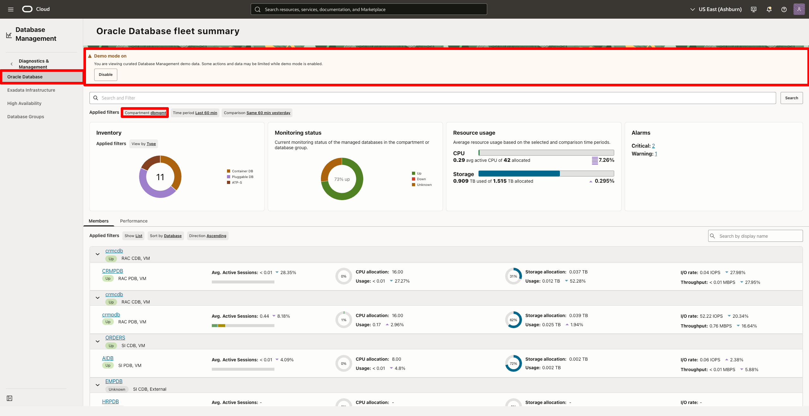

2. Review the summary tiles on the **Fleet Summary** page.

    - **Inventory** displays the number of Oracle Databases in the selected scope.
    - **Status** displays database availability.
    - **Resource Usage** displays CPU and storage allocation and utilization.
    - **Alarms** displays open database alarms by severity.
    - **Members** displays the databases included in the fleet.

3. In the **Inventory** tile, select available options such as **Type**, **Deployment**, **Version**, or **Cluster** to review different database groupings.

     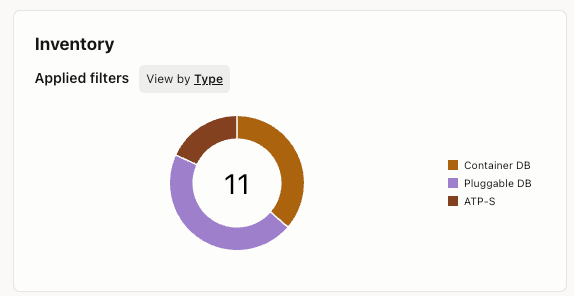

     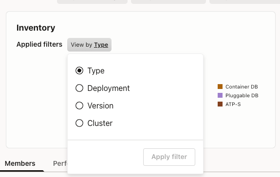

4. Click the **Performance** tab.

     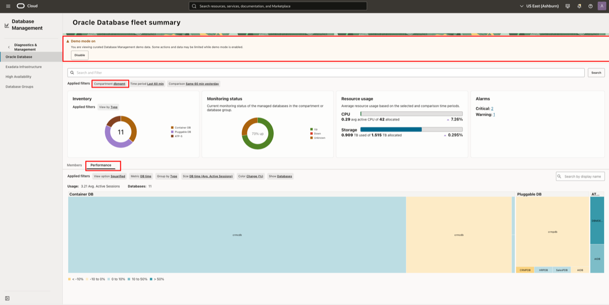

5. Review the performance tree map. The tree map provides a visual summary of database performance across the selected fleet.

## Task 5: Review Database Groups

1. On the left pane, under **Database Management**, click **Database Groups**, if available.

     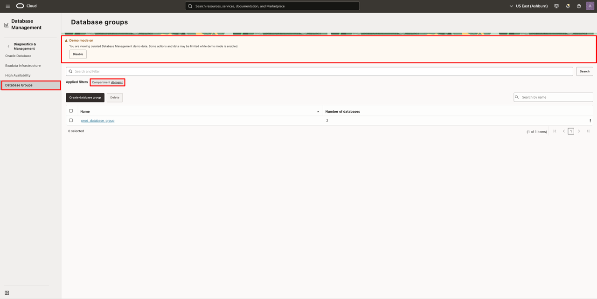

2. Click a database group in the list.

     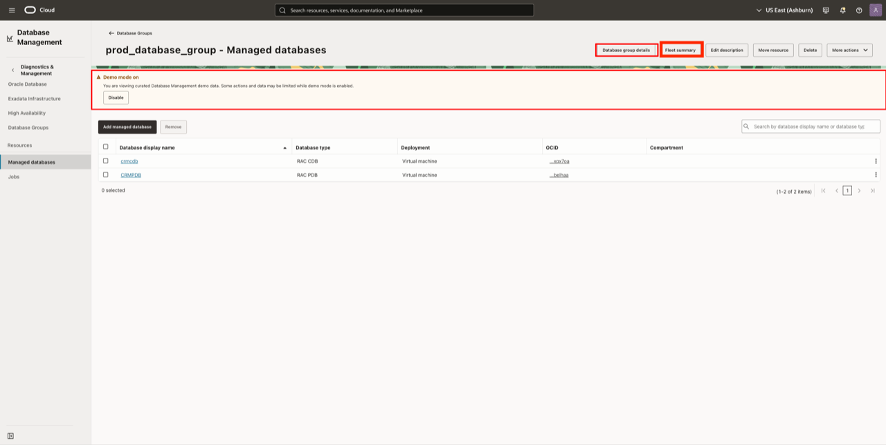

3. On the **Database group details** page, review the managed databases that are part of the group.

     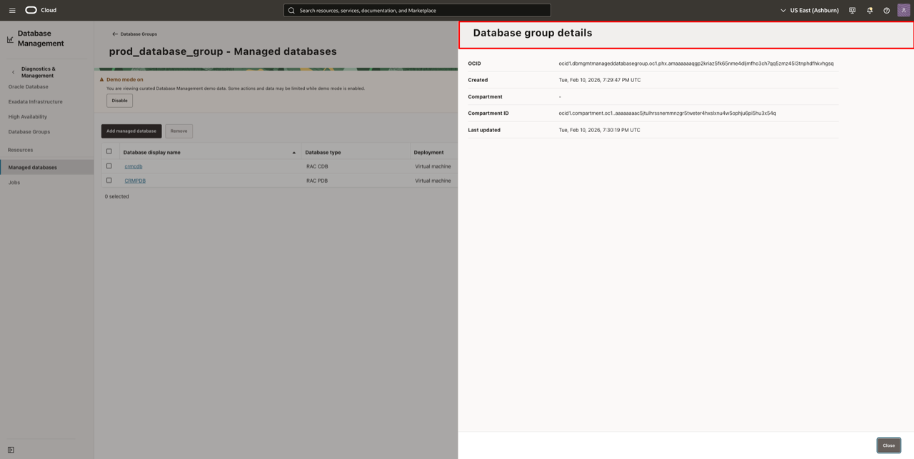

4. Click **Fleet Summary** to review the fleet summary for the selected database group.

     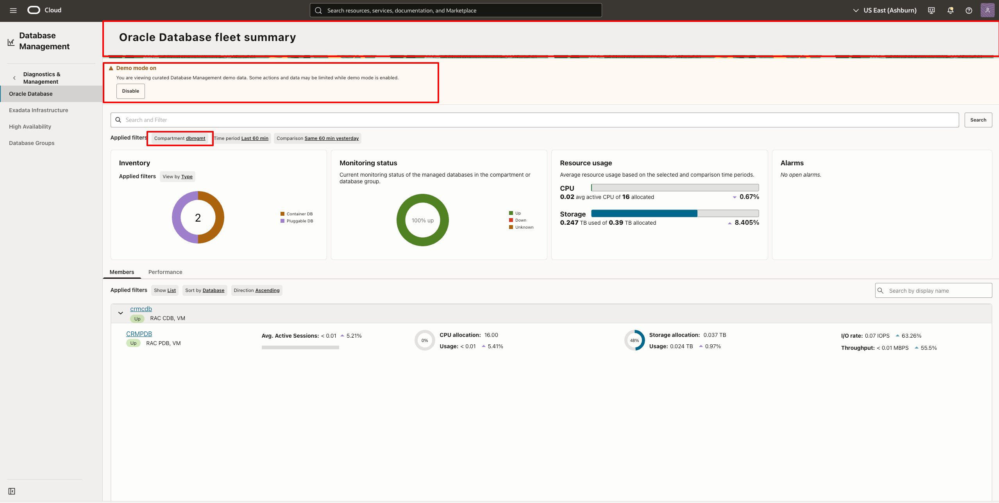

**Note:** Demo Mode is intended for exploration. You can try actions such as editing descriptions, moving resources, or creating jobs to see how the workflows behave, but Demo Mode prevents the actual changes from being applied.

## Task 6: Review Alert Logs

1. Click **Database Management** from the upper-left corner of the page.

2. Click **Fleet Summary** to return to the fleet view.

3. Scroll down to the **Members** section and click a managed database.

     

4. On the left pane, under **Resources**, click **Alert logs**.

     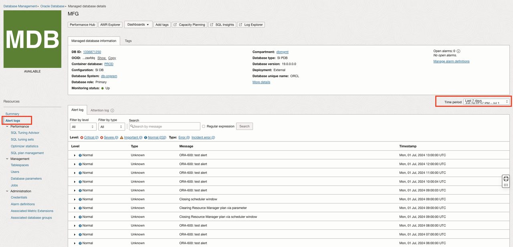

5. Use the available filters to review alert and attention logs for the selected time period.

    - Use **Filter by Level** and **Filter by Type** to narrow the log entries.
    - Use **Search** to find specific messages.

## Task 7: Review Managed Database Details

1. Go back to the **Fleet Summary** page.

2. In the **Members** section, click a managed database.

     

3. On the **Managed database details** page, review the **Summary** section.

     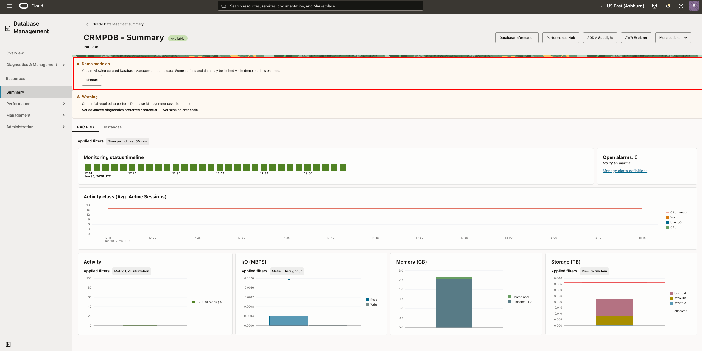

4. Review the monitoring charts available for the selected time period.

    - **Availability timeline** displays database availability during the selected period.
    - **Activity Class** displays average active sessions by wait class.
    - **Activity** displays CPU utilization and DB time.
    - **I/O** displays throughput and I/O rate.
    - **Memory** displays memory usage.
    - **Storage Usage** displays database storage usage.

5. Use the left pane to explore resource pages that are available in Demo Mode, such as **Tablespaces** and **Database parameters**. The **Users** page is not available in this Demo Mode environment.

     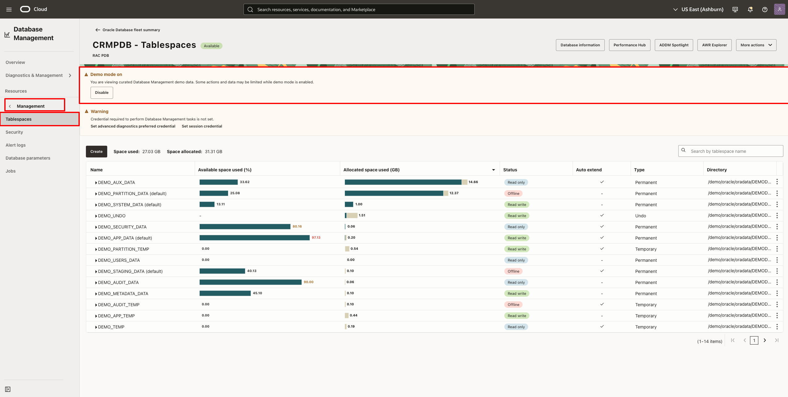

     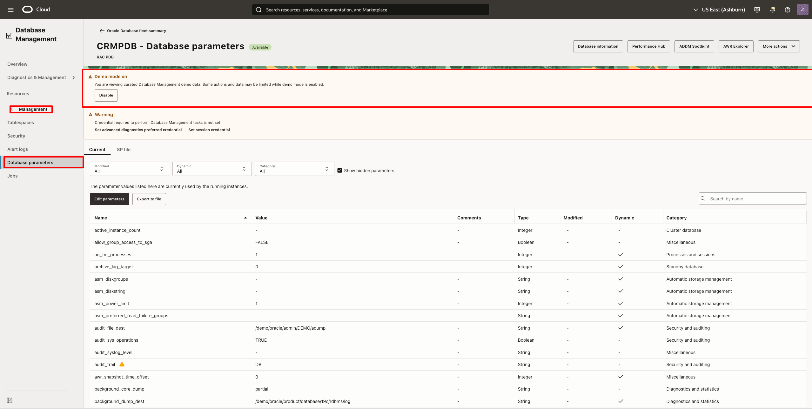

6. Under **Performance**, open **SQL Tuning Advisor** and **SQL tuning sets**, if available.

     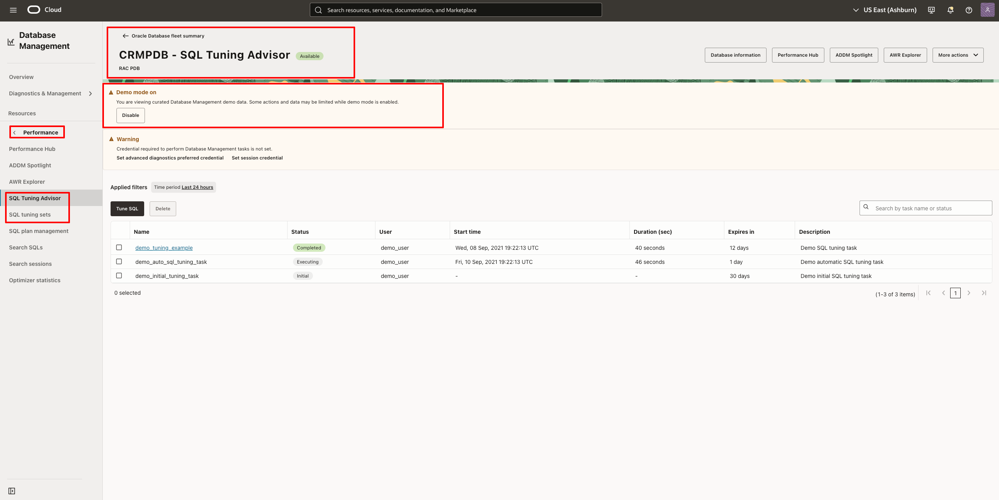

     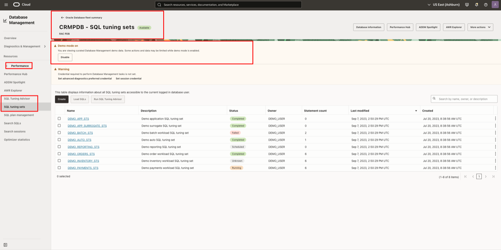

**Note:** Tablespaces, Database parameters, SQL Tuning Advisor, and SQL tuning sets may show curated Demo Mode data. You can review the workflows, but changes are not saved while Demo Mode is active.

## Task 8: Explore Performance Hub

1. Go back to the **Fleet Summary** page.

2. In the **Members** section, click a managed database.

3. On the **Managed database details** page, click **Performance Hub**.

     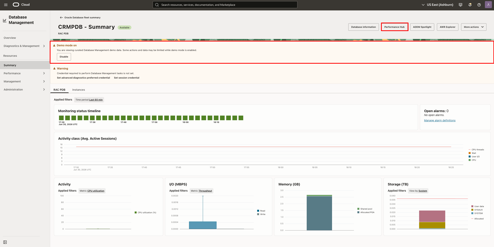

4. Confirm that the Demo Mode banner is visible in Performance Hub.

5. Review the **Performance Hub** page.

     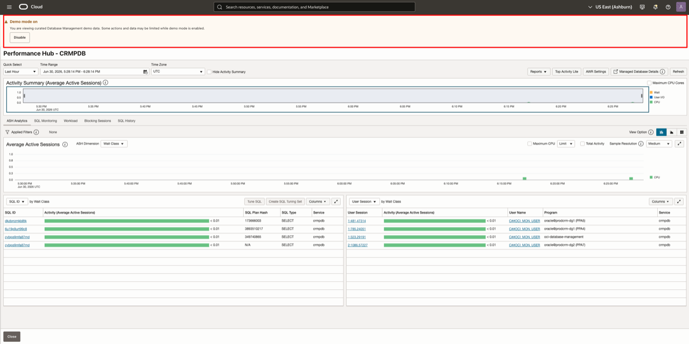

Performance Hub provides a consolidated view of database performance. In Demo Mode, Performance Hub uses demo-environment data where available so that workload-sensitive charts reflect current demo activity.

6. Click the **SQL Monitoring** tab, if available.

     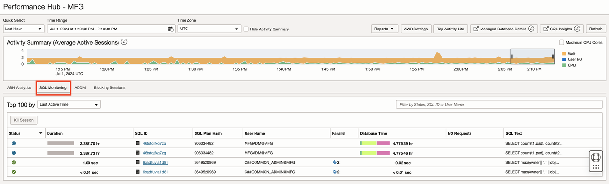

7. Click an available SQL ID to review SQL monitoring details.

     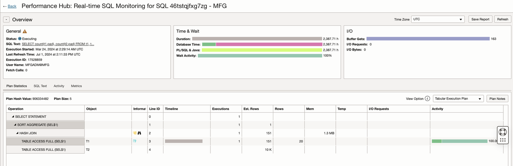

**Note:** You can open Performance Hub actions such as Tune SQL, Create SQL Tuning Set, credential preference, or session credential flows to see how they work. Demo Mode prevents any underlying write operation from being committed.

## Task 9: Explore AWR Explorer and ADDM Spotlight

1. From the **Managed database details** page, click **AWR Explorer**, if available.

     

2. Confirm that the Demo Mode banner is visible and review the available AWR data for the demo database.

     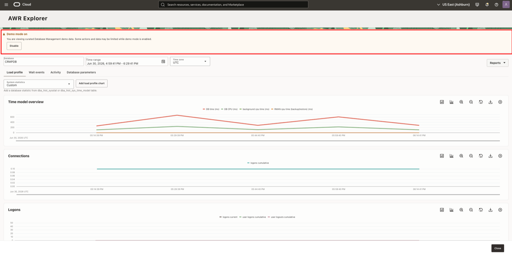

3. Return to the **Managed database details** page and click **ADDM Spotlight**, if available. If AWR Explorer or ADDM Spotlight is not listed for the selected database, return to **Fleet Summary** and select another demo database.

     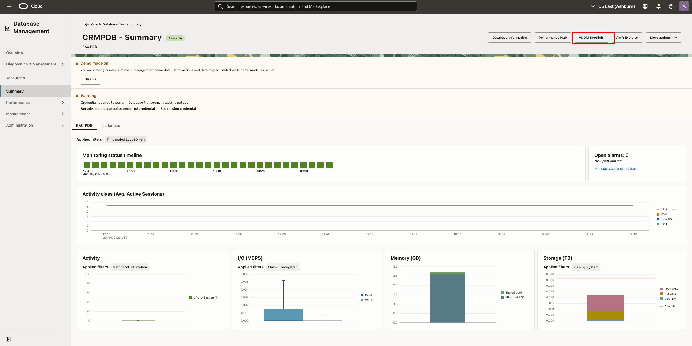

4. Confirm that ADDM Spotlight renders demo-environment data and shows the Demo Mode banner.

     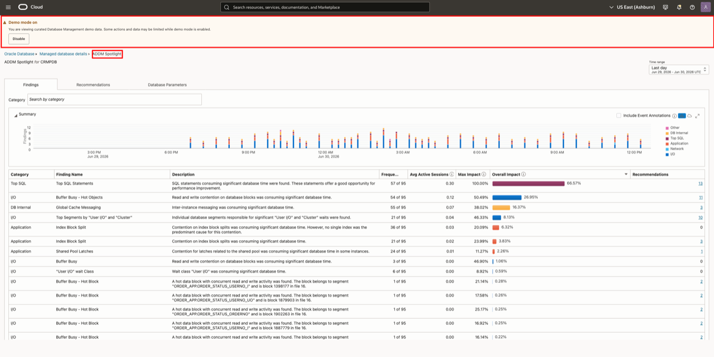

**Note:** Performance Hub, AWR Explorer, and ADDM Spotlight use demo-environment data where available, so the displayed values can change over time.

## Task 10: Review Demo Mode Guardrails

1. While Demo Mode is enabled, review the Database Management navigation menu.

2. Confirm that the following surfaces are hidden or unavailable in your Demo Mode environment:

    - Administration pages and menu entries
    - Overview Administration card
    - Dashboards
    - SQL Insights
    - Capacity Planning

3. Confirm that **Vulnerability Detection**, **Patch Management**, and **SQL Performance Watch** may remain visible while Demo Mode is active. Demo Mode still prevents changes from being applied.

4. Optionally open available setup or administration flows to see how they work. Do not expect changes to be saved while Demo Mode is active.

**Note:** Demo Mode is designed so users can safely explore available actions. Some pages may hide or disable actions, and any available change flow should leave the environment unchanged.

## Task 11: Disable Demo Mode

1. Use the Demo Mode banner or available Demo Mode control to disable Demo Mode.

     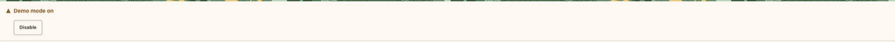

2. Confirm that the Demo Mode banner is removed.

3. Confirm that Database Management restores your original region selector, compartment filter, and navigation context.

## Acknowledgements

- **Author** - Vivek Verma, Master Principal Cloud Architect, North America Cloud Engineering
- **Contributors** - Vivek Verma, Sriram Vrinda, Murtaza Husain, Derik Harlow, Constanza Corvera
- **Last Updated By/Date** - Constanza Corvera, Jun 2026
