# Exploring Oracle Cloud Infrastructure Database Management

## Introduction

Database Management provides a single-pane-of-glass view of your fleet of on-premises and cloud databases in OCI, and enables you to detect issues across the fleet and respond to performance and configuration alerts. Here are some of the tasks you can perform using Database Management, which are categorized under database monitoring and management areas.

Fleet Monitoring and Management
-   Obtain an overview of your fleet of databases.
-   View the reports of the database fleet to obtain an insight into the overall health of the databases.
-   Automate database fleet management for enhanced operational efficiency.

Performance Diagnostics
-   Diagnose database performance issues quickly with Performance Hub.
-   Explore database performance statistics for advanced diagnostics with ADDM reports.
-   Use AWR Explorer to view customizable performance metrics from multiple sources of data in table form.

Database Administration
-   Enable SQL jobs to automate a scheduled database maintenance task across all databases in the fleet.
-   View, create, and perform basic administration tasks for tablespaces and their datafiles.
-   Perform SQL Tuning Advisor runs and implement recommendations for improvement.

Estimated Time: 1 hour

Watch the video below for a quick walk-through of the lab.
[Exploring Oracle Cloud Infrastructure Database Management](videohub:1_mpf7rizz)

### Objectives

-   Use Oracle Cloud Infrastructure Database Management to manage a fleet of Oracle Databases and drill down to a single database for additional investigation.

### Prerequisites

This lab assumes you have already completed the following:
- An Oracle Free Tier, Always Free, Paid or LiveLabs Cloud Account

## Task 1: Getting Started with Database Management

1.  Login to the Oracle Cloud Console, click the **Navigation Menu** in the upper left, navigate to **Observability & Management**, and select **Database Management**.

     

     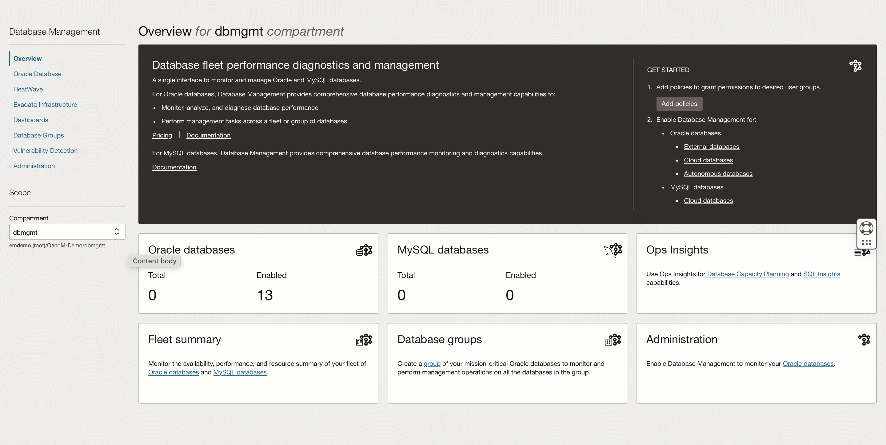

2.  The **Oracle databases** tile (on the **Overview** page) displays the total number of Oracle Databases in the compartment and the number of Oracle Databases for which Database Management is enabled.

## Task 2: Monitoring a Fleet of Databases

1.  On the left pane, click **Oracle Database** to navigate to the **Fleet Summary** page. The dbmgmt compartment is selected by default in the Compartment field. Set the **Compartment** to **dbmgmt** following the navigation -

     
     
     

2.  The following tiles are available on the **Fleet Summary** page:

    - **Inventory**: Displays the number of Oracle Databases (PDB and Non-CDB) in the compartment. Note that this does not show the number of CDBs.
    - **Status**: Displays the availability status of the Oracle Databases. You can click the **Alarms** link to view the Alarm Status page of the Oracle Cloud Infrastructure Monitoring service.
    -  **Resource Usage**: Displays a summary of the overall CPU and Storage allocation and utilization and a change percentage that denotes the comparison of resource usage between the selected time and the comparison time period. *Note*: Use the menus at the top-right corner of the page to select two time periods to compare the performance and configuration metrics of the fleet of databases.
    - **Alarms**: Displays the total number of open database alarms in the compartment or Database Group, and the number of alarms by severity.
    -  **Members**: Displays a thumbnail view of your Oracle Databases with their name, status, and type. This view is useful if you have a smaller number of databases in your fleet. The **List** view is displayed by default on the Members tab, however, you can select the **Table** option to view the same information in a tabular format.

3.  On **Fleet Summary** page under **Inventory** tile, select different options to view databases based on **Type**, **Deployment**, **Version** or **Cluster**.

     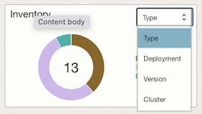

    For each PDB, the following metrics are displayed along with the change percentage that denotes the comparison of database metrics between the selected period and the comparison time period:

     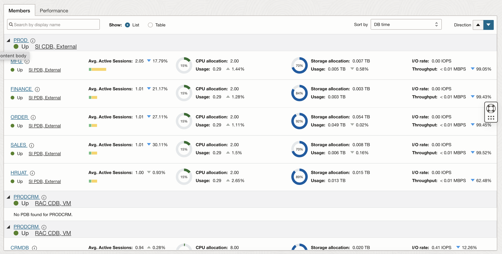

    - **Avg. Active Sessions**: Displays the average active sessions broken down by CPU, User I/O, and Others, which includes different categories within wait time such as System I/O and Commit.
    - **CPU**: Displays the CPU allocation and usage.
    - **Storage**: Displays the storage allocation and usage.
    - **I/O**: Displays the I/O rate and throughput.

4.  On **Fleet Summary** page, click the **Performance** tab. The **Performance** tree map is a visual representation of the performance of the Oracle Databases in a compartment or Database Group for a selected database metric. The databases are displayed as a collection of rectangles in different sizes and colors, in which the size of a rectangle indicates the value of the selected metric and the color indicates the change percentage for the selected metric over the selected time period. The **Performance** tree map is especially useful if you have many databases in your fleet and you want to assess their performance at a glance.

     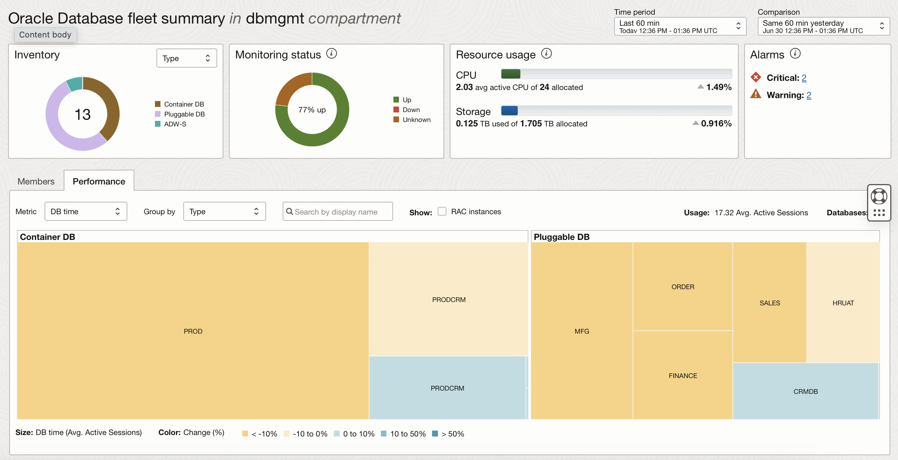

     Above the **Performance** tree map, select a metric in the **Metric** drop-down list. Depending on the selected metric, additional options may be displayed below the tree map. For example, if you select **CPU** in the Metric drop-down list, then you have the option of assigning the Size attribute to CPU time (Avg. Active CPU) or Allocation (CPU).
     
     You can also :
     * Select an option in the **Group by** drop-down list to group the Oracle Databases in the tree map.
     * Select the **RAC instances** check box to view and monitor the performance of all the instances within a RAC database.

## Task 3: Working with Database Groups

1.  On **Fleet Summary** page, click **Database Groups** under **Database Management**.

     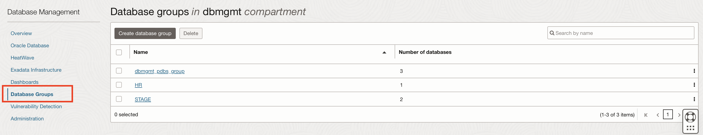

2.  Click **dbmgmt\_pdbs\_group** under the list of Database Groups.

     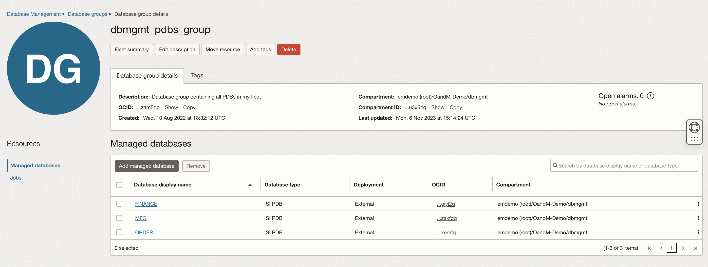

3.  On **Database group details** page, **Managed Databases** section has the list of all Managed Databases that are part of the group. You can also:

    - Click **Fleet Summary** to monitor all the Managed Databases in the Database Group on the Fleet Summary page.
    - Click **Edit Description** to add or edit the description of the Database Group.
    - Click **Move Resource** to move the Database Group to another compartment.
    - Click **Jobs** on the left pane under Resources to create a job for the Database Group and monitor job runs and executions.

4.  On the **Database Group Details** page, under **Resources** on the left pane, click **Jobs** to list jobs associated with the database group.

     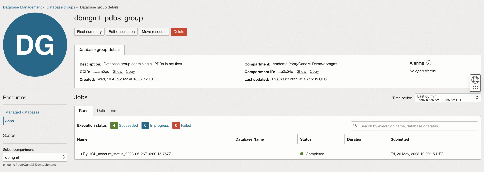

    - **Runs**: On this tab, you can monitor job runs and executions.
    - **Definitions**: On this tab, you can create a job and view the jobs that are in the Active state and were created within the time period selected in the **Time Period** field.

5.  Under **Runs** tab click on a particular job to view job executions.

     **Note** : Select a longer time period if you do not see data.

     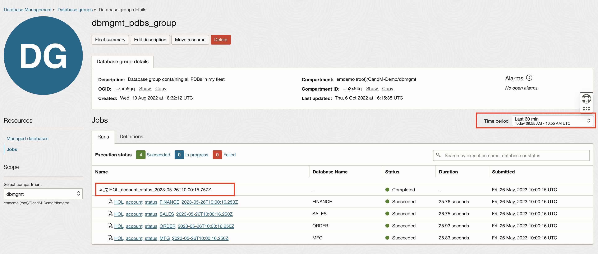

6.  Click on a particular Job Execution to view the **Job execution details** page, which contains the execution details of the job and **Job execution output**.

     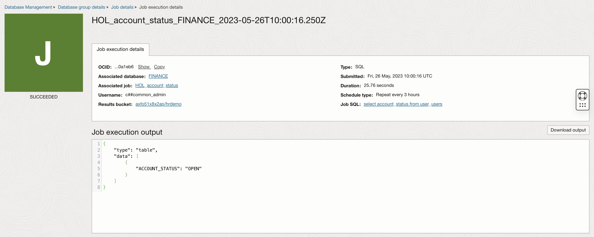

7.  Click the **Database group details** link in the breadcrumb or upper side of the screen and go back to the **Database group details** page. On **Database group details** page, click **Definitions** tab under **Jobs** to view the list of jobs.

     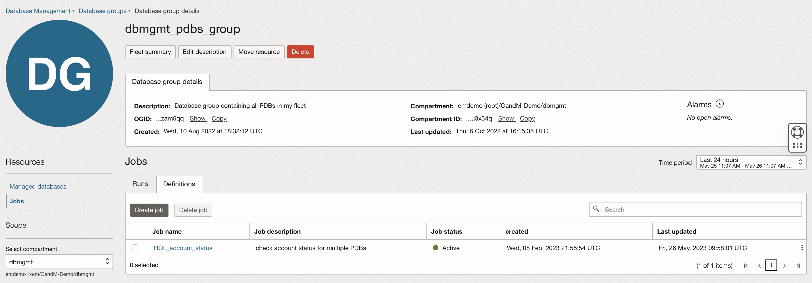

8.  Click a particular Job under **Job Name** to view Job details.

     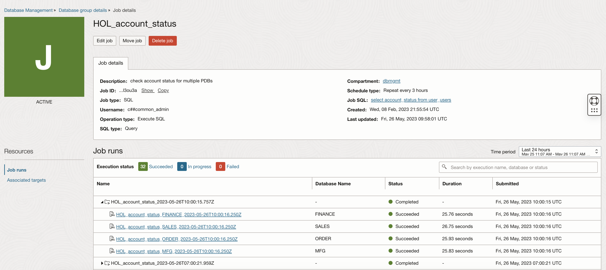

## Task 4: Monitoring Alert Log

1.  Click **Database Management** from the top left corner of the screen. On the left pane under **Database Management**, click **Oracle Database** to go back to **Fleet Summary** page. Scroll down to the **Members** tab on the Fleet Summary page. Click **MFG** under **Members** tab to go to **Managed database details** page.

     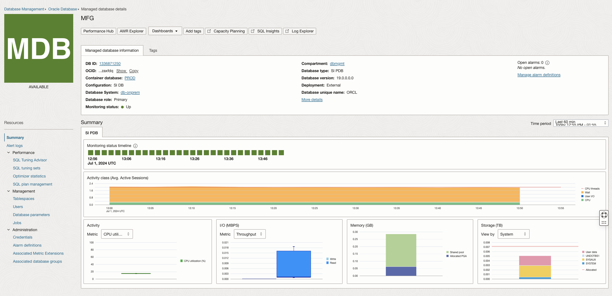

2.  On the left pane, under **Resources** click **Alert logs** to view alert and attention logs generated for the Managed Database in a selected time period. 

     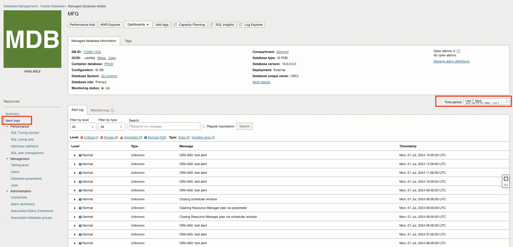

    You can use the drop-down lists, fields, and links on this tab to reduce the number of log entries displayed, or search for specific log entries:

    - Use the **Filter by Level** and **Filter by Type** drop-down lists to filter the entries by level or type.
    - Enter a specific message in the **Search field** and click **Search** to search for the alert log entry that contains the message. If you select the **Regular Expression** check box, then you can enter a regular expression such as ^ORA-600 in the Search field and search for the alert log entry whose message entirely or partially contains the regular expression.

## Task 5: Monitoring and Managing Individual Databases

1.  Go back to **Fleet Summary** page. Scroll down to the **Members** tab on the Fleet Summary page.

     

2.  Click the **MFG** database in the **Members** tab. In the **Managed Database Details** page Scroll down to the **Summary** section.

     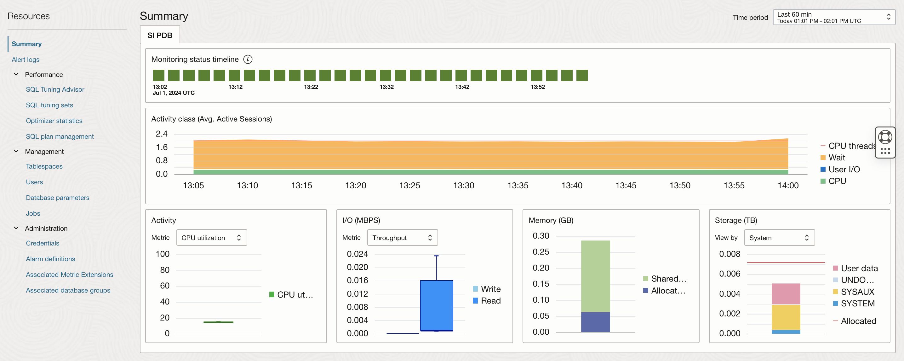

3.  We can monitor database performance attributes in the **Summary** section, for the time period selected in the **Time Period** menu on the top of this page. Last 60 min is the default time period, and the visual representations or charts provide a quick insight into the health of the database during the selected time period.

     **Availability timeline**: Displays the availability of the database during the selected period of time. The color of the blocks denotes the status and the number of blocks denotes the time slots within the selected time period over which availability is checked. For example, if the default time period, Last 60 min, is selected, then each block represents a period of two minutes.
     
     **Activity Class (Avg. Active Sessions):** Displays the average active sessions in the selected time period, broken down by CPU, User I/O, and Wait. The total CPU count is denoted by a red line and enables you to monitor average active sessions compared to the CPU count.

     **Activity**: Displays the percentage of CPU utilization, and DB time.

     **I/O:** Displays the I/O Throughput in MBPS and I/O Rate in IOPS broken down by Read and Write operations.

     **Memory:** Displays memory usage in GB, broken down by the memory usage in various components.

     **Storage Usage:** Displays system storage and user data storage in TB. System storage is broken down by usage in system tablespaces and user data, and User Data storage is broken down by usage in the top five user tablespaces. The total storage allocation for the database is denoted by a red line and enables you to monitor storage usage compared to the total allocation.

4.  You can click one of the other options on the left pane under Resources to perform the following tasks:

     - Monitor the alert and attention logs.
     - Use SQL Tuning Advisor to analyze SQL statements.
     - Monitor the tablespaces and data files.
     - View the users created in the Oracle Database.
     - View and edit database parameters.
     - Monitor the optimizer statistics for a Managed Database.
     - Create and manage Jobs and Job executions for the Managed Database.
     - Set preferred credentials to log in to the Managed Database and perform specific tasks.
     - View the Database Groups the Managed Database is a part of, if any.

5.  On **Managed database details** page, click **Tablespaces** from the left pane to monitor the tablespaces and datafiles stored in each tablespace in the Managed Database.

     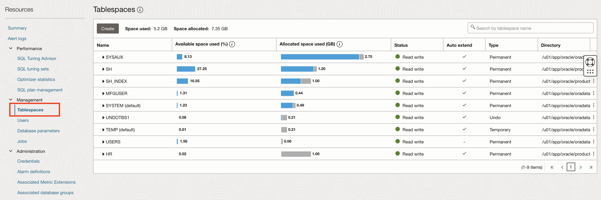

6.  On **Managed database details** page, click **Users** from the left pane to view the users created in the Oracle Database.

     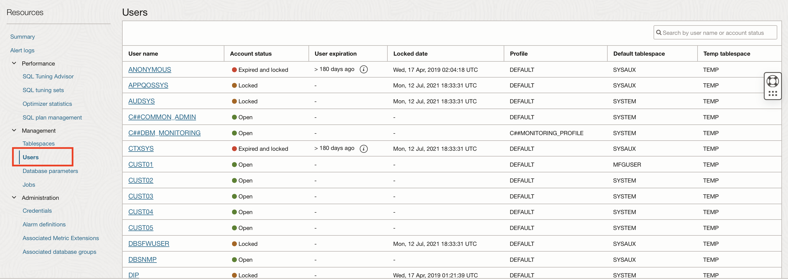

7.  On **Managed database details** page, click **Database Parameters** from the left pane to view and edit the database parameters for the Managed Database.

     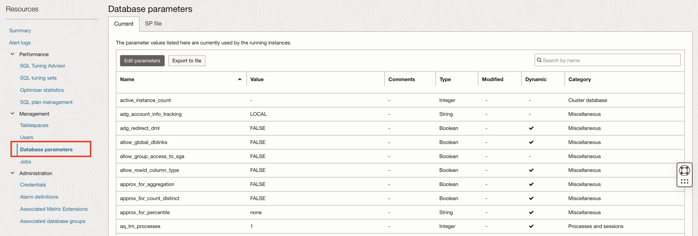

## Task 6: Performing Database Performance Diagnostics

1.  Go back to the **Fleet Summary** page. Scroll down to the **Members** tab and click the **MFG** database. On the top of the **Managed Database Details** page, click the **Performance Hub** button.

     

2.  This will launch the **Performance Hub** page. Performance Hub provides a single view of the database’s performance and enables you to perform the rapid diagnosis of its issues.

     

     Performance Hub provides holistic performance management capabilities providing a single view of the database performance using a varied set of features, such as Active Session History Analytics, Real-time SQL Monitoring, Automatic Database Diagnostics Monitoring (ADDM), Blocking sessions, and so on.

     **Active Session History Analytics (ASH) Analytics** allows you to analyze and resolve transient performance problems that can last for only a short period, such as why a particular job or session is not responding when the rest of the instance is performing as usual. It also allows you to perform scoped and targeted analysis by various dimensions and their combinations, such as time, session, module, action, or SQL identifier.

3.  Stay in **Performance Hub**, scroll down and click the **SQL Monitoring** tab.

     

     With Real-Time SQL Monitoring, you can perform complex run-time application SQL analysis, identity, and guide optimization of application calls in the data tier.

     Real-Time SQL Monitoring gives you the following capabilities:

     - Observe and analyze important SQL executions in progress (parallel and long-running queries)
     - Perform detailed and comprehensive execution analysis
     - Resource footprint per query plan step
     - Parallel plan skew across query workers
     - Visualize query plans interactively
     - Perform real-time and historical analysis

4.  Click on one of the SQLs listed under the **SQL ID** column to view **Real-time SQL Monitoring for SQL**

     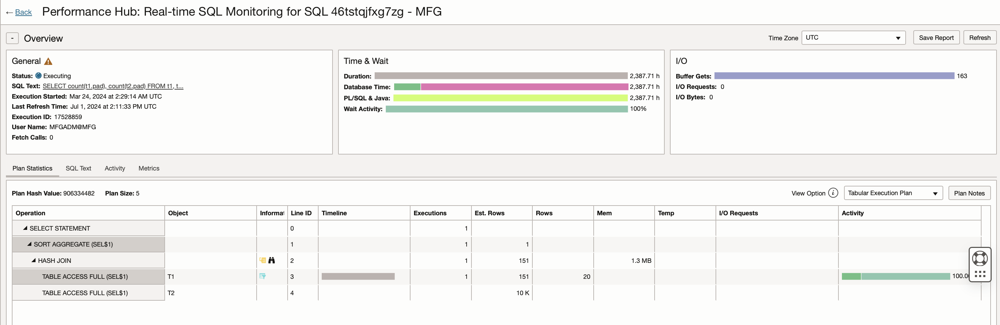

5.  Click **Back** on top left of the page to go back to **Performance Hub** and select the **Last 8 Hours** in the time select. Click the **ADDM** tab and select the most recent snapshot interval to view the automatic report. Note the **ADDM Task** section is updated. Click on the **Top SQL Statements** link under the **Name** column in the **Findings** section to view the recommendations

     
     

     The statistical data needed for the accurate diagnosis of a problem is saved in the Automatic Workload Repository (AWR) of the Oracle Database. The Automatic Database Diagnostic Monitor (ADDM) analyzes the AWR data regularly, locates the root causes of the performance problems, provides recommendations for correcting any problems, and identifies non-problem areas of the system. You can use ADDM to analyze performance issues after the event, often saving the time and resources needed to reproduce a problem.

     ADDM gives you the following capabilities:

     - Identify the root cause of a problem, not symptoms
     - Get recommendations for treating the root causes of problems
     - Identify non-problem areas of the system

5.  Click the **<-Back** link at the top left corner to go back to the **Performance Hub** page, scroll down and click the **Blocking Sessions** tab.

     

     The **Blocking Sessions** tab displays the current blocking and waiting sessions in a hierarchical display. You can view detailed information about each blocking session and view the sessions blocked by each blocking session. You can also use the tab to inspect or perform deeper analysis of the SQL involved to determine the cause of the blocking. You can perform several operations in the tab, including stopping one or more of the listed sessions to resolve a waiting session problem.

## Task 7: Real-time performance monitoring with Top Activity Lite

1.  Go back to the **Fleet Summary** page. Scroll down to the **Members** tab and click the **MFG** database. On the top of the **Managed Database Details** page, click the **Performance Hub** button.

     

2.  Click **Top Activity Lite** .

     

3.  **Top Activity Lite** provides a less resource intensive view of real-time activity compared to Performance Hub.  This allows for quicker refreshes of current performance even when the database is impacted by a heavier application workload.  You will utilize a familiar time-frame slider to select a window for historic or current performance investigation.  

     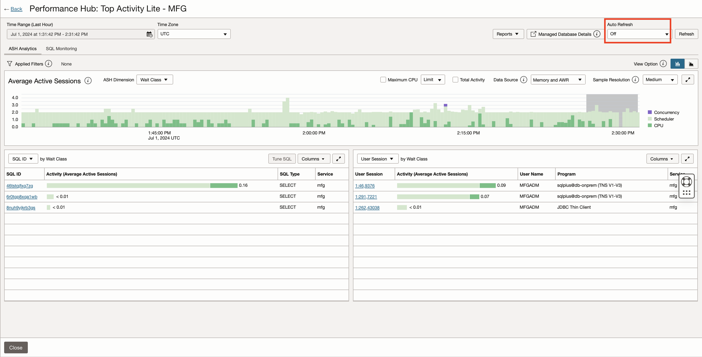

     Auto refresh of Top Activity Lite is possible at 15, 30 and 60 second intervals.  Select the **Auto Refresh** drop down menu and select 30 seconds to configure.

4.  The **Data Source** can be changed for the ASH Analytics monitoring.  The two options are **Memory** and **Memory and AWR**.  Select **Memory** from the Data Source drop down menu.  You will likely see a reduction of data in the slider due to historic AWR data being removed from the view.

     

5.  Additional information about the activity in the highlighted period of the Average Active Sessions slider can be seen in tables below the chart.  You can adjust the view of information in these tables to focus the performance investigation.  Utilize the **Columns** drop down menu to include **SQL Text** to more easily see which statements are generating the most activity in the databaseand and expand the table.

     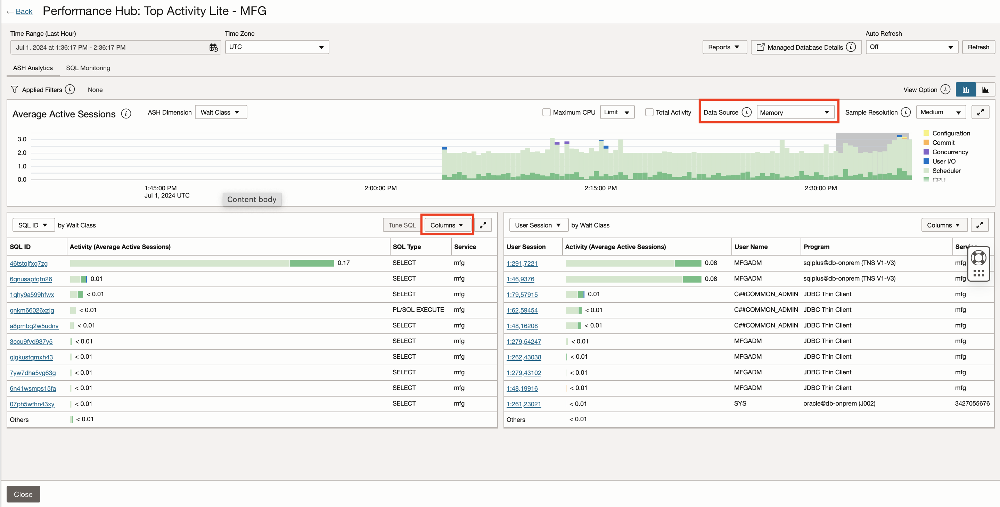

     

## Task 8: Data Guard monitoring

Database Management now supports the monitoring of Data Guard environments and provides configuration details as well as key metrics over time in graphs. A single location to administer a database as well as the associated standby databases provides a streamlined experience for DBAs. With Data Guard monitoring in Database Management a user will be able to:

- View configuration of primary and standby databases
- Validate the protection mode and level
- Ensure Fast-start failover is enabled
- Verify redo logs are being applied consistently

1.  Go back to the **Fleet Summary** page. Scroll down to the **Members** tab and click the **PRODCRM** database.

     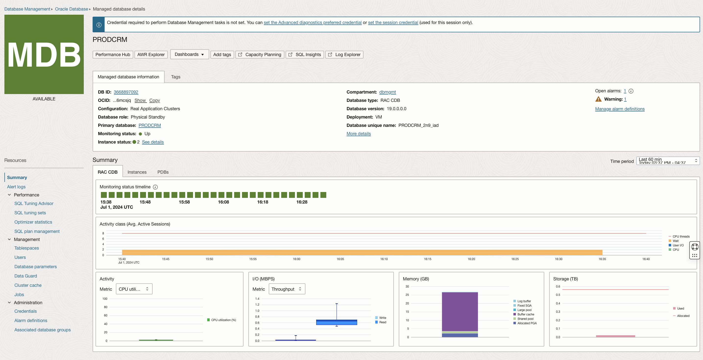

2.  On **Managed database details** page, click **Data Guard** from the left pane to view Data Guard details.

     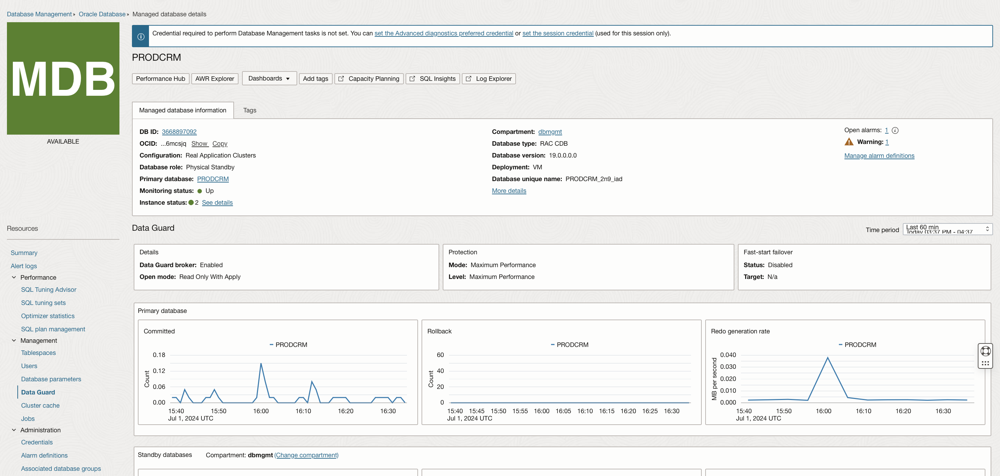

On the Managed database details page, you can perform the following tasks for primary databases:

- View the **Database role** in the **Managed database information** section. You can also click **More details** to view whether Flashback is enabled or not.
- Review the charts that provide an overview of the performance of the primary and standby databases for the time period selected in the Time period drop-down list.

     - Primary database: The charts in this section display the following performance metrics for the primary database:
          - Committed: The number of committed transactions.
          - Rollback: The number of rolled back transactions.
          - Redo generation rate: The amount of redo that was generated.

     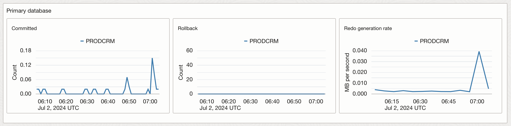

     - Standby databases: The charts in this section display the following performance metrics for all the standby databases in the selected compartment:
          - Apply lag: The number of seconds the standby databases are behind the primary database.
          - Transport lag: The number of seconds of redo not yet available on the standby databases.
          - Redo apply rate: The amount of redo applied on the standby databases.

     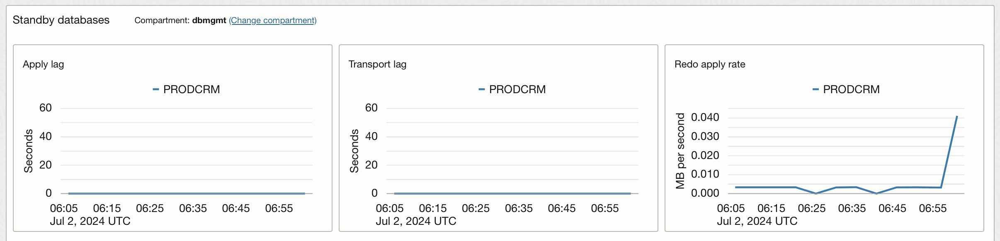

- Below the performance charts, the list of standby databases for the primary database, along with the mean values of their performance metrics is displayed. 

     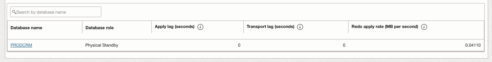
     
## Task 9: Custom and Out-of-the-box Dashboards

Dashboards are built upon a powerful data visualization framework that gathers real-time data and displays it in customizable widgets. You can either use the pre-configured, out-of-the-box dashboards or build customizable dashboards for specific operational and business requirements.

Performance dashboards can be utilized in investigations for a single database or for an entire fleet of databases.  Out of the box dashboards are available to quickly assess the overall performance for your environments, and the option to create custom dashboards enables modifying and tailoring widgets to focus on the most important resources or to assist in triaging performance investigations for specific application workflows.

The Dashboard Framework allows quick, easy editing of your own dashboards with customizations to layout and metric groupings from OCI namespaces.  These custom dashboards can be shared via PDFs or distributed to other OCI users by an export/import JSON feature.

1.  Login to the Oracle Cloud Console, click the **Navigation Menu** in the upper left, navigate to **Observability & Management** and within the **Database Management** service links click **Dashboards**.

     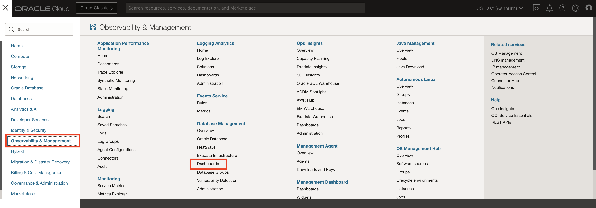

2.  There are several out-of-the-box dashboards available, including fleet database performance, single database performance, cloud database infrastructure performance, and even cross-service dashboards.  Select the **Database fleet performance** out-of-the-box dashboard.  You may need to expand the **Name** column to differentiate between the fleet and single database dashboards.

     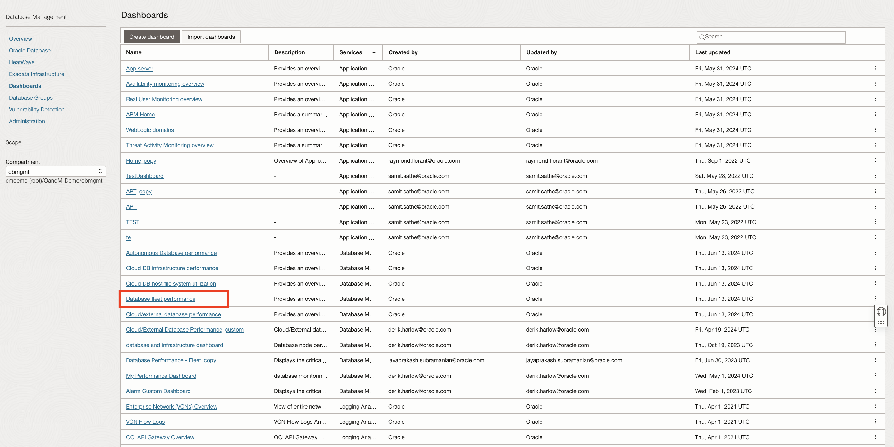

3.  Here you will see two main sections, one being Filters and the other Widgets.  Widgets are **miniature-reports** of metric collections that can be displayed in various chart configurations.  The widgets can be grouped together to share filter parameters which allows for easy toggling between OCI region or compartment resources.  
Filters allow narrowing the scope of the resources presented in the dashboard.  They also allow selecting multiple databases to be displayed in the same widget for a fleet wide comparison of resources.

     Default time period is the last 60 minutes, this can be adjusted by utilizing the time period selector in the upper-righthand.  Adjust the time period to past 24 hours.

     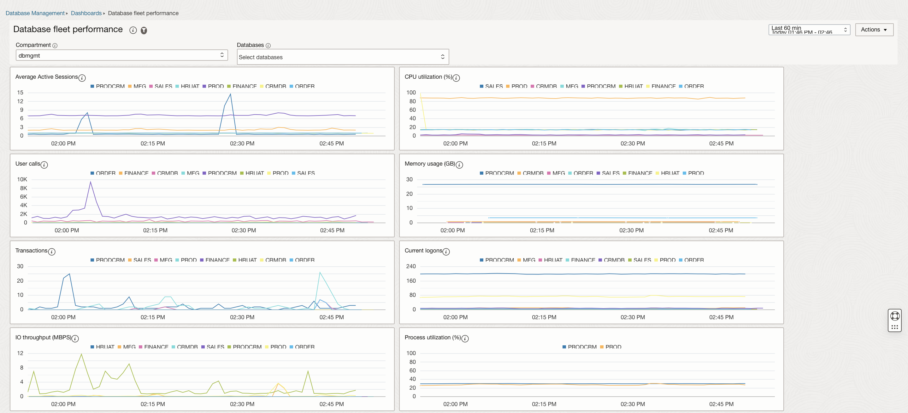

4.  Now you can hover over widgets to view metric data at a given time period.  The selector also shows corresponding charts data to easily visualize any performance abnormalities during that time.  This can assist in correlation and finding root cause of the performance issues.

     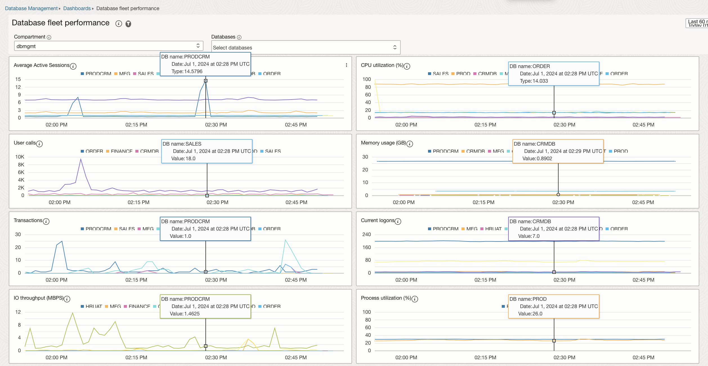

5.  Once the dashboard has launched, you will see multiple widgets with several databases listed in their legends.  You can select a smaller set of databases by utilizing the **Databases** filter at the top.  Use the drop down menu to select 3 separate databases to compare.

     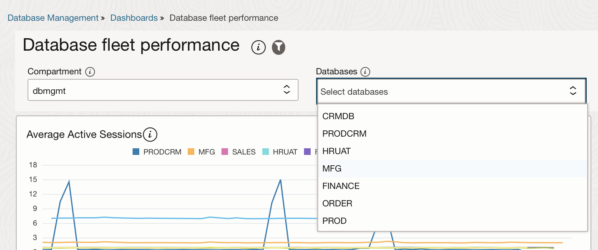

     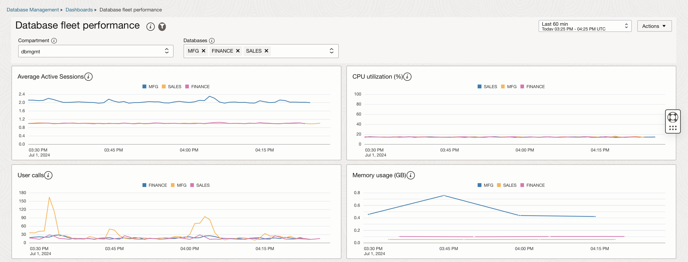

7.  You can even remove a database resource from a single widget by selecting the corresponding box in the widget legend.  This allows further focusing for a widget without needing to change filters. Click on one of the database boxes in the legend to exclude.

     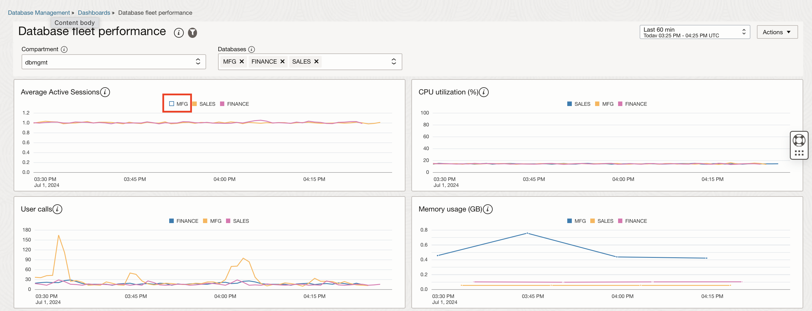

8.  Finally, you can follow the same steps to go back and check out the **Cloud DB Infrastructure Performance** dashboard.  This dashboard provides various infrastructure and host metrics to monitor a database system in a single location.  Included metric widgets are **Node Status**, **OCPU allocation**, **CPU utilization**, **Memory utilization** and storage metrics such as **File System utilization** and **ASM Disk Group utilization**.

## Acknowledgements

- **Author** - Vivek Verma, Master Principal Cloud Architect, North America Cloud Engineering
- **Contributors** - Vivek Verma, Sriram Vrinda, Murtaza Husain and Derik Harlow
- **Last Updated By/Date** - Vivek Verma, Jul 2024