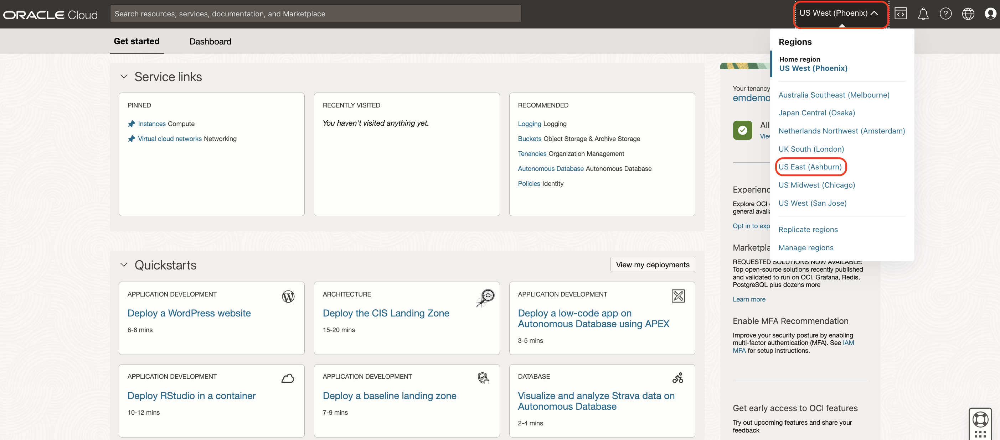
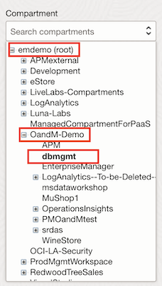
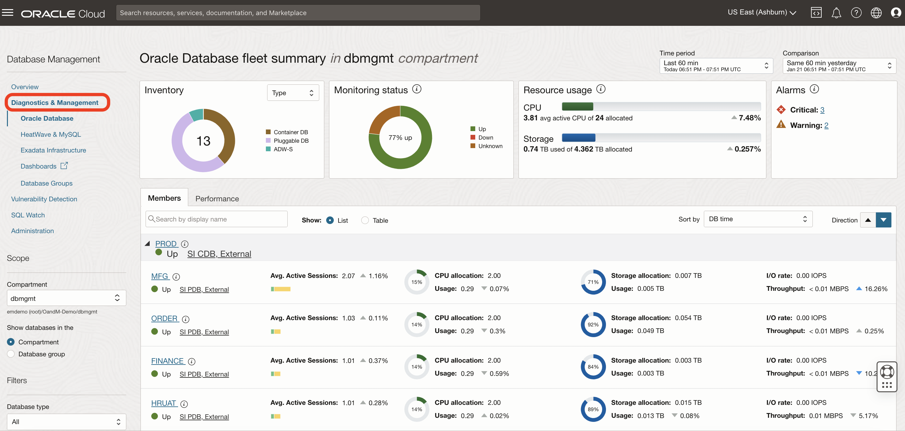
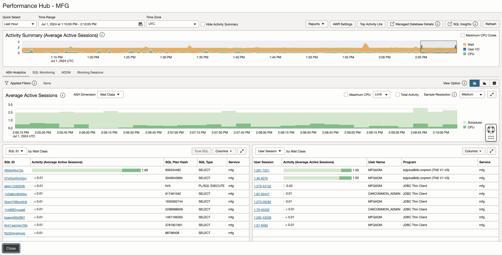
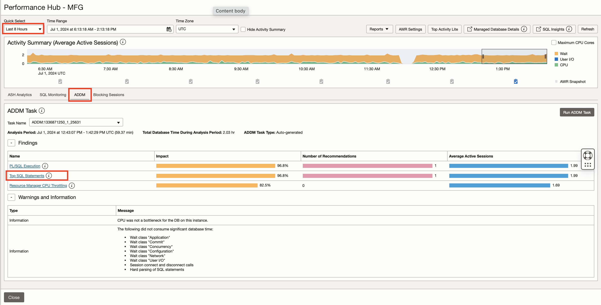
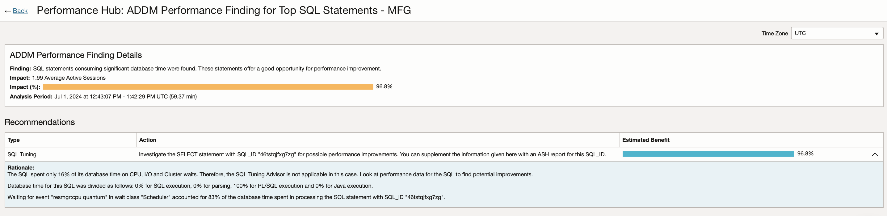
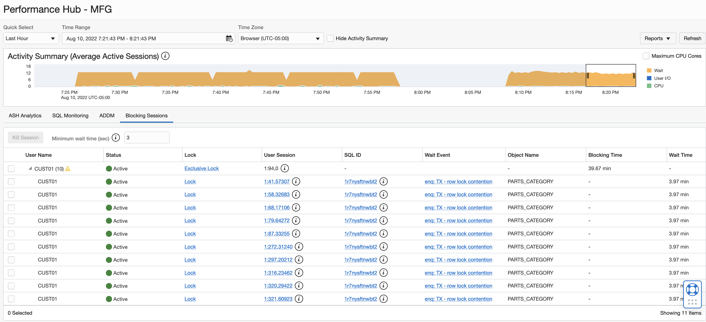
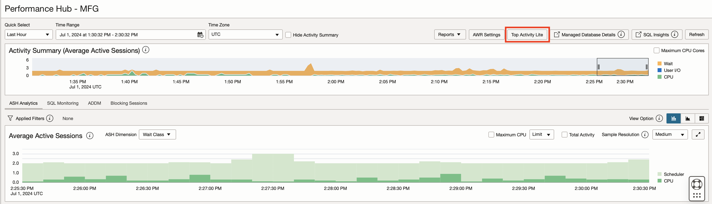
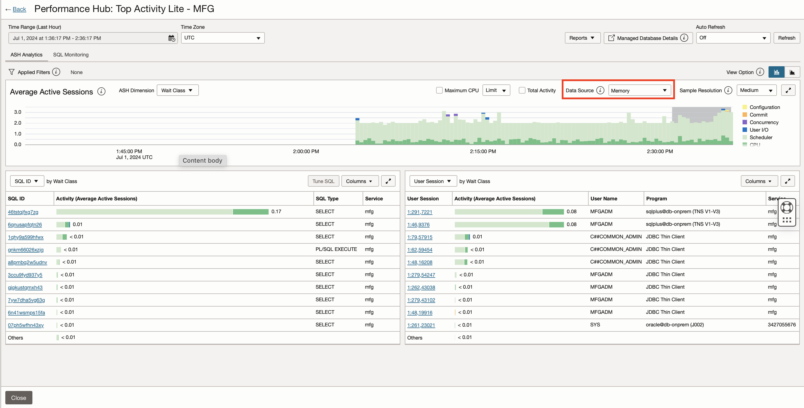
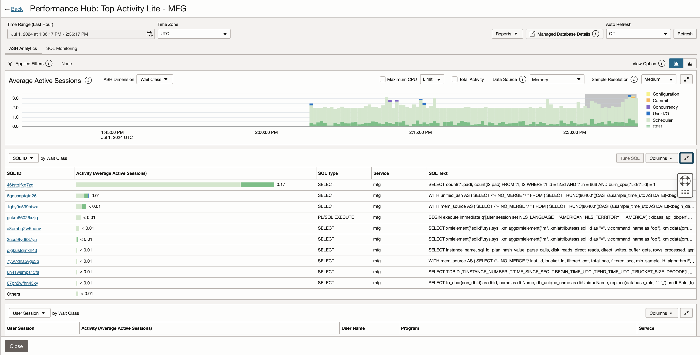

# Exploring Oracle Cloud Infrastructure Database Management

## Introduction

Database Management provides a single-pane-of-glass view of your fleet of on-premises and cloud databases in OCI, and enables you to detect issues across the fleet and respond to performance and configuration alerts. Here are some of the tasks you can perform using Database Management, which are categorized under database monitoring and management areas.

Fleet Monitoring and Management
-   Obtain an overview of your fleet of databases.
-   View the reports of the database fleet to obtain an insight into the overall health of the databases.
-   Automate database fleet management for enhanced operational efficiency.

Performance Diagnostics
-   Diagnose database performance issues quickly with Performance Hub.
-   Explore database performance statistics for advanced diagnostics with ADDM reports.
-   Use AWR Explorer to view customizable performance metrics from multiple sources of data in table form.

Database Administration
-   Enable SQL jobs to automate a scheduled database maintenance task across all databases in the fleet.
-   View, create, and perform basic administration tasks for tablespaces and their datafiles.
-   Perform SQL Tuning Advisor runs and implement recommendations for improvement.

Estimated Time: 10 minutes

### Objectives

-   Use Oracle Cloud Infrastructure Database Management to diagnose database performance issues quickly with Performance Hub

### Prerequisites

This lab assumes you have already completed the following:
- An Oracle Free Tier, Always Free, Paid or LiveLabs Cloud Account

## Task 1: Getting Started with Database Management

1.  Login to the Oracle Cloud Console, change the OCI Region to **US East (Ashburn)** and then click on the **Navigation Menu** in the upper left, navigate to **Observability & Management**, and select **Database Management**.

     

     

**Note** : You will see an error due to insufficient privileges granted on the root compartment.
     

2.  Change the compartment to **dbmgmt** in the compartment field. The **Oracle databases** tile (on the **Overview** page) displays the total number of Oracle Databases in the compartment and the number of Oracle Databases for which Database Management is enabled.

     

     

## Task 2: Performing Database Performance Diagnostics

1. On the left pane, click **Diagnostics & Management** to navigate to the **Fleet Summary** page. The **dbmgmt** compartment is selected by default in the Compartment field.
     

     Scroll down to the **Members** tab and click the **MFG** database. On the top of the **Managed Database Details** page, click the **Performance Hub** button.

     

     *Note: Since all attendees are accessing the **MFG** database, it may experience high load. If the MFG database is slow to display data in Performance Hub, please switch to the **PRODCRM** database and continue performing the below tasks there.* 

2.  This will launch the **Performance Hub** page. Performance Hub provides a single view of the database’s performance and enables you to perform the rapid diagnosis of its issues.

     

     Performance Hub provides holistic performance management capabilities providing a single view of the database performance using a varied set of features, such as Active Session History Analytics, Real-time SQL Monitoring, Automatic Database Diagnostics Monitoring (ADDM), Blocking sessions, and so on.

     **Active Session History Analytics (ASH) Analytics** allows you to analyze and resolve transient performance problems that can last for only a short period, such as why a particular job or session is not responding when the rest of the instance is performing as usual. It also allows you to perform scoped and targeted analysis by various dimensions and their combinations, such as time, session, module, action, or SQL identifier.

3.  Stay in **Performance Hub**, scroll down and click the **SQL Monitoring** tab.

     

     With Real-Time SQL Monitoring, you can perform complex run-time application SQL analysis, identity, and guide optimization of application calls in the data tier.

     Real-Time SQL Monitoring gives you the following capabilities:

     - Observe and analyze important SQL executions in progress (parallel and long-running queries)
     - Perform detailed and comprehensive execution analysis
     - Resource footprint per query plan step
     - Parallel plan skew across query workers
     - Visualize query plans interactively
     - Perform real-time and historical analysis

4.  Click on one of the SQLs listed under the **SQL ID** column to view **Real-time SQL Monitoring for SQL**

     

5.  Click **Back** on top left of the page to go back to **Performance Hub** and select the **Last 8 Hours** in the time select. Click the **ADDM** tab and select the most recent snapshot interval to view the automatic report. Note the **ADDM Task** section is updated. Click on the **Top SQL Statements** link under the **Name** column in the **Findings** section to view the recommendations

     
     

     The statistical data needed for the accurate diagnosis of a problem is saved in the Automatic Workload Repository (AWR) of the Oracle Database. The Automatic Database Diagnostic Monitor (ADDM) analyzes the AWR data regularly, locates the root causes of the performance problems, provides recommendations for correcting any problems, and identifies non-problem areas of the system. You can use ADDM to analyze performance issues after the event, often saving the time and resources needed to reproduce a problem.

     ADDM gives you the following capabilities:

     - Identify the root cause of a problem, not symptoms
     - Get recommendations for treating the root causes of problems
     - Identify non-problem areas of the system

6.  Click the **<-Back** link at the top left corner to go back to the **Performance Hub** page, scroll down and click the **Blocking Sessions** tab.

     

     The **Blocking Sessions** tab displays the current blocking and waiting sessions in a hierarchical display. You can view detailed information about each blocking session and view the sessions blocked by each blocking session. You can also use the tab to inspect or perform deeper analysis of the SQL involved to determine the cause of the blocking. You can perform several operations in the tab, including stopping one or more of the listed sessions to resolve a waiting session problem.

## Task 3: Real-time performance monitoring with Top Activity Lite

1.  Click **Top Activity Lite** .

     

2.  **Top Activity Lite** provides a less resource intensive view of real-time activity compared to Performance Hub.  This allows for quicker refreshes of current performance even when the database is impacted by a heavier application workload.  You will utilize a familiar time-frame slider to select a window for historic or current performance investigation.  

     

     Auto refresh of Top Activity Lite is possible at 15, 30 and 60 second intervals.  Select the **Auto Refresh** drop down menu and select 30 seconds to configure.

3.  The **Data Source** can be changed for the ASH Analytics monitoring.  The two options are **Memory** and **Memory and AWR**.  Select **Memory** from the Data Source drop down menu.  You will likely see a reduction of data in the slider due to historic AWR data being removed from the view.

     

4.  Additional information about the activity in the highlighted period of the Average Active Sessions slider can be seen in tables below the chart.  You can adjust the view of information in these tables to focus the performance investigation.  Utilize the **Columns** drop down menu to include **SQL Text** to more easily see which statements are generating the most activity in the databaseand and expand the table.

     

     

## Acknowledgements

- **Author** - Vivek Verma, Master Principal Cloud Architect, North America Cloud Engineering
- **Contributors** - Vivek Verma, Sriram Vrinda, Murtaza Husain and Derik Harlow
- **Last Updated By/Date** - Vivek Verma, Jul 2024