# Prerequisite: Create a dynamic group and policies for agent communication

## Introduction

The following steps represents the prerequisites for the management communication.

Estimated time: 20 minutes

### Objectives

- Log into OCI Tenancy.
- Create a compartment.
- Create the policies to use Oracle Management Agent Service and to allow agent to use OCI resources.

### Prerequisites

- Your Oracle Cloud Trial Account
- Generate SSH Key (FreeTier and Paid accounts)
- Environment Setup or Verify Setup
- Setup pluggable databases and workload

## Task 1: Create compartment

1.  From OCI console, navigate to **Identity & Security** and under **Identity**, click **Compartments** and then click on the blue **Create Compartment** button to create a sub-compartment.

      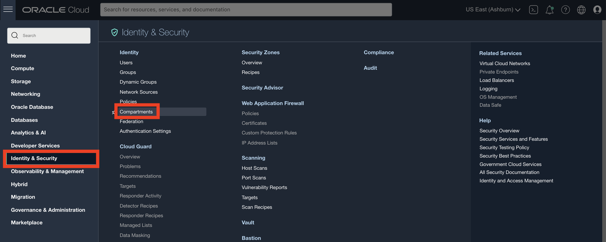

2.  Name the compartment **dbmgmt-demo** and provide a short description. Be sure your root compartment is shown as the parent compartment. Press the blue **Create Compartment** button when ready.

   

## Task 2: Create a Dynamic Group

To interact with the Oracle Cloud Infrastructure service end-points, customers must explicitly consent to let the management agents carry on the communication.

In this step, a dynamic group is created using the Identity and Access Management service from the OCI Console. This group includes all the management agents. This is a one-time set up step. Any additional management agents installed will automatically belong to this group based on the resource type definition shown below.

1. To access the Identity and Access Management service, click on the Oracle Cloud Console **Navigation menu** (aka hamburger menu) located in the upper left. Under **Identity & Security**, go to **Identity** and click **Dynamic Groups**.

      

2. Click **Create Dynamic Group**

3. In the Create Dynamic Group dialog box, name the dynamic group _dbmgmt\_dynamic\_group_, a description and the matching rules, and then click **Create Dynamic Group**.

      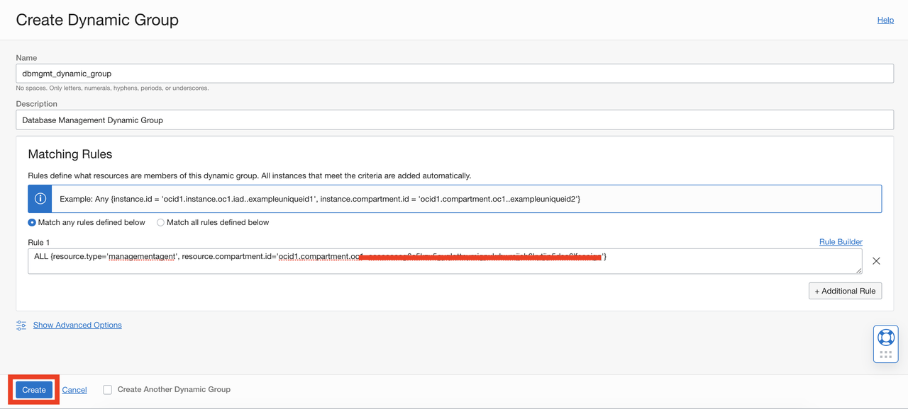

      ```
      <copy>
      ALL {resource.type='managementagent', resource.compartment.id='ocid1.compartment.oc1.examplecompartmentid'}  </copy>
      ```
Where resource.type='managementagent' is the managementagent resource type definition for Management Agent at dynamic group level, and resource.compartment.id value is the compartment id used in step 1.

## Task 3: Create a Group

1.  To access the Identity and Access Management service, open the **Navigation menu**. Under **Identity & Security**, go to **Identity** ,then select **Groups**.

2.  Click **Create Group**.

3.  In the **Create Group** dialog box, enter the following:

   - **Name:** Enter a unique name for your group such as "dbmgmt-group". Note that the group name cannot contain spaces.
   - **Description:** Enter a description (for example, "New group for OCI Database Management").
   - Click **Create**.

      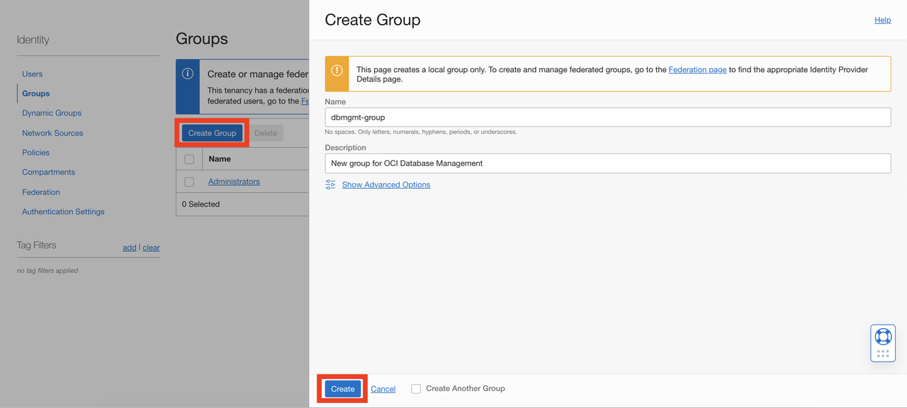

      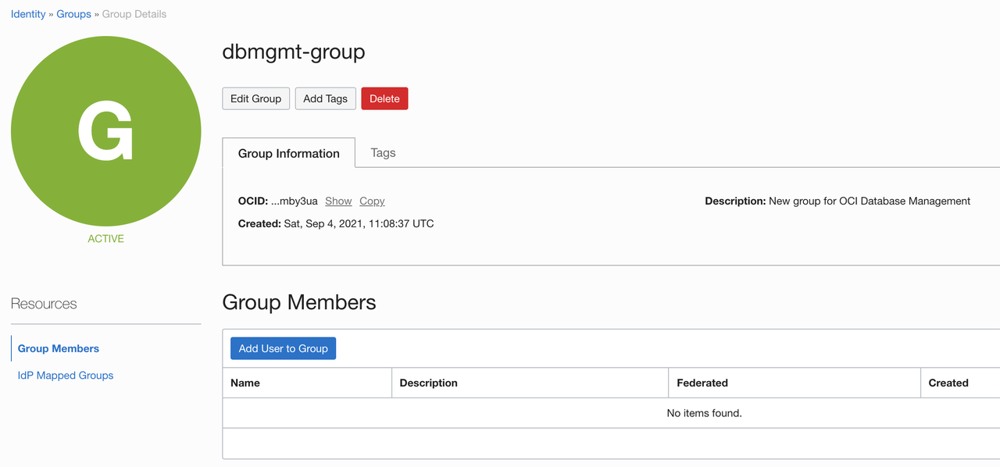

## Task 4: Managing Users, Groups

1.  Now, let's create a security policy that gives your group permissions in your assigned compartment. For example, create a policy that gives permission on compartment **dbmgmt-demo** to members or group **dbmgmt-group**.

   a) From the Oracle Cloud Console **Navigation menu** (aka hamburger menu) located in the upper left, under **Identity & Security**, go to **Identity** and then select **Policies**.

   b) On the left side, select root compartment.

    *NOTE*: You may need to click on the + sign next to your main compartment name to be able to see the sub-compartment **dbmgmt-demo**. If you do, and you still don't see the sub-compartment, **Refresh your browser**. Sometimes your browser caches the compartment information and does not update its internal cache.

   c) After you have selected the **root** compartment, click **Create Policy**.

      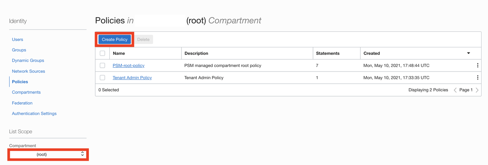

   d) Enter a unique **Name** for your policy (For example, "Policy-for-dbmgmt-group"). Note that the name cannot contain spaces.

   e) Enter a **Description** (for example, "Policy for OCI DB Management").

      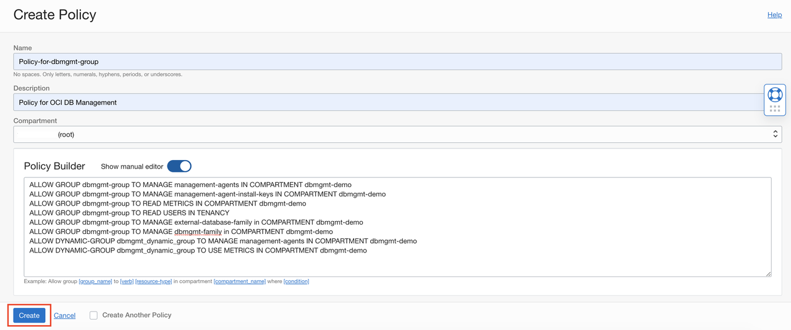

   f) Select **Show manual editor**   

   g) Enter the following **Statements**:

      ```
      <copy>
      ALLOW GROUP dbmgmt-group TO MANAGE management-agents IN COMPARTMENT dbmgmt-demo
      ALLOW GROUP dbmgmt-group TO MANAGE management-agent-install-keys IN COMPARTMENT dbmgmt-demo
      ALLOW GROUP dbmgmt-group TO READ METRICS IN COMPARTMENT dbmgmt-demo
      ALLOW GROUP dbmgmt-group TO READ USERS IN TENANCY
      ALLOW GROUP dbmgmt-group TO MANAGE external-database-family in COMPARTMENT dbmgmt-demo
      ALLOW GROUP dbmgmt-group TO MANAGE dbmgmt-family in COMPARTMENT dbmgmt-demo
      ALLOW DYNAMIC-GROUP dbmgmt_dynamic_group TO MANAGE management-agents IN COMPARTMENT dbmgmt-demo
      ALLOW DYNAMIC-GROUP dbmgmt_dynamic_group TO USE METRICS IN COMPARTMENT dbmgmt-demo
      </copy>
      ```

   h) Click **Create**.

2. Create a New User

   a) From the Oracle Cloud Console **Navigation menu** (aka hamburger menu) located in the upper left, under **Identity & Security**, go to **Identity** and then select **Users**.

   b) Click **Create User**.

   c) In the **New User** dialog box, enter the following:

      - **Name:** Enter a unique name or email address for the new user. For example "dbmgmt_user". This value is the user's login name for the Console and it must be unique across all other users in your tenancy.
      - **Description:** Enter a description. For example, "New OCI Database Management User".

      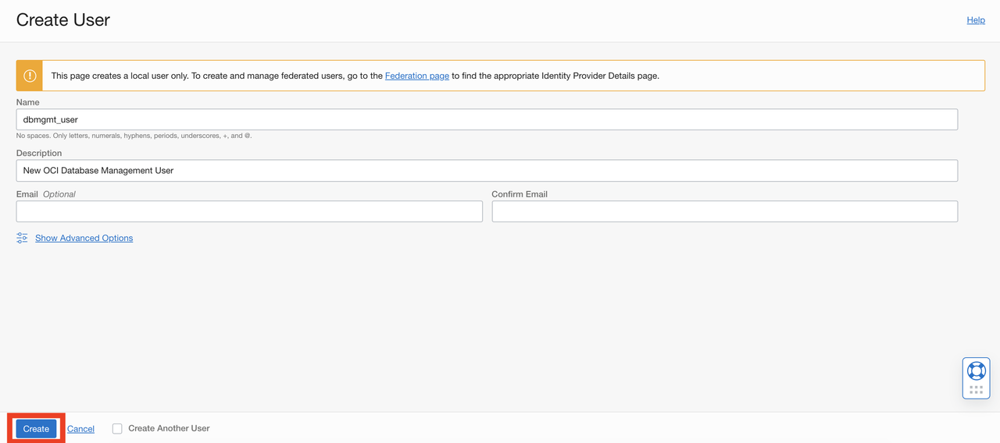

   d) Click **Create**.

3. Set a Temporary Password for the newly created User

   a) The newly created user is displayed.

   b) Click **Create/Reset Password**.  

      

   c) In the dialog, click **Create/Reset Password**.

      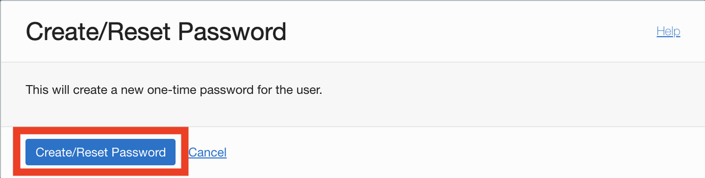

   d) The new one-time password is displayed.

      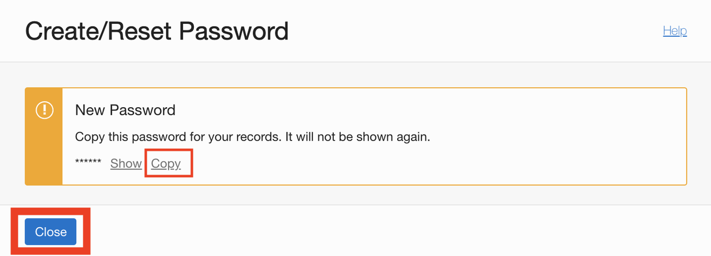

   e) Click the **Copy** link and then click **Close**. Make sure to copy this password to your notepad.

4. Add User to a Group

      a) Sign in back with the ***admin*** account.

      b) From the **Users** list, click the user account that you just created (for example, "dbmgmt_user") to go to the user details page.

      c) Under the **Resources** menu on the left, click **Groups.**

      d) Click **Add User to Group**.

      e) From the **GROUPS** drop-down list, select the **dbmgmt-group** that you created.

      f) Click **Add**.
      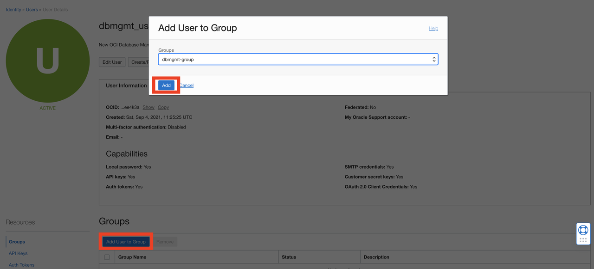

      g) On the top right corner of Oracle Cloud Console, click on **Profile** and then click **Sign Out** to sign out of the Oracle Cloud website.

      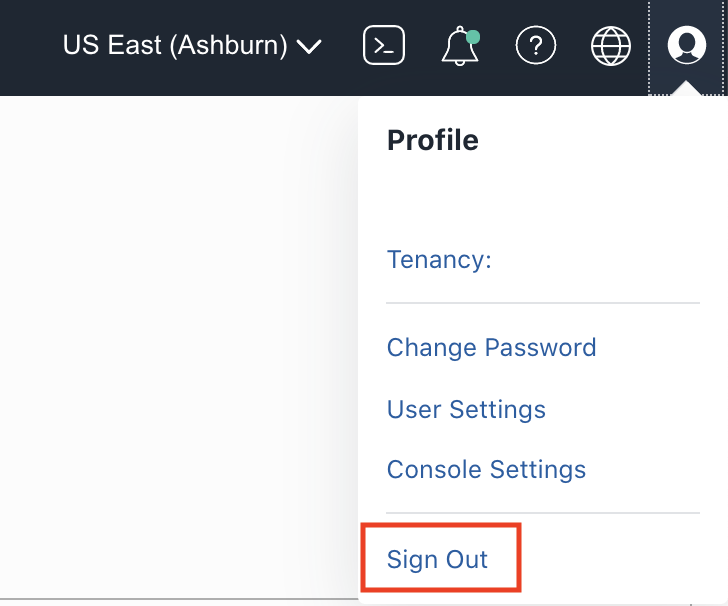

5. Verify user permissions when a user belongs to a specific group

      a) Login to Oracle Cloud Console with the local "dbmgmt_user" account you created. Enter the password that was copied earlier.

      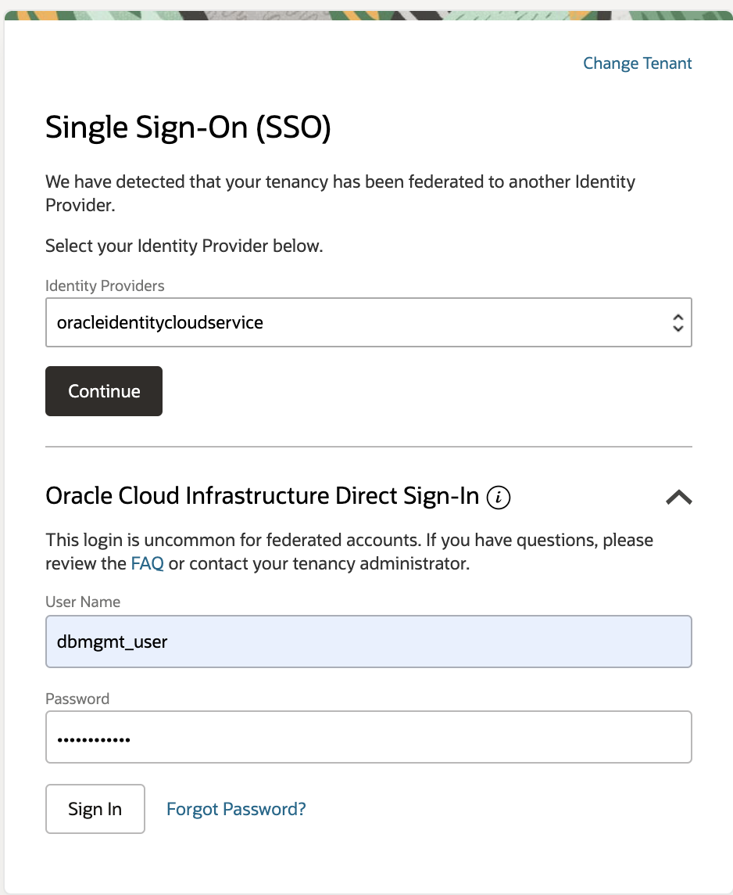

      b) On first login user is prompted to reset the password. Enter current password and new password for user.

      b) Open the **Navigation menu**. Under **Observability & Management** click on **Database Management**.

      c) Select compartment **dbmgmt-demo** from the list of compartments on the left.

      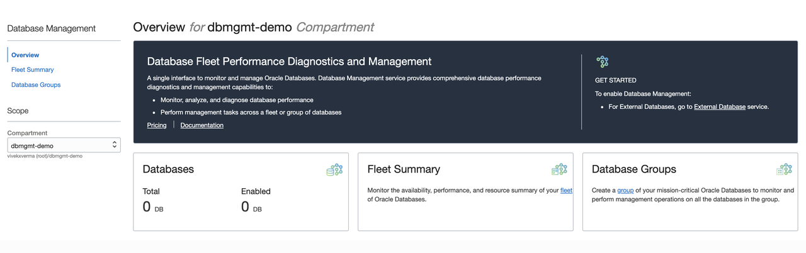

      d) There is no message related to permissions and you are allowed to create new instances

      e) Open the **Navigation menu**. Under **Identity & Security**, go to **Identity** and then select **Groups**.

      f) The message **Authorization failed or requested resource not found** appears. This is expected, since your user has no permission to modify groups. (Note: You may instead get the "An unexpected error occurred" message instead. That is also fine.)

## Acknowledgements

- **Author** - Vivek Verma, Principal Cloud Architect, North America Cloud Engineering
- **Contributors** - Vivek Verma, Sriram Vrinda, Pratima Chennupati
- **Last Updated By/Date** - Vivek Verma, September 2021
