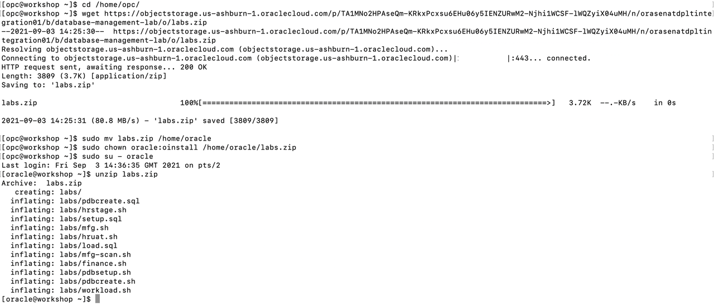
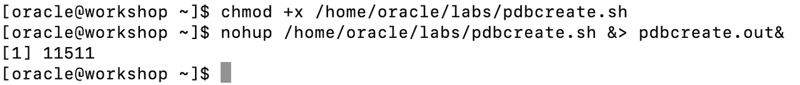
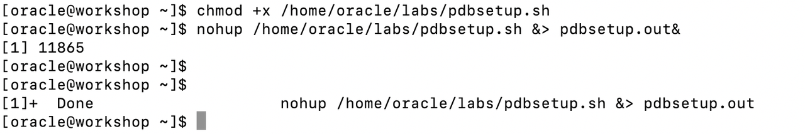
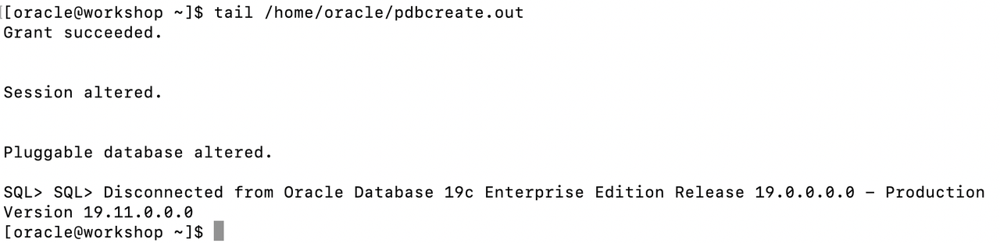
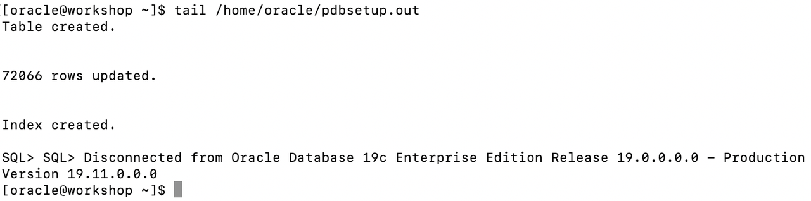
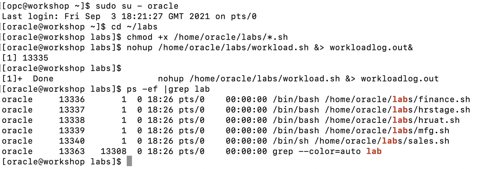

# Setup Pluggable Databases and workload

## Introduction

In this lab, you will go through the steps to setup and configure the workload to be used in exploring Database Management use cases.

Estimated Time: 20 minutes

### Objectives

-   Setup and configure the workload to be used to explore Database Management.

### Prerequisites

This lab assumes you have completed the following labs:
* Lab: Generate SSH Key (FreeTier and Paid accounts)
* Lab: Environment Setup or Verify Setup

## Task 1: Download the Lab Files

1.  Open up the terminal of your choice and login to the compute instance you created in the previous lab.

2.  Copy the following commands into your terminal.  These commands download the files needed to run the lab.

    Note: If you are running in Microsoft Windows using PuTTY, ensure your Session Timeout is set to greater than 0

    ```
    <copy>
    cd /home/opc/
    wget https://objectstorage.us-ashburn-1.oraclecloud.com/p/ftGGzovwbcFVbRyG6jDfgehtN1hV4FsRvyXjvlcwsjmGu-lNxkH0HnwGX_bDgbCb/n/orasenatdpltintegration01/b/database-management-lab/o/labs.zip
    sudo mv labs.zip /home/oracle
    sudo chown oracle:oinstall /home/oracle/labs.zip
    sudo su - oracle
    unzip labs.zip
    </copy>
    ```
    

## Task 2: Run the Setup Scripts
1.  Run this command to setup the fleet of databases and workload schema that you will use for this lab.   This script takes about 10 minutes to complete.   It creates pluggable databases and installs the workload data. Make sure you are still logged in as oracle user.


    ```
    <copy>
    chmod +x /home/oracle/labs/pdbcreate.sh
    nohup /home/oracle/labs/pdbcreate.sh &> pdbcreate.out&
    </copy>
    ```
    

2.  Run this command to install the workload data.


    ```
    <copy>
    chmod +x /home/oracle/labs/pdbsetup.sh
    nohup /home/oracle/labs/pdbsetup.sh &> pdbsetup.out&
    </copy>
    ```
    


3.  To check the status of the script above run the command below.   You can also use the unix **jobs** command to see if the script is still running.  

    ```
    <copy>
    tail /home/oracle/pdbcreate.out
    </copy>
    ```
    

    ```
    <copy>
    tail /home/oracle/pdbsetup.out
    </copy>
    ```
    

## Task 3: Start the workload

1.  All scripts for this lab are stored in the labs folder and are run as the oracle user.  Let's navigate there now.  Run this command to start the workload on all the databases that were setup earlier.

    ```
    <copy>
    sudo su - oracle
    cd ~/labs
    chmod +x /home/oracle/labs/*.sh
    nohup /home/oracle/labs/workload.sh &> workloadlog.out&
    ps -ef |grep lab
    </copy>
    ```
    

## Acknowledgements

- **Author** - Vivek Verma, Principal Cloud Architect, North America Cloud Engineering
- **Contributors** - Vivek Verma, Sriram Vrinda, Pratima Chennupati
- **Last Updated By/Date** - Vivek Verma, September 2021
