# Exadata Cost Management

## Introduction

In this lab, you will go through the steps to explore Exadata Cost Management.

The vision of Ops Insights service is to provide net-new features for users dealing with FinOps domain. The chargeback feature will help organizations utilizing Oracle Cloud services such as ExaDB-D and ExaDB-C@C to understand their resource usage and associated costs, allowing organizations to understand where their IT spending is going.

By showing "showback" and/or allocating "chargeback" costs to individual departments or business units based on their actual usage, or tenancy/resource administrators can promote accountability and encourage more efficient resource utilization. By assigning costs to individual users or departments, chargeback features incentivize responsible resource usage. Users become more mindful of the resources they consume when they know they will be charged for it, leading to better optimization of IT resources and reduced wastage.

The Exadata Cost Management feature will provide organizations with the ability to accurately track, allocate, and manage IT costs associated with the usage of resources within their IT infrastructure.

Objectives

* Enable organizations to track resource usage and associated costs in a hybrid deployment across different departments or business units.
* Facilitate accurate allocation of IT expenses to departments based on their actual resource consumption.
* Provide detailed reporting and analysis capabilities to help organizations understand and optimize their IT spending.

Estimated Time: 15 minutes

### Lab Objectives

* Explore Exadata Cost Management

### Prerequisites

This lab assumes you have completed the following labs:

* Lab: Enable Demo Mode

## Task 1: Exadata Cost Management

1. On the **Ops Insights Overview** page, from the left pane click **Exadata Cost Management**. This will take you to the **Exadata Cost Management** landing page. This page displays a summary view of all the resources that are enabled on the Exadata Cost Management feature. Click on the Exadata System name.

      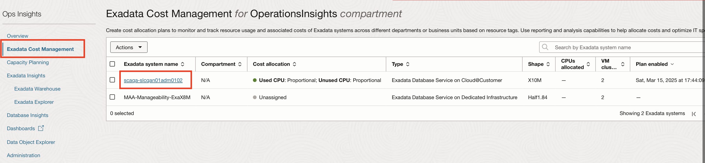

2. The **Exadata Cost Management details** page shows the details of cost associated with this Exadata System at a VM Cluster and PDB Level. The cost associated with each VM Cluster and PDB is depicted by **Color** and **Size** in the Pie Chart.

      The table on the right shows the commulative cost at a VM Cluster, CDB and PDB level.

      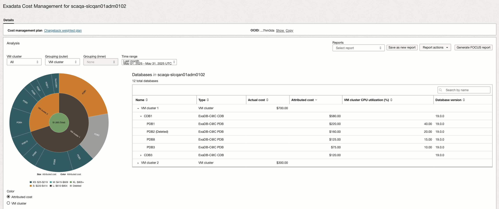

      The legend for the sunburst chart shows different colors for diffrent cost ranges.

3. **Exadata Cost Management details** page also shows -

      * Usage Trend - Monthly CPU, Storage and Memory usage/utilization percentage by Exadata rack type, VM Cluster CDB and PDB.
      * Charge Trend - Monthly charge ($) per VM Cluster (bar-chart)

      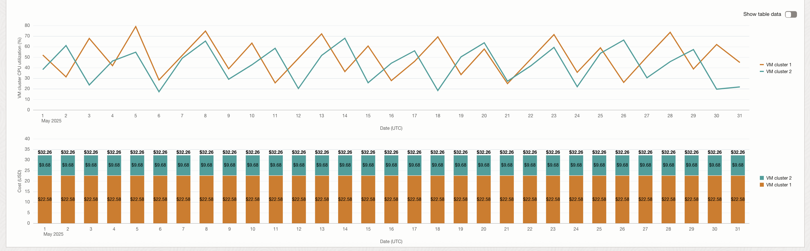

4. Un-select **VM Cluster 2** to view data only for **VM Cluster 1**.

      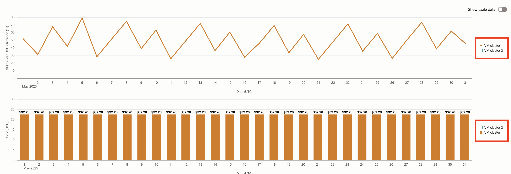

5. Select **VM Cluster 2** again and click **Show table data** to view the data in tabular form.

      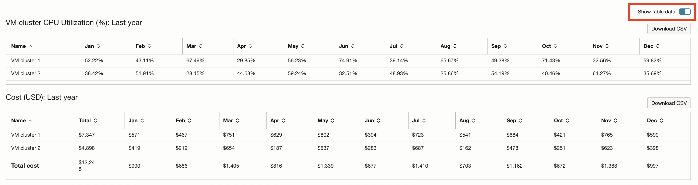

6. Click any PDB and the utilization/cost charts will show details of that specific PDB (names and colors will change depending on which PDB you click, but data does not change). Click **PDB1**.

      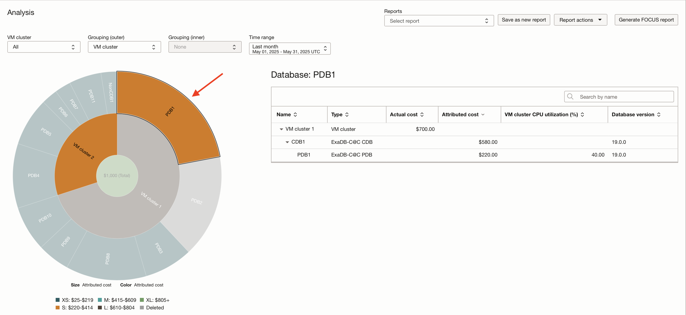

7. Click in the centre of the sunburst chart to get the details of the complete Exadata System.

      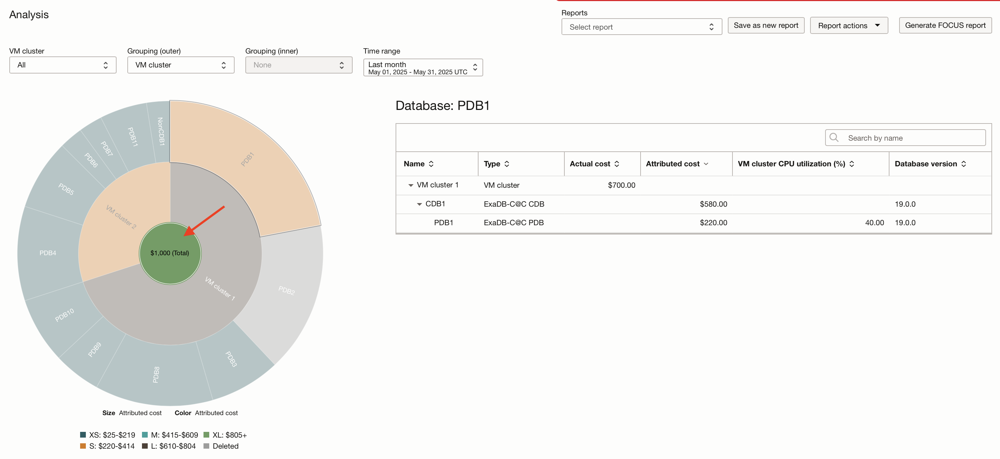

8. Under **VM Cluster** select **VM Cluster 1**

      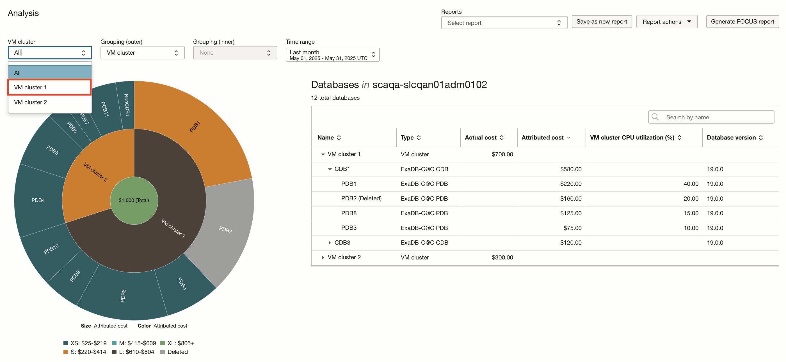

9. The sunburst chart will depict the Cost at a PDB level within the *VM Cluster 1*. The table on the right shows the commulative cost at a CDB level.

      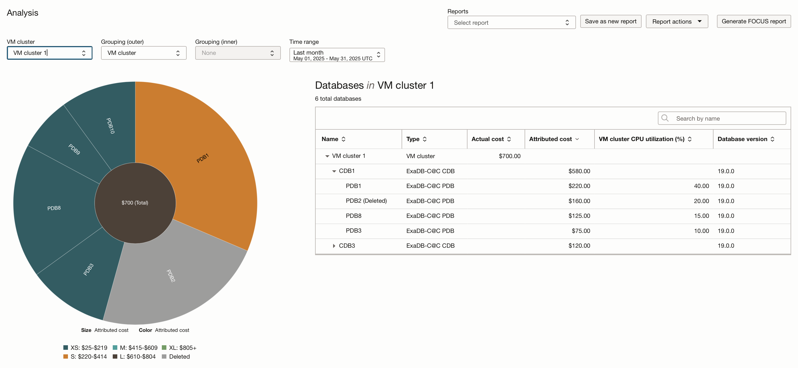

10. Click on the VM Cluster drop down to select **All** and select **LOB** under **Grouping (outer)**. You can create cost center hierarchy/LOB manually within your organization. In order to accomplish this, you have to utilize OCI standard tags to assign cost center's key value.

       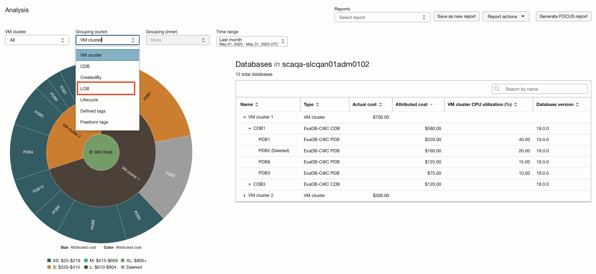

11. This will display cost associated at a Cost Centre or LOB level and PDB level.

      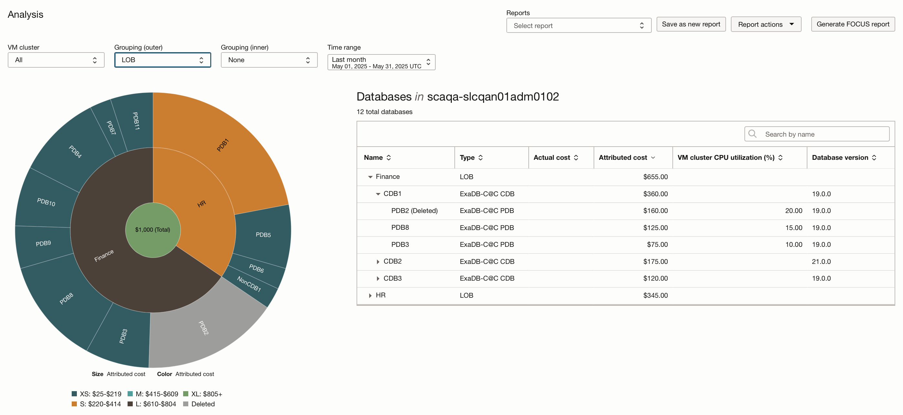

      Apart from the cost, you can also view how many resources are assigned to which cost center and how much is the total charge based on a given time range.

12. Under the Reporting section, you can view existing reports or create new reports based on the data collected on the **Exadata Cost Management details** page. Let's view a previously saved report. Click the **Reports** drop down and select **VM Cluster 1: Lifecycle: Last month**.

      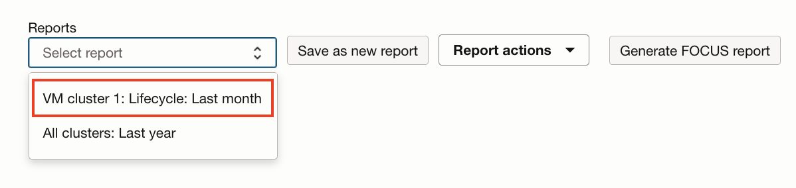

13. This will display data for **VM Cluster 1** grouped by **Lifecycle** for last month.

      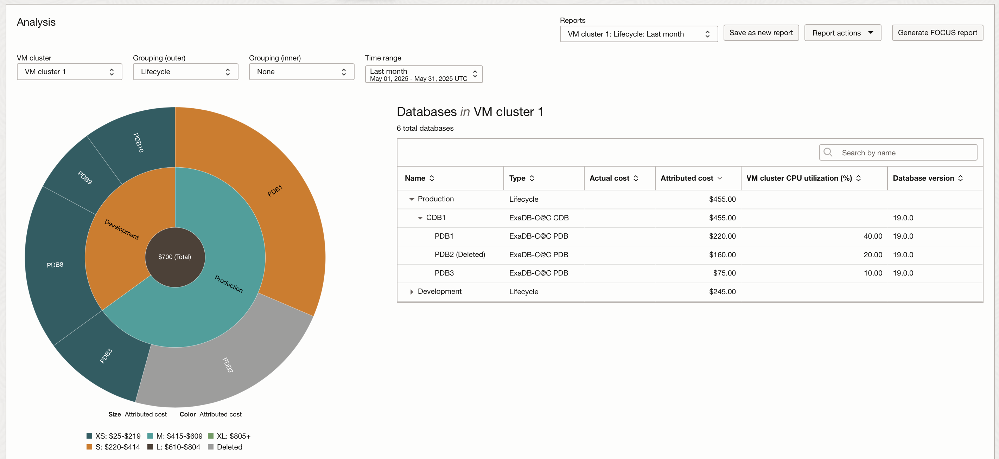

      The table on the right shows cost associated by **Lifecycle**(Production or Development), **CDB** and **PDB**.

14. You can generate reports with multiple levels, such as Cost associated at a LOB level, moving next level to cost associated with CDBs under that LOB and at the next level cost associated with PDBs under those CDBs.

      Under **VM Cluster** select **All**, select **CDB** for **Grouping (outer)** and **LOB** for **Grouping (inner)**.

      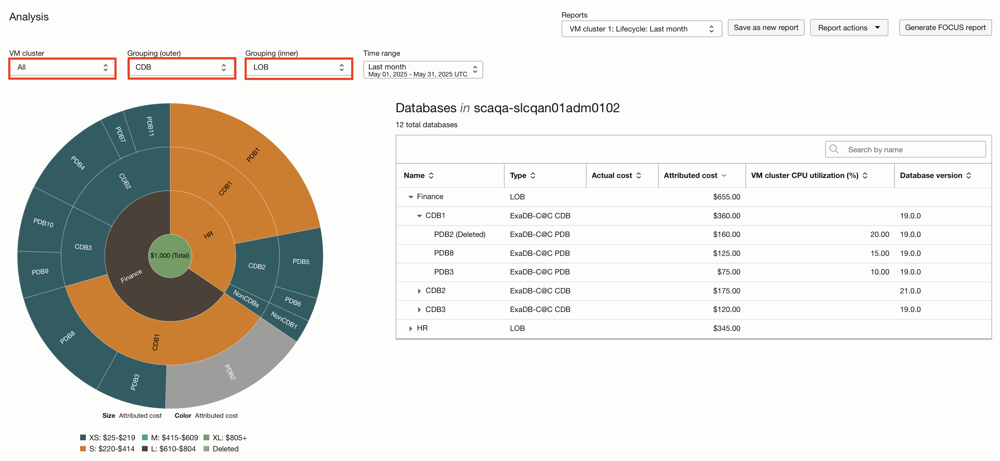

## Acknowledgements

* **Author** - Vivek Verma, Master Principal Cloud Architect, North America Cloud Engineering
* **Contributors** - Vivek Verma, Murtaza Husain
* **Last Updated By/Date** - Vivek Verma, July 2025
