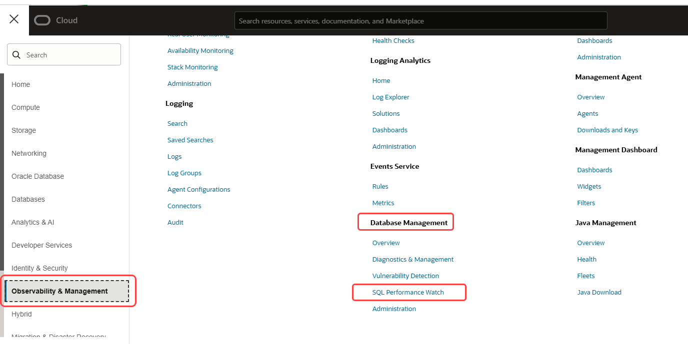
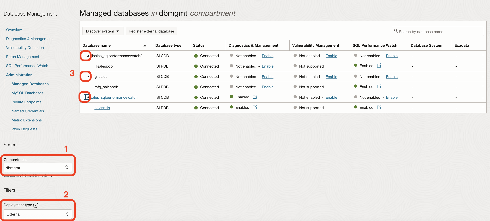
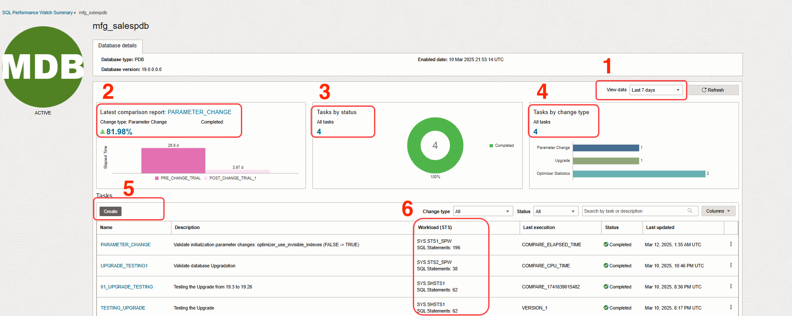
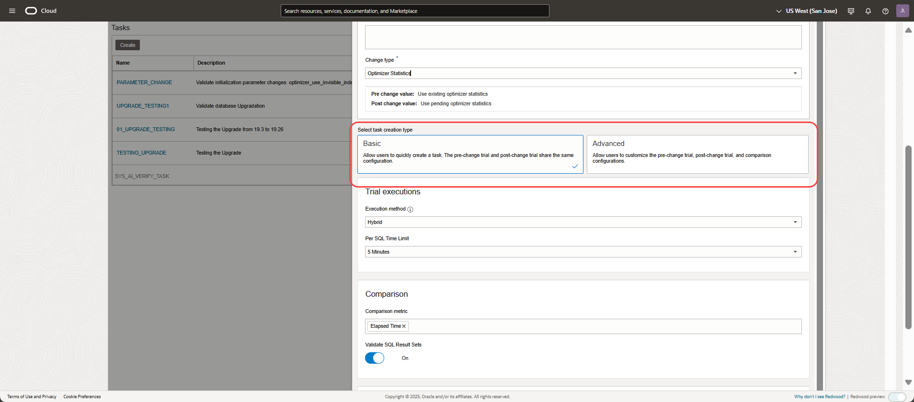
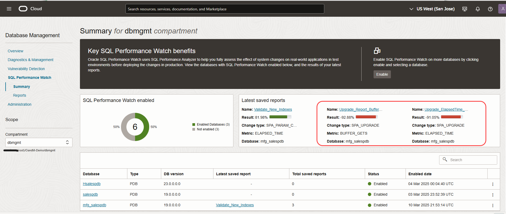
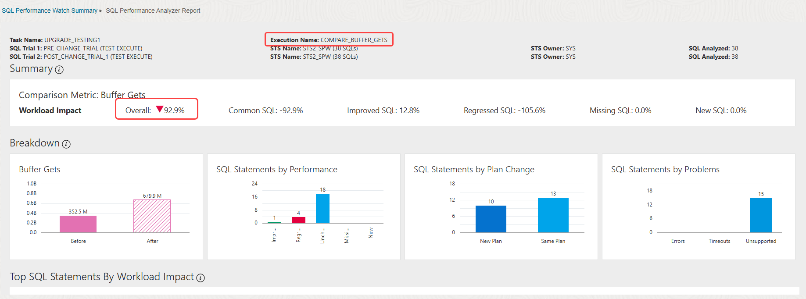
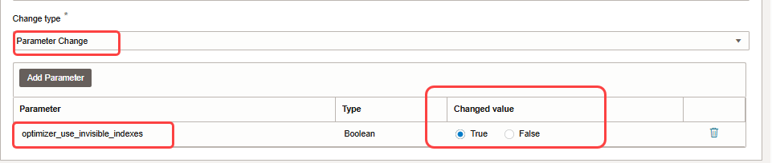

# Explore Oracle Cloud Infrastructure SQL Performance Watch

## Introduction

SQL Performance Watch helps users predict the impact of system changes on SQL workload and generate the granular level details of a SQL performance. Here are some of the tasks you can perform using SQL Performance Watch, which gives you a glimpse into how to identify the regressions from the SQL Performance Analyzer report.

Business Challenges
-   Difficult to predict how database upgrades, parameter changes, or migrations will affect SQL performance, potentially leading to regressions in production
-   Performance issues post-change can disrupt business services, breach SLAs, and impact customer satisfaction
-   Identifying root causes of SQL slowdowns after deployment often consumes significant DBA time and operational cost

Benefits of SQL Performance Watch
-   Enables testing and validating SQL performance before making changes, reducing risk and increasing confidence in deployment decisions
-   Proactively detects performance regressions, ensuring that changes do not negatively affect mission-critical workloads
-   By catching issues early in a test environment, it reduces the need for reactive troubleshooting in production, saving time and operational expenses

SQL Performance Watch Workshop
-   Obtain an overview of your fleet of databases
-   View the reports of the SQL Performance Watch to obtain an insight into the overall health of the databases
-   View how to create the SQL Performance Watch task
-   Review the report of database upgrade from 19.3 to 19.26
-   Proactively review the impact of adding a new index in an database by assessing the saved SPA report

*This workshop is intended solely as an introduction to SQL Performance Watch within a preconfigured environment. It is a guided walkthrough and does not include any tasks or exercises that allow free interaction or modifications within this environment.*

Estimated Time: 30 minutes

### Objectives

-   Use Oracle Cloud Infrastructure SQL Performance Watch to identify the regression by proactively testing the changes before implementing on the production database.

### Prerequisites

This lab assumes you have already completed the following:
- An Oracle Free Tier, Always Free, Paid or LiveLabs Cloud Account

## Task 1: Getting started with SQL Performance Watch

1. Login to the Oracle Cloud Console, change the region to **US West (San Jose)** region, if you are not in the **US West (San Jose)** region on the top right corner, refer to the image below. 
	
	
   	
   Click the **Navigation Menu** in the upper left, navigate to **Observability & Management** and choose **SQL Performance Watch** service to go the SQL Performance Watch page.
	
	

   Ignore the error shown on the top right corner *Authorization failed or requested resource not found.* as the policies for the service are set for the compartment **dbmgmt**. Proceed to next step which will guide you on how to change the compartment.

    

	

2. Choose **dbmgmt** compartment as shown in the below image

	
	
 	Once compartment **dbmgmt** is selected, we can see the databases in the compartment on the table
	
	
3. Navigate to Administration page as shown in the below image 

	
  
   Ignore the error shown on the top right corner as the policies for the service are set for the compartment **dbmgmt**. 

    

   Change the compartment to **dbmgmt** and deployment type as **External** to view the external databases as shown in the below image.
   *Note: External databases are non-OCI databases discovered using Management Agent. They are monitored through the Management Agent, which collects metrics, performs diagnostics, and enables lifecycle operations.*

	
	
	This page shows all the services in columns and the databases in rows. You can enable or disable any service such as SQL Performance Watch, etc,. by using this page for the respective databases. You can view the databases that have SQL Performance Watch enabled under **SQL Performance Watch** column.

	
	

4. Page shows the list of external databases that have SQL Performance Watch enabled. Pluggable Databases (PDBs) can be enabled independent of Container Databases (CDBs).

	

   Go to SQL Performance Watch summary page, and view the databases that have SQL Performance Watch enabled in **US West (San Jose)** region and **dbmgmt** compartment. Summary page gives you fleet of databases including CDBs and PDBs that have enabled SQL Performance Watch. Please make sure you have the **dbmgmt** compartment and region selected as mentioned above.

 	

## Task 2: Create the SQL Performance Watch Task

1. On SQL Performance Watch summary page, click on **mfg\_salespdb** database. The page shows the summary of last 7 days, if no tasks are run in last 7 days the page shows empty, so ensure you have changed **View data** in right corner value to **ALL** from the drop down menu. 

	

	Review the highlighted sections:
	- View data: Please choose **ALL** from the dropdown menu, to view all the tasks
	- Latest Comparison report: Shows the latest report results on the database with the regressed or improved % of the performance of the SQL Tuning Set (STS)
	- Tasks by status: All the tasks performed on the database along with status such as completed, failed, canceled, processing etc., can be viewed here
	- Tasks by change type: Tasks that are created by various **change type** menus that are performed on the database can be viewed in this section
	- You can create the task by clicking on the **Create** button
	- Workload(STS) column highlights the SQL Tuning Set (STS) that is used as an input while creating the task

	

2. Let's start with creating the task. *Please note that this lab is simulated with read only privileges, thus you cannot submit the task or fetch the DB links.*

	 

3. Enter the task name and select the SQL Tuning Set (STS) by clicking on the search icon.

	 

	Choose **STS1_SPW** from the list of SQL Tuning Sets.
	 

4. Choose **Change type** as **Optimizer Statistics** from the drop down menu.

    **Change Type** determines the nature of change being tested for its impact on SQL performance. The available options include:
    - Parameter Change – Test the effect of modifying initialization parameter values.
    - Optimizer Statistics – Analyze performance differences between current and pending optimizer statistics
    - Ignore Optimizer Hints – Compare SQL performance with and without optimizer hints.
    - Upgrade – Assess SQL performance impact after upgrading the database version.
    - Migration – Evaluate SQL performance changes when migrating data between source and target databases.

	 

	There are two types of task creations - one is basic and other is advanced. Basic with basic setting whereas Advanced has customized setting.

	 

5. Choose **Advanced** setting.

	 

	Choose execution method as **Execute SQL** in pre-change trail configurations and leave other fields as default. 
	 

	Choose execution method as **Execute SQL** in post-change trail configurations and leave other fields as default. 
	 

	Now, choose the different metrics to compare before change and after change in the database to understand the impact on SQL Performance such as ***Elapsed Time, Buffer Gets, Opitimizer Cost** and then click **Submit**

	 

	Since, this is preconfigured environment with read only privileges, you won't be able to create the tasks. 
	 

    *Note: We have created tasks for two use cases:*
	- *Use Case 1: Upgrade from DB version 19.3 to 19.26 – Check the impact on SQL performance due to the upgrade.*
	- *Use Case 2: Database parameter change – Check the impact on SQL performance due to this change.*
	
	**Proceed to the next task to review the results of these pre-staged use cases.**

## Task 3: Use Case 1 - Test the upgrade from 19.3 to 19.26 DB version

1. For this demo lab, the tasks are already submitted with Change Type as **Upgrade** and **Parameter Change**. In this task, we will look at the saved reports of Upgrade change type.

2. Let's look at the saved reports, to analyze the performance of a SQL during the upgrade and parameter change. You can save the report after running the task and the saved reports are listed in the summary page. To view the reports, go to SQL Performance Watch summary page, and click on one of the saved reports as shown in the below image.

	

3.  One of the saved reports is testing the upgrade use cases and the other is validating adding the new indexes. First, let's review the upgrade saved reports **Upgrade\_Report\_BufferGets**.

	

4.  Click on **Upgrade\_Report\_BufferGets** to review the granular level details of the SQL Performance while testing the upgrade from 19.3 to 19.26. This report is generated to compare **Buffer Gets** with the previous version of the database. Hence the comparison metric is **Buffer Gets**. You can view the breakdown of SQL execution under **Breakdown** section. There are four section each divided based on the SQL statements: 
	- Buffer Gets (i.e Comparison metrics): Is showing the performance of SQLs pre-change and post-change trials
	- SQL Statements by Performance: Is showing the SQLs that are improved, regressed, unchanged, new and missing in pre and post change trails
	- SQL Statements by Plan Change: Is showing the number of SQLs that are New Plans or Same Plans in pre and post change trials
	- SQL Statements by Problems: Is showing number of Errors, Timeouts and Unsupported SQL statements

	Below Image - Buffer Gets report
	

5. Review the regressed SQLs and look for plan change **Yes**, indicating that there is a SQL plan change for that specific SQL.    

	Below Image - Regressed SQLs
	

6. Click on the SQLID to review the SQL performance by analyzing the metrics and the plan changes. In this report, you can analyze each metric for pre-change and post-change trials. You can view that in the column **Metric Change (Before/After)** where the bars indicating before and after the change for each metric and the respective impact on SQL and on Workload. As you go scroll down, you can see two Plans - Plan Before and Plan After, which shows the execution plan for the SQL before and after the change.
 
	Below Image - Regressed SQL report
	

	Below Image - View before and after SQLID plans
	

	Below Image - Index change in the plan
	

**Note:** To do it in your own tenancy, please choose change type as **Upgrade** and make sure there are DB links available to run the SPA trials remotely. [Refer to video](https://youtu.be/C9qkLNqj5x4) on how to test the upgrade using SQL Performance Watch.

## Task 4: Use Case 2 - Test the database parameter change

1. Go back to SQL Performance Watch summary page and view the other saved report of validating new indexes. Let's open the report to review how to validate adding new indexes report. Click on saved report - **Validate\_New\_Indexes**.

	Below Image - Parameter Change saved report
	

2. Check for improved SQLs and analyze the report for the impact and improvement of the SQLs due to index addition. 

	Below Image - View improved SQLs
	

3. Click on the SQLID to review the SQL performance by analyzing the metrics and the plan changes as you have done in the previous task.

4. To do it on your own, please choose change type as **Parameter Change** and make sure the indexes are invisible while adding, and choose the parameter as **optimizer\_use\_invisible\_indexes** and change the value to **True**. Please note that this lab is simulated with read only privileges, thus you cannot submit the task or fetch the DB links.
 
	Below Image - View New Indexes
	

Now you can follow the same steps in your own tenancy to explore SQL Performance Watch features, to know more about the other use cases, please refer to the videos below.

## Learn More

- [Test the upgrade using SQL Performance Watch](https://youtu.be/C9qkLNqj5x4)
- [Assess parameter change using SQL Performance Watch](https://youtu.be/whv2V9WTack)
- [Custom or Guided workflow](hhttps://youtu.be/yzo_zdmvUTE)

## Acknowledgements

- **Author** - Anusha Vojjola, Senior Product Manager, Observability and Management
- **Contributors** - Anusha Vojjola, Anand Prabhu
- **Last Updated By/Date** - Anusha Vojjola, April 2025