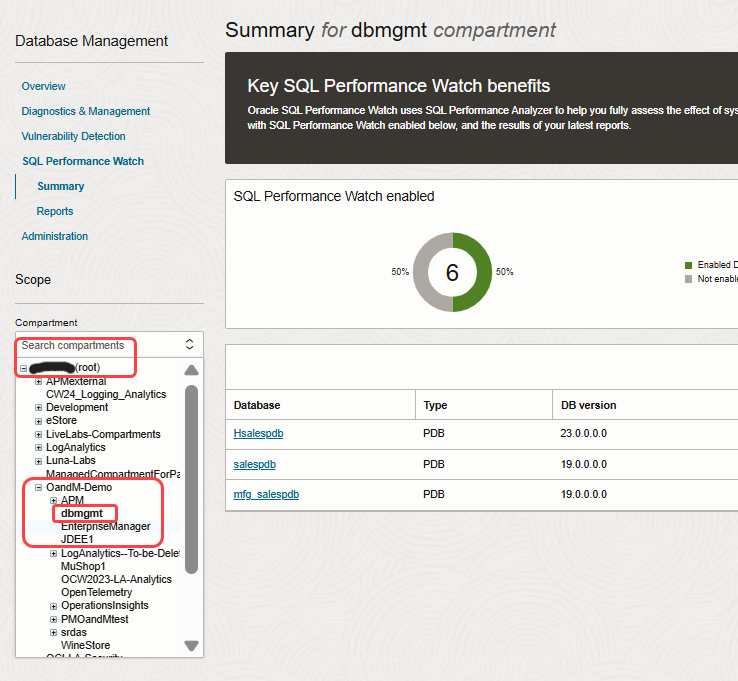
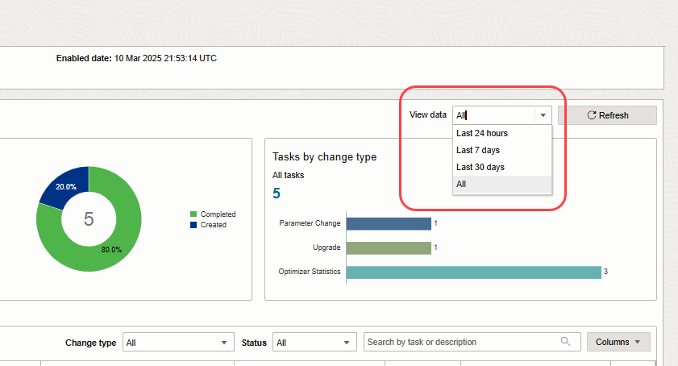
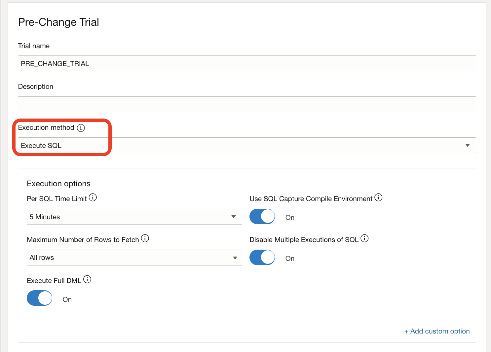
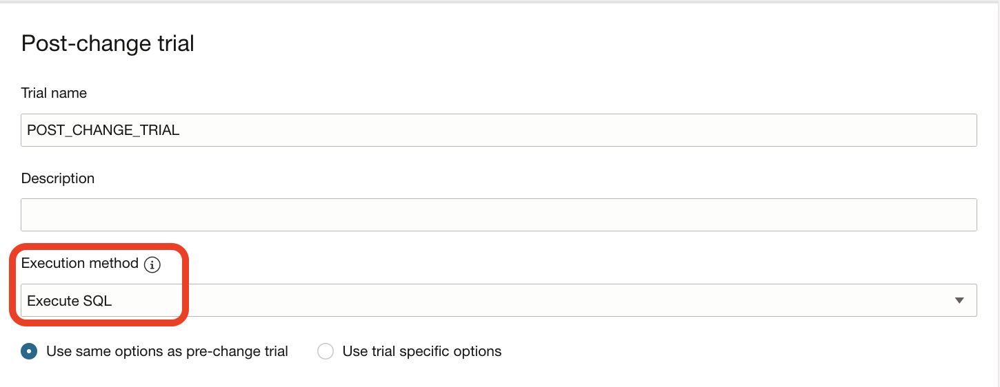
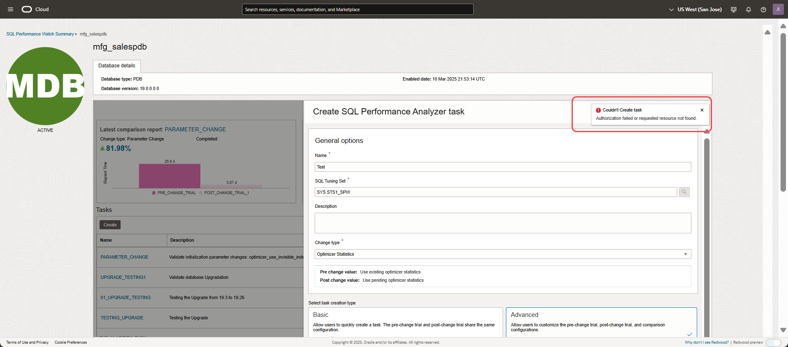
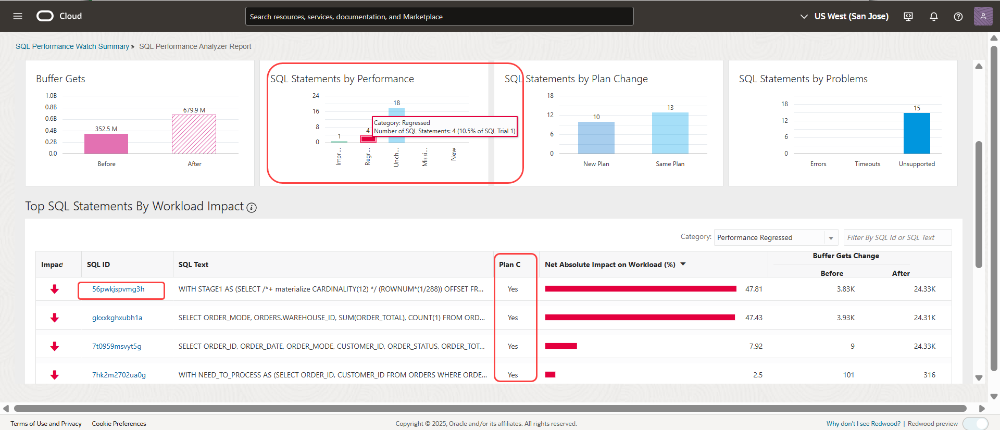
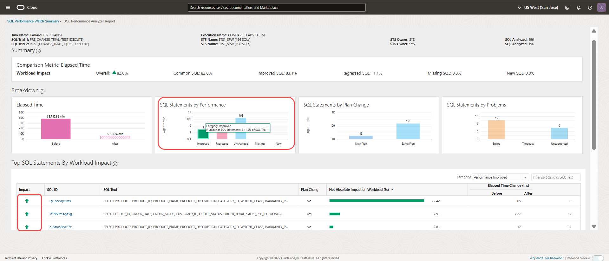

# Explore Oracle Cloud Infrastructure SQL Performance Watch

## Introduction

SQL Performance Watch helps users predict the impact of system changes on SQL workload and generate the granular level details of a SQL performance. Here are some of the tasks you can perform using SQL Performance Watch, which gives you a glimpse into how to identify the regressions from the SQL Performance Analyzer report.

SQL Performance Watch
-   Obtain an overview of your fleet of databases
-   View the reports of the SQL Performance Watch to obtain an insight into the overall health of the databases
-   View how to create the SQL Performance Watch task
-   Review the report of database upgrade from 19.3 to 19.26
-   Proactively review the impact of adding a new index in an database by assessing the saved SPA report

Estimated Time: 30 minutes

### Objectives

-   Use Oracle Cloud Infrastructure SQL Performance Watch to identify the regression by proactively testing the changes before implementing on the production database.

### Prerequisites

This lab assumes you have already completed the following:
- An Oracle Free Tier, Always Free, Paid or LiveLabs Cloud Account

## Task 1: Getting started with SQL Performance Watch

1. Login to the Oracle Cloud Console, change the region to **US West (San Jose)** region, if you are not in the **US West (San Jose)** region on the top right corner, refer to Image. Click the **Navigation Menu** in the upper left, navigate to **Observability & Management** and choose **SQL Performance Watch** service to go the SQL Performance Watch page.
	
	Below Image- Region selection
	
   	
	Below Image- Choose SQL Performance Watch
	
	

2. Choose **dbmgmt** compartment. Once compartment is selected, you can see the databases in the compartment on the table. Refer to the images below.

	Below Image- selecting dbmgmt compartment
	
	
 	Below Image- Once compartment is selected, we can see the databases in the compartment on the table
	
	
3. Navigate to Administration page and choose external database to view the external databases. This page shows all the services in columns and the databases in rows. You can enable or disable any service such as SQL Performance Watch, etc,. by using this page for the respective databases. You can view the databases that have SQL Performance Watch enabled under **SQL Performance Watch** column.

	Below Image- Navigate to administration page and select deployment type -External
	
	

4. You can view the list of external databases that have SQL Performance Watch enabled. Pluggable Databases (PDBs) can be enabled independent of Container Databases (CDBs). Go to SQL Performance Watch summary page, and view the databases that have SQL Performance Watch enabled in **US West (San Jose)** region and **dbmgmt** compartment. Summary page gives you fleet of databases including CDBs and PDBs that have enabled SQL Performance Watch.

	Below Image- Navigate to administration page and select deployment type -External
	

 	

5. Go to SQL Performance Watch summary page, and click on one of the listed databases.

	Below Image - List of the SQL Performance Watch enabled databases
	

## Task 2: Create the SQL Performance Watch Task

1. On SQL Performance Watch summary page, click on **mfg\_salespdb** database. The page shows the summary of last 7 days, if no tasks are run in last 7 days the page shows empty, so ensure you have changed **View data** in right corner value to **ALL** from the drop down menu. Review the highlighted sections:
	- View data: Please choose **ALL** from the dropdown menu, to view all the tasks
	- Latest Comparison report: Shows the latest report results on the database with the regressed or improved % of the performance of the SQL Tuning Set (STS)
	- Tasks by status: All the tasks performed on the database along with status such as completed, failed, canceled, processing etc., can be viewed here
	- Tasks by change type: Tasks that are created by various **change type** menus that are performed on the database can be viewed in this section
	- You can create the task by clicking on the **Create** button
	- Workload(STS) column highlights the SQL Tuning Set (STS) that is used as an input while creating the task

	Below Image - View all tasks
	

	Below Image - SQL Performance Watch Single DB landing page
	

2. Let's start with creating the task. Please note that this lab is simulated with read only privileges, thus you cannot submit the task or fetch the db links.

	Below Image - Task Creation
	 

3. Enter the task name and give the SQL Tuning Set (STS) as an input by clicking on the search icon. Choose one from the list of SQL Tuning Sets.

	Below Image - Enter Task Name and search STS
	 

	Below Image - Choose STS
	 

4. Depending on what you want to test, choose **Change type** from the drop down menu. There are two types of task creations - one is basic and other is advanced. Basic with basic setting whereas Advanced has customized setting.

	Below Image - Choose the Change type
	 

	Below Image - Task Creation Type
	 

5. Let's explore **Advanced** setting. Choose pre-change trial and post-change trial configurations. Accordingly, choose the comparison metrics such as Elapsed time, Buffer Gets, etc.,. Since, this is simulated for read only privileges, you won't be able to create the tasks.

	Below Image - Advanced setting
	 

	Below Image - Pre Change trial 
	 

	Below Image - Post Change trial 
	 

	Below Image - Comparison metric and submit 
	 

	Below Image - Expected submission error
	 

## Task 3: Test the upgrade from 19.3 to 19.26 DB version

1. For this demo lab, the tasks are already submitted with Change Type as **Upgrade** and **Parameter Change**. In this task, we will look at the saved reports of Upgrade change type.

2. Let's look at the saved reports, to analyze the performance of a SQL during the upgrade and parameter change. You can save the report after running the task and the saved reports are listed in the summary page. To view the reports, go to SQL Performance Watch summary page, and click on one of the saved reports.

	Below Image - Saved reports
	

3.  One of the saved reports is testing the upgrade use cases and the other is validating adding the new indexes. First, let's review the upgrade saved reports **Upgrade\_Report\_BufferGets**.

	Below Image - Upgrade saved report
	

4.  Click on **Upgrade\_Report\_BufferGets** to review the granular level details of the SQL Performance while testing the upgrade from 19.3 to 19.26. This report is generated to compare **Buffer Gets** with the previous version of the database. Hence the comparison metric is **Buffer Gets**. You can view the breakdown of SQL execution under **Breakdown** section. There are four section each divided based on the SQL statements: 
	- Buffer Gets (i.e Comparison metrics): Is showing the performance of SQLs pre-change and post-change trials
	- SQL Statements by Performance: Is showing the SQLs that are improved, regressed, unchanged, new and missing in pre and post change trails
	- SQL Statements by Plan Change: Is showing the number of SQLs that are New Plans or Same Plans in pre and post change trials
	- SQL Statements by Problems: Is showing number of Errors, Timeouts and Unsupported SQL statements

	Below Image - Buffer Gets report
	

5. Review the regressed SQLs and look for plan change **Yes**, indicating that there is a SQL plan change for that specific SQL.    

	Below Image - Regressed SQLs
	

6. Click on the SQLID to review the SQL performance by analyzing the metrics and the plan changes. In this report, you can analyze each metric for pre-change and post-change trials. You can view that in the column **Metric Change (Before/After)** where the bars indicating before and after the change for each metric and the respective impact on SQL and on Workload. As you go scroll down, you can see two Plans - Plan Before and Plan After, which shows the execution plan for the SQL before and after the change.
 

	Below Image - Regressed SQL report
	

	Below Image - View before and after SQLID plans
	

	Below Image - Index change in the plan
	

7. To do it your own tenancy, please choose change type as **Upgrade** and make sure there are DB links available to run the SPA trials remotely. [Refer to video](https://youtu.be/C9qkLNqj5x4) on how to test the upgrade using SQL Performance Watch.

## Task 4: Parameter Change - Validate New Indexes

1. Go back to SQL Performance Watch summary page and view the other saved report of validating new indexes. Let's open the report to review how to validate adding new indexes report. Click on saved report - **Validate\_New\_Indexes**.

	Below Image - Parameter Change saved report
	

2. Check for improved SQLs and analyze the report for the impact and improvement of the SQLs due to index addition. 

	Below Image - View improved SQLs
	

3. Click on the SQLID to review the SQL performance by analyzing the metrics and the plan changes as you have done in the previous task.

4. To do it on your own, please choose change type as **Parameter Change** and make sure the indexes are invisible while adding, and choose the parameter as **optimizer\_use\_invisible\_indexes** and change the value to **True**
 
	Below Image - View New Indexes
	

Finally, you can follow the same steps to go back on your own tenancy to explore the features, to know more about the other use cases, please refer to the videos below.

## Learn More

- [Test the upgrade using SQL Performance Watch](https://youtu.be/C9qkLNqj5x4)
- [Assess parameter change using SQL Performance Watch](https://youtu.be/whv2V9WTack)
- [Custom or Guided workflow](hhttps://youtu.be/yzo_zdmvUTE)

## Acknowledgements

- **Author** - Anusha Vojjola, Senior Product Manager, Observability and Management
- **Contributors** - Anusha Vojjola, Anand Prabhu
- **Last Updated By/Date** - Anusha Vojjola, April 2025