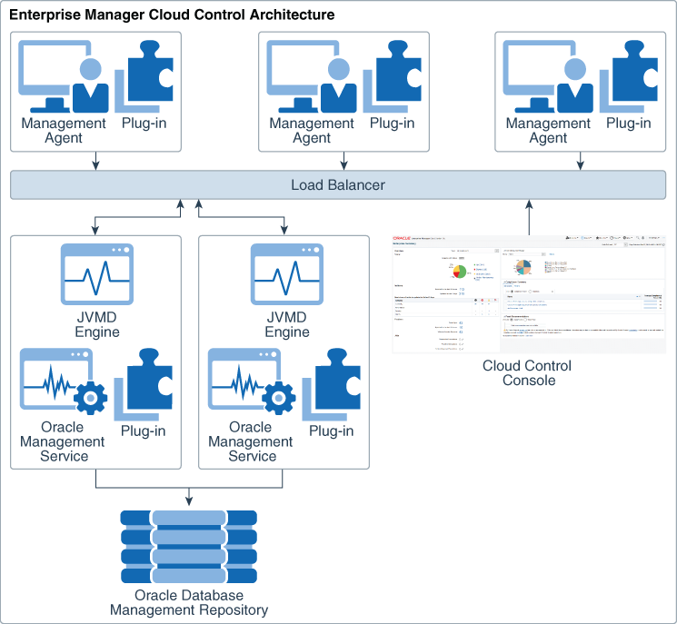

# Introduction

## About this workshop

After you install Oracle Database 21c on your host, let's connect to the database, and get started with database administration using Oracle Enterprise Manager (Oracle EM).

**Oracle Enterprise Manager Cloud Control (Oracle EMCC)** is Oracle’s on-premise management solution providing centralized monitoring, administration, and lifecycle management functionality for the complete IT infrastructure. It offers a single dashboard to monitor and manage your entire computing environment from a web-based console.

Oracle EM offers a comprehensive set of performance and health metrics that allows unattended monitoring of key components in your environment. These key components include but are not limited to applications, application servers, Oracle Databases, and the back-end components on which they rely, such as hosts, operating systems, storage, and so on.

*Estimated Time:* 1 hour 45 minutes

Watch this video on *Oracle EMCC Console Overview*.

### Objectives

In this workshop, you will learn how to *connect to SQL Plus* and *view container details*. You will *log in to Oracle EMCC* console from a web browser and *manage target databases and listeners* from the cloud interface. You will access the *container homepage* from Oracle EMCC and manage your *favorites*.

### Prerequisites
This lab assumes you have -
- A Free Tier, Paid or LiveLabs Oracle Cloud account

**Note:** If you have a **Free Trial** account, when your Free Trial expires your account will be converted to an **Always Free** account. You will not be able to conduct Free Tier workshops unless the Always Free environment is available. **[Click here for the Free Tier FAQ page.](https://www.oracle.com/cloud/free/faq.html)**

## Appendix 1: Oracle EMCC Architecture

The figure below shows a sample Oracle EMCC configuration and illustrates how the core components interact with each other in the architecture.

**Note:** This figure depicts a load balancer and multiple Oracle Management Service (OMS) instances only to indicate how to deploy Oracle EMCC in a large organization. They are not prerequisites for an Oracle EM system installation.

> If you do not have the load balancer, the Management Agents communicate directly with the OMS instances.

### Oracle EMCC Components

Oracle EMCC includes the following components:

- **Oracle Management Agent**

    The agent enables you to convert an unmanaged host to a managed host and helps you monitor the targets running on the managed host.

    To learn more about managed hosts, see the *What are managed targets and managed hosts?* section below.

- **Oracle Management Service (OMS)**

    A web-based application to discover, monitor, and manage targets, and to store the collected information in a repository. It also renders the user interface for Oracle EMCC.

- **Oracle Management Repository**

    A storage location for the information, which the Management Agent collects. It consists of objects such as database jobs, packages, procedures, views, and tablespaces. It organizes the data so that OMS can retrieve and display it on the Oracle EMCC console.

- **Plug-ins**

    Pluggable entities that help you monitor all types of targets in your environment.

- **Oracle Java Virtual Machine Diagnostics (JVMD) Engine**

    It enables you to diagnose performance problems in Java applications in the environment. It eliminates the need to reproduce problems, thus improving application availability and performance.

- **Oracle EMCC Console**

    The user interface that you see after logging in to Oracle EMCC. The console helps you monitor and administer your entire computing environment from one location on the network.

- **EMCTL**

    A command-line tool that enables you to execute tasks on the OMS and Management Agents. You can use it for tasks, such as starting and stopping OMS instances, setting properties on OMS instances, or getting a list of targets that the Management Agent monitors.

- **EM CLI**

    A command-line tool that is accessible through classic programming language constructs. It helps you create and run tasks from the command-line or by using a program. It enables you to access Oracle EMCC functionality from text-based consoles (shells and command-line windows) for a variety of operating systems.

### What are managed targets and managed hosts?

Oracle EMCC allows you to discover entities and add them as *targets*. Examples of manageable entities are Oracle Databases, Oracle homes, listeners, agents, OMS, Fusion Middleware components, and server targets (hardware) to name a few.

*Managed hosts* are the host systems where these manageable entities reside. You can monitor and manage these hosts and the targets therein from the cloud interface.

Click on the next lab to **Get Started**.

## Learn More

- [Oracle Enterprise Manager Cloud Control (Oracle EMCC)](https://docs.oracle.com/en/enterprise-manager/index.html)
- [Oracle EMCC Release Notes](https://docs.oracle.com/en/enterprise-manager/cloud-control/enterprise-manager-cloud-control/13.5/emrel/cloud-control-release-notes-emrel.html#GUID-42C87BBB-CA6D-4A5E-8B59-AA94755724E0)
- [Oracle Database Documentation](https://docs.oracle.com/en/database/oracle/oracle-database/index.html)
- [Oracle Cloud Infrastructure Documentation](https://docs.oracle.com/en-us/iaas/Content/Identity/Concepts/overview.htm)

## Acknowledgements

- **Author** - Manish Garodia, Principal User Assistance Developer, Database Technologies
- **Contributors** - Suresh Rajan, Steven Lemme, Ashwini R
- **Last Updated By/Date** - Manish Garodia, December 2021
