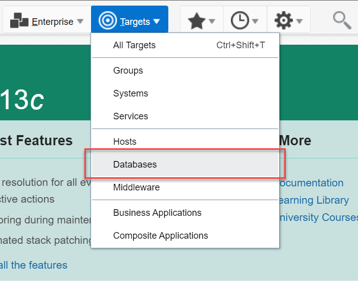
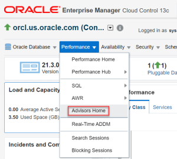
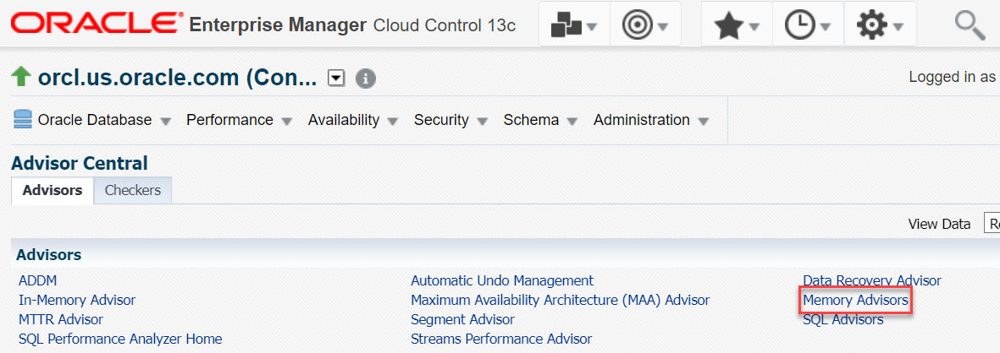
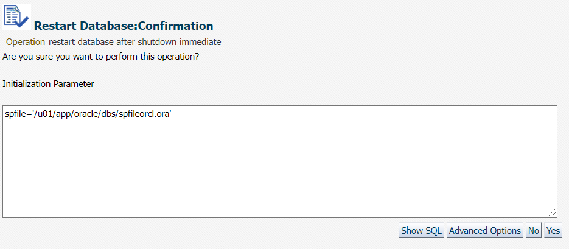
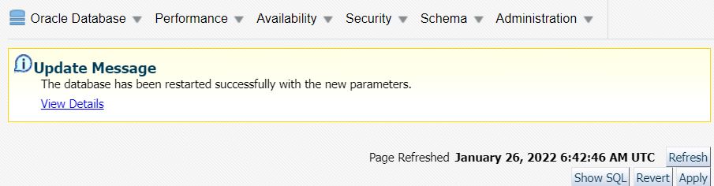
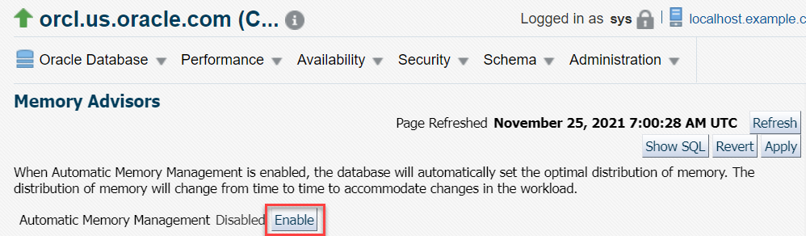
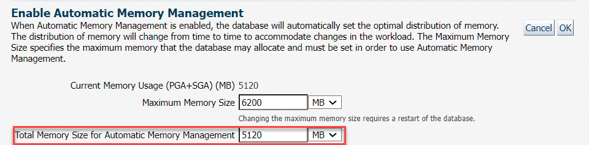
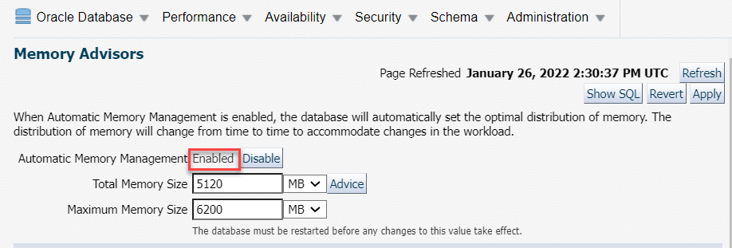
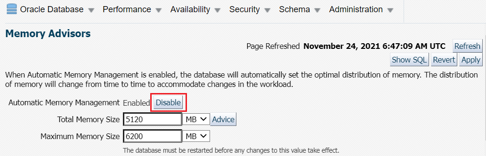
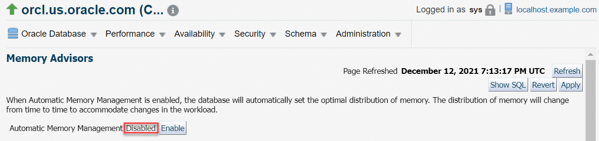

# Automatic Memory Management

## Introduction

This lab shows how to enable Automatic Memory Management for Oracle Database from Oracle Enterprise Manager Cloud Control (Oracle EMCC) and SQL command line.

Estimated time: 15 minutes

### Objectives  

Enable Automatic Memory Management for Oracle Database from either Oracle EMCC or the SQL command line. 

### Prerequisites  
This lab assumes you have -
-   A Free Tier, Paid or LiveLabs Oracle Cloud account
-   Completed all the previous labs succesfully.

## Task 1: Set the Environment  

To enable Automatic Memory Management feature using SQL commands, you must set the environment first. 

1.  Log in to your host as *oracle*.  

2.  Open a terminal window and change the current working directory to `$ORACLE_HOME/bin`. 

    ```
    $ <copy>cd /u01/app/oracle/product/21.0.0/dbhome_1/bin</copy>
    ```

3.  Run the command `oraenv` to set the environment variables.

    ```
    $ <copy>./oraenv</copy>
    ```

4.  Enter Oracle SID `orcl`.

    ```
    ORACLE_SID = [oracle] ? <copy>orcl</copy>
    The Oracle base has been set to /u01/app/oracle
    ```
    This command also sets the Oracle home path to `/u01/app/oracle/product/21.0.0/dbhome_1.`

You have set the environment variables for the active terminal session. You can now connect to Oracle Database and run the commands.

**Note:** Every time you open a new terminal window, you must set the environment variables to connect to Oracle Database from that terminal. Environment variables from one terminal do not apply automatically to other terminals. 
Alternatively, you may run the script file `.set-env-db.sh` from the home location and enter the number for `ORACLE_SID`, for example, *3* for `orcl`. It sets the environment variables automatically.

## Task 2: Options to Enable Automatic Memory Management

You can enable Automatic Memory Management for your Oracle Database from either Oracle EMCC or the SQL command line. 

-   To enable Automatic Memory Management from Oracle EMCC, follow *Task 2A* of this lab.
-   To enable Automatic Memory Management from the SQL command line, follow *Task 2B* of this lab. 

## Task 2A: Enable Automatic Memory Management from SQL command line

To enable Automatic Memory Management, shut down and restart the Oracle Database.  

1.  From `$ORACLE_HOME/bin`, log in to SQL\*Plus as `SYSDBA`.

    ```
    $ <copy>./sqlplus / as sysdba</copy>
    ```

    ```
    SQL*Plus: Release 21.0.0.0.0 - Production on Tue Sep 28 08:23:15 2021
    Version 21.3.0.0.0

    Copyright (c) 1982, 2021, Oracle.  All rights reserved.

    Connected to:
    Oracle Database 21c Enterprise Edition Release 21.0.0.0.0 - Production
    Version 21.3.0.0.0

    SQL>
    ```

2.  View the values of all initialization parameters with the string `TARGET` in the parameter name.

    ```
    SQL> <copy>show parameter target</copy>

    ```
    It displays the following output.

    ```
    NAME                                 TYPE        VALUE
    ------------------------------------ ----------- ----------------------
    archive_lag_target                   integer     0
    db_big_table_cache_percent_target    string      0
    db_flashback_retention_target        integer     1440
    fast_start_io_target                 integer     0
    fast_start_mttr_target               integer     0
    memory_max_target                    big integer 0
    memory_target                        big integer 0
    parallel_servers_target              integer     40
    pga_aggregate_target                 big integer 1477M
    sga_target                           big integer 4432M
    target_pdbs                          integer     8

    ```

	Run the following commands and change the values of the initialization parameters.

3.	Set the parameter `memory_max_target` to *6G*.

    ```
    SQL> <copy> alter system set memory_max_target=6G scope=spfile;</copy>      
    ```
    ```
    System altered.
    ```

4.  Set the parameter `memory_target` to *5G*.

    ```
    SQL> <copy>alter system set memory_target=5G scope=spfile;</copy>  
    ```
    ```  
    System altered.
    ```

5.  Set the parameter `pga_aggregate_target` to *0*.  

    ```
    SQL> <copy>alter system set pga_aggregate_target=0 scope=spfile;</copy>
    ```  
    ```
    System altered.
    ```

6.  Set the parameter `sga_target` to *0*.  

    ```
    SQL> <copy>alter system set sga_target=0 scope=spfile;</copy>
    ```  
    ```
    System altered.
    ```

    **Note:** The preceding steps instruct you to set the parameters `SGA_TARGET` and `PGA_AGGREGATE_TARGET` to *0* so that the size of the SGA and instance PGA are tuned up and down as required, without restrictions.  

	For the new values of the parameters to take effect, shut down and start the Database Instance.

7.  Shut down the Database Instance in *IMMEDIATE* mode. 

    ```
    SQL> <copy>shutdown immediate;</copy>
    ```
    ```
    Database closed.

    Database dismounted.

    ORACLE instance shut down.
    ```

8.  Start the Database Instance again and open Oracle Database.  

    ```
    SQL> <copy>startup</copy>
    ```

    ```
    ORACLE instance started
    Total System Global Area 4647288568 bytes
    Fixed Size                  9694968 bytes
    Variable Size            1073741824 bytes
    Database Buffers         3556769792 bytes
    Redo Buffers                7081984 bytes
    Database mounted.
    Database opened.
    ```

    The Database Instance starts in the default *OPEN* mode.  

9.  Execute `show parameter target` command to view the new values of the initialization parameters.

    ```
    SQL> <copy>show parameter target</copy>
    ```

    ```
    NAME                                 TYPE        VALUE
    ------------------------------------ ----------- -------
    archive_lag_target                   integer     0
    db_big_table_cache_percent_target    string      0
    db_flashback_retention_target        integer     1440
    fast_start_io_target                 integer     0
    fast_start_mttr_target               integer     0
    memory_max_target                    big integer 6G
    memory_target                        big integer 5G
    parallel_servers_target              integer     40
    pga_aggregate_target                 big integer 0
    sga_target                           big integer 0
    target_pdbs                          integer     9

    ```

To verify that you have enabled the Automatic Memory Management option for your Oracle Database, log in to Oracle EMCC. From the instance home page, go to Memory Advisors. The Automatic Memory Management option displays *Enabled*.  

## Task 2B: Enable Automatic Memory Management from Oracle EMCC

After logging in to Oracle EMCC, you can view the status of Automatic Memory Management and enable it.

1.  From the **Targets** menu, select **Databases**.  

      

    The Databases page displays a list of Oracle Databases added to Oracle EMCC as managed targets.   
	The values may differ depending on the system you are using.  

      

2.  Click on the Database Instance name, *orcl.us.oracle.com*, to open the instance home page.  
	The values may differ depending on the system you are using.  

      

3.  From the **Performance** menu, select **Advisors Home**.  

      

4.  On the Advisors tab, select **Memory Advisors**.  

      

    **Note:** The Memory Advisors option is available only from the Database Instance home page, and not from the PDB home page. You can use Memory Advisors when the Automatic Memory Management feature is disabled. The Memory Advisors automatically adjusts the memory distribution among the various SGA and PGA for optimal performance. These adjustments are made within the boundaries of your total SGA and PGA target values. If the Memory Advisor finds that the current amount of available memory is inadequate and adversely affecting performance, it recommends you to increase your SGA or PGA target value. You can set new values for the SGA and PGA using the Memory Advisor.   

    If the **Maximum SGA Size (MB)** field consists of a positive number that is greater than or equal to the desired total amount of memory to allocate to the database, then you can directly **Enable** Automatic Memory Management option without performing rest of the steps.  

5.  In the **Maximum SGA Size (MB)** field, enter the maximum permissible size for database memory and click **Apply**. For this lab the Maximum SGA Size entered is *6 GB*.  

      

	**Note:** To decide the maximum SGA size, use the sum of the current sizes of the SGA and instance PGA as a guideline, and optionally add some extra values for extension.

6.  A confirmation page appears indicating that you must restart Oracle Database. Click **Yes** to restart the database.

	

	The Restart Database credentials page appears.  

      

7.  For Host Credentials, specify the following.  

    **Credential**: *Named*  
    Oracle EMCC fills in the **UserName** and **Password** fields automatically.  
    You can click **More Details** and then click **Test** to verify that the specified host credentials are working.  

8.  For Database credentials, specify the following.

    **Credential**: *Preferred*. This is the default value selected.  
    **Preferred Credential Name**: *SYSDBA Database Credentials*. This is the credential you assigned during Oracle Database installation.  

    Click **OK** to proceed.   

9.  A restart database confirmation window appears. Click **OK** to restart the database.   
	Oracle Database takes a while to restart. After which you receive an update message of successful database restart.  

      


10.  Click **Refresh** to return to the Database home page.

    

	Now, go to the Memory Advisors page and view the status of Automatic Memory Management as follows.

11.  On the Database home page, click on the Database Instance name, *orcl.us.oracle.com*, to open the instance home page.   

      

12.  From the **Performance** menu, select **Advisors Home**.  

      

13.  In the Advisors section, select **Memory Advisors**.  

      

14.  The Memory Advisors page displays the status of Automatic Memory Management as `Disabled`. Click **Enable** to enable this option.  

    

15.  On the Enable Automatic Memory Management page, in the **Total Memory Size for Automatic Memory Management** field, enter the desired amount of memory to allocate to the database and then click **OK**. For this lab, *5.12 GB* is used as **Total Memory Size for Automatic Memory Management**. 

      

    The window displays a message to confirm that you have enabled Automatic Memory Management. Oracle Database will automatically adjust the memory sizes to achieve optimal distribution.   

	You can verify that you have enabled the Automatic Memory Management option for your Oracle Database. From the instance home page, go to Memory Advisors as explained in this task above. The Automatic Memory Management option displays *Enabled*.  

	

## Task 3: Disable Automatic Memory Management from Oracle EMCC

From Memory Advisors home page in Oracle EMCC, you can disable Automatic Memory Management for your Oracle Database and manage the memory sizes manually.

1.  Click **Disable** next to the Automatic Memory Management option.  

      

    You have disabled Automatic Memory Management for your Oracle Database. The Memory Advisors page displays **Disabled** next to the Automatic Memory Management option.  

      

	You can now log out of Oracle EMCC.

Congratulations! You have successfully completed the workshop on *Database Instance and Memory Management*.

## Acknowledgements

- **Author** - Manisha Mati, Senior User Assistance Developer
- **Contributors** - Suresh Rajan, Manish Garodia, Kurt Engeleiter, Suresh Mohan, Jayaprakash Subramanian, Ashwini R
- **Last Updated By/Date** - Manisha Mati, January 2022
