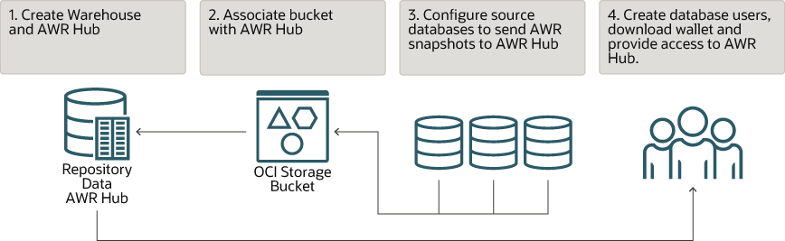
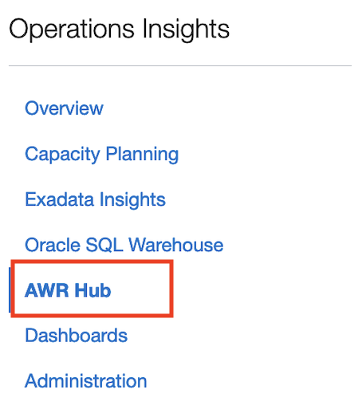
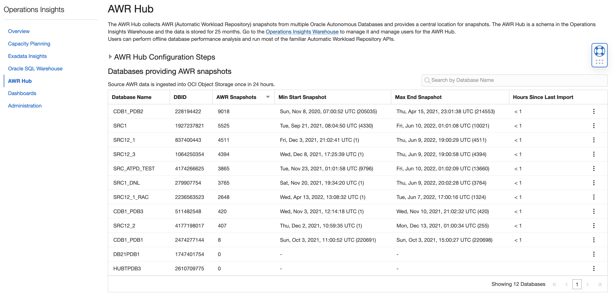
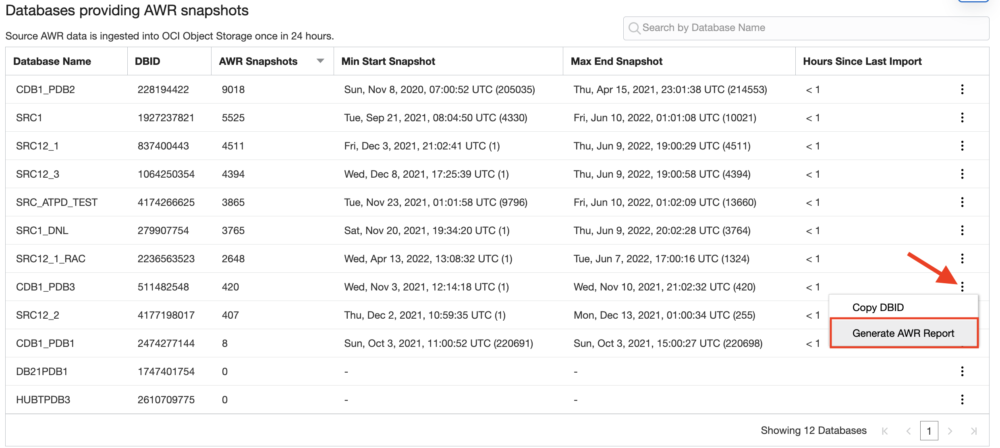
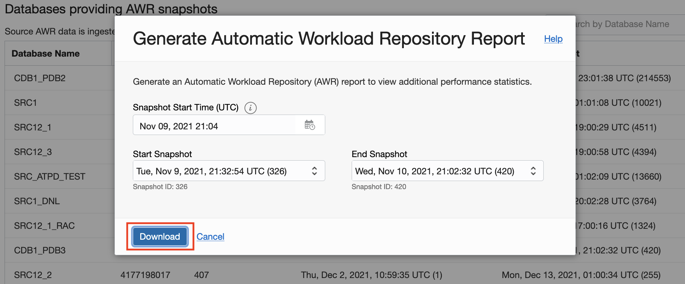
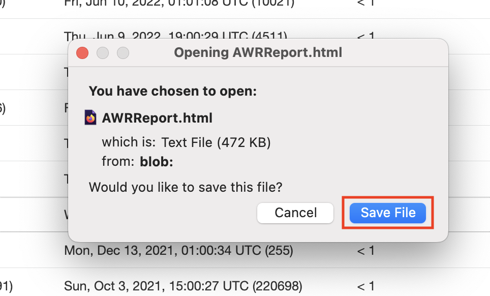

# AWR Hub

## Introduction

In this lab, you will go through the process to navigate through **AWR Hub**.

The Operations Insights AWR Hub lets you consolidate and store detailed performance data from the Automatic Workload Repository (AWR) of your important Oracle Databases. This consolidated AWR Hub allows you to view and analyze historical performance data beyond the AWR retention period of the source database.

An AWR report contains performance statistics on database activity between two points in time – two snapshots. This can be used for problem detection and self-tuning purposes. For example, you can compare database statistics captured during a period of poor performance and compare it with normal baseline performance to identify and diagnose problems. Because AWR Hub stores AWR snapshots for multiple databases, you can easily compare performance statistics across your database fleet.

Estimated Time: 10 minutes

### Objectives

-   Navigate thru AWR Hub.

### Prerequisites

This lab assumes you have completed the following labs:
* Lab: Enable Demo Mode

## Task 1: Configuring AWR Hub

1.  Before using the AWR Hub feature, you must first configure Operations Insights to work with your existing database environment.

      

2.  To configure AWR Hub, you must:

      *  [Create the Warehouse and AWR Hub](https://docs.oracle.com/en-us/iaas/operations-insights/doc/analyze-automatic-workload-repository-awr-performance-data.html#GUID-2CE174B9-0A9E-4D37-91D6-12E363FB4183)
      *  [Configure Database Sources](https://docs.oracle.com/en-us/iaas/operations-insights/doc/analyze-automatic-workload-repository-awr-performance-data.html#GUID-7F811D14-0ED7-4CEE-A0AA-F5D7A0891422)
      *  [Access the Operations Insights Warehouse](https://docs.oracle.com/en-us/iaas/operations-insights/doc/analyze-automatic-workload-repository-awr-performance-data.html#GUID-B53B91EC-AEC2-465E-AE94-BF35A08F506B)
      *  [Create an Operations Insights Warehouse Database User](https://docs.oracle.com/en-us/iaas/operations-insights/doc/analyze-automatic-workload-repository-awr-performance-data.html#GUID-71EE360E-708A-4C83-B30F-A5EB03190D97)

      Refer the [documentation](https://docs.oracle.com/en-us/iaas/operations-insights/doc/analyze-automatic-workload-repository-awr-performance-data.html) for details.       

## Task 2: AWR Hub

1.  On the **Operations Insights Overview** page, from the left pane click **AWR-Hub**.

      

2.  This will take you to **AWR Hub** page, which lists the Databases providing AWR snapshots.

      

3.  Click **More** (vertical ellipses) in the last column to display the pop-up menu and select **Generate AWR Report**.

      

4.  The **Generate Automatic Workload Repository Report** dialogue appears. Selecting a different **Snapshot Start Time** changes the list of available snapshots for the **Start Snapshot** and **End Snapshots** drop-down menus. Select **Snapshot Start Time** and then **Start Snapshot** and **End Snapshots**. Click **Download**.

      

5.  Click **Save File** to save the AWR report on your local machine.

      

## Acknowledgements

- **Author** - Vivek Verma, Master Principal Cloud Architect, North America Cloud Engineering
- **Contributors** - Vivek Verma, Sriram Vrinda, Derik Harlow
- **Last Updated By/Date** - Vivek Verma, May 2022