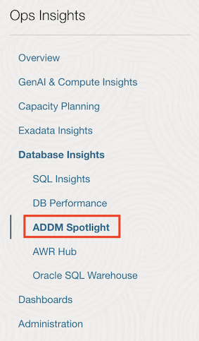
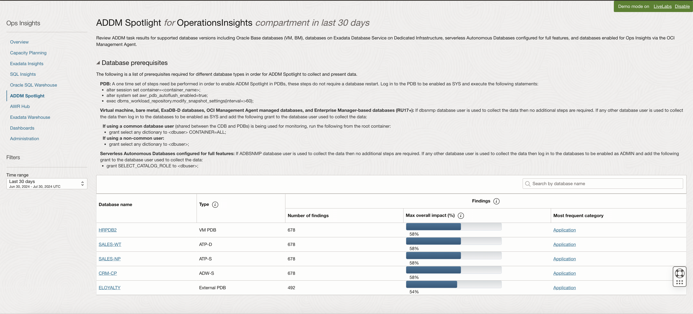
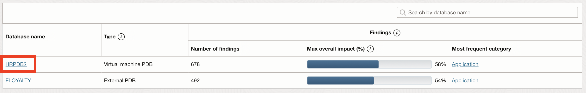
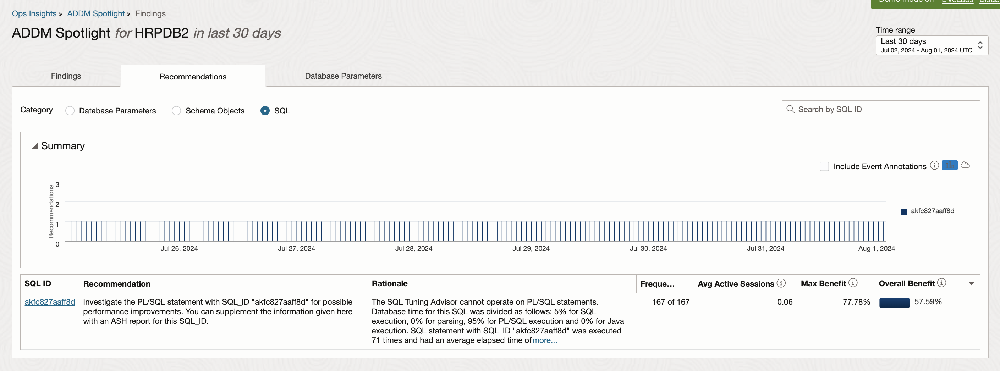

# ADDM Spotlight in Operations Insights

## Introduction

In this lab, you will go through the process to navigate through **ADDM Spotlight**.

**Automatic Database Diagnostic Monitor** (ADDM) is an expert system that analyzes data captured in the Automatic Workload Repository (AWR) snapshots to review performance analysis.

Operations Insights harvests ADDM data from your source databases and highlights these findings and recommendations. Operations insights harvests and stores ADDM data for a duration longer than the event itself, providing you with the ability to analyze ADDM findings and recommendations for a collection of events into the past which may no longer exist in the source database.

ADDM Spotlight supports Virtual Machine, Bare Metal, databases managed by Management Agent, and non PDB databases version 18c and above.

Estimated Time: 10 minutes

### Objectives

-   Navigate thru ADDM Spotlight.

### Prerequisites

This lab assumes you have completed the following labs:
* Lab: Enable Demo Mode

## Task 1: Using ADDM Spotlight

1.  To access and view ADDM Spotlight, click on the Oracle Cloud menu, select **Observability and Management** and then under **Operations Insights** click on **ADDM Spotlight**.

      

      This will take you to the **ADDM Spotlight Landing Page**

      

      The main ADDM Spotlight screen will show a listing of databases with the following information:
      1.  Database Name
      2.  Type
      3.  Number of Findings
      4.  Max Overall Impact (%)
      5.  Most Frequent Category
      
      A search bar is located on the upper right hand side, allowing you to search by database name.

      On the left hand side, beneath the **Operations Insights** menu, **Filters** section is displayed to further refine your search. **Filters** allows you to further refine the Time Range. By default it will be set to Last 30 days, but can be set to Last day, Last 7 days, Last 90 days, Last 6 months, or a user defined Custom time range.

2.  Review ADDM Findings for a Specific Database

      To review a specific database's findings and recommendations click on the Database Name for the database you wish to review. Click on **HRPDB2**. 
      
      

      This will load a new screen with information for only the chosen database.
      
      

      Three informational tabs are displayed **Findings**, **Recommendations**, and **Database Parameters**. 
      
      In a regular ADDM Spotlight findings review you will start at the **Findings** tab review the information presented, then move on to the **Recommendations** tab and finally into the **Database Parameters** tab. This allows you to observe the findings and see how much of an impact the issues found are having on your database, before moving onto recommendations to see how much of an improvement can be achieved by implementing the suggested recommendations. Lastly **Database Parameters** allow you to analyze what parameters have changed historically from your database configuration that could be impacting performance.

      **Findings**: Data in this tab is presented in two formats - under Summary, a graphical time series representation and a tabular data representation of the data. Using the Category bar you can search by Configuration, CPU, DB Internal, I/O, Network, or Other; these searches can be done with one or more categories. The timeline summary you visualize is common to the Findings and Recommendations tabs, this allows you to view and effectively compare what ADDM found and what ADDM recommends to correct these findings.

      **Recommendations**: In this table specific recommendations are suggested in order to remedy problematic findings. Filter pertinent information by selecting the Category you wish to see Database Configuration, Schema Object, or SQL Tuning. The timeline summary you visualize is common to the Findings and Recommendations tabs, this allows you to view and effectively compare what ADDM found and what ADDM recommends to correct these findings.

      

      **Database Parameters**: In this tab you can view parameters with High Impact, Non-Default Values, Changes, or Recommendations. Once the Parameter value is selected the table below is populated with the relevant parameters.

      

## Acknowledgements

- **Author** - Vivek Verma, Master Principal Cloud Architect, North America Cloud Engineering
- **Contributors** - Vivek Verma, Sriram Vrinda, Derik Harlow, Murtaza Husain
- **Last Updated By/Date** - Vivek Verma, May 2023
