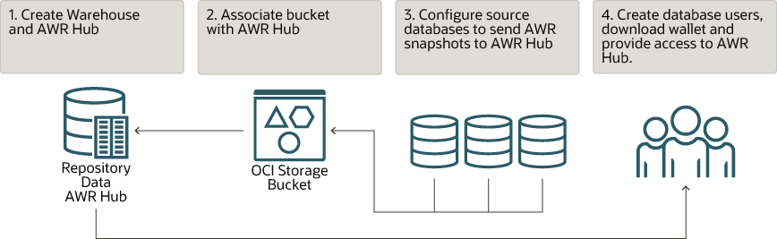
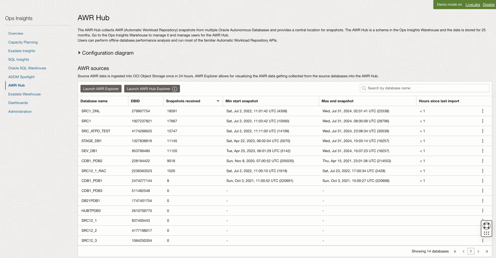
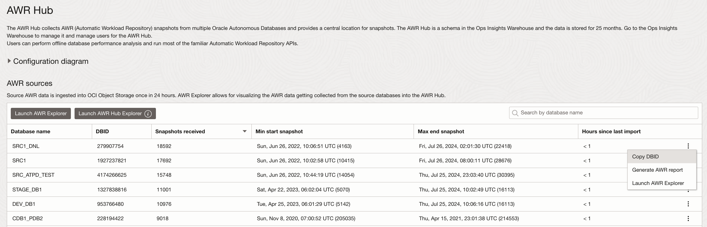
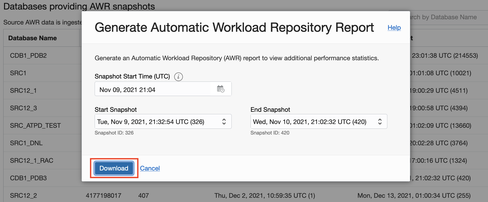
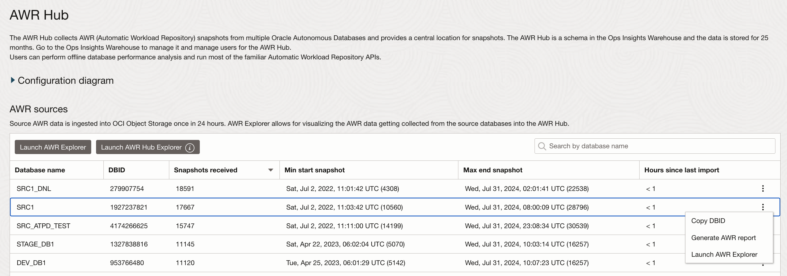
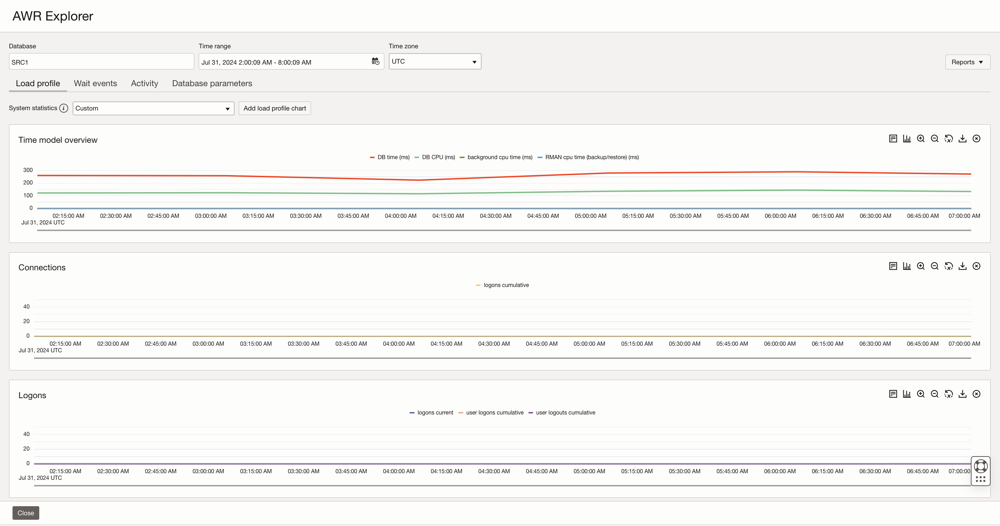
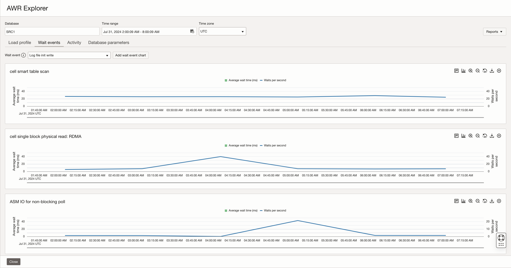
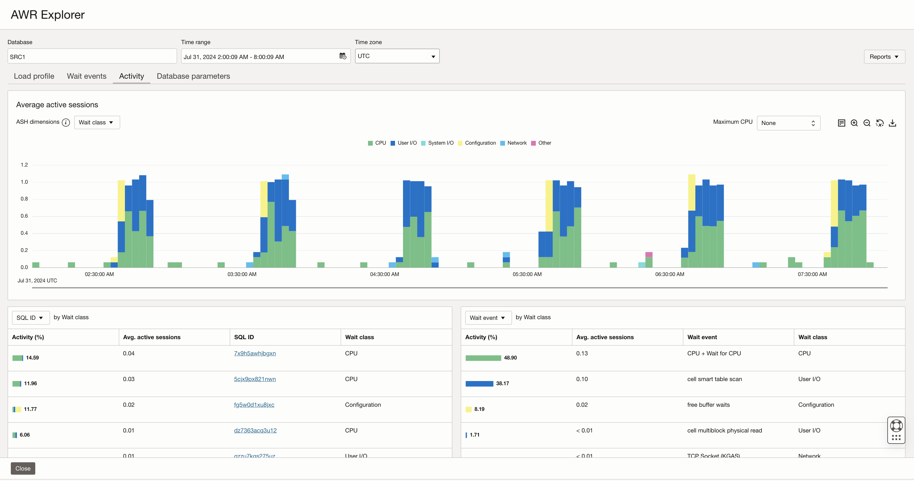
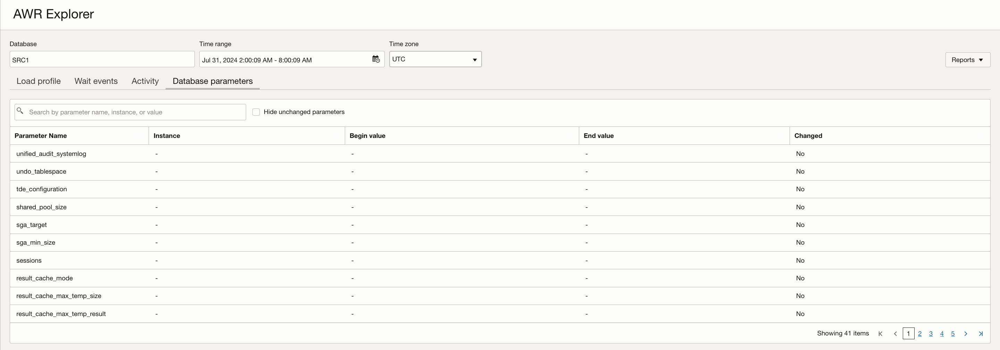
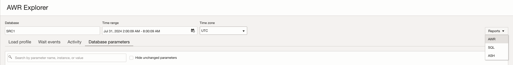

# AWR Hub

## Introduction

In this lab, you will go through the process to navigate through **AWR Hub**.

The Operations Insights AWR Hub lets you consolidate and store detailed performance data from the Automatic Workload Repository (AWR) of your important Oracle Databases. This consolidated AWR Hub allows you to view and analyze historical performance data beyond the AWR retention period of the source database.

An AWR report contains performance statistics on database activity between two points in time – two snapshots. This can be used for problem detection and self-tuning purposes. For example, you can compare database statistics captured during a period of poor performance and compare it with normal baseline performance to identify and diagnose problems. Because AWR Hub stores AWR snapshots for multiple databases, you can easily compare performance statistics across your database fleet.

Estimated Time: 10 minutes

### Objectives

-   Navigate thru AWR Hub.

### Prerequisites

This lab assumes you have completed the following labs:
* Lab: Enable Demo Mode

## Task 1: Configuring AWR Hub

1.  Before using the AWR Hub feature, you must first configure Operations Insights to work with your existing database environment.

      

2.  To configure AWR Hub, you must:

      *  [Create the Warehouse and AWR Hub](https://docs.oracle.com/en-us/iaas/operations-insights/doc/analyze-automatic-workload-repository-awr-performance-data.html#GUID-2CE174B9-0A9E-4D37-91D6-12E363FB4183)
      *  [Configure Database Sources](https://docs.oracle.com/en-us/iaas/operations-insights/doc/analyze-automatic-workload-repository-awr-performance-data.html#GUID-7F811D14-0ED7-4CEE-A0AA-F5D7A0891422)
      *  [Access the Operations Insights Warehouse](https://docs.oracle.com/en-us/iaas/operations-insights/doc/analyze-automatic-workload-repository-awr-performance-data.html#GUID-B53B91EC-AEC2-465E-AE94-BF35A08F506B)
      *  [Create an Operations Insights Warehouse Database User](https://docs.oracle.com/en-us/iaas/operations-insights/doc/analyze-automatic-workload-repository-awr-performance-data.html#GUID-71EE360E-708A-4C83-B30F-A5EB03190D97)

      Refer the [documentation](https://docs.oracle.com/en-us/iaas/operations-insights/doc/analyze-automatic-workload-repository-awr-performance-data.html) for details.       

## Task 2: AWR Hub

1.  On the **Operations Insights Overview** page, from the left pane click **AWR-Hub**.

      

2.  This will take you to **AWR Hub** page, which lists the Databases providing AWR snapshots.

      

3.  Click **More** (vertical ellipses) in the last column to display the pop-up menu and select **Generate AWR Report**.

      

4.  The **Generate Automatic Workload Repository Report** dialogue appears. Selecting a different **Snapshot Start Time** changes the list of available snapshots for the **Start Snapshot** and **End Snapshots** drop-down menus. Select **Snapshot Start Time** and then **Start Snapshot** and **End Snapshots**. Click **Download**.

      

5.  Click **Save File** to save the AWR report on your local machine.

      

## Task 3: AWR Explorer

1.  On the **Operations Insights Overview** page, from the left pane click **AWR-Hub**.

      

2.  This will take you to **AWR Hub** page, which lists the Databases providing AWR snapshots.

      

3.  Click More (vertical ellipses) in the last column to display the pop-up menu and select **Launch AWR Explorer**.

      

4.  **AWR Explorer** is displayed showing performance charts for the chosen database.

      

      The following fields are displayed in **AWR Explorer**. You can select the options in these fields to determine the data to be displayed:

	* **Database**: The name used when registering the database with AWR Hub.

	* **Time Range**: Duration of the snapshot range for which AWR data is displayed. By default, the duration of the latest AWR snapshot range is selected. However, if the snapshot range has more than six snapshots, then the default time range is the duration of the most recent six snapshots in the snapshot range. For example, if the duration of each snapshot (snapshot interval) is 10 minutes, then the time range is 6 * 10 minutes = 1 hour and the data within this time range is displayed.

		Click the **Time Range** field to view the **Custom Time Range** dialog and change the duration within the selected time range, if required.

	* **Time Zone**: Time zone in which AWR data is displayed. By default, the UTC (Coordinated Universal Time) time zone is selected. Click this field to replace the default time zone with your local browser time zone.

5.  **AWR Explorer** displays the following tabs, which provide information on the important aspects of database performance within the selected time range. These tabs display charts that greatly simplify the ­interpretation and comparison of AWR data.

	* **Load Profile**: This tab displays historical system statistics from AWR tables such as DBA\_HIST\_SYSSTAT. The charts display the default SYSSTAT categories, such as Time Model Overview, Connections, and Logons, which provide an overview of the global health of the database.

      On the **Load Profile** tab, you can add charts to display other supported system statistics. To do so:
           1.  Ensure that **Custom** is selected in the **System Statistics** drop-down list.
           2.  Click **Add Load Profile Chart**.
           3.  In the **Add Custom Load Profile Chart** dialog, enter a title for the new chart, select the system statistics that you want to display, and click **Add Load Profile Chart**.

      * **Wait Events**: This tab displays the top ten wait events sorted by wait time from AWR tables such as DBA\_HIST\_SYSTEM\_EVENT. The charts display the wait event and the corresponding Waits per Second and Average Wait Time information.
      
      

      On the **Wait Events** tab, you can also:

           1.  Add new charts to display more wait events. To do so, select a wait event in the **Wait Event** drop-down list and click **Add Wait Event Chart**.
           2.  View a histogram of the wait event with a breakdown of the percentage of waits by their duration, within a selected snapshot range. To do so, click the **Show Histogram** option available for each wait event chart. Note that you can also click on the chart to navigate to the **Show Histogram** dialog.

      * **Activity**: This tab enables you to view the performance trend of the database by selecting an Average Active Sessions dimension and viewing the top activity for that dimension in the selected time range. You can also scroll down to view the top activity by additional dimensions based on the dimension selected in the **Average Active Sessions** chart.

      

      * **Database Parameters**: This tab displays all the database parameters that were changed and you can click the link in the **Changed** column to view change history. The change history information includes details such as the ID of the snapshot when the database parameter was changed, the start and end time of the snapshot, and the changed value.
      On this tab, you can also view all the database parameters, including those that were not changed. To do so, deselect the **Hide Unchanged Parameters** check box.

      

6.  **Generate Reports**

      You can generate and download various reports from the database in AWR Explorer.

      To do so, click Reports and select one of the following options:

      

      * **AWR**: In the **Generate AWR Report** dialog, select the snapshot range and click **Generate Report** to generate and download an AWR report with additional performance data.
      * **SQL**: In the **Generate SQL Report** dialog, select the snapshot range, enter a SQL ID, and click **Generate Report** to generate and download a SQL Health Check report with additional performance data for the specified SQL statement.
      * **ASH**: In the **Generate ASH Report** dialog, specify the start and end time and click **Generate Report** to generate and download an ASH report with additional Active Session History data.

## Acknowledgements

- **Author** - Vivek Verma, Master Principal Cloud Architect, North America Cloud Engineering
- **Contributors** - Vivek Verma, Sriram Vrinda, Derik Harlow, Murtaza Husain
- **Last Updated By/Date** - Vivek Verma, May 2023
