# Capacity Planning of Oracle Databases

## Introduction

In this lab, you will go through the steps to explore Capacity Planning for Oracle Databases.

Estimated Time: 15 minutes

### Objectives

-   Explore Capacity Planning for Oracle Databases.

### Prerequisites

This lab assumes you have completed the following labs:
* Lab: Enable Demo Mode

## Task 1: Capacity Planning - Databases

1.  On the **Operations Insights Overview** page, from the left pane click on **Capacity Planning**.

      

2.  On the **Database Capacity Planning** page, you will obtain a fleet-wide overview of your resource consumption and trends.  CPU insights, storage insights, and memory insights give a quick view into top resource consumers now and forecast potential resource bottlenecks over the selected period.

      

    From this page you can perform the following tasks in support of the Capacity Planning use case goals:

    * View total allocation and utilization of CPU, Storage, Memory, and I/O resources for all (enabled) databases in the compartment
    * Identify top-5 databases of CPU, Storage, and Memory by absolute usage or utilization percentage
    * Identify top-5 databases by CPU, Storage, and Memory growth over the period
    * See aggregated historical usage trends for CPU, Storage, and Memory over the period

3.  From **Time Range** on the left pane select **Last 90 days**.

      

      You can filter based on **Time range**, **Database type** or **Tags**. This let’s you customize the fleet of database of your choice by using combination of one of these.

      

4.  Review the **Inventory** section. The **Inventory** section displays the total number of databases enabled for Operations Insights along with the database types. In addition, the CPU, Storage, Memory, and I/O usage charts display overall resource consumption (Top Consumers and UsageTrend) by these database targets.

      

5.  **CPU Insights** - Database utilization percentage for the 90th percentile value of the daily average CPU Usage over the selected time period. These sections show the number of databases running with low (0–25%) and high (75–100%) utilization of CPU.

      

      You can select from different options in the drop-down list in the middle widget **Top CPU consumers** - **Usage (avg. active CPU)**, **Usage change (%)** or **Utilization (%)**

6.  **Storage Insights** - Database utilization percentage for the 90th percentile value of the daily average Storage Usage over the selected time period.  These sections show the number of databases running with low (0–25%) and high (75–100%) utilization of storage.

      

      The drop-down list in the middle widget works similarly as compared to the CPU section.

7.  **Memory Insights** - Database utilization percentage for the 90th percentile value of the daily average Memory Usage over the selected time period.  These sections show the number of databases running with low (0–25%) and high (75–100%) utilization of memory.

      

      The drop-down list in the middle widget works similarly as compared to the CPU section.

* **Note**: the hyperlinks in the insights tiles on the left for CPU, Storage and Memory drill down to the details page for those specific resources.

## Task 2: Capacity Planning - CPU

1.  On the **Database Capacity Planning** page, from the left pane click on **CPU**.

      

2.  **Database CPU** page has a parent-child design with three primary components:

    * Insights tab – a parent table of databases from which one database can be selected for trending and forecast
    * Aggregate tab – a parent treemap showing the entire database fleet that can be used to trend and forecast the entire fleet or sub-groups within the fleet
    * Trend & Forecast – the child component of time series charts showing maximum and average CPU usage and machine-learning forecasts of future demand

      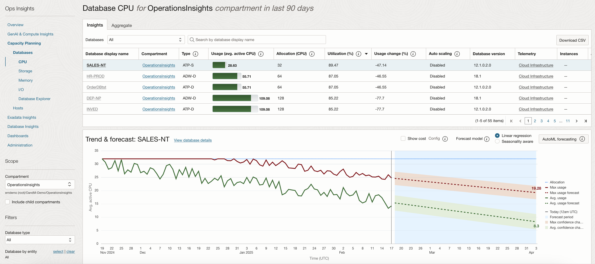

3.  On the **Database CPU** page, under **Insights** tab, select **30 Day High Utilization Forecast** against **Databases**, to view database CPU utilization forecast for next 30 days.

      

4.  Under the **Database Display Name** column, select the row corresponding to the **CRM-ST** database.

      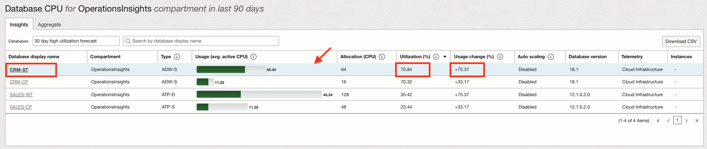

5.  Check the **Utilization (%)** and **Usage Change (%)** for database **CRM-ST**.
    
    * Utilization (%) -  Utilization percentage for the 90th percentile value of the daily average CPU usage over the selected time period
    * Usage Change (%): Percentage change in the linear trend of storage usage over the selected time

6.  The **Trend and Forecast** chart displays historical time series plots related to CPU allocation and usage for the selected database **CRM-ST**.

      

7.  Historical CPU Usage (dark solid green line) is the Avg Usage - average value of daily (hourly) CPU usage data

8.  Avg Usage Forecast - forecast of Avg Usage data using linear forecast model (Dashed Green line) and the Max Allocation - maximum allocation of CPU for the database.

9.  The value **56.42** AVG ACTIVE CPU USAGE is forecasted for after 15 days for Avg usage of CPU.

10.  Select **Max Usage** from the legend on the right side. The red line is **Max Usage** - maximum value of daily (hourly) CPU usage data for database **CRM-ST**.

      

11.  Select **Max Usage Forecast** from the legend on the right side.

      

12.  The value **77.07** AVG ACTIVE CPU USAGE is forecasted for after 15 days for Max usage of CPU.

    **Key Insight**: Traditionally, capacity is allocated to accommodate the maximum demand and represents your spend for the resource. Average usage represents the real value obtained from resource. The difference between the maximum and average can be considered the cost of having to over-allocate resources to meet peak demand. We call this the opportunity cost of workload variability.

    **Autonomous Database Auto-scale** option is designed specifically to help mitigate over-spending for highly variable workloads.

13.  The trending and forecast chart facilitates:

     * Forecast future maximum and average demand for CPU resources
     * Compare current usage to allocation to detect over-provisioning
     * Compare maximum to average usage and trends to assess demand volatility
     * Forecast difference between the maximum and average daily CPU usage to estimate potential savings from workload smoothing

14.  The following models can be selected for display on the upper right of the Trend and Forecast chart:

     * **Linear regression**: The linear regression model assumes a linear relationship across variables to predict the future resource usage.

      

     * **Seasonality aware**: The seasonal option combines a simple model that detects basic seasonality with dynamic, user-selectable data.

      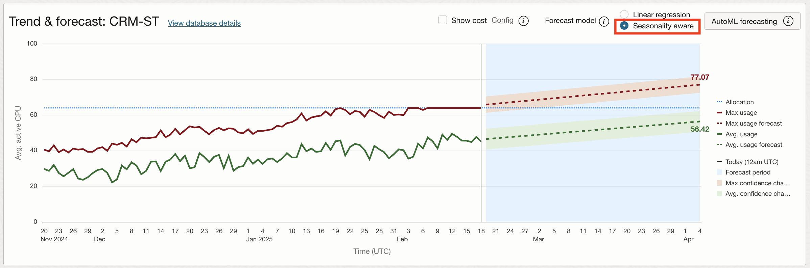

     * **AutoML forecasting**: The AutoML forecasting option selects the best fit from multiple machine learning models trained on fixed data window. AutoML (Machine Learning) forecasting leverages Oracle Data Science, employing metalearning to quickly identify the most relevant features, model and hyperparameters for a given training dataset. Forecast and model are precomputed and the forecasts are periodically retrained. The forecast uses up to 13 months of data, or the highest amount of data available for a resource if the resource has less than 13 months since onboarding.
     
     On the **Database CPU** page, under **Insights** tab, select **All** against **Databases** and search for database **PROLLP**. Within the **Trend & Forecast** chart, click **AutoML forecasting**

      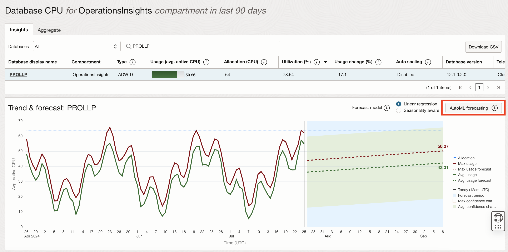

      A new pop up will appear with the AutoML forecasting charts loaded. It will state the training period and the selected forecast algorithms for maximum usage and average usage. The maximum and average confidence channels are also displayed within the chart. The confidence interval for these are 95%, meaning that 95% of future points are expected to fall within this radius from the forecast.

      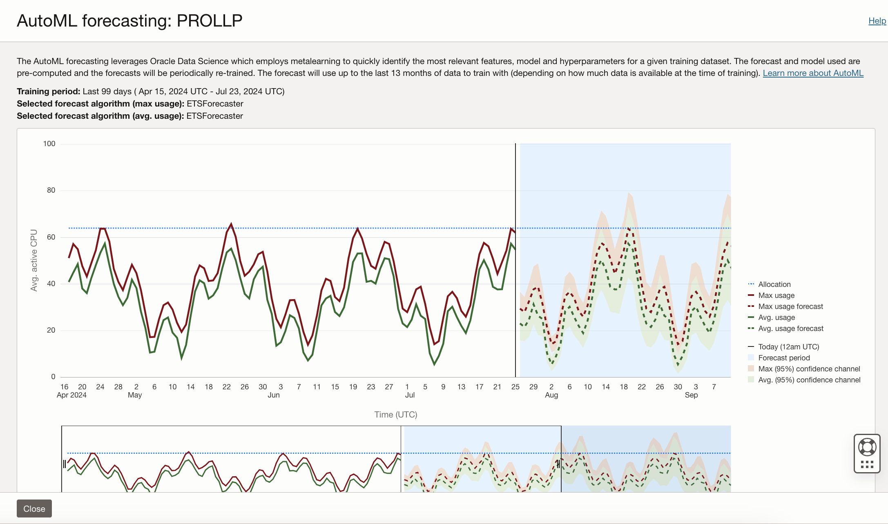           
 

15.  Click **Aggregate** on the top and from **Grouping** select **Database Type**.

      

     The page displays a Treemap of all databases breaking it down by Database Type. This lets you compare how your different, individual databases are using their resources as well as between various database types. This also lets you review the problem across fleet of databases. The databases with dark color are critical and are high on utilization. The size of the box displayed on the treemap shows usage in terms of active CPU.

## Task 3: Capacity Planning - Storage

1.  Click on the **Storage** menu on the left panel.

      

2.  You get a complete view of storage usage across all Operations Insights enabled databases

      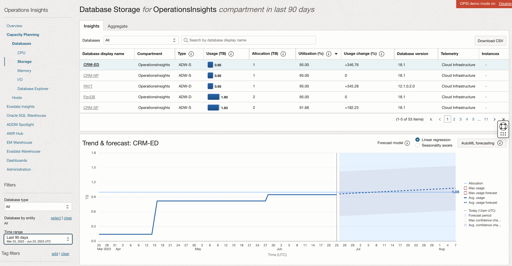

    From here we can identify servers with underused or overused storage and also compare storage utilization between databases.

3.  From the drop-down on the top select **30 Days High Utilization Forecast**.

      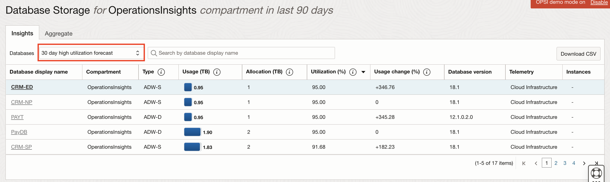

4.  In the **Trend & Forecast** chart View the storage trend and usage forecast for the selected database.

      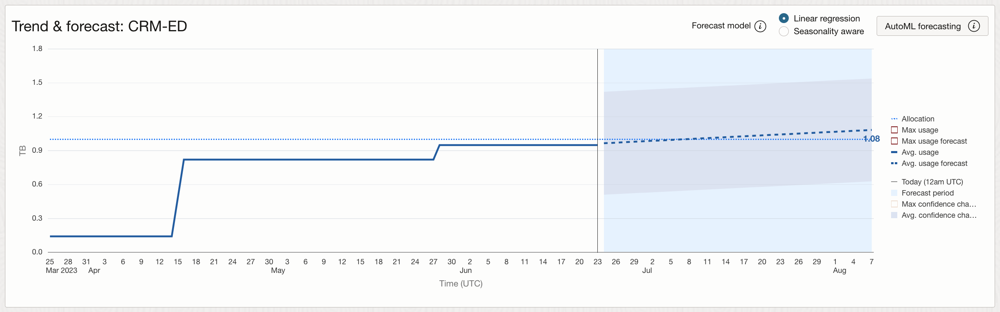

5.  In the **Trend & Forecast** chart View click on **Machine Learning** to project future resource consumption. Machine Learning is a more advanced model that considers seasonality.

      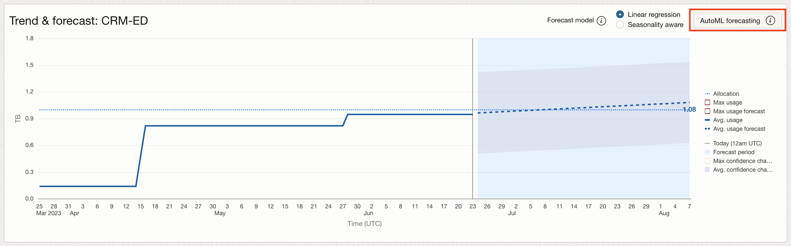

6.  From the drop-down on the top select **All** and search for **PAYD** database. Select **PAYD** database.

      

7.  In the **Trend & Forecast** chart View the storage trend and forecast for the selected database.

      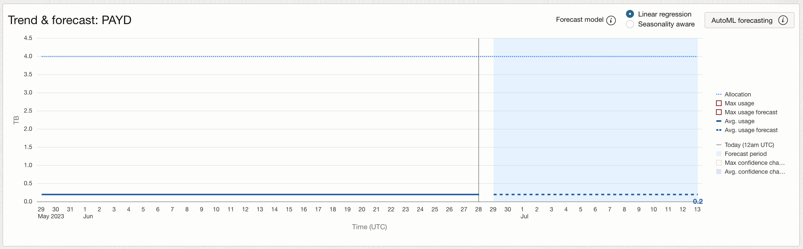

8.  Select **Max usage** and **Max usage forecast** from the right panel.

      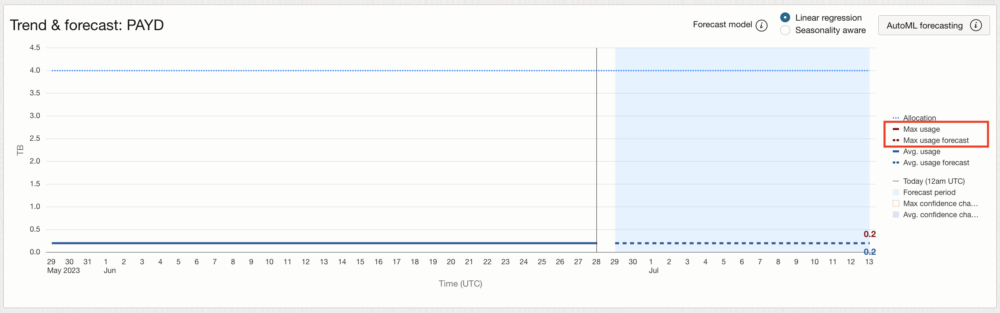

      You can see the average forecasted value v/s Max forecasted value for storage. **Max Usage Forecast** for this database is 0.2 TB, whereas **Allocation** shows that total storage allocated to this database is 4 TB. Since, allocation is more but storage used or forecasted is less, it is ok release some storage for this database and save money on storage.

## Acknowledgements

- **Author** - Vivek Verma, Master Principal Cloud Architect, North America Cloud Engineering
- **Contributors** - Vivek Verma, Sriram Vrinda, Derik Harlow, Murtaza Husain
- **Last Updated By/Date** - Vivek Verma, May 2023
