# Capacity Planning of Oracle Databases

## Introduction

In this lab, you will go through the steps to explore Capacity Planning for Oracle Databases.

Estimated Time: 15 minutes

### Objectives

-   Explore Capacity Planning for Oracle Databases.

### Prerequisites

This lab assumes you have completed the following labs:
* Lab: Enable Demo Mode

## Task 1: Capacity Planning - Databases

1.  On the **Ops Insights Overview** page, from the left pane click on **Capacity Planning**.

      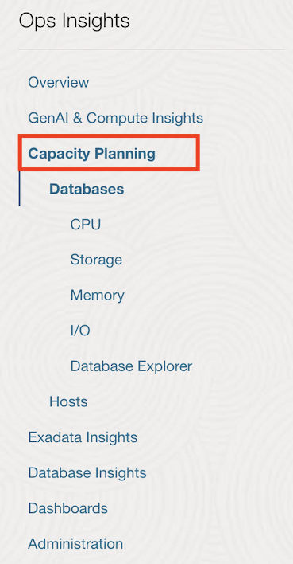

2.  On the **Database Capacity Planning** page, you will obtain a fleet-wide overview of your resource consumption and trends.  CPU insights, storage insights, and memory insights give a quick view into top resource consumers now and forecast potential resource bottlenecks over the selected period.

      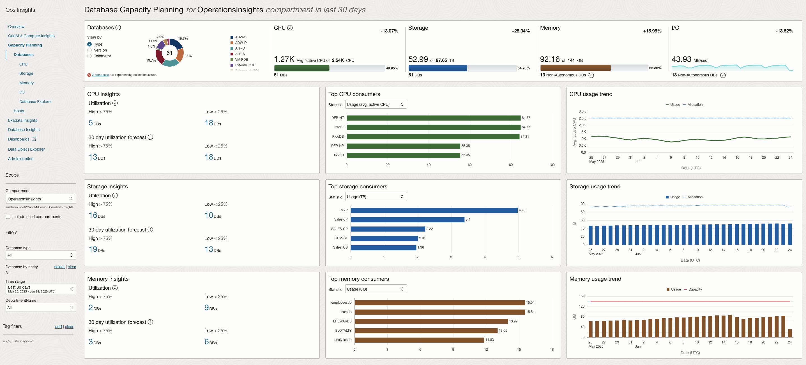

    From this page you can perform the following tasks in support of the Capacity Planning use case goals:

    * View total allocation and utilization of CPU, Storage, Memory, and I/O resources for all (enabled) databases in the compartment
    * Identify top-5 databases of CPU, Storage, and Memory by absolute usage or utilization percentage
    * Identify top-5 databases by CPU, Storage, and Memory growth over the period
    * See aggregated historical usage trends for CPU, Storage, and Memory over the period

3.  From **Time Range** on the left pane select **Last 90 days**.

      

      You can filter based on **Time range**, **Database type** or **Tags**. This let’s you customize the fleet of database of your choice by using combination of one of these.

      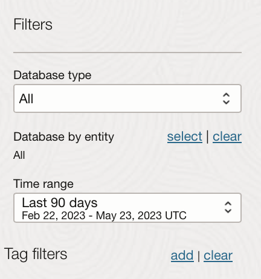

4.  Review the **Inventory** section. The **Inventory** section displays the total number of databases enabled for Ops Insights along with the database types. In addition, the CPU, Storage, Memory, and I/O usage charts display overall resource consumption (Top Consumers and Usage Trend) by these database targets.

      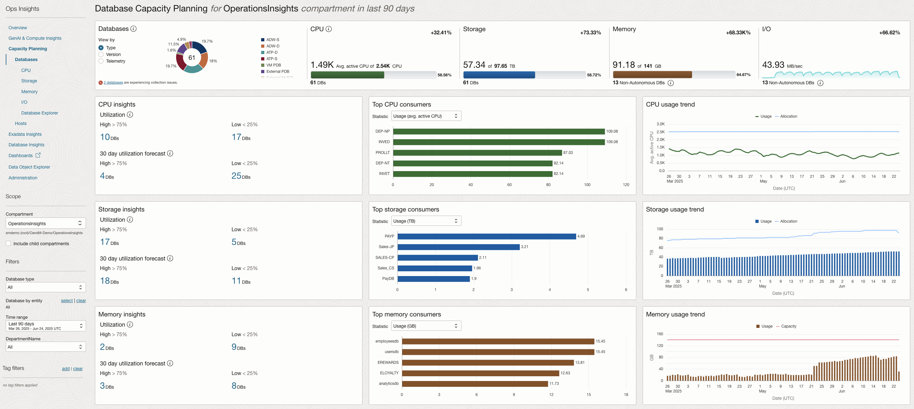

5.  **CPU Insights** - Database utilization percentage for the 90th percentile value of the daily average CPU Usage over the selected time period. These sections show the number of databases running with low (0–25%) and high (75–100%) utilization of CPU.

      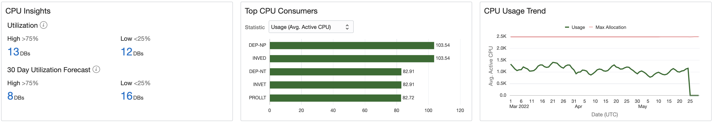

6.  **Storage Insights** - Database utilization percentage for the 90th percentile value of the daily average Storage Usage over the selected time period.  These sections show the number of databases running with low (0–25%) and high (75–100%) utilization of storage.

      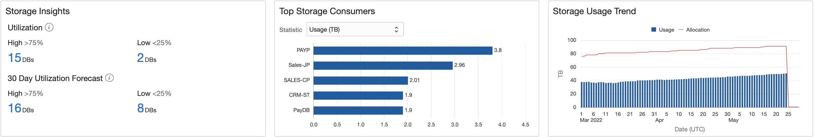

7.  **Memory Insights** - Database utilization percentage for the 90th percentile value of the daily average Memory Usage over the selected time period.  These sections show the number of databases running with low (0–25%) and high (75–100%) utilization of memory.

      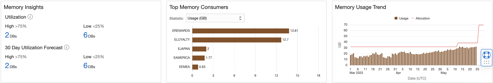

## Task 2: Capacity Planning - CPU

1.  On the **Database Capacity Planning** page, from the left pane click on **CPU**.

      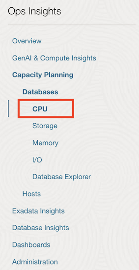

2.  **Database CPU** page has a master-detail design with three primary components:

    * Insights – table of databases flagged for CPU utilization insights
    * Aggregate – treemap of CPU utilization over all databases in the compartment
    * Trend & Forecast – time series charts of CPU usage trends and forecasts for individual or groups of databases

      

3.  On the **Database CPU** page, under **Insights** tab, select **30 Day High Utilization Forecast** against **Databases**, to view database CPU utilization forecast for next 30 days.

      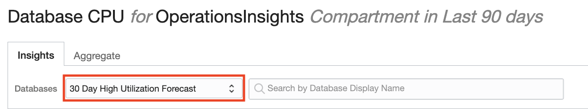

4.  Under the **Database Display Name** column, select the row corresponding to the **CRM-ST** database.

      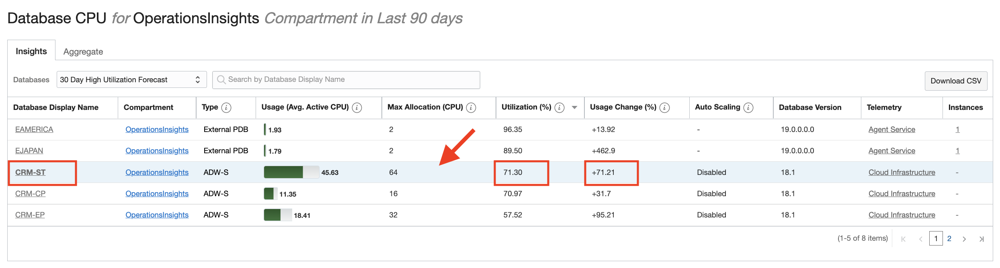

5.  Check the **Utilization (%)** and **Usage Change (%)** for database **CRM-ST**.
    
    * Utilization (%) -  Utilization percentage for the 90th percentile value of the daily average storage usage over the selected time period
    * Usage Change (%): Percentage change in the linear trend of storage usage over the selected time

6.  The **Trend and Forecast** chart displays historical time series plots related to CPU allocation and usage for the selected database **CRM-ST**.

      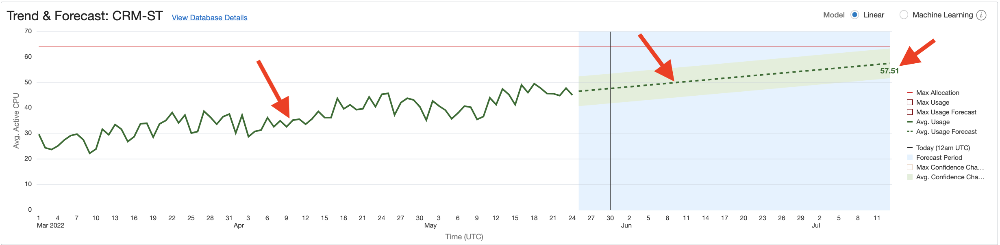

7.  Historical CPU Usage (dark solid green line) is the Avg Usage - average value of daily (hourly) CPU usage data

8.  Avg Usage Forecast - forecast of Avg Usage data using linear forecast model (Dashed Green line) and the Max Allocation - maximum allocation of CPU for the database.

9.  The value **57.51** AVG ACTIVE CPU USAGE is forecasted for after 15 days for Avg usage of CPU.

10.  Select **Max Usage** from the legend on the right side. The red line is **Max Usage** - maximum value of daily (hourly) CPU usage data for database **CRM-ST**.

      

11.  Select **Max Usage Forecast** from the legend on the right side.

      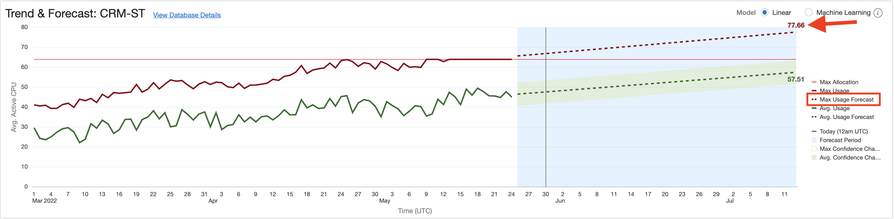

12.  The value **77.66** AVG ACTIVE CPU USAGE is forecasted for after 15 days for Max usage of CPU.

    You can see the difference in average forecasted value v/s Max forecasted value. If the workload is critical and cannot tolerate any performance issues then the database must be allocated the max forecasted value. If the workload is not so critical and can tolerate deviations in performance then it is ok to allocate CPU based on average forecasted value and save money.

13.  The trending and forecast chart facilitates:

     * Forecast future maximum and average demand for CPU resources
     * Compare current usage to allocation to detect over-provisioning
     * Compare maximum to average usage and trends to assess demand volatility
     * Forecast difference between the maximum and average daily CPU usage to estimate potential savings from workload smoothing

14.  Click **Aggregate** on the top and from **Grouping** select **Database Type**.

      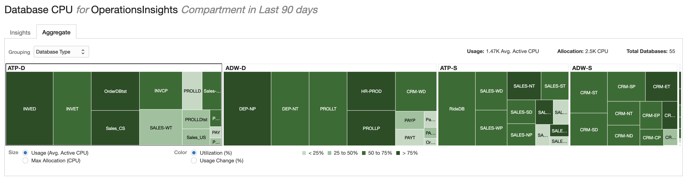

     The page displays a Treemap of all databases breaking it down by Database Type. This lets you compare how your different, individual databases are using their resources as well as between various database types.

## Task 3: Capacity Planning - Storage

1.  Click on the **Storage** menu on the left panel.

      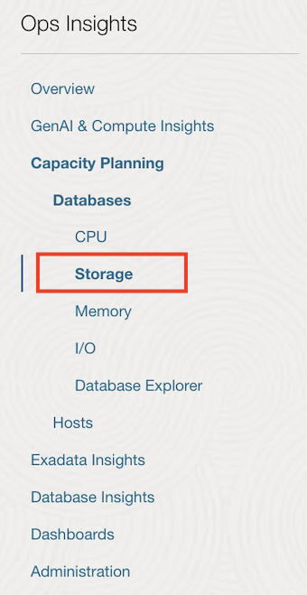

2.  You get a complete view of storage usage across all Ops Insights enabled databases

      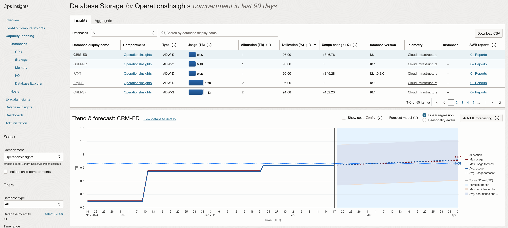

    From here we can identify servers with underused or overused storage and also compare storage utilization between databases.

3.  From the drop-down on the top select **30 Days High Utilization Forecast**.

      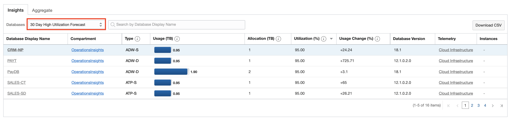

4.  In the **Trend & Forecast** chart View the storage trend and usage forecast for the selected database.

      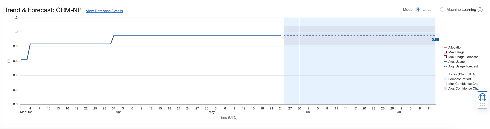

5.  In the **Trend & Forecast** chart View click on **Machine Learning** to project future resource consumption. Machine Learning is a more advanced model that considers seasonality.

      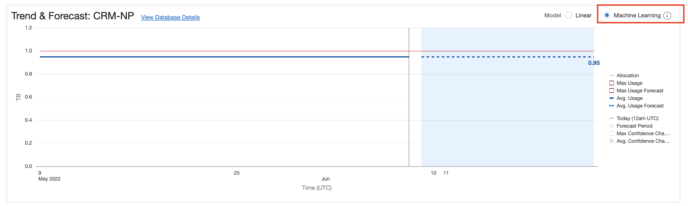

6.  On the **Insights** tab select **30 Day High Utilization Forecast** for **Databases** and search the database **EAMERICA**.

      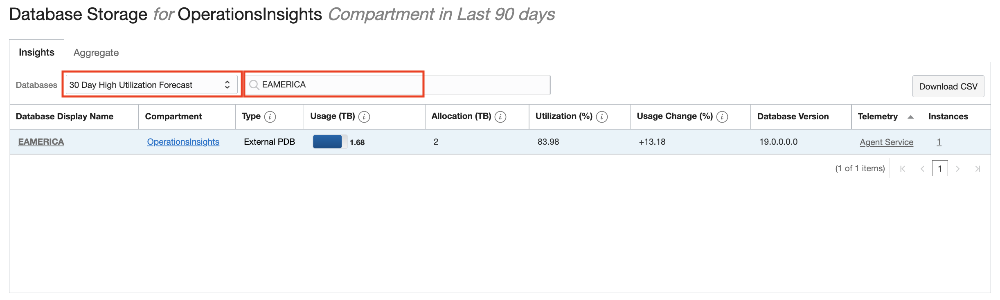

7.  In the **Trend & Forecast** chart view select **Tablespace Breakdown** to view details on a tablespace level.

      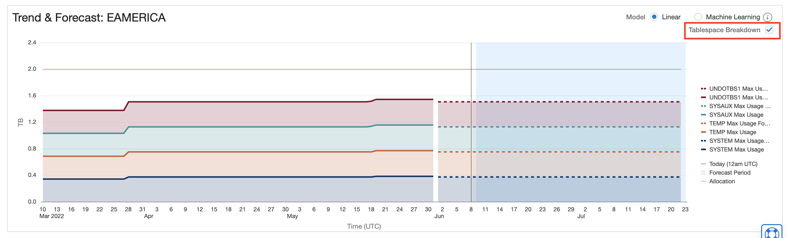

## Acknowledgements

- **Author** - Vivek Verma, Master Principal Cloud Architect, North America Cloud Engineering
- **Contributors** - Vivek Verma, Sriram Vrinda, Derik Harlow, Murtaza Husain
- **Last Updated By/Date** - Vivek Verma, Apr 2024