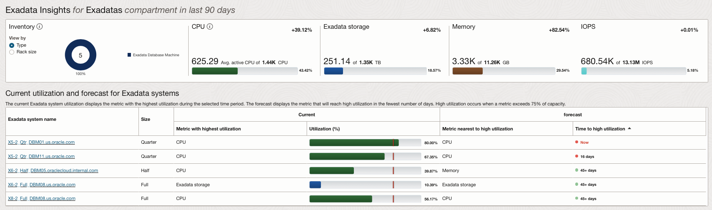
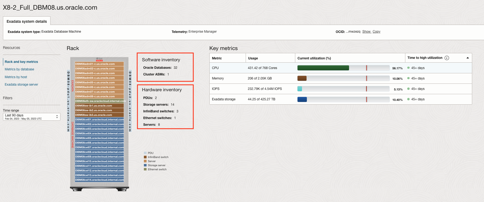
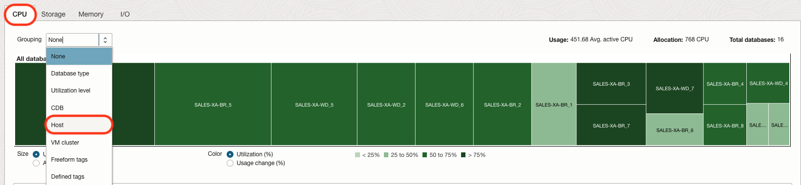
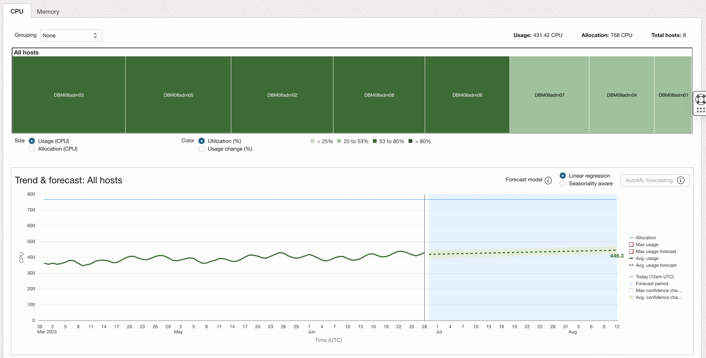
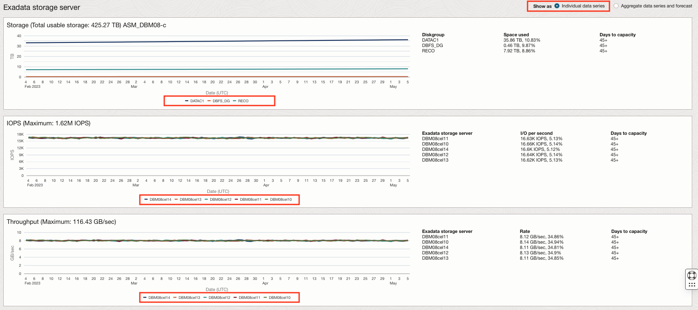

# Capacity Planning of Oracle Exadata

## Introduction

In this lab, you will go through the steps to explore the Capacity Planning of Oracle Exadata.

Estimated Time: 15 minutes

### Objectives

-   Explore Capacity Planning Oracle Exadata.

### Prerequisites

This lab assumes you have completed the following labs:
* Lab: Enable Demo Mode

## Task 1: Exadata Insights

1.  On the **Overview** page, click on **Exadata Insights** from the left pane.

      

2.  This will show the Exadata systems registered for Operations Insights.

      

3.  On this page, the aggregate view of all the discovered Exadata systems will be shown.

      

4.  Also, the current and forecast utilization of the Exadata system will be shown in the bottom section. Click on an Exadata system to evaluate more insights. Click on the Full Rack.

      

5.  On the **Exadata System Details** page, you can view **Rack and Key Metrics**. The page displays Software and Hardware Summary.

      

6.  Navigate to **Metrics by Database** on the left pane.

      

7.  Select the **CPU** tab and choose the **Host** under Grouping.

      

8.  Now choose **Allocation (CPU)** under **Size** and **Usage Change (%)** under **Color**.

      

9.  To show the trend & forecast of CPU for Host and Database, click on the hostname and highlight the trend graph.

      

      We see the aggregate CPU demand of the 3 databases is very stable at the host-level. At the database-level, 2 have growing demand and one is shrinking.

10.  Select the database and highlight the trend and forecast graph.

      

11.  Click **Metrics by Host** on the left pane.

      

12.  On the **Metrics by Host** page, click on the **CPU** tab, select **All hosts** to see the aggregate trend & forecast. 

      

13.  Click the **Exadata Storage Server** option on the left pane.

      

14. Select **Individual data series** on the top right pane to show the individual storage utilization.

      

15. Select **Aggregate data series and forecast** on the top right pane to show total individual storage utilization.

      

In Conclusion, OPSI Exadata Insights provides comprehensive capacity analysis to give administrators the ability to view, analyze, proactively forecast, and detect potential constraints in Exadata resources. As a system administrator they want to be able to make critical decisions to optimize their Exadata stacks; plan for growth, compare resource usage and perform what-if analysis for various scenarios.

## Acknowledgements

- **Author** - Vivek Verma, Master Principal Cloud Architect, North America Cloud Engineering
- **Contributors** - Vivek Verma, Sriram Vrinda, Derik Harlow, Murtaza Husain
- **Last Updated By/Date** - Vivek Verma, May 2023