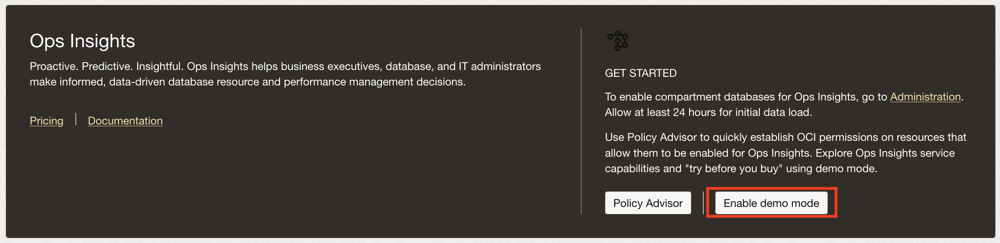
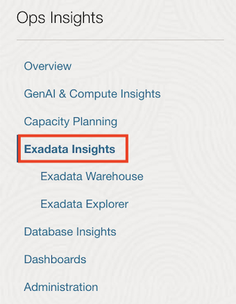
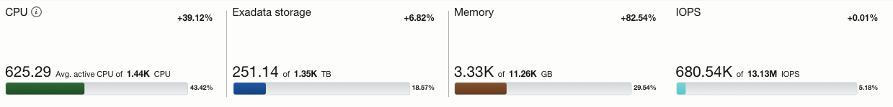
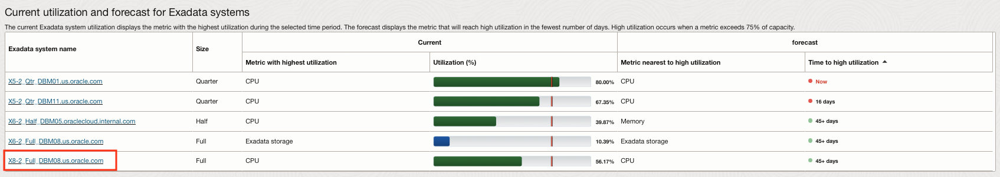
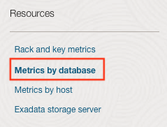
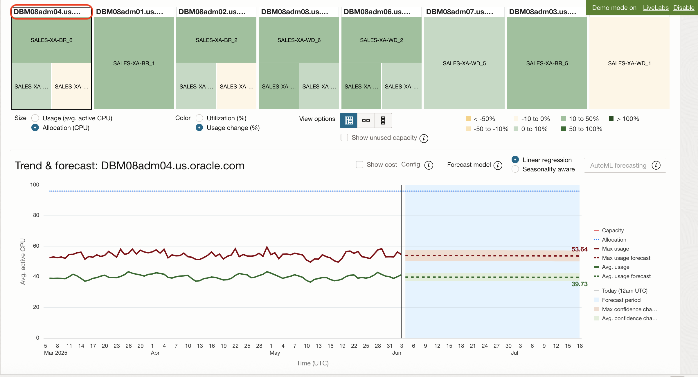
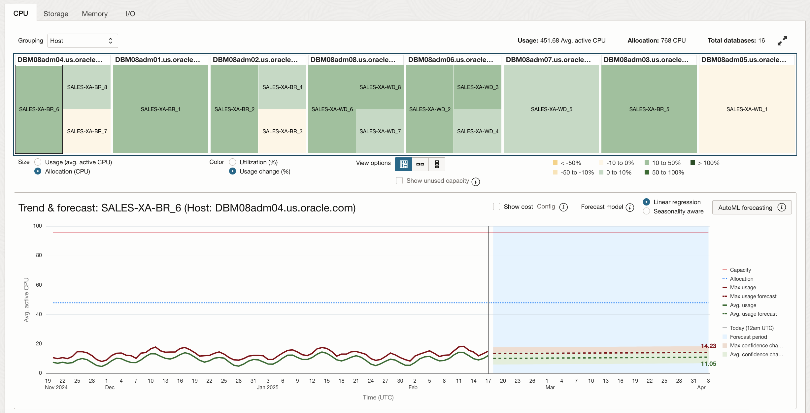
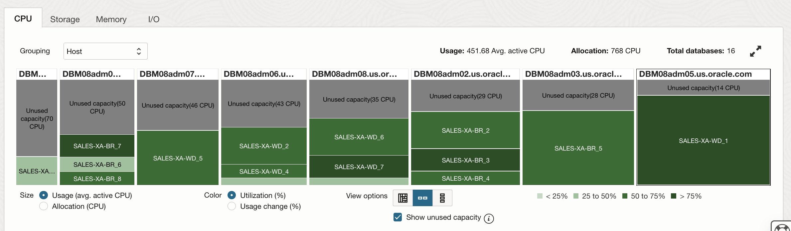
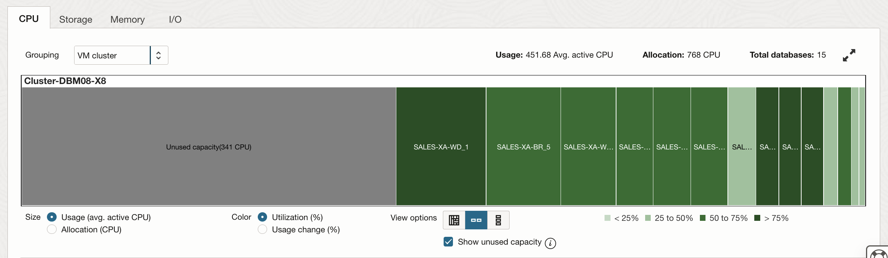
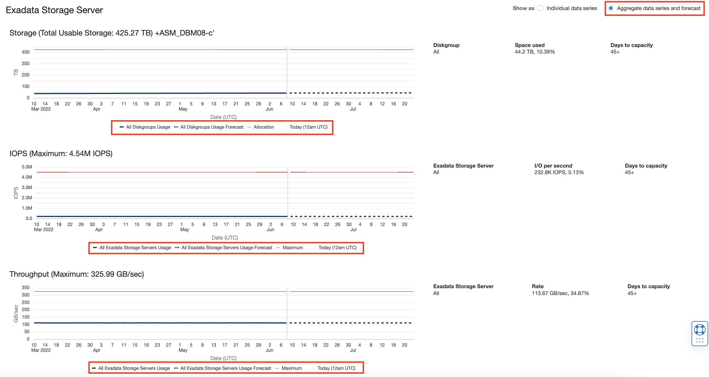

# Capacity Planning of Oracle Exadata

## Introduction

In this lab, you will go through the steps to explore the Capacity Planning of Oracle Exadata.

Estimated Time: 10 minutes

### Objectives

-   Explore Capacity Planning Oracle Exadata.

### Prerequisites

This lab assumes you have completed the following labs:
* Lab: Enable Demo Mode

## Task 1: Enable Demo Mode

1.  Skip this task and proceed to *Task 2: Exadata Insights* if you have already enabled Demo Mode in Ops Insights.
    
    To access Ops Insights, click on the Oracle Cloud Console **Navigation menu** (aka hamburger menu) located in the upper left. Under **Observability & Management**, go to **Ops Insights** and click **Overview**.

      

2.  Click on **Enable Demo Mode** to enable Demo Mode.

      

3.  Once the mode is enabled the overview page will now show resource information for the OperationsInsights compartment, notice the upper-right hand corner will show Demo Mode is now ON for your session.  When you would like to exit demo mode you can either click the disable link in the corner or click the now present **Disable Demo Mode** button where you initially enabled it on the overview page.

      

4.  On the left-hand pane you will find links to quickly navigate to OPSI offerings including Capacity Planning, Exadata Insights, Oracle SQL Warehouse, AWR Hub, and Dashboards.  

      

## Task 2: Exadata Insights

1.  On the **Overview** page, click on **Exadata Insights** from the left pane.

      

2.  This will show the Exadata systems registered for Ops Insights.

      

3.  On this page, the aggregate view of all the discovered Exadata systems will be shown.

      

4.  Also, the current and forecast utilization of the Exadata system will be shown in the bottom section. Click on an Exadata system to evaluate more insights. Click on the Full Rack **X8-2\_Full_DBM08.us.oracle.com**.

      

5.  On the **Exadata System Details** page, you can view **Rack and Key Metrics**. The page displays Software and Hardware Summary.

      

6.  Navigate to **Metrics by Database** on the left pane.

      

7.  Select the **CPU** tab and choose **Host** under Grouping.

      

8.  Now choose **Allocation (CPU)** under **Size** and **Usage Change (%)** under **Color**.

      

    Heatmap gets updated based on the selection as shown below

      

9.  To show the trend & forecast of CPU for Host and Database, click on the hostname **DBM08adm04.us.oracle.com** and highlight the trend graph.

      

      We see the aggregate CPU demand of the 3 databases is very stable at the host-level. At the database-level, 2 have growing demand and one is shrinking.

10.  Select the database and highlight the trend and forecast graph.

      

11.  To view **Unused CPU capacity** within your database resources navigate to **Metrics by database**. Under **Grouping** select **Host**. Choose **Usage (avg. active CPU)** under **Size** and **Utilization (%)** under **Color**.

      Selecting one of these will allow you to checkmark the **Show Unused Capacity** check.
      Once the **Show Unused Capacity** has been checked, a gray bar will appear on the treemap showing the unused space. 
      
      You can additionally expand the treemap for a better visualization, as well as view the treemap squarified, vertical, or horiziontal. Unused capacity will be grouped by vertically default.

      

      Under **Grouping** select **VM cluster**.

      

12.  Click **Metrics by Host** on the left pane.

      

13.  On the **Metrics by Host** page, click on the **CPU** tab, select **All hosts** to see the aggregate trend & forecast. 

      

14.  Click the **Exadata Storage Server** option on the left pane.

      

15. Select **Individual data series** on the top right pane to show the individual storage utilization.

      

16. Select **Aggregate data series and forecast** on the top right pane to show total individual storage utilization.

      

In Conclusion, OPSI Exadata Insights provides comprehensive capacity analysis to give administrators the ability to view, analyze, proactively forecast, and detect potential constraints in Exadata resources. As a system administrator they want to be able to make critical decisions to optimize their Exadata stacks; plan for growth, compare resource usage and perform what-if analysis for various scenarios.

## Acknowledgements

- **Author** - Vivek Verma, Master Principal Cloud Architect, North America Cloud Engineering
- **Contributors** - Vivek Verma, Sriram Vrinda, Derik Harlow, Murtaza Husain
- **Last Updated By/Date** - Vivek Verma, Feb 2025