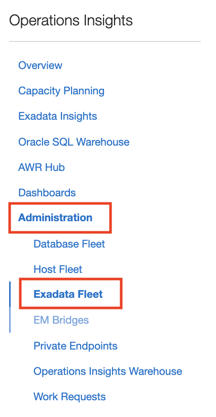
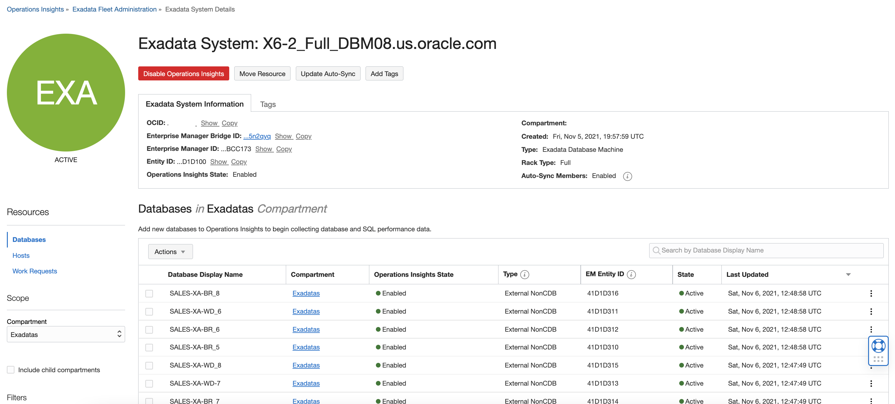
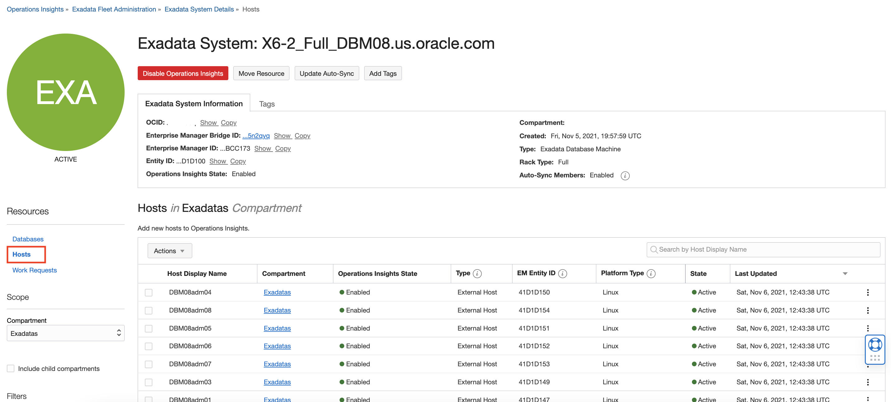
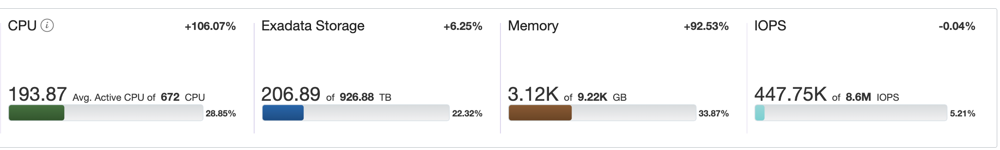
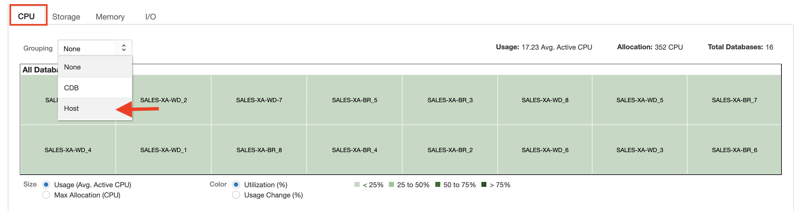
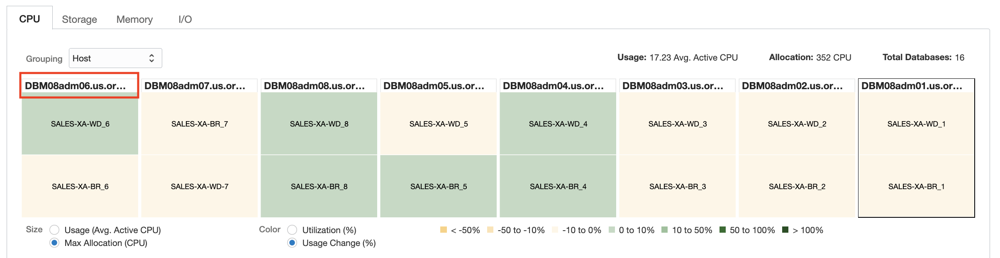
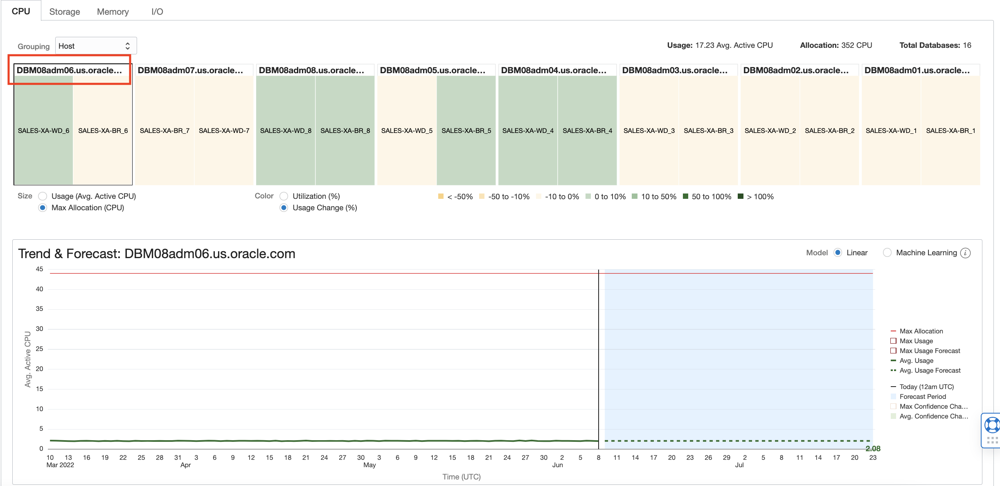
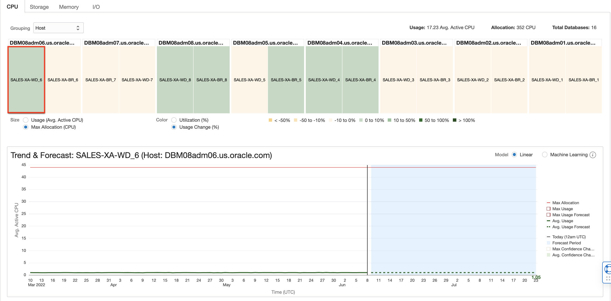

# Capacity Planning of Oracle Exadata

## Introduction

In this lab, you will go through the steps to explore the Capacity Planning of Oracle Exadata.

Estimated Time: 15 minutes

### Objectives

-   Explore Capacity Planning Oracle Exadata.

### Prerequisites

This lab assumes you have completed the following labs:
* Lab: Enable Demo Mode

## Task 1: Prerequisites

1.  Before you begin, ensure the following:

      * IMPORTANT: Enterprise Manager configuration (setting up the OCI Bridge) MUST be done first. See [Integrating Enterprise Manager with OCI Services](https://docs.oracle.com/en/enterprise-manager/cloud-control/enterprise-manager-cloud-control/13.5/emadm/using-oci-services-enterprise-manager.html#GUID-1F310CD9-23FD-4CF3-8E32-0943F7DB3762).

      * EM Bridge and Object Storage bucket has been set up. See [Adding Enterprise Manager Targets](https://docs.oracle.com/en-us/iaas/operations-insights/doc/get-started-operations-insights.html#GUID-3B9CFE26-976E-4983-8D4F-2909DA327BD0).

      * Enable Exadata Systems for Ops Insights.  Only Exadata Database Machines and Exadata Cloud at Customer deployments monitored by Enterprise Manager are currently supported.

2.  Exadata Insights is compatible with the following versions of Enterprise Manager:
      * On-premises (Exadata Database Machine): Enterprise Manager 13c Release 5 Update 1 (13.5.0.1) and greater
      * Cloud Service (Exadata Customer at Cloud): Enterprise Manager 13c Release 5 Update 4 (13.5.0.4) and greater

## Task 2: Exadata Fleet

1.  On the **Ops Insights Overview** page, from the left pane select the **Exadatas** compartment.

      

2.  On the **Ops Insights Overview** page, from the left pane click on **Administration** and then click on **Exadata Fleet**.

      

3.  This will bring up the **Exadata Fleet Administration** page, where all registered Exadata systems are displayed.

      

4.  Click on **X6-2\_Full_DBM08.us.oracle.com** Exadata System to see the Databases and Hosts associated with this Exadata System.

      

5.  From the left pan click on **Hosts** to view the hosts associated with this Exadata System.

      

6.  Select individual Database and Host and then click **Actions** and **Re-Enable Ops Insights** / **Disable Ops Insights** to manage and remove or enable the OPSI functionality.

      

## Task 3: Exadata Insights

1.  Click on **Ops Insights** to go to the Overview Page.

      

2.  On the **Overview** page, click on **Exadata Insights** from the left pane.

      

3.  This will show the Exadata systems registered for Ops Insights.

      

4.  On this page, the aggregate view of all the discovered Exadata systems will be shown.

      

5.  Also, the current and forecast utilization of the Exadata system will be shown in the bottom section. Click on an Exadata system to evaluate more insights. Click on the Full Rack.

      

6.  On the **Exadata System Details** page, you can view **Rack and Key Metrics**. The page displays Software and Hardware Summary.

      

7.  Navigate to **Metrics by Database** on the left pane.

      

8.  Select the **CPU** tab and choose the **Host** under Grouping.

      

9.  Now choose **Max Allocation (CPU)** under **Size** and **Usage Change (%)** under **Color**.

      

10.  Highlight the hosts with maximum CPU utilization and the databases which consume the highest CPU.

      

11.  To show the trend & forecast of CPU for Host and Database, click on the hostname and highlight the trend graph.

      

12.  Select the database and highlight the trend and forecast graph.

      

13.  Click **Metrics by Host** on the left pane.

      

14.  On the **Metrics by Host** page, click on the **CPU** tab, select **All hosts** to see the aggregate trend & forecast. 

      

15.  Click the **Exadata Storage Server** option on the left pane.

      

16. Select **Individual data series** on the top right pane to show the individual storage utilization.

      

17. Select **Aggregate data series and forecast** on the top right pane to show total individual storage utilization.

      

In Conclusion, OPSI Exadata Insights provides comprehensive capacity analysis to give administrators the ability to view, analyze, proactively forecast, and detect potential constraints in Exadata resources. As a system administrator they want to be able to make critical decisions to optimize their Exadata stacks; plan for growth, compare resource usage and perform what-if analysis for various scenarios.

## Acknowledgements

- **Author** - Vivek Verma, Master Principal Cloud Architect, North America Cloud Engineering
- **Contributors** - Vivek Verma, Sriram Vrinda, Derik Harlow
- **Last Updated By/Date** - Vivek Verma, Apr 2024