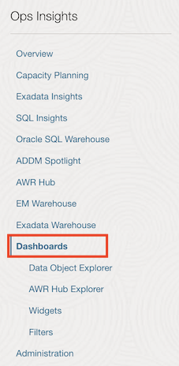
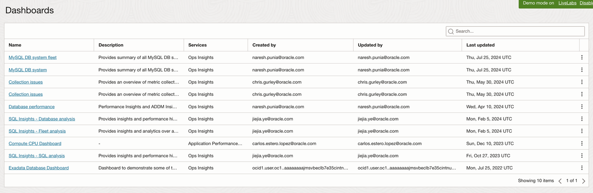
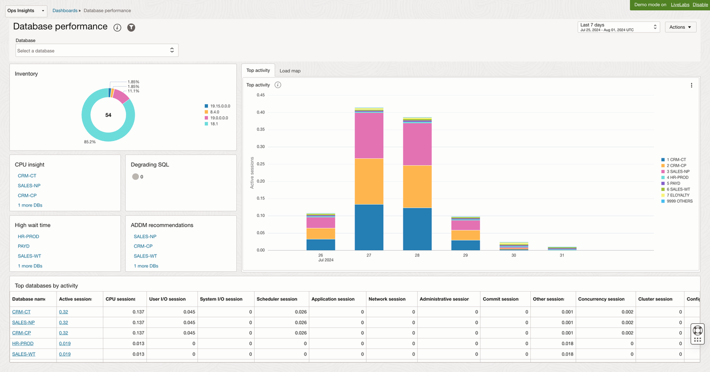
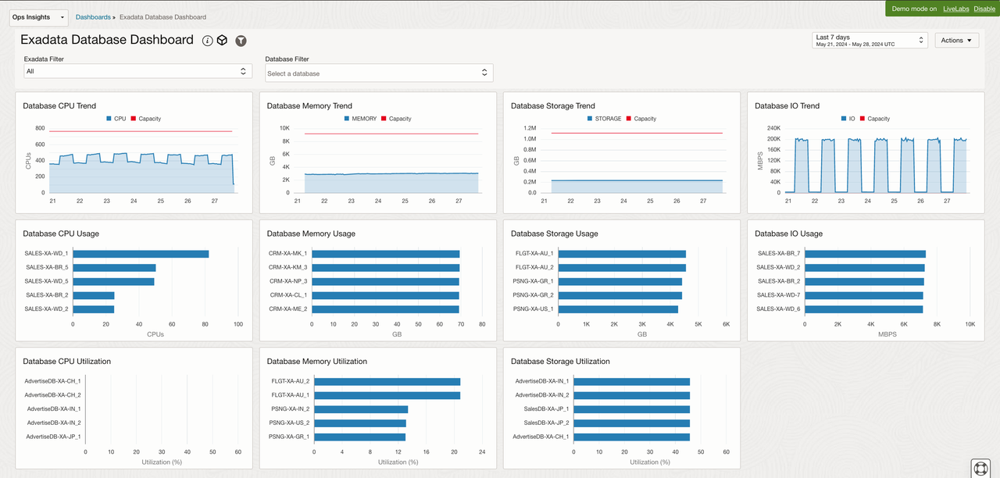
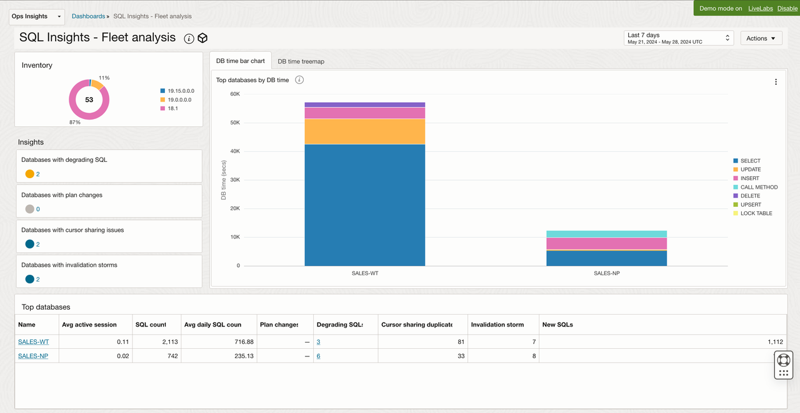

# Ops Insights Dashboards

## Introduction

In this lab, you will go through the steps to view Out of the box Ops Insights Dashboards provided by Oracle.

Estimated Time: 10 minutes

### Objectives

-   Review Out of the box Ops Insights Dashboards.

### Prerequisites

This lab assumes you have completed the following labs:
* Lab: Enable Demo Mode

## Task 1: Dashboards

1.  On the **Ops Insights Overview** page, from the left pane click on **Dashboards**.

      

2.  This will list all the Ops Insights dashboards.

      

3. In addition to creating dashboards, Ops Insights also provides the following predefined dashboards which can be access by clicking on the "Dashboard Name" from "Dashboard Listing":

    Database performance - Performance Insights and ADDM Insights for all databases enabled in the compartment. Autonomous databases must be enabled for full features to appear within Database performance dashboard.

      

    Exadata Database Dashboard	- Dashboard to demonstrate some of the Operations Insights database widgets releated to Exadata Database Systems.

      

    SQL Insights - Fleet analysis - Fleet-wide view of configurations and Insights and analytics over all SQLs, across the Ops Insights enabled databases. Autonomous databases must be enabled for full features to appear within SQL Insights.

      

## Acknowledgements

- **Author** - Vivek Verma, Master Principal Cloud Architect, North America Cloud Engineering
- **Contributors** - Vivek Verma, Sriram Vrinda, Derik Harlow, Murtaza Husain
- **Last Updated By/Date** - Vivek Verma, July 2024