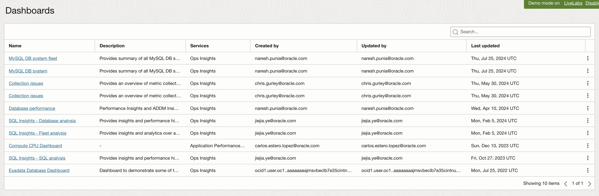
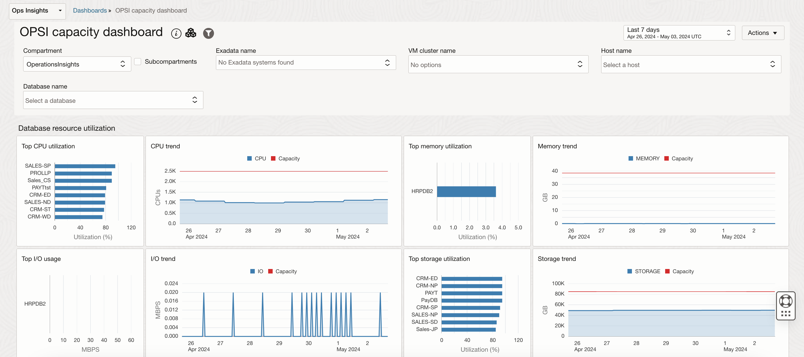
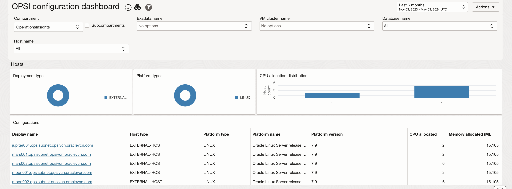
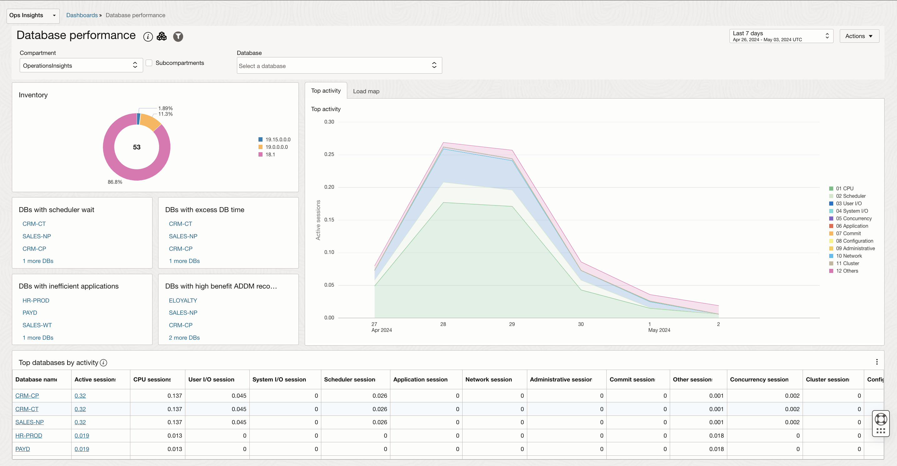

# Ops Insights Dashboards

## Introduction

In this lab, you will go through the steps to view Out of the box Ops Insights Dashboards provided by Oracle.

Estimated Time: 10 minutes

### Objectives

-   Review Out of the box Ops Insights Dashboards.

### Prerequisites

This lab assumes you have completed the following labs:
* Lab: Enable Demo Mode

## Task 1: Dashboards

1.  On the **Ops Insights Overview** page, from the left pane click on **Dashboards**.

      

2.  This will list all the Ops Insights dashboards.

      

3. In addition to creating dashboards, Ops Insights also provides the following predefined dashboards which can be access by clicking on the "Dashboard Name" from "Dashboard Listing":

    Exadata Cell Dashboard - Hourly	Hourly granularity dashboard for cell disk metrics. The disk metrics are aggregated across the flash and hard disks as indicated by the widget names.
    Useful to help identify potential disk-related IO bottlenecks and cell outliers.

    Exadata IORM Dashboard - Hourly	Hourly granularity dashboard for Exadata IORM-related metrics.
    This dashboard breaks down hard and flash IORM metrics helping to pinpoint heavy consumers of the cell IO resources at both database and pluggable database levels.

    OPSI capacity dashboard	- Fleet-wide view of top utilized databases, hosts, and Exadata Systems enabled for Ops Insights.

      

    OPSI configuration dashboard - Fleet-wide view of configurations across the Ops Insights enabled databases, hosts, and Exadata systems.

      

      

    Database performance - Performance Insights and ADDM Insights for all databases enabled in the compartment. Autonomous databases must be enabled for full features to appear within Database performance dashboard.

      

    Host fleet dashboard - Performance insights and details about top processes and containers for hosts enabled for Ops Insights

      

## Acknowledgements

- **Author** - Vivek Verma, Master Principal Cloud Architect, North America Cloud Engineering
- **Contributors** - Vivek Verma, Sriram Vrinda, Derik Harlow, Murtaza Husain
- **Last Updated By/Date** - Vivek Verma, Apr 2024