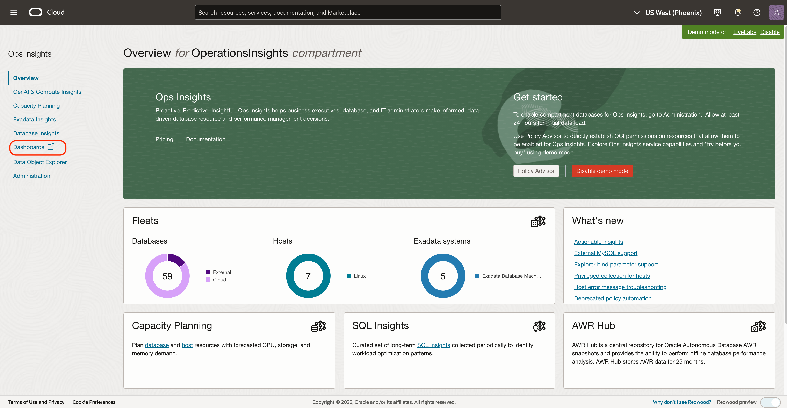
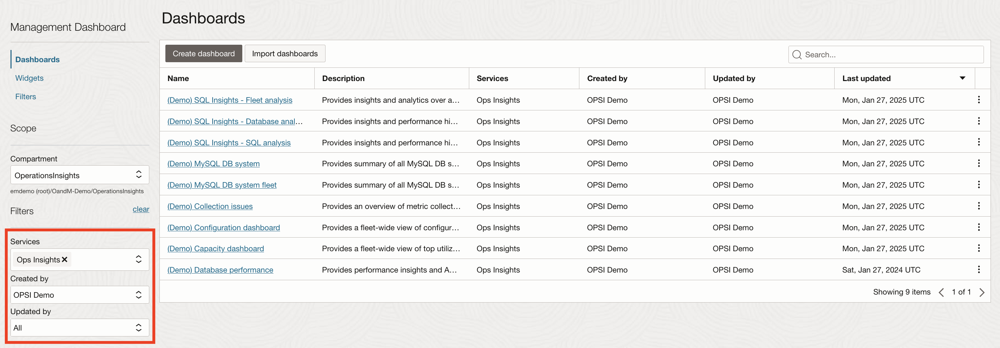
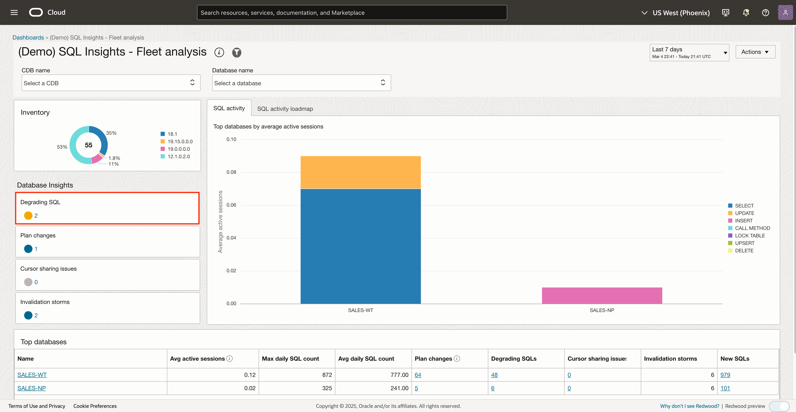
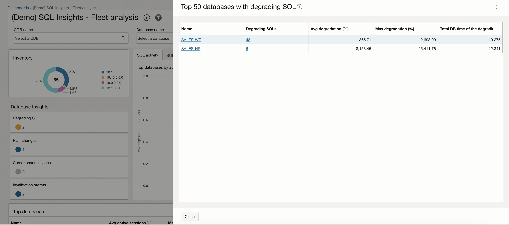
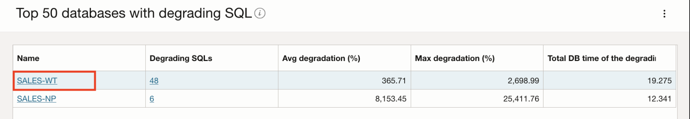
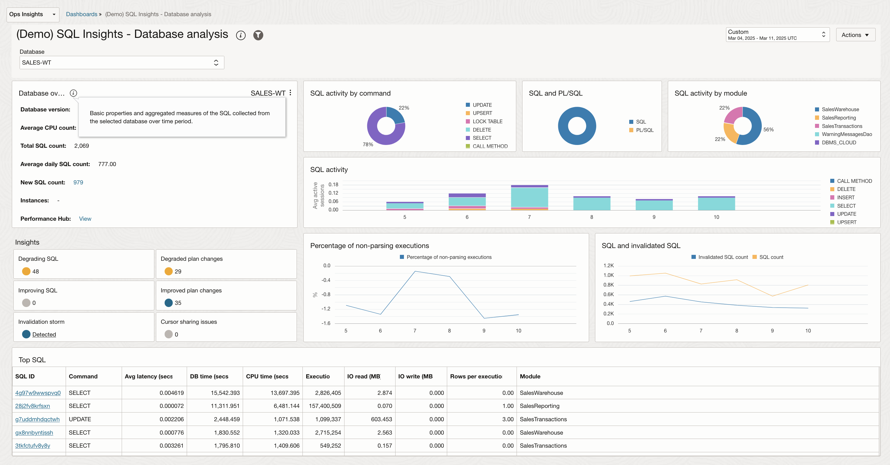
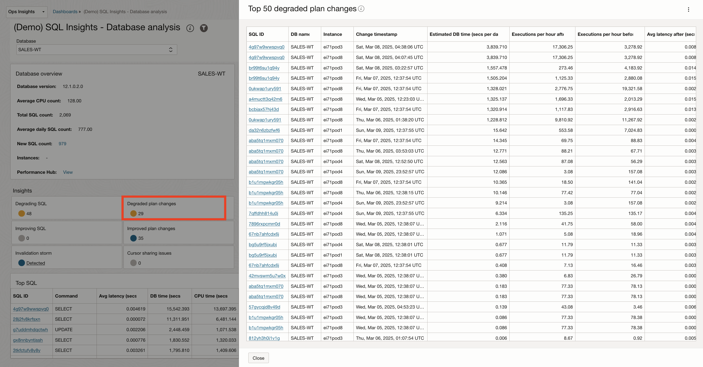
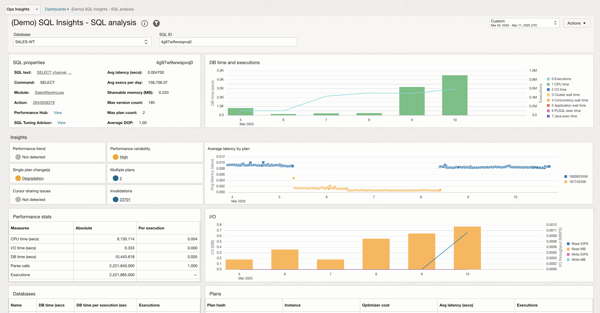

# Ops Insights Dashboards

## Introduction

In this lab, you will go through the steps to view Out of the box Ops Insights Dashboards provided by Oracle.

Estimated Time: 10 minutes

### Objectives

-   Review Out of the box Ops Insights Dashboards.

### Prerequisites

This lab assumes you have completed the following labs:
* Lab: Enable Demo Mode

## Task 1: Dashboards

1.  On the **Ops Insights** main page, click **Dashboards** from the left pane.

      

2. On the **Dashboards** page you can view the list of Ops Insights dashboards.

      

3. From the list of dashboards click **(Demo) SQL Insights - Fleet Analysis** to launch the **(Demo) SQL Insights - Fleet Analysis** page.

      

4. Click **Degrading SQL** under **Database Insights** on the left to list the databases with degrading SQL.

      

5. Click the database name **SALES-WT** from the list of databases to launch the **Databae Analysis** page.

      

      

6. Click **Degraded plan changes** to list the **Top 50 degraded plan changes**.

      

7. Click SQL ID **4g7w9wwspvq0** from the list of SQL IDs to launch the **SQL Analysis** page.

      

## Acknowledgements

- **Author** - Vivek Verma, Master Principal Cloud Architect, North America Cloud Engineering
- **Contributors** - Vivek Verma, Sriram Vrinda, Derik Harlow, Murtaza Husain
- **Last Updated By/Date** - Vivek Verma, Mar 2025