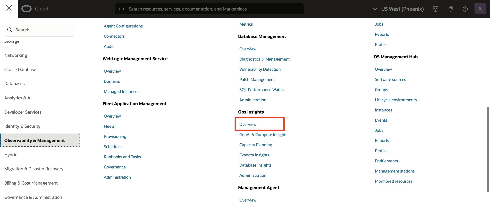
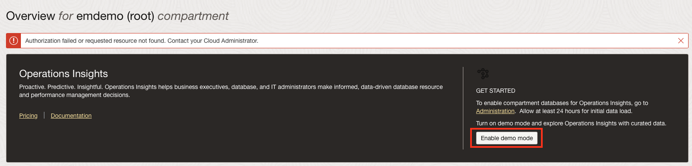
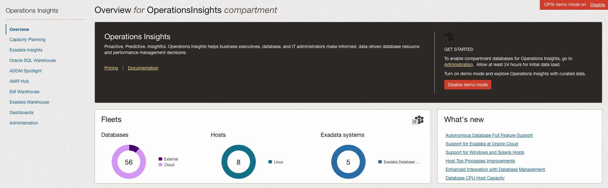
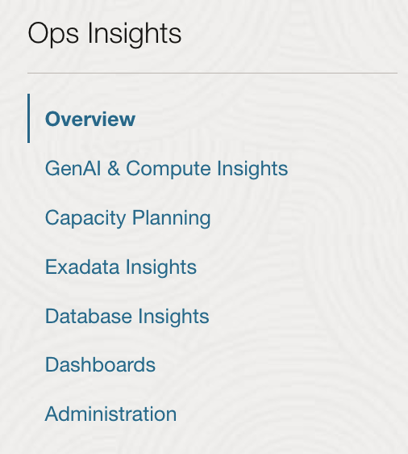

# Enable Demo Mode for Operations Insights

## Introduction

In this lab, you will go through the steps to enable Demo Mode for Oracle Cloud Infrastructure Operations Insights.

Estimated time: 10 minutes

### Objectives

- Log into OCI Tenancy.
- Enable Operations Insights Demo Mode.

## Task 1: Enable Demo Mode

1.  To access Operations Insights, click on the Oracle Cloud Console **Navigation menu** (aka hamburger menu) located in the upper left. Under **Observability & Management**, go to **Operations Insights** and click **Overview**.

      

2.  Click on **Enable Demo Mode** to enable Demo Mode.

      

3.  After clicking on the **Enable Demo Mode**, the following error message will pop-up stating that authorization error has occurred. Please skip this message by clicking on Enable demo mode icon again.

      

4.  Once the mode is enabled the overview page will now show resource information for the OperationsInsights compartment, notice the upper-right hand corner will show Demo Mode is now ON for your session.  When you would like to exit demo mode you can either click the disable link in the corner or click the now present **Disable Demo Mode** button where you initially enabled it on the overview page.

      

5.  On the left-hand pane you will find links to quickly navigate to OPSI offerings including Capacity Planning, Exadata Insights, Oracle SQL Warehouse, AWR Hub, and Dashboards.  

      

## Acknowledgements

- **Author** - Vivek Verma, Master Principal Cloud Architect, North America Cloud Engineering
- **Contributors** - Vivek Verma, Sriram Vrinda, Derik Harlow, Murtaza Husain
- **Last Updated By/Date** - Vivek Verma, May 2023