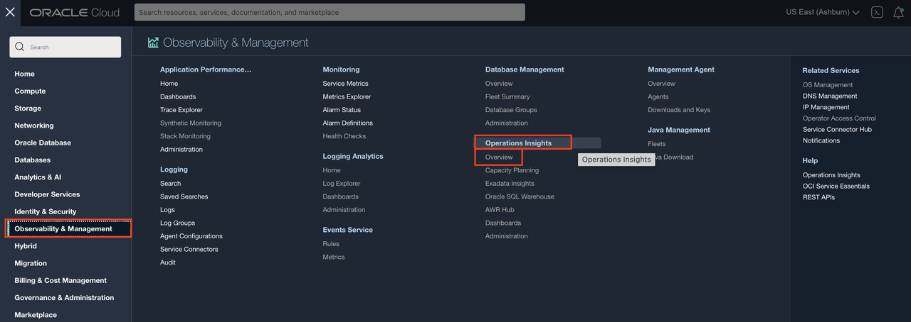
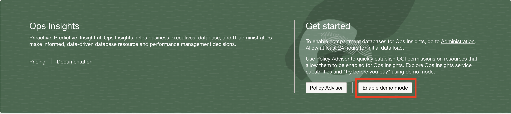
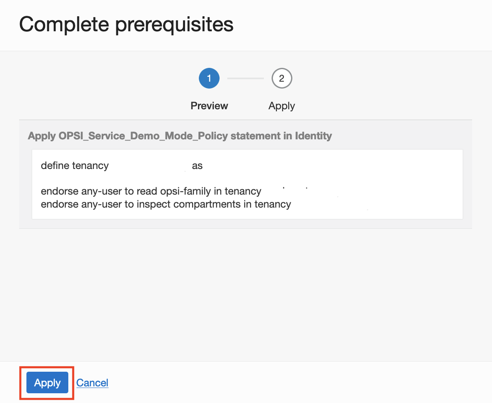
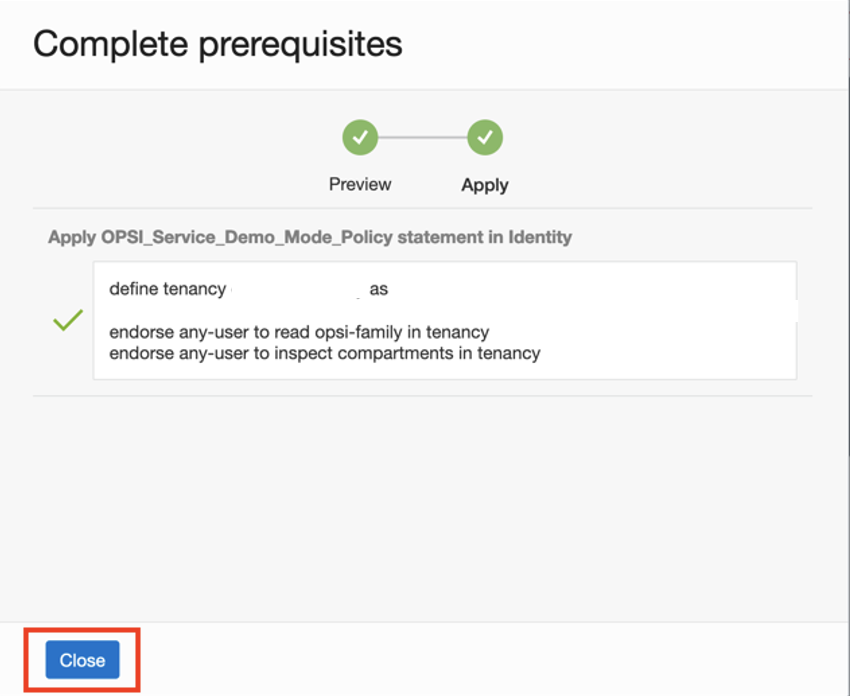
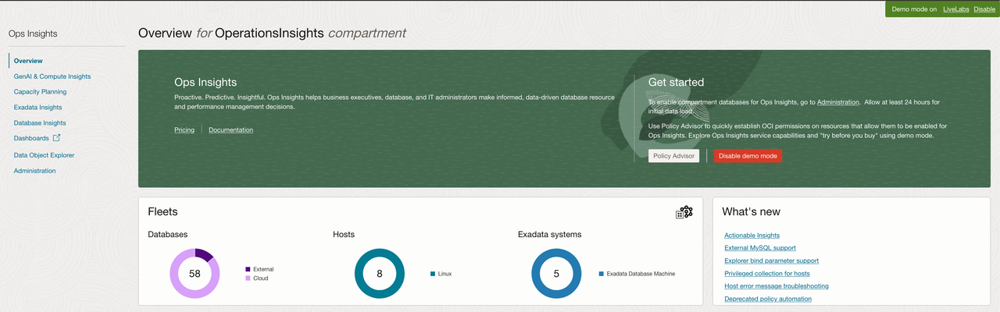
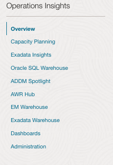

# Enable Demo Mode for Operations Insights

## Introduction

In this lab, you will go through the steps to enable Demo Mode for Oracle Cloud Infrastructure Operations Insights.

Estimated time: 10 minutes

### Objectives

- Log into OCI Tenancy.
- Enable Operations Insights Demo Mode.

### Prerequisites

- Your Oracle Cloud Trial Account

## Task 1: Enable Demo Mode

1.  To access Operations Insights, click on the Oracle Cloud Console **Navigation menu** (aka hamburger menu) located in the upper left. Under **Observability & Management**, go to **Operations Insights** and click **Overview**.

      

2.  Click on **Enable Demo Mode** to enable Demo Mode.

      

3.  On the **Complete prerequisites** pop-up click on **Apply**. When enabling demo mode, a policy is created to allow read-only access to the demo tenancy's data. It may take up to 1 or 2 minutes for the policy to allow data access across the tenancies.  If you are receiving authorization errors you may need to refresh the page until they have cleared, or you will need to engage an administrator or user with elevated privileges to create the policy.

      

4.  Click **Close** after the policy has been created.

      

5.  Once the mode is enabled the overview page will now show resource information for the OperationsInsights compartment, notice the upper-right hand corner will show Demo Mode is now ON for your session.  When you would like to exit demo mode you can either click the disable link in the corner or click the now present **Disable Demo Mode** button where you initially enabled it on the overview page.

      

6.  On the left-hand pane you will find links to quickly navigate to OPSI offerings including Capacity Planning, Exadata Insights, Oracle SQL Warehouse, AWR Hub, and Dashboards.  

      

## Acknowledgements

- **Author** - Vivek Verma, Master Principal Cloud Architect, North America Cloud Engineering
- **Contributors** - Vivek Verma, Sriram Vrinda, Derik Harlow, Murtaza Husain
- **Last Updated By/Date** - Vivek Verma, May 2023