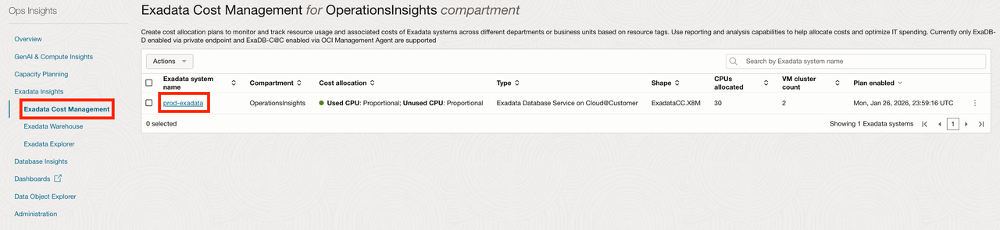
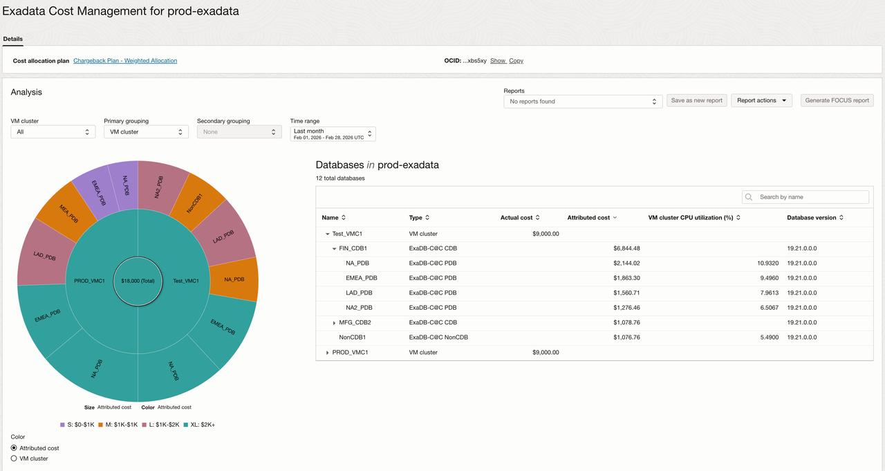
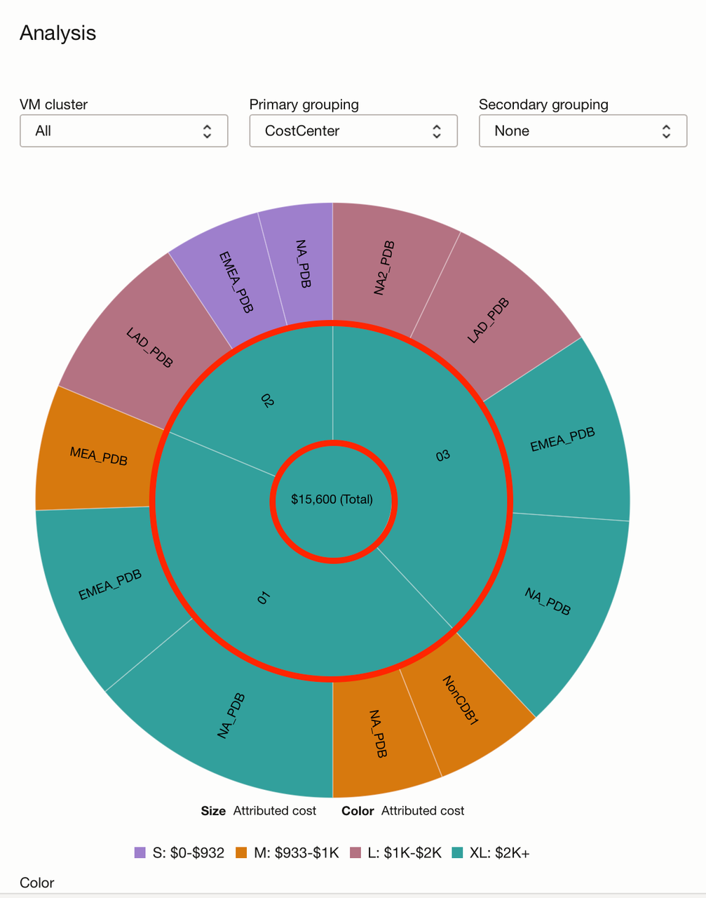
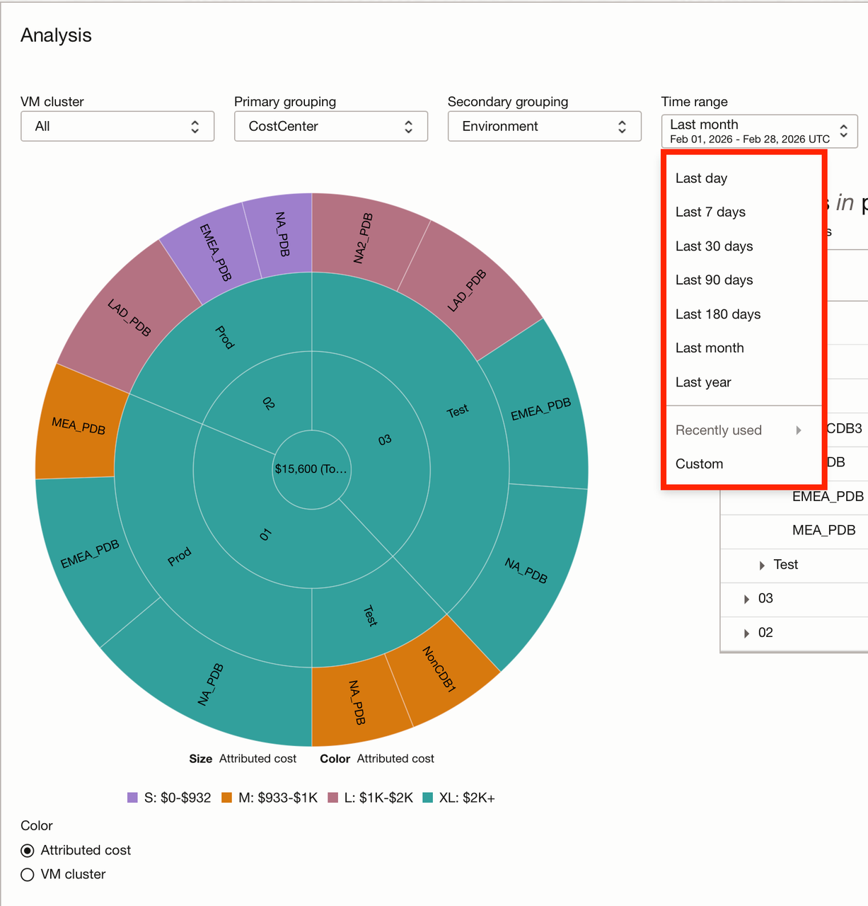
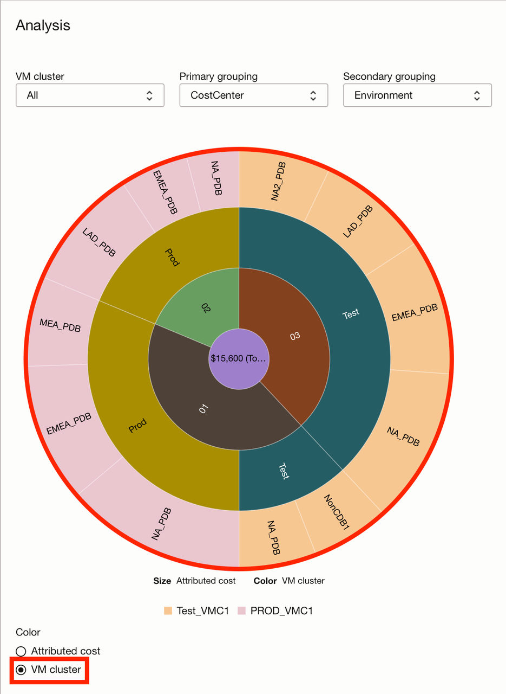
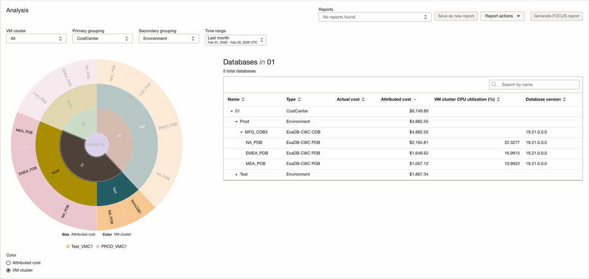
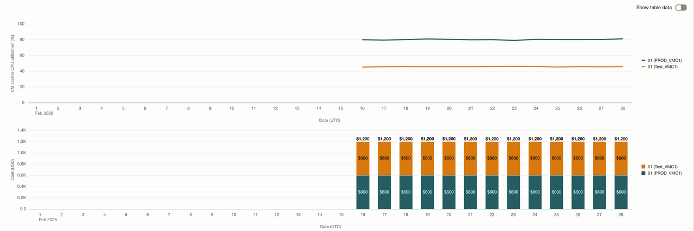
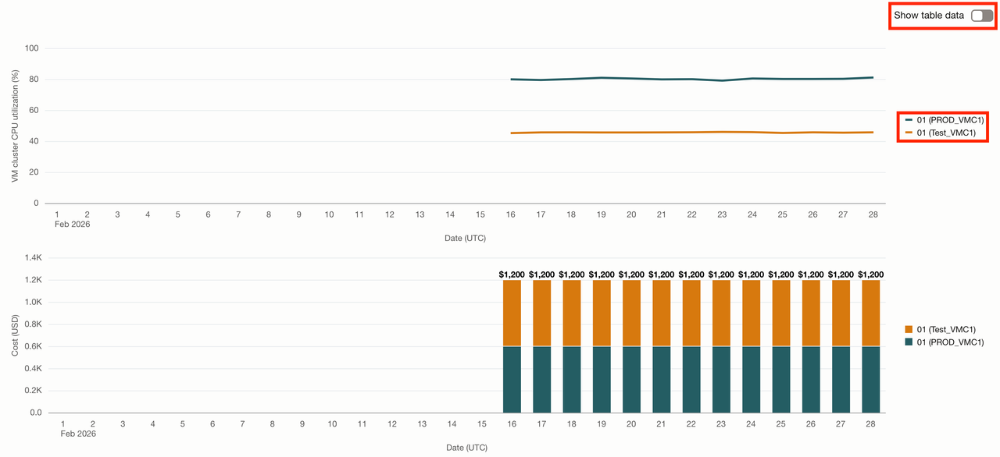
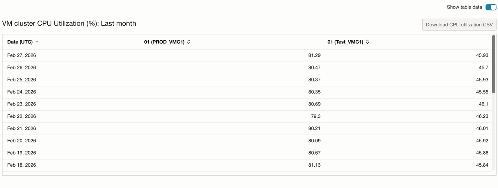

# Exadata Cost Management

## Introduction

In this lab, you will go through the steps to explore Exadata Cost Management.

The chargeback feature will help organizations utilizing ExaDB-D and ExaDB-C@C to understand their resource usage and associated costs. These capabilities will allow organizations to pinpoint where their IT spending is going, provide spending accountability, and identify opportunities to reduce overall spend on infrastructure.

By providing "showback" and allocating "chargeback" costs to individual departments or business units based on their actual usage of shared infrastrucutre, tenancy or resource administrators can promote accountability and encourage more efficient resource utilization. By assigning costs to individual users or departments, chargeback features incentivize responsible resource usage. Users become more mindful of the resources they consume when they know they will be charged for it, leading to better optimization of IT infrastructure and a reduction of costs associated with overallocated resources.

The Exadata Cost Management feature will provide organizations with the ability to accurately track, allocate, and manage IT costs associated with the usage of resources within their IT infrastructure.

### Objectives

- Enable organizations to track resource usage and associated costs in a hybrid deployment across different departments or business units.
- Facilitate accurate allocation of IT expenses to departments based on their actual resource consumption.
- Provide detailed reporting and analysis capabilities to help organizations understand and optimize their IT spending.

Estimated Time: 15 minutes

### Lab Objectives

* Explore Exadata Cost Management

### Prerequisites

This lab assumes you have completed the following labs:

* Lab: Enable Demo Mode

## Task 1: Exadata Cost Management

1. On the **Ops Insights Overview** page, from the left pane click **Exadata Insights**. Next, click on the **Exadata Cost Management** link. This will take you to the **Exadata Cost Management** landing page. This page displays a summary view of all the resources that are enabled on the Exadata Cost Management feature. Click on the Exadata System name.

      

2. The **Exadata Cost Management details** page shows the details of cost associated with this Exadata System at a VM Cluster and database level. You can analyze your cost management data with an interactive **Sunburst chart** and the **Databases** table. 
      
      The **Sunburst chart** on the left quickly highlights the biggest cost drivers by visualizing the cost associated with each VM Cluster and database depicted by **Color** and **Size**. The legend for the sunburst chart shows separate colors for different cost ranges. 
      
      **Note**: A Sunburst chart shows how a whole is broken into parts, using layers of rings to represent levels in a hierarchy. 

            1. The center is the top level (the “whole” or root category).
            2. Each ring outward is a deeper level (subcategories of what’s inside).
            3. Each slice is a category; its angle/arc length shows its size/value relative to its siblings.
            4. A slice’s children appear as slices directly outside it, lining up with the parent slice.
     
      The **Databases** table on the right complements the **Sunburst chart** by listing the VM clusters and databases with key metrics/context such as **Actual cost**, **Attributed cost**, and **VM cluster CPU utilization (%)**. This table shows the cumulative cost at a VM Cluster, CDB, and PDB level. 

      

3. You can utilize the **VM cluster** drop down to select a specific VM cluster. For this exercise, we will keep it selected for all VM clusters. Click on the **Primary grouping** drop down to select **CostCenter**, you can observe that it changes the inner ring values of the Sunburst chart to visualize the attributed costs of cost centers **01**, **02**, and **03**. 

      

4. Next, click on the **Secondary grouping** drop down to select **Environment**. This will add another ring to your Sunburst chart to visualize the **Prod** and **Test** environments that belong to each cost center.

      

5. You can create cost center hierarchy or LOB manually within your organization. In order to accomplish this, you must utilize OCI standard tags to assign cost center's key value.  Likewise, free-form tags you have created can be utilized to further filter on organizational entities.
      
      Apart from the cost, you can also view how many resources are assigned to which cost center and how much is the total charge based on a given time range.
      
      

      
6. Underneath **Color**, select the **VM cluster** button so the Sunburst chart will now use color to differentiate by VM cluster instead of attributed cost. You can see in the outer ring of the Sunburst chart which databases belong to **Test_VMC1** or **PROD_VMC1 VM clusters**.

      

7. Select the slice for cost center **01** in the Sunburst chart. You can see the **Databases** table on the right changes the values on the columns to visualize only cost center **01**.

      

8. Scroll down and you will see the Exadata Cost Management details page also shows:

      * Usage trend – Monthly CPU utilization (%) per VM Cluster (line-graph).
      * Charge Trend - Monthly charge ($) per VM Cluster (bar-chart)
      
      These charts are showing the usage and charge trends for cost center **01**.

      

9. In the VM cluster CPU utilization chart, de-select **01 (Test_VMC1)** to view data only for **01 (PROD_VMC1)**.

      ")

10. Select **01 (Test_VMC1)** again and click **Show table data** to view the data in tabular form.

      

      

## Acknowledgements

* **Author** - Vivek Verma, Master Principal Cloud Architect, North America Cloud Engineering
* **Contributors** - Vivek Verma, Murtaza Husain, Derik Harlow, Marco Hernandez
* **Last Updated By/Date** - Marco Hernandez, March 2026
