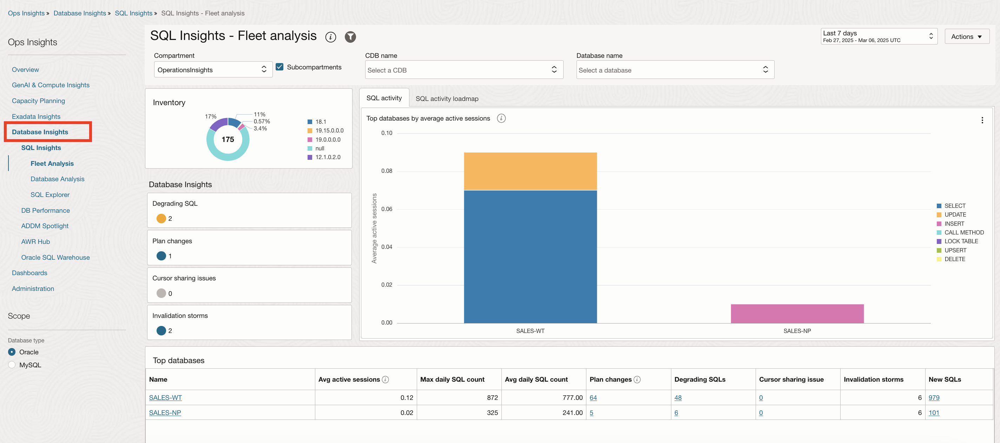
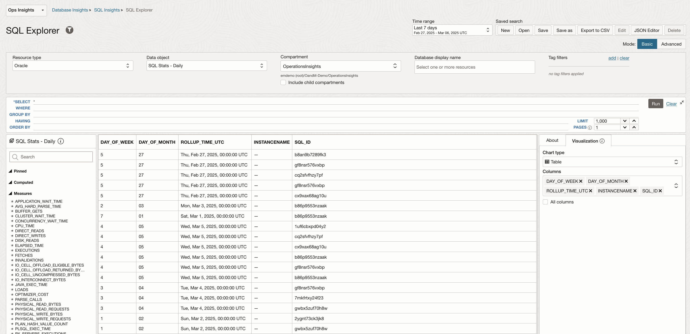
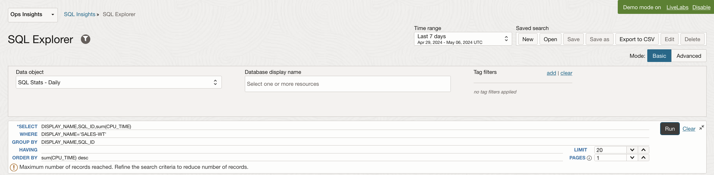
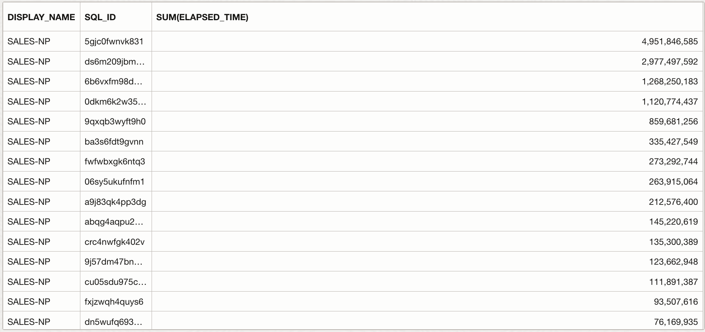

# Analyze SQL Performance at Fleet Level

## Introduction

In this lab, you will go through the steps to analyze SQL Performance at Fleet level and proactively identify SQLs Degrading performance.

Estimated Time: 10 minutes

### Objectives

-   Analyze SQL Performance at Fleet level and proactively identify SQLs Degrading performance.

### Prerequisites

This lab assumes you have completed the following labs:
* Lab: Enable Demo Mode

## Task 1: SQL Insights

1. On the **Ops Insights Overview** page, from the left pane click **SQL Insights**. On the **SQL Insights - Fleet analysis** page you can view insights and analysis over all SQL and all databases enabled in the compartment.

      

2. Click **DB time treemap** to view the tree map.

            

## Task 2: SQL Explorer

SQL Explorer provides an easy-to-use interface that lets you interactively explore and visualize detailed performance statistics stored in Ops Insights SQL Warehouse.

With SQL Explorer, you can explore performance statistics via a SQL query to extract the data with which to create an intuitive visualization. This provides interactive data exploration and visualization for deep exploration of application SQL performance statistics. The user interface is designed to simplify and streamline query development.

In this lab create visualuzations using pre-existing performance statistics via a SQL query.

1. In this example we will sum up all the CPU time per SQL ID for one specific DB and then sort them by descending order.

2. On the **Ops Insights Overview** page, from the left pane click **SQL Insights** and then click **SQL Explorer**.

      

3. This will take you to the **SQL Explorer** page.

      

4. Enter the following SQL in the SQL query section

      ```
      <copy>SELECT DISPLAY_NAME,SQL_ID,sum(CPU_TIME)
            WHERE DISPLAY_NAME='SALES-WT'
            GROUP BY DISPLAY_NAME,SQL_ID
            HAVING
            ORDER BY sum(CPU_TIME)desc</copy>
      ```

      

5. Enter **20** for **LIMIT** to limit 20 records per page.

6. Click **Run** to execute the query.

7. This will display the query result in a tabular format.

      

8. Under the **Visualization** tab on the right pane, select the following -

      **Chart type** : **Bar Chart**

      **Y axis** : **SUM(CPU\_TIME)**
      
      **X axis** : **DISPLAY\_NAME**
      
      **Series** : **SQL\_ID**
      
      **Color by** : **SQL\_ID**
      
      **Y axis title** : **CPU time (s)**
      
      **Legend** : **None**
      
      Check mark **Stacked**

      

9. This will display the visualization as a Stacked Bar Chart.

10. In the second use case we will sum up all the Elapsed time per SQL ID across the fleet of Databases and then sort that in descending order.

11. On the **Ops Insights Overview** page, from the left pane click **SQL Insights** and then click **SQL Explorer**.

      

12. This will take you to the **SQL Explorer** page.

      

13. Enter the following SQL in the SQL query section

      ```
      <copy>SELECT DISPLAY_NAME,SQL_ID,sum(ELAPSED_TIME)
            WHERE
            ​GROUP BY DISPLAY_NAME,SQL_ID
            HAVING sum(ELAPSED_TIME)>70000000
            ORDER BYDISPLAY_NAME,sum(ELAPSED_TIME)desc</copy>
      ```

      

14. Enter **1000** for **LIMIT** to limit 1000 records per page.

15. Click **Run** to execute the query.

16. This will display the query result in a tabular format.

      

17. Under the **Visualization** tab on the right pane, select the following -

      **Chart type** : **Bar Chart**

      **Y axis** : **SUM(ELAPSED\_TIME)**
      
      **X axis** : **DISPLAY\_NAME**
      
      **Series** : **SQL\_ID**
      
      **Color by** : **SQL\_ID**
            
      **Legend** : **None**
      
      Check mark **Stacked**

      

9. This will display the visualization as a Stacked Bar Chart.

## Acknowledgements

- **Author** - Vivek Verma, Master Principal Cloud Architect, North America Cloud Engineering
- **Contributors** - Vivek Verma, Sriram Vrinda, Derik Harlow, Murtaza Husain
- **Last Updated By/Date** - Vivek Verma, Apr 2024