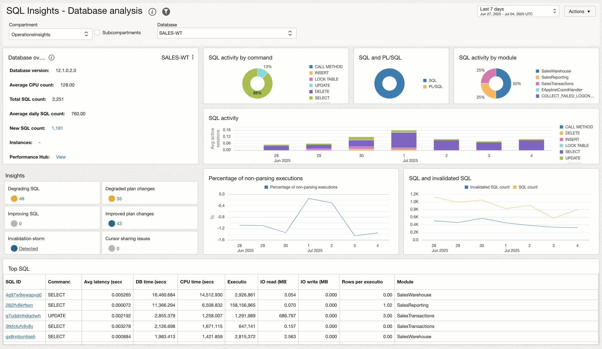
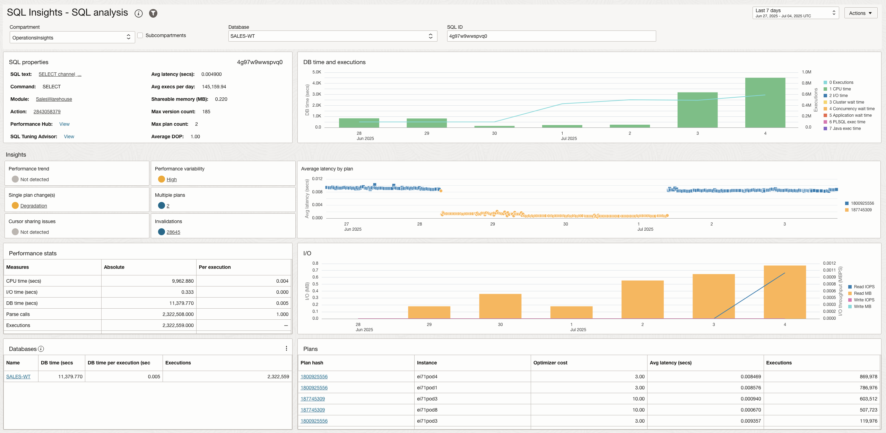
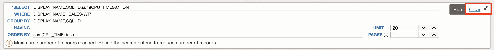
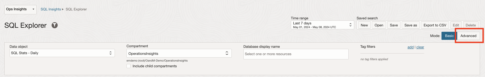
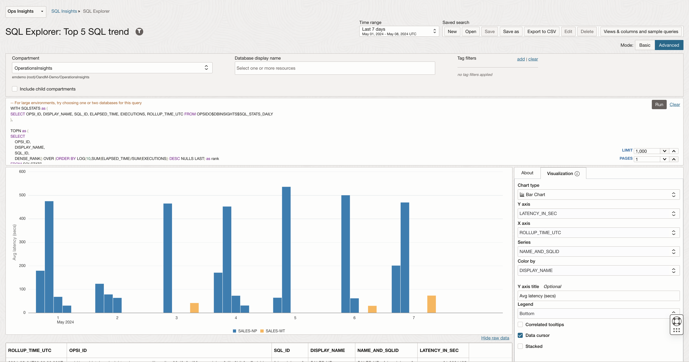
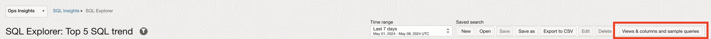
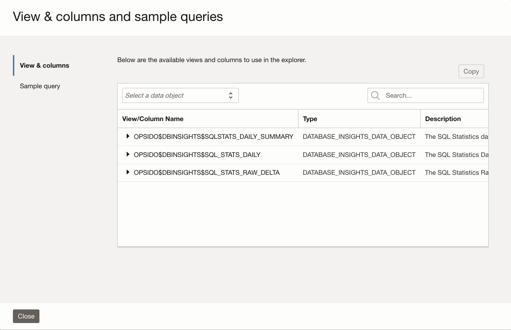

# Analyze SQL Performance at Fleet Level

## Introduction

In this lab, you will go through the steps to analyze SQL Performance at Fleet level and proactively identify SQLs Degrading performance.

Estimated Time: 10 minutes

### Objectives

-   Analyze SQL Performance at Fleet level and proactively identify SQLs Degrading performance.

### Prerequisites

This lab assumes you have completed the following labs:
* Lab: Enable Demo Mode

## Task 1: SQL Insights

1. On the **Ops Insights Overview** page, from the left pane click **SQL Insights**. On the **SQL Insights - Fleet analysis** page you can view insights and analysis over all SQL and all databases enabled in the compartment.

      

2. Click **SQL activity loadmap** to view the tree map.

         

3. Click the database **SALES-WT** to view **SQL Insights - Database: For database level insights**

      
      

      The Database analysis dashboard is designed to give a broad overview of the SQL workload executing in the database. This includes basic properties of the database and the SQL collected from it, including breakdowns of total time by command and module, and the ratio of time in SQL or PL/SQL. Insight tiles with counts of SQL with SQL having level insights quantify those issues at the database level. SQL activity is shown by day broken down by command type, exposing changes in workload over time. Execute to parse ratio and SQL count and invalidation charts expose important application properties over time.

4. Click the SQL ID **4g97w9wwspvq0** to view **SQL Insights - SQL analysis: For SQL level insights**

      

      

      This is the most granular level for SQL insights, at this level you can view a full picture of the performance properties of given SQL\_ID on a given database. This includes basic properties like the command type and text of the statement as well as average latency and execution frequency, and numerous other metrics from V$SQLSTATS. Insight tiles indicate whether the SQL level insights were true of the SQL_ID over the time period. Daily charts of total database time, average latency, and I/O enable deeper examination of the relationship of SQL plans to resource usage.

## Task 2: SQL Explorer

SQL Explorer provides an easy-to-use interface that lets you interactively explore and visualize detailed performance statistics stored in Ops Insights SQL Warehouse.

With SQL Explorer, you can explore performance statistics via a SQL query to extract the data with which to create an intuitive visualization. This provides interactive data exploration and visualization for deep exploration of application SQL performance statistics. The user interface is designed to simplify and streamline query development.

In this lab create visualuzations using pre-existing performance statistics via a SQL query.

1. In this example we will sum up all the CPU time per SQL ID for one specific DB and then sort them by descending order.

2. On the **Ops Insights Overview** page, from the left pane click **SQL Insights** and then click **SQL Explorer**.

      

3. This will take you to the **SQL Explorer** page.

      

4. Enter the following SQL in the SQL query section (copy & paste the statement line by line)

      ```
      <copy>SELECT DISPLAY_NAME,SQL_ID,sum(CPU_TIME)
            WHERE DISPLAY_NAME='SALES-WT'
            GROUP BY DISPLAY_NAME,SQL_ID
            HAVING
            ORDER BY sum(CPU_TIME)desc</copy>
      ```

      

5. Enter **20** for **LIMIT** to limit 20 records per page.

6. Click **Run** to execute the query.

7. This will display the query result in a tabular format.

      

8. Under the **Visualization** tab on the right pane, select the following -

      **Chart type** : **Bar Chart**

      **Y axis** : **SUM(CPU\_TIME)**
      
      **X axis** : **DISPLAY\_NAME**
      
      **Series** : **SQL\_ID**
      
      **Color by** : **SQL\_ID**
      
      **Y axis title** : **CPU time (s)**
      
      **Legend** : **None**
      
      Check mark **Stacked**

      

9. This will display the visualization as a Stacked Bar Chart.

10. In the second use case we will sum up all the Elapsed time per SQL ID across the fleet of Databases and then sort that in descending order.

11. Click on **Clear** to clear the query section.

      

12. Enter the following SQL in the SQL query section (copy & paste the statement line by line)

      ```
      <copy>SELECT DISPLAY_NAME,SQL_ID,sum(ELAPSED_TIME)
            WHERE
            ​GROUP BY DISPLAY_NAME,SQL_ID
            HAVING sum(ELAPSED_TIME)>70000000
            ORDER BY DISPLAY_NAME,sum(ELAPSED_TIME)desc</copy>
      ```

      

13. Enter **1000** for **LIMIT** to limit 1000 records per page.

14. Click **Run** to execute the query.

15. This will display the query result in a tabular format.

      

16. Under the **Visualization** tab on the right pane, select the following -

      **Chart type** : **Bar Chart**

      **Y axis** : **SUM(ELAPSED\_TIME)**
      
      **X axis** : **DISPLAY\_NAME**
      
      **Series** : **SQL\_ID**
      
      **Color by** : **SQL\_ID**
            
      **Legend** : **None**
      
      Check mark **Stacked**

      

9. This will display the visualization as a Stacked Bar Chart.

10. Click on **Advanced** Mode to view **SQL Explorer** in advanced mode. The advanced mode give you more control over the SQL queries that you are running against your database to view database performance.

      

11. This will take you to the **SQL Explorer Advanced** Mode page. Advanced mode can be used to execute your own custom queries and obtain more information above the SQLs running in the database.

      

12. Click **Views & columns and sample queries** to view available views and columns which can be used in the explorer.

      

13. **View & columns and sample queries** shows **View and columns** and **Sample query** that can be used in the explorer.

      

13. Click on a View to see the underlying columns that can be used to fetch desired data.

      


## Acknowledgements

- **Author** - Vivek Verma, Master Principal Cloud Architect, North America Cloud Engineering
- **Contributors** - Vivek Verma, Sriram Vrinda, Derik Harlow, Murtaza Husain
- **Last Updated By/Date** - Vivek Verma, July 2024