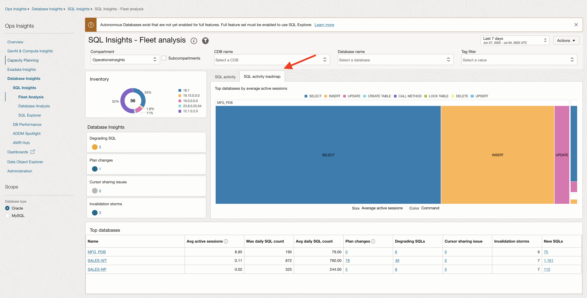
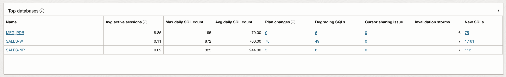

# Analyze SQL Performance at Fleet Level

## Introduction

In this lab, you will go through the steps to analyze SQL Performance at Fleet level and proactively identify SQLs Degrading performance.

Estimated Time: 5 minutes

### Objectives

-   Analyze SQL Performance at Fleet level and proactively identify SQLs Degrading performance.

## Task 1: Enable Demo Mode

1.  To access Ops Insights, click on the Oracle Cloud Console **Navigation menu** (aka hamburger menu) located in the upper left. Under **Observability & Management**, go to **Ops Insights** and click **Overview**.

      

2.  Click on **Enable Demo Mode** to enable Demo Mode.

      

3.  Once the mode is enabled the overview page will now show resource information for the OperationsInsights compartment, notice the upper-right hand corner will show Demo Mode is now ON for your session.  When you would like to exit demo mode you can either click the disable link in the corner or click the now present **Disable Demo Mode** button where you initially enabled it on the overview page.

      

4.  On the left-hand pane you will find links to quickly navigate to OPSI offerings including Capacity Planning, Exadata Insights, Oracle SQL Warehouse, AWR Hub, and Dashboards.  

      

## Task 2: SQL Insights

1. On the **Ops Insights Overview** page, from the left pane click **Database Insights** and that will select **SQL Insights** and **Fleet Analysis**. On the **SQL Insights - Fleet analysis** page you can view insights and analysis over all SQL and all databases enabled in the compartment.

  *Note: A warning is shown on the screen **"Autonomous Databases exist that are not yet enabled for full features. Full feature set must be enabled to use SQL Explorer. Learn more".** Close the warning message as shown below and proceed to Task 2*

      

      

2. Click **SQL activity loadmap** to view the tree map.

         

3. Click the database **SALES-WT** to view **SQL Insights - Database: For database level insights**

      
      

      The Database analysis dashboard is designed to give a broad overview of the SQL workload executing in the database. This includes basic properties of the database and the SQL collected from it, including breakdowns of total time by command and module, and the ratio of time in SQL or PL/SQL. Insight tiles with counts of SQL with SQL having level insights quantify those issues at the database level. SQL activity is shown by day broken down by command type, exposing changes in workload over time. Execute to parse ratio and SQL count and invalidation charts expose important application properties over time.

4. Click the SQL ID **4g97w9wwspvq0** to view **SQL Insights - SQL analysis: For SQL level insights**

      

      *Note: The region will default to UK South (London) and is set to demo mode. Please ignore this setting and proceed with the instructions below.*

      

      This is the most granular level for SQL insights, at this level you can view a full picture of the performance properties of given SQL\_ID on a given database. This includes basic properties like the command type and text of the statement as well as average latency and execution frequency, and numerous other metrics from V$SQLSTATS. Insight tiles indicate whether the SQL level insights were true of the SQL_ID over the time period. Daily charts of total database time, average latency, and I/O enable deeper examination of the relationship of SQL plans to resource usage.
      

## Acknowledgements

- **Author** - Vivek Verma, Master Principal Cloud Architect, North America Cloud Engineering
- **Contributors** - Vivek Verma, Sriram Vrinda, Derik Harlow, Murtaza Husain
- **Last Updated By/Date** - Vivek Verma, Mar 2025