# Analyze SQL Performance at Fleet Level

## Introduction

In this lab, you will go through the steps to analyze SQL Performance at Fleet level and proactively identify SQLs Degrading performance.

Estimated Time: 10 minutes

### Objectives

-   Analyze SQL Performance at Fleet level and proactively identify SQLs Degrading performance.

### Prerequisites

This lab assumes you have completed the following labs:
* Lab: Enable Demo Mode

## Task 1: Analyze SQL Performance

1.  On the **Ops Insights Overview** page, from the left pane click on **Oracle SQL Warehouse**.

      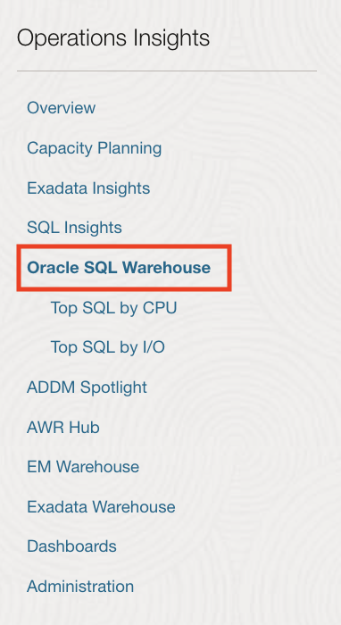

2.  On the **Oracle SQL Warehouse** page, you can Identify SQL performance trends across enterprise-wide databases.

      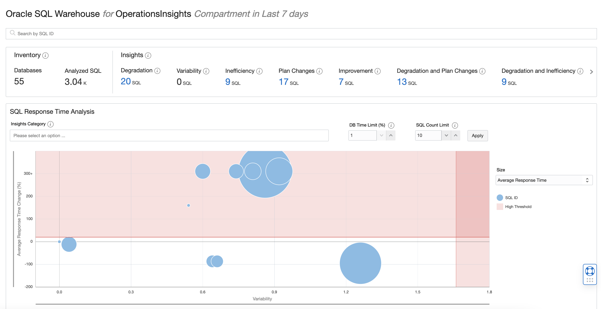

    From this page you can perform the following tasks :

    * View the degrading SQL, variant SQL, inefficient SQL, and SQL with plan changes.
    * View the SQL statements with the highest CPU and I/O usage.
    * Analyze the performance of SQL based on these categories – degrading, inefficient, variant, and with plan changes.

3.  Click on the **Degradation**.

      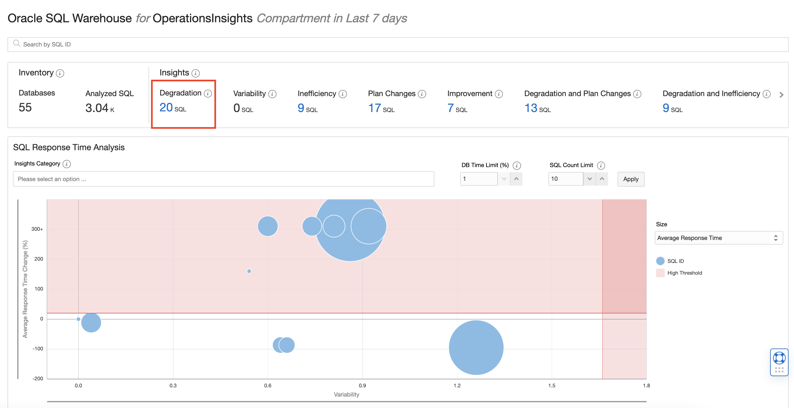

4.  This will bring up SQL Insights for degrading SQLs in the last 7 days.

      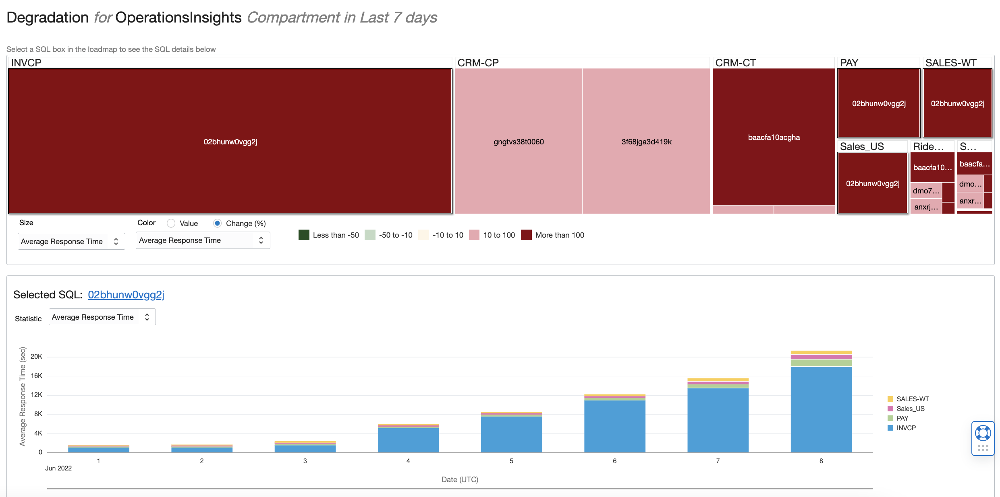

    * The heat map shows the degrading SQLs across databases. This page analyzes the SQL insights using the **Master** and **Details** way. The heatmap is the **Master** and the below bar chart is the **Details** chart.
    * The size of the box represents **Average response Time** and colour represents the change % of **Average Response Time**.
      
      You can customize the heat map based on the following:
      * **Size**: Customizes the size of the heat map segments based on Average Active Sessions, Average Response Time, Executions/Hour, I/O Time, and CPU Time.
      * **Color**: Customizes the colour-coding of the heat map based on percentage change value or absolute value of Average Active Sessions, Average Response Time, Executions/Hour, I/O Time, and CPU Time.

5.  Here SQL_ID **02bhunw0vgg2j** in database **INVCP** is degrading the most.

6.  The details bar chart shows the time series view of the sql_id **02bhunw0vgg2j** for the last 7 days.

      You can see how the Average SQL Response time of SQL has been increasing consistently for database **INVCP**. You can customize the bar chart display based on the following:

      * Avg. Active Sessions
      * Avg. Average Response Time
      * Executions Per Hour
      * I/O Time
      * CPU Time
      * Inefficient Wait Time

7.  Click the sql_id beside **Selected SQL**.

      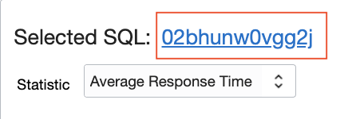

8.  This page shows the SQL Details of our most degrading SQL **02bhunw0vgg2j** for database **INVCP**. You can review its SQL Text and database location as well as its key performance metrics under: **Performance Statistics** and **Execution Plan Insights**.

      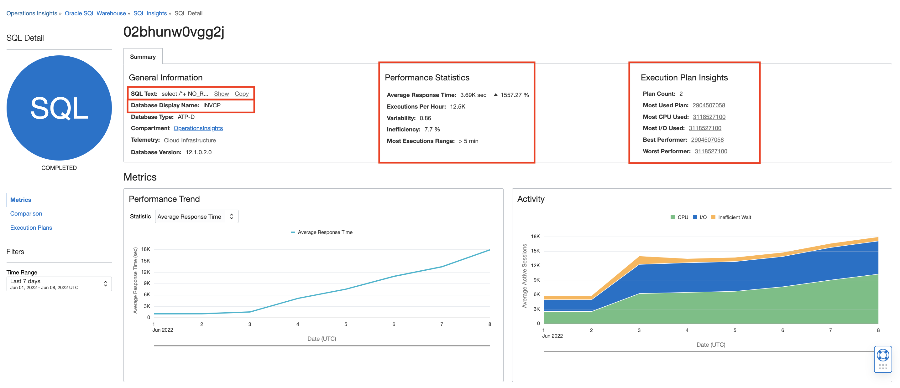

      **Performance Statistics**: This chart helps you view the trend in the SQL Statement performance for the current time, based on

      * The Average Response time in seconds.
      * The number of SQL Statements that were executed per hour.
      * The variability value of the SQL Statement, which indicates the extent of variance in the SQL Statement's performance in the current period.
      * The inefficiency percentage is based on the idle wait time of the SQL Statement.
      * The time range within which the maximum executions of the SQL Statement occurred.

      **Execution Plan Insights** provides:

      * Plans Used
      * The best and worst-performing plans
      * Plans with the most CPU and I/O usage
      * The most executed SQL Plan  

      In the **Metrics** section **Performance Trend** chart, we can see that the average Response of the SQL started to increase.
      
      The **Activity** chart displays the session activity of the SQL Statement, for the current time. It also shows how the SQL Statement activity is categorized into different wait classes indicated by the colour, as described in the legend on the chart.

9.  Click on **Execution Plans** from the left pane.

      

      The **Execution Plan** shows the plan lines by operation.
      
      You can analyze the Operation Cost, Estimated Rows and Estimated bytes of each operation; allowing you to locate problematic operations.  The higher the operation cost, the more problematic the operation can be.  The current operations cost of this plan hash is 22.9 million and this is the best performing plan.     

10.  Click on the plan hash value besides **Worst Performer**.

      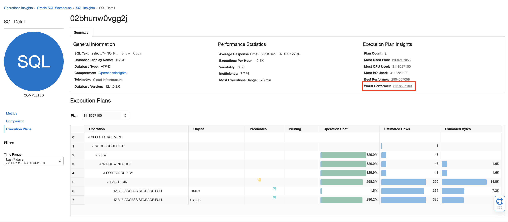

      You can see that the execution plan is different and much more expensive because the Operations Cost of the SQL is now 329 million.

11.  Click on **Comparison** from the left pane. This will show the comparison of performance trends of the two plans based on the **Average Response Time**.

      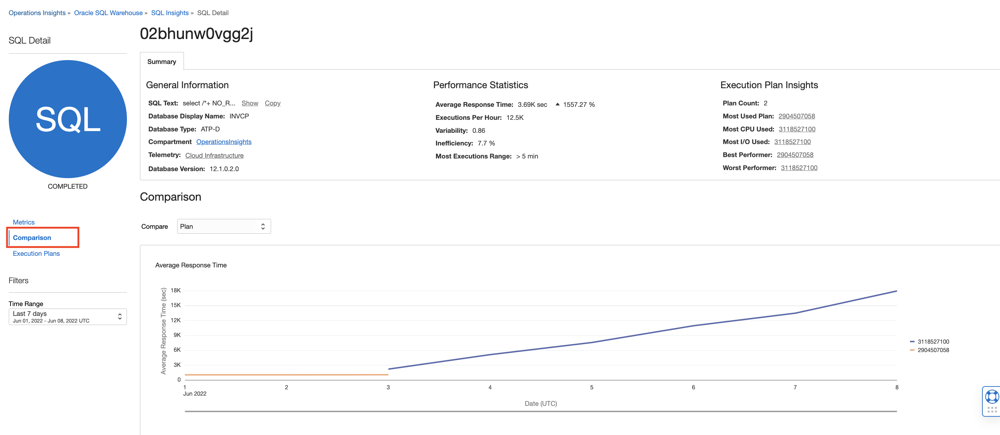

12.  We can further compare and analyze the two plans by:

    * Average Active Sessions
      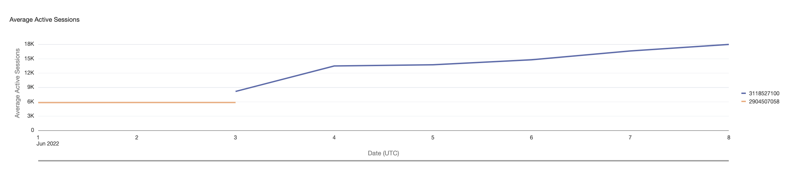
    * Executions Per Hour
      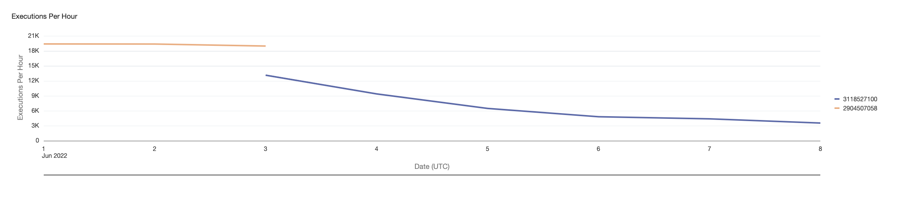
    * I/O Time
      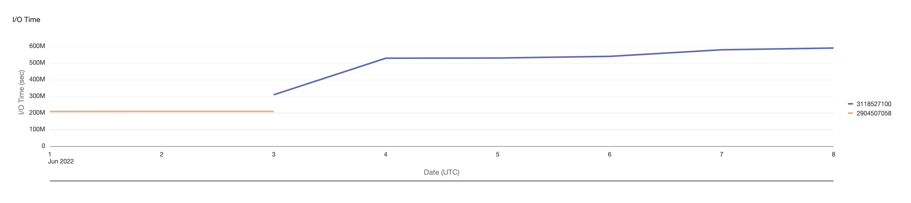
    * CPU Time
      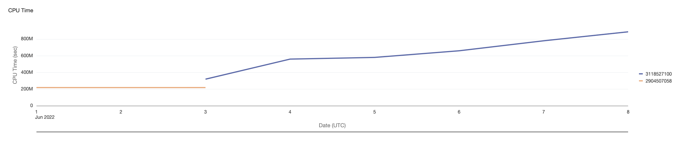


## Task 1: SQL Insights

1. On the **Ops Insights Overview** page, from the left pane click **SQL Insights**. On the **SQL Insights - Fleet analysis** page you can view insights and analysis over all SQL and all databases enabled in the compartment.

      

2. Click **DB time treemap** to view the tree map.

            

## Task 2: SQL Explorer

SQL Explorer provides an easy-to-use interface that lets you interactively explore and visualize detailed performance statistics stored in Ops Insights SQL Warehouse.

With SQL Explorer, you can explore performance statistics via a SQL query to extract the data with which to create an intuitive visualization. This provides interactive data exploration and visualization for deep exploration of application SQL performance statistics. The user interface is designed to simplify and streamline query development.

In this lab create visualuzations using pre-existing performance statistics via a SQL query.

1. In this example we will sum up all the CPU time per SQL ID for one specific DB and then sort them by descending order.

2. On the **Ops Insights Overview** page, from the left pane click **SQL Insights** and then click **SQL Explorer**.

      

3. This will take you to the **SQL Explorer** page.

      

4. Enter the following SQL in the SQL query section

      ```
      <copy>SELECT DISPLAY_NAME,SQL_ID,sum(CPU_TIME)
            WHERE DISPLAY_NAME='SALES-WT'
            GROUP BY DISPLAY_NAME,SQL_ID
            HAVING
            ORDER BY sum(CPU_TIME)desc</copy>
      ```

      

5. Enter **20** for **LIMIT** to limit 20 records per page.

6. Click **Run** to execute the query.

7. This will display the query result in a tabular format.

      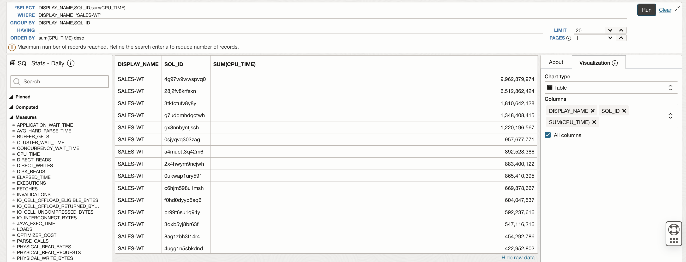

8. Under the **Visualization** tab on the right pane, select the following -

      **Chart type** : **Bar Chart**

      **Y axis** : **SUM(CPU\_TIME)**
      
      **X axis** : **DISPLAY\_NAME**
      
      **Series** : **SQL\_ID**
      
      **Color by** : **SQL\_ID**
      
      **Y axis title** : **CPU time (s)**
      
      **Legend** : **None**
      
      Check mark **Stacked**

      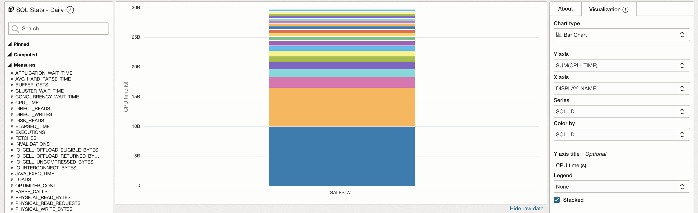

9. This will display the visualization as a Stacked Bar Chart.

10. In the second use case we will sum up all the Elapsed time per SQL ID across the fleet of Databases and then sort that in descending order.

11. On the **Ops Insights Overview** page, from the left pane click **SQL Insights** and then click **SQL Explorer**.

      

12. This will take you to the **SQL Explorer** page.

      

13. Enter the following SQL in the SQL query section

      ```
      <copy>SELECT DISPLAY_NAME,SQL_ID,sum(ELAPSED_TIME)
            WHERE
            ​GROUP BY DISPLAY_NAME,SQL_ID
            HAVING sum(ELAPSED_TIME)>70000000
            ORDER BYDISPLAY_NAME,sum(ELAPSED_TIME)desc</copy>
      ```

      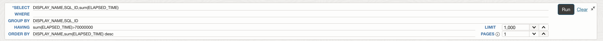

14. Enter **1000** for **LIMIT** to limit 1000 records per page.

15. Click **Run** to execute the query.

16. This will display the query result in a tabular format.

      

17. Under the **Visualization** tab on the right pane, select the following -

      **Chart type** : **Bar Chart**

      **Y axis** : **SUM(ELAPSED\_TIME)**
      
      **X axis** : **DISPLAY\_NAME**
      
      **Series** : **SQL\_ID**
      
      **Color by** : **SQL\_ID**
            
      **Legend** : **None**
      
      Check mark **Stacked**

      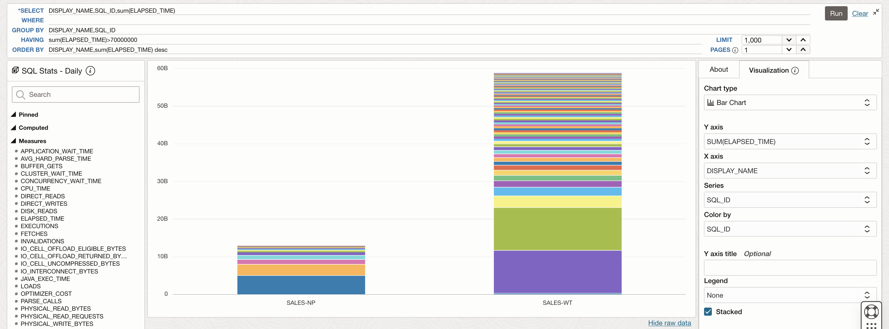

9. This will display the visualization as a Stacked Bar Chart.

## Acknowledgements

- **Author** - Vivek Verma, Master Principal Cloud Architect, North America Cloud Engineering
- **Contributors** - Vivek Verma, Sriram Vrinda, Derik Harlow, Murtaza Husain
- **Last Updated By/Date** - Vivek Verma, Apr 2024