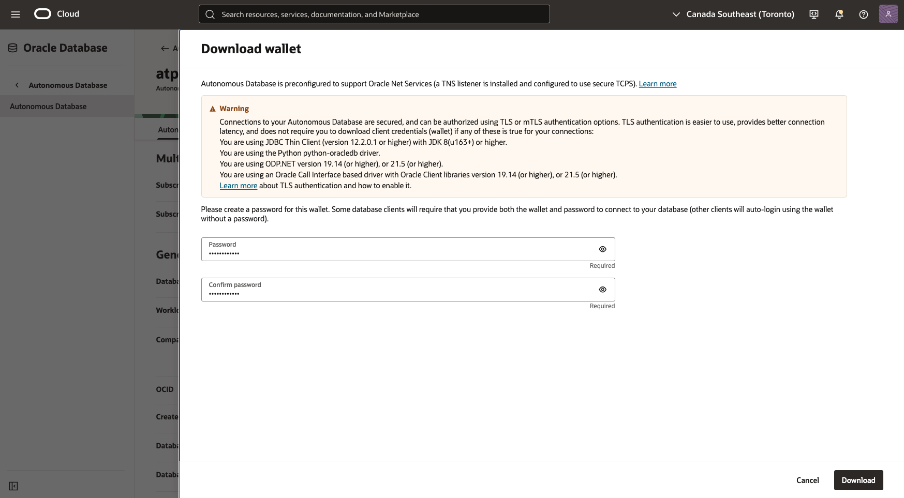
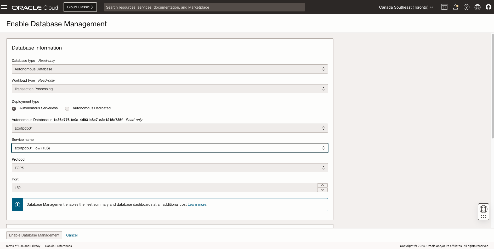

#  Setting up Database Management for Oracle Database@Azure Autonomous Databases

## Introduction

In this lab, you will go through the steps to set up Database Management for **Oracle Database@Azure Autonomous Database**.

**Database Management Service** now also supports **Oracle Database@Azure Autonomous Database**. You can use Database Management to monitor a single Autonomous Database or a fleet of Autonomous Databases and obtain meaningful insights from the metrics pushed to the Oracle Cloud Infrastructure Monitoring service.

Estimated Time: 60 minutes

### Objectives

Set up Database Management to monitor and manage **Oracle Database@Azure Autonomous Database**.

## Prerequisites

Assign proper IAM permissions

- From **Navigation Menu**, click **Identity & Security**, click **Policies**
- Click the existing policy MulticloudLink_ODBAA_20240227_DBM_Policy
- Add the following **Policy Statement** to the policy

    ```
    <copy>
    Allow service dpd to read secret-family in compartment MulticloudLink_ODBAA_20240105042431
    Allow service dpd to manage objects in compartment MulticloudLink_ODBAA_20240105042431
    Allow group odaa_dbmgmt-group to manage dbmgmt-family in tenancy 
    Allow group odaa_dbmgmt-group to manage autonomous-database-family in tenancy
    Allow group odaa_dbmgmt-group to read database-family in tenancy 
    Allow group odaa_dbmgmt-group to manage vnics in tenancy 
    Allow group odaa_dbmgmt-group to use subnets in tenancy 
    Allow group odaa_dbmgmt-group to use network-security-groups in tenancy 
    Allow group odaa_dbmgmt-group to use security-lists in tenancy 
    Allow group odaa_dbmgmt-group to manage secret-family in compartment MulticloudLink_ODBAA_20240105042431 
    Allow group odaa_dbmgmt-group to read metrics in compartment MulticloudLink_ODBAA_20240105042431 
    Allow group odaa_dbmgmt-group to manage alarms in compartment MulticloudLink_ODBAA_20240105042431 
    Allow group odaa_dbmgmt-group to manage ons-topics in compartment MulticloudLink_ODBAA_20240105042431 
    Allow group odaa_dbmgmt-group to manage management-dashboard-family in compartment MulticloudLink_ODBAA_20240105042431 
    </copy>
    ```

- Click **Save changes**

## Task 1: Grant a database user the privileges to monitor and management Autonomous Database and save the database user password in a secret

- Use **ADBSNMP** for **basic monitoring preferred credential**
- Use **ADMIN** user for **advanced diagnostic and administration preferred credential**
- Grant proper privileges for **DBM Diagnostic & Management features**
- In the left pane, click **Secrets**.
- Click **Create Secret**. 
- On the **Create Secret** page
- Create in Compartment: Select Compartment Name
- **Name**: <dbname\>_secret
- **Description**: Monitoring user password
- **Encryption Key**: Select OnM_key
- Select **Manual secret generation**
- **Secret Contents**: Enter the ADBSNMP or ADMIN user password
- Click **Create Secret**.
    
     

## Task 2: Configure network access between Database Management and the Autonomous Database

**Note**: if mutual TLS (mTLS) authentication is required, you must download the wallet and save it in a Vault service secret. This secret is required when enabling Diagnostics & Management for the Autonomous Database. 

- **Create a Database Management private endpoint in the Autonomous Database VCN**. If the Autonomous Database is in a private subnet in the VCN, it's recommended that the Database Management private endpoint also resides in the same subnet. If there's an existing Database Management private endpoint in the same VCN, you can reuse it even if it's not in the same subnet.

     

- **Add ingress and egress security rules** (TCP protocol, port 1521 or 1522) to NSG in the VCN to enable communication between the Database Management private endpoint and the Autonomous Database. If an NSG is not available, create one and add ingress and egress security rules on TCP protocol with a port used for JDBC for the subnet IP CIDR.

     

- Note that if the Autonomous Database and the Database Management private endpoint are not in the same subnet, you must:
    - Replace the JDBC port constraint with All on the non-database end.
    - Replace the subnet IP CIDR with the VCN IP CIDR.

## Task 3: Save the wallet in a Vault service secret for mTLS connections 

- **Download the wallet from the Autonomous Database details page**. For Autonomous Databases Serverless, it's recommended that you download the Regional wallet.

     

- Once you download the wallet, you must **extract the wallet_<databasename\>.zip file and save the SSO wallet, cwallet.sso file in a Vault service secret**. This secret can then be uploaded when enabling Diagnostics & Management for the Autonomous Database. Note that if you've not created a secret with the cwallet.sso file, you can also do so when enabling Diagnostics & Management.

     


## Task 4: Enable Database Management for Oracle Database@Azure Autonomous Database

- Open the **Navigation Menu**
- Click **Observability & Management**. 
- Under **Database Management**, click **Administration**.
- **On the left pane**, select a **compartment** in the Compartment drop-down list and Autonomous in the Deployment type drop-down list.
- On the Managed databases page, click **Enable Database Management**.

In the Enable Database Management panel, provide the information: 

- **Database type**: Select Autonomous.
- **Workload type**: Select the Autonomous Database workload type.
- **Deployment type**: Select the deployment type: Autonomous Serverless 
- **Autonomous Database**: Select the Autonomous Database. 
- **Service name**: The predefined connection profiles for the Autonomous Database are automatically displayed in the dbname\_<service name\> (TLS or Mutual TLS) format. 
- **Protocol**: The TCP or TCPS protocol used to connect to the Autonomous Database 
- **Port**: 1521(TCP) or 1522(TCPS)
- **Database wallet secret**: Select the secret that contains the wallet from the drop-down list. This field is only displayed if mTLS is appended to the service name. If an existing secret that contains the wallet is not available, then select Create new secret... in the drop-down list and save the cwallet.sso file in a secret.

     

- Provide the credentials for the database connection
- **Database username**: Enter admin
- **User password secret**: Select the secret from the drop down menu
- Click **Add policy** to create the policy for Database Management service to read the secret. 
- **Select connection mode**: select Private Endpoint from the drop-down menu
- **Management options**: select Full management
- Click **Enable Database Management**

     

- After you enable Database Management, you can click the **Work Requests** on the left pane under Resources to monitor the progress of the work request.
- After Database Management is successfully enabled, the **Enable** option next to Database Management on the Autonomous Database Details page is replaced with Enabled. A **Disable** option is also displayed, which you can click to disable Database Management.
- Click the **Autonomous Database** for which we just enabled Database Management to view Managed Database Details.

## Acknowledgements

- **Author** - Royce Fu, Master Principal Cloud Architect, North America Cloud InfrastructureEngineering
- **Contributors** - Royce Fu, Derik Harlow, Murtaza Husain, Sriram Vrinda
- **Last Updated By/Date** - Royce Fu, January 2025
