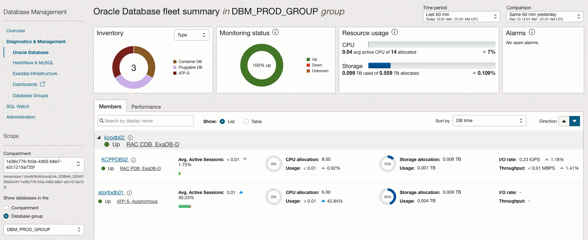
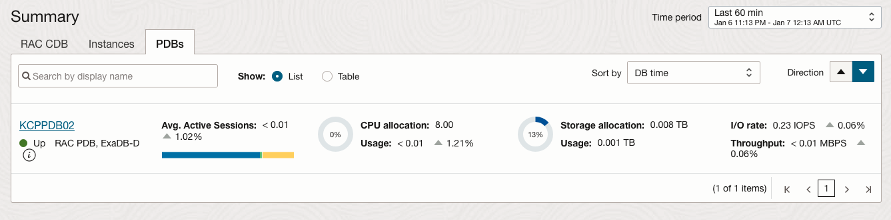
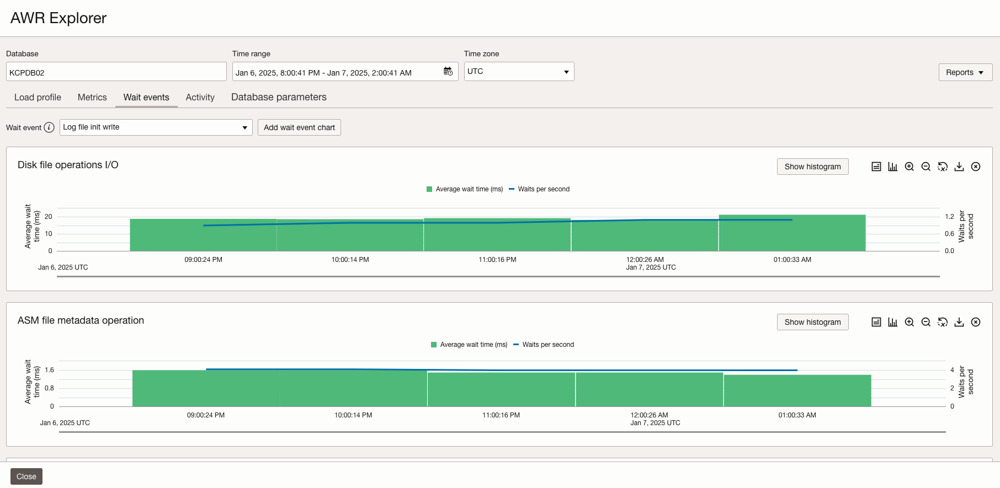
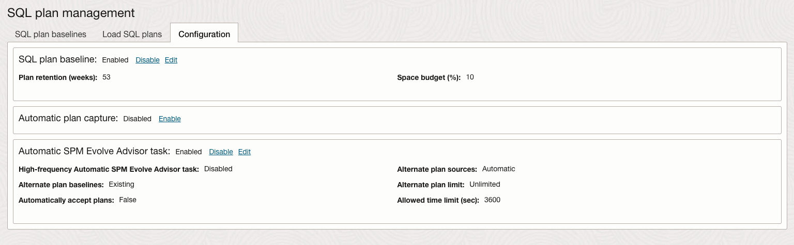

# Exploring Oracle Cloud Infrastructure Database Management for Oracle Database@Azure

## Introduction

Multicloud adoption allows businesses to harness the strengths of different cloud platforms while mitigating risks. However, monitoring and managing databases in a multicloud environment introduces unique challenges, requiring specialized approaches and solutions. You can use Diagnostics & Management features to monitor and manage Oracle Database@Azure. 

Estimated Time: 15 minutes

### Objectives

Fleet Monitoring and Management
-   Obtain an overview of your fleet of databases.
-   View the reports of the database fleet to obtain an insight into the overall health of the databases.
-   Automate database fleet management for enhanced operational efficiency.

Performance Diagnostics
-   Diagnose database performance issues quickly.
-   Explore database performance statistics for advanced diagnostics.

## Task 1: Getting Started with Database Management

1.  Login to the Oracle Cloud Console, click the **Navigation Menu** in the upper left, navigate to **Oracle Database**, and select **Oracle Exadata Database Service on Dedicated Infrastructure**.

2.  Navigate to the **Exadata VM Clusters** page and select the Oracle Database@Azure VM Cluster.

3.  Navigate to the **Databases** page and select the Oracle Database@Azure cloud database.

4.  On the **Database Information** page, navigate to **Associated services** section.

     

2.  The **Databases** tile (on the **Overview** page) displays the total number of Oracle Databases in the compartment and the number of Oracle Databases for which Database Management is enabled.

## Task 2: Monitoring a Fleet of Databases

1.  On the left pane, click **Diagnostic & Management** and then click **Oracle Database** to navigate to the **Oracle Database fleet summary** page. 

2.  The following tiles are available on the **Oracle Database fleet summary** page:

    - **Inventory**: Displays the number of Oracle Databases in the compartment by Type. 
    - **Monitoring Status**: Displays the availability status of the Oracle Databases. 
    - **Resource Usage**: Displays a summary of the overall CPU and Storage allocation and utilization and a change percentage that denotes the comparison of resource usage between the selected time and the comparison time period. *Note*: Use the menus at the top-right corner of the page to select two time periods to compare the performance and configuration metrics of the fleet of databases.
    - **Alarms**: Displays the alarms of the Oracle Databases. 

4.  On **Oracle Database fleet summary** page, by default, **Members** tab is selected to view the database fleet.

     

    For each database, the following metrics are displayed along with the change percentage that denotes the comparison of database metrics between the selected period and the comparison time period:
    - **Avg. Active Sessions**: Displays the average active sessions broken down by CPU, User I/O, and Others, which includes different categories within wait time such as System I/O and Commit.
    - **CPU**: Displays the CPU allocation and usage.
    - **Storage**: Displays the storage allocation and usage.
    - **I/O**: Displays the I/O rate and throughput.

5.  On **Oracle Database fleet summary** page, click the **Performance** tab. The Performance tab displays a tree map of the performance of your Oracle Databases against various database metrics. You can select the metric from the dropdown menu, such as DB time, CPU, Storage, Memory, and I/O. You can also use Group By drop down to group the databases by Type. This view is more useful when you have a large number of databases in the fleet. The databases are displayed as a collection of rectangles in different sizes and colors, in which the size of a rectangle indicates the value of the selected metric and the color indicates the change percentage for the selected metric over the selected time period.

## Task 3: Working with Database Groups

1.  Login to the Oracle Cloud Console, click the **Navigation Menu** in the upper left, navigate to **Observability & Management**, and select **Database Management**. Under **Diagnostic & Management** submenu **Oracle Database**, click **Database Groups**.

2.  Click **Create Database Group**. In the **Create Database Group** dialog, enter the name you want to assign to the new Database Group ex. dbmgmt\_pdbs\_group, optionally add a description, and click **Create Group**.

     

3.  On the **Database Groups** page, click the group named **dbmgmt\_prod\_group**. On the **Database Group Details** page of the **dbmgmt\_pdbs\_group** group, click **Add Managed Database**.

     

4.  On the **Database Groups Details** page, click **Fleet Summary**.

     

5.  On the **Fleet Summary** page you will see the summary of databases added to **dbmgmt\_pdbs\_group** Group.

     

## Task 4: Monitoring and Managing Individual Oracle Databases@Azure Databases

1.  On the left pane, click **Oracle Database** to navigate to the **Oracle Database fleet summary** page. Scroll down to the **Members** tab on the Fleet Summary page.

2.  Click the **kcpdb02** database in the **Members** tab. Sroll down to the Summary section, by default, **RAC CDB** tab is selected, you can see the monitoring status andperformance metrics of the selected RAC CDB.

     

3.  We can monitor RAC CDB database performance attributes in the **Summary** section, for the time period selected in the **Time Period** menu on the top of this page. Last 60 min is the default time period, and the visual representations or charts provide a quick insight into the health of the database during the selected time period.
 
     - **Monitoring status timeline:** Displays the monitoring status of the RAC CDB over the selected time period.
     - **Activity class (Avg. Active Sessions):** Displays the average active sessions in the selected time period, broken down by CPU, User I/O, and Wait. The total CPU count is denoted by a red line and enables you to monitor average active sessions compared to the CPU count.
     - **Activtiy:** Displays a summary of the average active sessions data broken down by CPU utilization or DB time. The total CPU count is denoted by a red line.
     - **I/O(MBPS):** Displays the I/O Throughput in MBPS and I/O Rate in IOPS broken down by Read and Write operations.
     - **Memory(GB):** Displays memory usage in GB, broken down by the memory usage in various components.
     - **Storage(TB):** Displays system storage and user data storage in TB. System storage is broken down by usage in system tablespaces and user data, and User Data storage is broken down by usage in the top five user tablespaces. The total storage allocation for the database is denoted by a red line and enables you to monitor storage usage compared to the total allocation.

4. You can also monitoring the performance of the RAC instances in the **Instances** tab.

     - **Monitoring status timeline:** Displays the monitoring status of the RAC instances over the selected time period.
     - **Activity class (Avg. Active Sessions):** Displays the average active sessions in the selected time period, broken down by RAC instances. 
     - **CPU utilization(%):** Displays CPU utilization by RAC instances.
     - **DB time(Avg. Active Sessions):** Displays DB Time by RAC instances and Wait, User I/O and CPU.
     - **I/O(MBPS):** Displays the I/O Throughput in MBPS and I/O Rate in IOPS broken down by Read and Write operations and RAC instances.
     - **Memory(GB):** Displays memory usage in GB, broken down by the memory usage in various components and RAC instances.

5. In order to monitor the performance of the PDBs from the CDB, you can click the **PDBs** tab. You can see the performance metrics of all PDBs from the CDB. You can monitor and visualize the monitoring status, Avg. Active Sessions, CPU allocation, Storage allocation, and I/O metrics of the PDBs over the selected time period.

     

## Task 6: Performing Database Performance Diagnostics for the Oracle Database@Azure

1.  On the left pane **Resources** section, click the **Performance Hub** button. This will launch the **Performance Hub** page. Performance Hub provides a single view of the database’s performance and enables you to perform the rapid diagnosis of its issues.

     

     Performance Hub provides holistic performance management capabilities providing a single view of the database performance using a varied set of features, such as Active Session History Analytics, Real-time SQL Monitoring, Automatic Database Diagnostics Monitoring (ADDM), Blocking sessions, and so on.

     **ASH Analytics** allows you to analyze and resolve transient performance problems that can last for only a short period, such as why a particular job or session is not responding when the rest of the instance is performing as usual. It also allows you to perform scoped and targeted analysis by various dimensions and their combinations, such as time, session, module, action, or SQL identifier.

3.  Stay in **Performance Hub**, scroll down and click the **SQL Monitoring** tab.

     

     With Real-Time SQL Monitoring, you can perform complex run-time application SQL analysis, identity, and guide optimization of application calls in the data tier.

     Real-Time SQL Monitoring gives you the following capabilities:

     - Observe and analyze important SQL executions in progress (parallel and long-running queries)
     - Perform detailed and comprehensive execution analysis
     - Resource footprint per query plan step
     - Parallel plan skew across query workers
     - Visualize query plans interactively
     - Perform real-time and historical analysis

4.  In **Performance Hub**, scroll down and click the **ADDM** tab.

     

     The statistical data needed for the accurate diagnosis of a problem is saved in the Automatic Workload Repository (AWR) of the Oracle Database. The Automatic Database Diagnostic Monitor (ADDM) analyzes the AWR data regularly, locates the root causes of the performance problems, provides recommendations for correcting any problems, and identifies non-problem areas of the system. You can use ADDM to analyze performance issues after the event, often saving the time and resources needed to reproduce a problem.

     ADDM gives you the following capabilities:

     - Identify the root cause of a problem, not symptoms
     - Get recommendations for treating the root causes of problems
     - Identify non-problem areas of the system

5.  In **Performance Hub**, scroll down and click the **Exadata** tab.

     

     The **Exadata** tab provides a unified view of Oracle Exadata hard disk and flash performance statistics. *Note*: **Exadata** tab is only available for when launching **Performance Hub** from a CDB.

     It gives a deep insight into the health and performance of system components including the databases, Exadata storage cells, and Automatic Storage Management (ASM). You can use the Exadata tab for enhanced performance diagnostics for Exadata databases.

     Exadata provides the following capabilities:

     - Analyze outliers that affect database performance, including finding a slow disk component that is affecting the system
     - Analyze performance characteristics of multiple databases deployed in an Exadata system
     - Identify a high I/O load and classify the load as Backup, Rebalance, User I/O, and others
     - Identify CPU bound cells and determine cell offload
     - Identify configurations such as versions and disk status

## Task 7: Performing Other Database Performance Diagnostics for the Oracle Database@Azure

1.  You can click one of the other options on the left pane under Resources to perform the following tasks:

     - **Alert logs:** Monitor the alert and attention logs generated for the Managed Database in a selected time period. 
     - **AWR Explorer:** Explore and analyze AWR data for a Managed Database and use it as a central repository to import, analyze, and compare AWR data from other databases. 
     - **SQL Tuning Advisor:** Use SQL Tuning Advisor to analyze SQL statements and obtain recommendations on how to tune SQL statements, along with the rationale and expected benefit.
     - **SQL tuning sets:** Manage SQL tuning sets and perform tasks such as creating and monitoring SQL tuning sets and loading SQL statements into SQL tuning sets. 
     - **SQL plan management:** Manage SPM configuration and monitor SQL plan baselines for a Managed Database.
     - **Search sessions:** Specify conditions and filters to search for current sessions in the Managed Database. 
     - **Tablespaces:** Monitor the tablespaces and datafiles stored in each tablespace in the Managed Database. You can also perform storage management tasks such as creating a tablespace and adding datafiles.
     - **Users:** View the users created in the Oracle Database. 
     - **Database parameters:** View and edit the database parameters for the Managed Database. 
     - **Data Guard:** Monitor the performance of the primary and standby databases that are a part of an Oracle Data Guard configuration. 
     - **Cluster cache:** Monitor cluster cache metrics to identify processing trends and optimize the performance of your RAC database.
     - **Jobs:** View the jobs defined for the Managed Database, if any. You can use the options available in the Jobs section to create a job for the Managed Database and monitor job runs and executions. 
     - **Credentials:** Set credentials to access, monitor and manage the Managed Database. 
     - **Alarm definitions:** Create Oracle-recommended alarms and perform other alarm-related tasks in Database Management. 
     - **Associated database groups:** View the Database Groups the Managed Database is a part of, if any.

2. Use AWR Explorer to analyze database performance.Under **Resources** section, click **AWR Explorer** to navigate to the **AWR Explorer** page.

     

     You can use AWR Explorer to explore and analyze AWR data for a Managed Database and use it as a central repository to import, analyze, and compare AWR data from other databases. AWR Explorer in Database Management is an integration of performance and data visualization tools, which displays the historical performance data from AWR snapshots in easy-to-interpret charts. It enables you to visualize AWR data in a single interface, thereby allowing you to analyze performance trends and detect issues.

     Using AWR Explorer, you can:

     - Troubleshoot performance issues by analyzing AWR Load Profile, Metrics, and Wait Events
     - Compare AWR data from different databases
     - Visualize AWR data in charts

3. Analyze SQL with SQL Tuning Advisor. Under **Resources** section, click **SQL Tuning Advisor** to navigate to the **SQL Tuning Advisor** page.

     

     SQL tuning is an important aspect of database system performance tuning. SQL Tuning Advisor is a mechanism for resolving problems related to sub-optimally performing SQL statements. It takes one or more SQL statements or one SQL Tuning Set (STS) as input and invokes the Automatic Tuning Optimizer to analyze the statements. 

     SQL Tuning Advisor generates output that provides the following findings and recommendations:

     - Collection of object statistics
     - Creation of indexes
     - Rewriting SQL statements
     - Creation of SQL profiles
     - Creation of SQL plan baselines

4. Use SPM to manage SQL execution plans. Under **Resources** section, click **SQL Plan Management** to navigate to the **SQL Plan Management** page.

     

     SPM is a preventative mechanism that enables the Oracle optimizer to automatically manage SQL plans, ensuring that the database uses only known or verified plans. The performance of any database application heavily relies on consistent SQL statement execution. A SQL statement’s execution plan can change unexpectedly for a variety of reasons such as regathering optimizer statistics, changes to the optimizer parameters or schema or metadata definitions. SPM provides "plan stability" through a framework that preserves the current SQL plans amidst environment changes, yet allows changes only for better plans. When a new SQL plan is found for a SQL statement, it will not be used until it has been verified to have comparable or better performance than the current plan.

     You can perform the following SPM tasks in Database Management:

     - Manage SQL plan baselines.
     - Submit tasks to load SQL plans into SQL plan baselines.
     - Perform configuration tasks such as enabling, disabling, or editing SQL plan baseline, automatic plan capture, and Automatic SPM Evolve Advisor task parameters.

## Conclusion

Oracle Database Management offers comprehensive monitoring and management capabilities for your Oracle Database@Azure fleet. Through its unified interface, you can monitor database performance metrics, manage database groups, analyze AWR data, optimize SQL performance, and maintain SQL plan stability. The service enables proactive issue detection across your database fleet while providing powerful diagnostic tools like SQL Tuning Advisor and SQL Plan Management to resolve performance bottlenecks. This integrated approach streamlines database administration tasks and helps ensure optimal database operations in your multicloud environment.

## Acknowledgements

- **Author** - Royce Fu, Master Principal Cloud Architect, North America Cloud Infrastructure Engineering
- **Contributors** - Royce Fu, Derik Harlow, Murtaza Husain, Sriram Vrinda
- **Last Updated By/Date** - Royce Fu, January 2025

