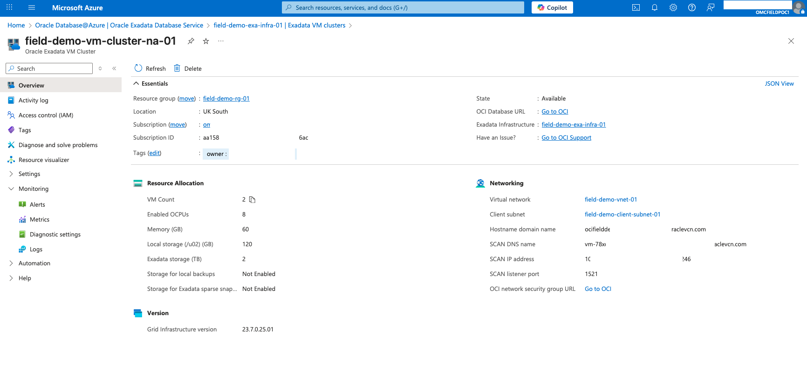
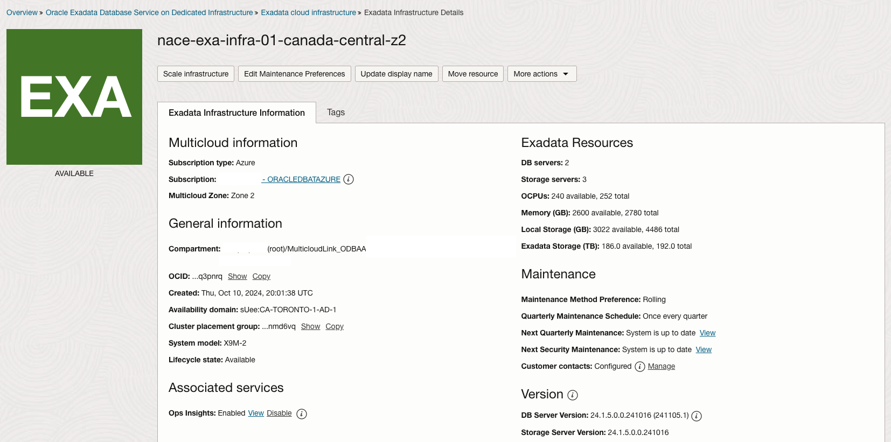
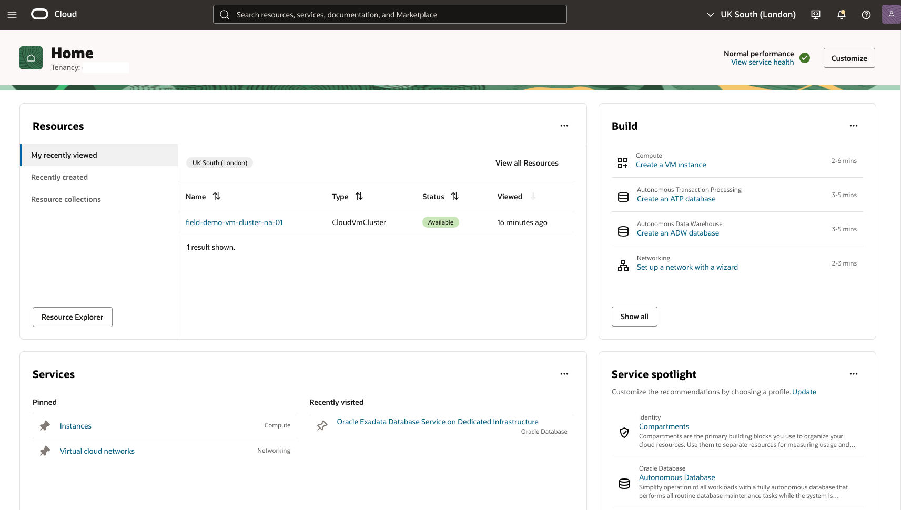

# Get started - Oracle Database@Azure Cloud login

## Introduction

Oracle Database@Azure enables you to run your mission-critical Oracle databases on Oracle Exadata Database Service on Dedicated Infrastructure in Microsoft Azure data center.

Oracle Database@Azure brings Oracle technologies—such as Oracle Exadata Database Service, Oracle Autonomous Database, Oracle Real Application Clusters (Oracle RAC), Oracle Database Autonomous Recovery Service, and Oracle Data Guard—into Microsoft Azure. Take advantage of the built-in high availability, performance, and scalability provided by Oracle Exadata Database Service and Oracle Real Application Clusters (Oracle RAC) while benefiting from low-latency to your Azure applications.

Estimated Time: 10 minutes

### Objectives
- Learn how to log in to Oracle Cloud Console from Microsoft Azure Portal

### Prerequisites
- Oracle Database@Azure Private offer is accepted.
- Microsoft Azure subscription with Oracle Database@Azure is registered.
- New OCI Tenant is created and the service limits are increased for Database Management Service and Ops Insights.
- Oracle Database@Azure service activated
- Oracle Database@Azure Exadata infrastructure including VM Clusters, Databases are provisioned.

## Task 1: Check the Oracle Database@Azure subscription in Microsoft Azure Portal

- Login to **Microsoft Azure Portal**

    

- Navigate to the **Oracle Database@Azure**
- Click on the **Oracle Exadata Database Service**
- Click on the corresponding Oracle Exadata Infrastructure entity

    

- Click the hyperlink **Go to OCI** to open the Oracle Cloud Console

    

- If multi-factor authentication is enabled, complete the verification process

- You will be redirected to the Oracle Cloud Console Exadata Infrastructure Details page.

    

## Task 2: Log in to Oracle Cloud

If you've signed out of the Oracle Cloud, use these steps to sign back in.

1. Go to [cloud.oracle.com](https://cloud.oracle.com) and enter your Cloud Account Name and click **Next**. This is the name you chose while creating your account in the previous section. It's NOT your email address. If you've forgotten the name, see the confirmation email.

    

2. Choose **Azure Entra ID**

    

4. Based on the Multi-factor authentication setup for your account, provide authentication to sign into the account. For example, click **Allow** on the app or enter your **authentication code** and click **Verify** based on the authentication setup. For more details, refer the [Managing Multifactor Authentication documentation](https://docs.oracle.com/en-us/iaas/Content/Identity/Tasks/usingmfa.htm)

    

    

5. After verification, you will be signed in to Oracle Cloud! 

    

You may now **proceed to the next lab**.

## Acknowledgements
- **Author** - Royce Fu, Master Principal Cloud Architect, North America Cloud Infrastructure and Engineering
- **Contributors** -  Derik Harlow, Murtaza Husain, Sriram Vrinda
- **Last Updated By/Date** - Royce Fu, January 2025