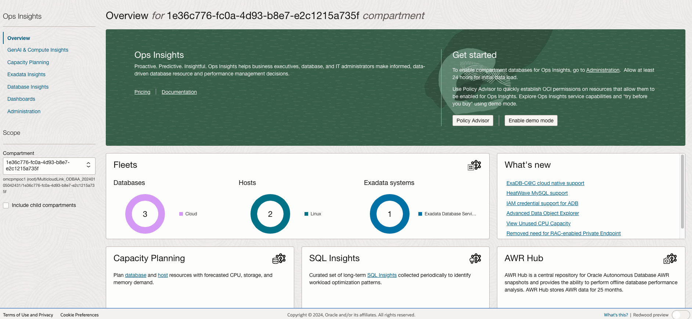
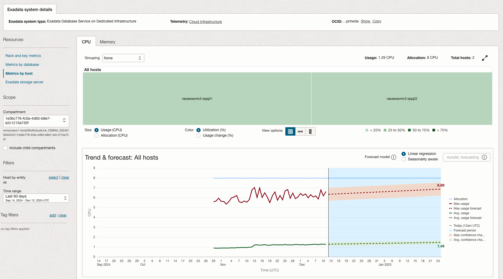
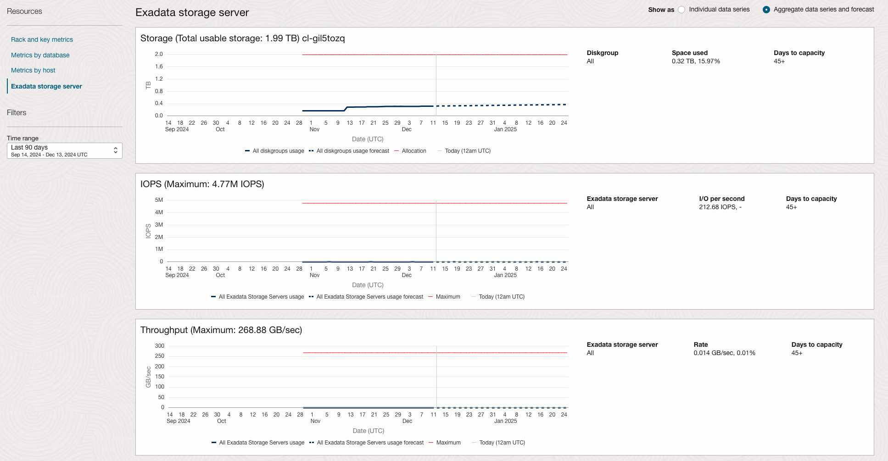
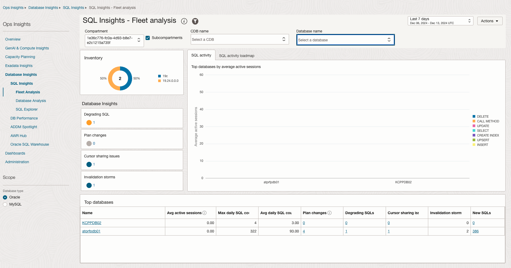
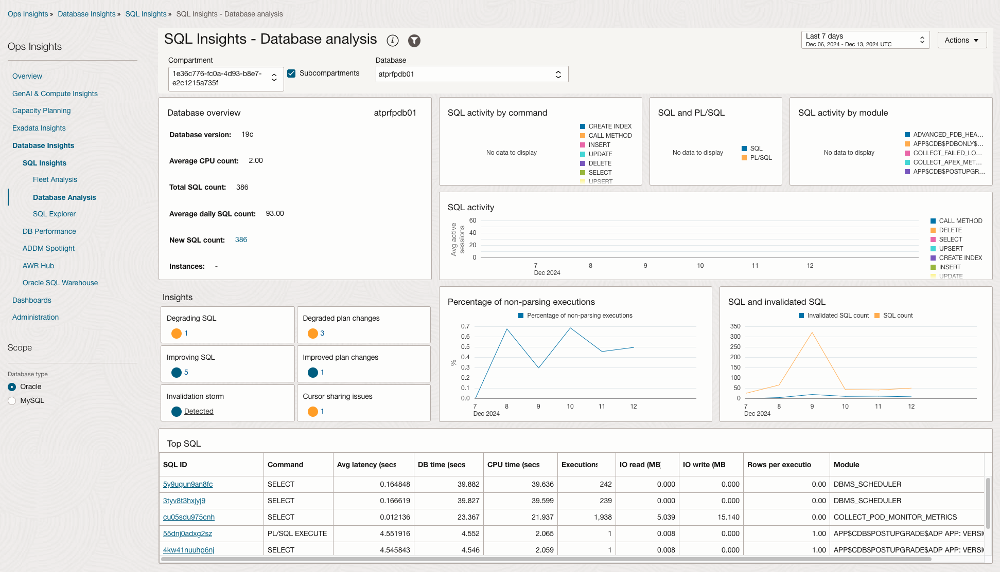

# Exploring Oracle Cloud Infrastructure Ops Insights for Oracle Database@Azure

## Introduction

Oracle Cloud Infrastructure Ops Insights is an Oracle Cloud Infrastructure (OCI) native service that provides holistic insight into database and host resource utilization and capacity. Ops Insights (OPSI) provides capacity planning, long-term SQL analysis, and historical performance reports for your Oracle databases. The service has a full offering of features to improve performance and reduce overhead for your resources. The ability to quickly and easily ingest valuable metric data allows administrators, engineers, and executives to make informed decisions on allocating resources to prevent major issues and reduce overhead for managing their infrastructure resources.

Estimated Time: 15 minutes

### Objectives

-   Utilize predictive insights to forecast database and host resource consumption for long-term capacity planning. 
-   Uncover database performance issues using SQL Insights and ADDM Spotlight.
-   Make data-driven decisions to optimize resource use, proactively avoid outages, and improve performance.

## Task 1: Getting Started with Oracle Database@Azure Ops Insights

*  Login to the Oracle Cloud Console, click the **Navigation Menu** in the upper left, navigate to **Oracle Database**, and select **Oracle Exadata Database Service on Dedicated Infrastructure**.

*  Navigate to the **Exadata VM Clusters** page and select the Oracle Database@Azure VM Cluster.

*  Navigate to the **Databases** page and select the Oracle Database@Azure cloud database.

*  On the **Database Information** page, navigate to **Associated services** section. 

*  Click **View** for Ops Insights.

     
     

## Task 2: Exadata Insights

*  On the **Ops Insights Overview** page, from the left pane select the **Exadata Insights**.

      

*  On the **Overview** page, click on **Exadata Insights** from the left pane.

      

*  This will show the Exadata systems registered for Ops Insights.

      

*  On this page, the aggregate view of all the discovered Exadata systems will be shown.

      

*  Also, the current and forecast utilization of the Exadata system will be shown in the bottom section. Click on the Oracle Database@Azure Exadata system to evaluate more insights. 

      

*  On the **Exadata System Details** page, you can view **Rack and Key Metrics**. The page displays Software and Hardware Summary.

      

*  Navigate to **Metrics by Database** on the left pane.

      

*  Click **Metrics by Host** on the left pane.

*  On the **Metrics by Host** page, click on the **CPU** tab, select Grouping **None** to see the aggregate trend & forecast for All Hosts. 

      

*  Now choose **Allocation(CPU)** under **Size** and **Usage Change (%)** under **Color**.Select the **Seasonality aware** radio button. 

      

*  Click the **Exadata Storage Server** option on the left pane.

      

* Select **Aggregate data series and forecast** on the top right pane to show total individual storage utilization.
      

## Task 3: SQL Insights

*  On the **Ops Insights Overview** page, from the left pane select the **Database Insights** which will take you to **SQL Insights** landing page.

      

*  On the **SQL Insights** page, from the left pane select the **Database Analysis** page.

      

*  On the **Insights** section, to look at the Degraded SQL due to the plan changes, click the number under **Degraded plan changes**.

      

*  It will bring up the page for the **Top 50 degraded plan changes**.

      

*  Click on the **SQL ID: cu05sdu975cnh** to see the details of the SQL.

      

## Conclusion

OCI Ops Insights enables administrators to uncover performance issues, forecast consumption, and plan capacity using machine-learning-based analytics on historical and SQL data. Organizations can use these capabilities to make data-driven decisions to optimize resource use, proactively avoid outages, and improve performance.

## Acknowledgements

- **Author** - Royce Fu, Master Principal Cloud Architect, North America Cloud Infrastructure Engineering
- **Contributors** - Royce Fu, Derik Harlow, Murtaza Husain, Sriram Vrinda
- **Last Updated By/Date** - Royce Fu, January 2025

