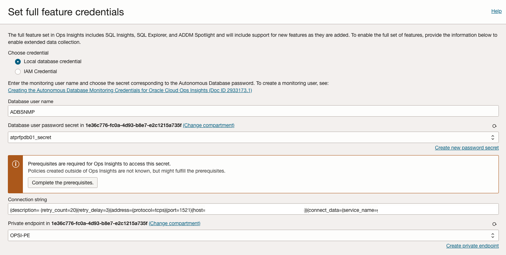

# Enabling Ops Insights for Oracle Database@Azure Autonomous Database

## Introduction

Ops Insights allows you to perform advanced and basic collections on your Autonomous Databases via a private endpoint or through secure access from anywhere. These connection methods allows Ops Insights to connect to the database directly and enable Full Features collection, which includes SQL Explorer and ADDM Spotlight.

With Ops Insights you can:
- Analyze resource usage of databases/hosts across the enterprise
- Forecast future demand for resources based on historical trends
- Compare SQL Performance across databases and identify common patterns
- Identify SQL performance trends across enterprise-wide databases
- Analyze AWR statistics for database performance, diagnostics, and tuning across a fleet of databases
- Create and receive weekly News Reports giving you breakdowns of new utilization highs, big utilization changes and inventory changes across your fleet of databases, hosts, and Exadata systems.

In this lab, you will go through the steps to enable Ops Insights for Oracle Database@Azure Exadata Database Service on Dedicated Infrastructure databases, allowing you to gain insight into Capacity Planning and SQL Insights functionality.

### Technical Architecture


Estimated Time: 30 minutes

### Objectives

- Analyze resource usage of databases/hosts across the enterprise
- Forecast future demand for resources based on historical trends
- Compare SQL Performance across databases and identify common patterns
- Identify SQL performance trends across enterprise-wide databases

## Task 1: Setting Up IAM Policies

Ops Insights requires specific permissions:
- Create a Group and assign users to the group: Establish a user group for Ops Insights admins.
- Define Policies: Write policies that grant the group permissions to use Ops Insights features.

    ```
    allow service operations-insights to read autonomous-database-family in tenancy where ALL{request.operation='GenerateAutonomousDatabaseWallet'}
    allow service operations-insights to read secret-family in tenancy where ANY{target.secret.id='<SecretId>'}
    Allow group odaa_dbmgmt-group to manage opsi-family in compartment MulticloudLink_ODBAA_20240105042431
    Allow group odaa_dbmgmt-group to manage management-dashboard-family in compartment MulticloudLink_ODBAA_20240105042431
    Allow group odaa_dbmgmt-group to use database-family in compartment MulticloudLink_ODBAA_20240105042431
    allow group opsi-admins to read cloud-exadata-infrastructures in tenancy
    allow group opsi-admins to read cloud-vmclusters in tenancy
    Allow group odaa_dbmgmt-group to manage virtual-network-family in compartment MulticloudLink_ODBAA_20240105042431
    Allow group odaa_dbmgmt-group to read secret-family in compartment MulticloudLink_ODBAA_20240105042431 where any { target.vault.id = 'ocid1.vault.oc1.iad.example}
    Allow service operations-insights to read secret-family in tenancy where any { target.vault.id = 'ocid1.vault.oc1.iad.example' }
    ```

- Database user permission

    ```
    SQL> GRANT SELECT ANY DICTIONARY, SELECT_CATALOG_ROLE TO DBSNMP;
    ```

- To enable IAM connections for your Autonomous Databases using the Ops Insights script (recommended method) follow these steps:

    - Create a dynamic group containing the OPSI resource (for example, iam_admin_dg_grp):

    ```
    All {instance.compartment.id = '<compartmentid>', request.principal.type='opsidatabaseinsight'}
    ```

**Run the credential creation script, located in MOS note: OCI : Creating the Autonomous Database Monitoring Credentials for Oracle Cloud Operations Insights (Doc ID 2933173.1)**

## Task 2: Create Ops Insights Private Endpoint

The **private endpoint** is a representation of Ops Insights in the VCN in which the Oracle Cloud Database can be accessed, and acts as a Virtual Network Interface Card (VNIC) with private IP addresses in a subnet of your choice. The private endpoint does not have to be on the same subnet as the Oracle Cloud Database, but it must be on a subnet that can communicate with the Oracle Cloud Database.

**Ops Insights** lets you create a private endpoint for Oracle Cloud Databases. You can create a maximum of five Ops Insights private endpoints in your tenancy (per region) to connect to Oracle Base Databases, Exadata Database Service on Dedicated Infrastructure, and Autonomous Databases. There is no set limit or restriction on the number of databases for which you can enable Ops Insights using a single private endpoint. The private endpoint requires one private IP in the subnet.

Refer to Database Management Service Create Private Endpoint for detailed steps: 
     


## Task 3: Enable Network Communication between Ops Insights and the Databases

You must enable communication between Ops Insights and the Oracle Cloud Database by adding the ingress and egress security rules to an NSG or a Security List in the VCN in which the Oracle Database@Azure Cloud Databases can be accessed.

For Ops Insights to communicate with the Oracle Cloud Database, you must add ingress and egress security rules using either Network Security Groups (NSG) or Security Lists. The following examples illustrate how to enable communication between an Ops Insights private endpoint and the Oracle Databases@Azure DB system using Security Lists.

- Add security rules to a Security List to enable communication between an Ops Insights private endpoint and Oracle Database@Azure primary subnet
    

- Ingress rule for the Oracle Database@Azure VCN: The Oracle Database@Azure primary subnet can receive incoming traffic from the Ops Insights private IP address (10.0.0.6/32) from any port.
    

- Egress rule for the Ops Insights private endpoint: The Ops Insights private IP address (from any port) can send requests to the Oracle Database@Azure primary subnet (10.0.0.0/16) on port 1521.
    

## Task 4: Enable Ops Insights for Autonomous Databases

To enable one or more Autonomous Databases for Ops Insights, log in to OCI Console and do the following:
- Open the **Navigation Menu** and click **Observability and Management**. Under **Ops Insights**, click **Administration** and then **Database Fleet**.
- Click **Add Databases**. 
- Under Telemetry click on **Cloud Infrastructure**. 
- Under cloud database type select **Autonomous Oracle Databases**.
- Select the **Compartment**
- Select one or more Autonomous Databases to enable. 

- To enable Full Feature collections click on **Set connection properties** to setup the Full Feature connection. This opens the **Set full feature credentials** window, setup the **Local credential**.

    

- Enter the monitoring user name and choose the secret corresponding to the Autonomous Database password. To create a monitoring user, see: Creating the Autonomous Database Monitoring Credentials for Oracle Cloud Ops Insights (Doc ID 2933173.1)

- Select the **Local Credential** radio button
- Enter the **Database user name**: ADBSNMP
- Enter the **Database user password secret** and verify the compartment chosen
- Select the **Private Endpoint** from the drop-down
- Click **Add Databases**. 
- Once the state shows as Active the process has successfully completed.

## Acknowledgements

- **Author** - Royce Fu, Master Principal Cloud Architect, North America Cloud Infrastructure Engineering
- **Contributors** - Royce Fu, Derik Harlow, Murtaza Husain, Sriram Vrinda
- **Last Updated By/Date** - Royce Fu, January 2025
