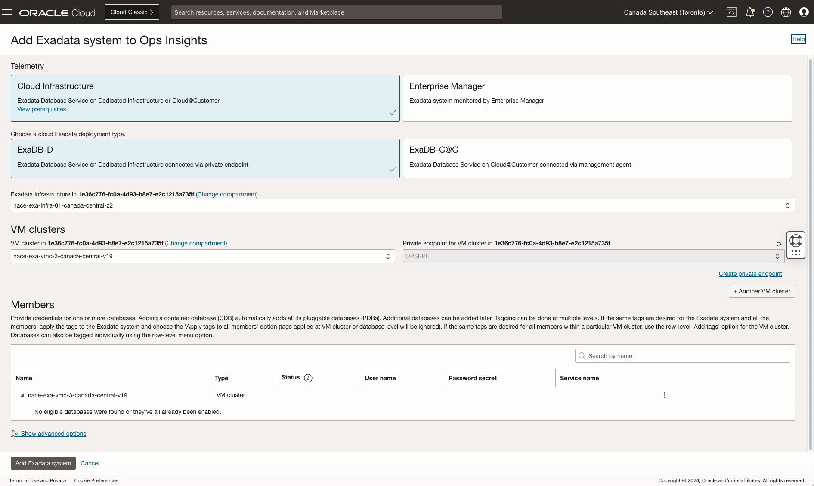

# Enable Oracle Cloud Infrastructure Ops Insights for Oracle Database@Azure Exadata Infrastructure

## Introduction

Oracle Cloud Infrastructure Ops Insights is an OCI native service that provides holistic insight into database and host resource utilization and capacity.
With Ops Insights you can:
* Analyze resource usage of databases/hosts across the enterprise
* Forecast future demand for resources based on historical trends
* Compare SQL Performance across databases and identify common patterns
* Identify SQL performance trends across enterprise-wide databases
* Analyze AWR statistics for database performance, diagnostics, and tuning across a fleet of databases
* Create and receive weekly News Reports giving you breakdowns of new utilization highs, big utilization changes and inventory changes across your fleet of databases, hosts, and Exadata systems.

In this lab, you will go through the steps to enable Ops Insights for Oracle Database@Azure Exadata Database Service on Dedicated Infrastructure databases, allowing you to gain insight into Capacity Planning and SQL Insights functionality.

### Technical Architecture


Estimated Time: 30 minutes

### Objectives

- Analyze resource usage of databases/hosts across the enterprise
- Forecast future demand for resources based on historical trends
- Compare SQL Performance across databases and identify common patterns
- Identify SQL performance trends across enterprise-wide databases

## Task 1: Setting Up IAM Policies

**Ops Insights** requires specific permissions:

- Create a Group and assign users to the group: Establish a user group for Ops Insights admins.
- Define Policies: Write policies that grant the group permissions to use Ops Insights features.

    ```
    Allow group odaa_dbmgmt-group to manage opsi-family in compartment MulticloudLink_ODBAA_20240105042431
    Allow group odaa_dbmgmt-group to manage management-dashboard-family in compartment MulticloudLink_ODBAA_20240105042431
    Allow group odaa_dbmgmt-group to use database-family in compartment MulticloudLink_ODBAA_20240105042431
    allow group opsi-admins to read cloud-exadata-infrastructures in tenancy
    allow group opsi-admins to read cloud-vmclusters in tenancy
    Allow group odaa_dbmgmt-group to manage virtual-network-family in compartment MulticloudLink_ODBAA_20240105042431
    Allow group odaa_dbmgmt-group to read secret-family in compartment MulticloudLink_ODBAA_20240105042431 where any { target.vault.id = 'ocid1.vault.oc1.iad.example}
    Allow service operations-insights to read secret-family in tenancy where any { target.vault.id = 'ocid1.vault.oc1.iad.example' }
    ```

- Database user permission

    ```
    SQL> GRANT SELECT ANY DICTIONARY, SELECT_CATALOG_ROLE TO DBSNMP;
    ```

## Task 2: Create Ops Insights Private Endpoint

The private endpoint is a representation of Ops Insights in the VCN in which the Oracle Cloud Database can be accessed, and acts as a Virtual Network Interface Card (VNIC) with private IP addresses in a subnet of your choice. The private endpoint does not have to be on the same subnet as the Oracle Cloud Database, but it must be on a subnet that can communicate with the Oracle Cloud Database.

Ops Insights lets you create a private endpoint for Oracle Cloud Databases. You can create a maximum of five Ops Insights private endpoints in your tenancy (per region) to connect to Oracle Base Databases, Exadata Database Service on Dedicated Infrastructure, and Autonomous Databases. There is no set limit or restriction on the number of databases for which you can enable Ops Insights using a single private endpoint. The private endpoint requires one private IP in the subnet.

Refer to Database Management Service Create Private Endpoint for detailed steps: 
    


## Task 3: Enable Network Communication between Ops Insights and the Databases

You must enable communication between Ops Insights and the Oracle Cloud Database by adding the ingress and egress security rules to an NSG or a Security List in the VCN in which the Oracle Database@Azure Cloud Databases can be accessed.

For Ops Insights to communicate with the Oracle Cloud Database, you must add ingress and egress security rules using either Network Security Groups (NSG) or Security Lists. The following examples illustrate how to enable communication between an Ops Insights private endpoint and the Oracle Databases@Azure DB system using Security Lists.

- Add security rules to a Security List to enable communication between an Ops Insights private endpoint and Oracle Database@Azure primary subnet
    


- Ingress rule for the Oracle Database@Azure VCN: The Oracle Database@Azure primary subnet can receive incoming traffic from the Ops Insights private IP address (10.0.0.6/32) from any port.

    


- Egress rule for the Ops Insights private endpoint: The Ops Insights private IP address (from any port) can send requests to the Oracle Database@Azure primary subnet (10.0.0.0/16) on port 1521.

    


## Task 4: Enabling Ops Insights for Oracle Database@Azure Exadata fleet 

With a private endpoint defined, you’re ready to add an Exadata Database Service on Dedicated Infrastructure that uses that endpoint. You can add Exadata Database Service on Dedicated Infrastructures from the Private Endpoint Details page or from the Exadata Fleet Administration page.

- From the **Ops Insights** main menu, click **Administration** and then **Exadata Fleet**.
- Click **Add Exadata System**. The **Add Exadata Systems** to Ops Insights dialog displays.
- Telemetry Type: select **Cloud Infrastructure**
- Exadata Deployment Type: select **EXADB-D**
- Under **Exadata Infrastructure** in <compartment name>, select the desired **Exadata Infrastructure** from the drop-down menu. 

- Select the **VM Cluster** and **Private Endpoint** from their respective drop-down menus to change the default values, if necessary.
- To enable a member Container Database for Ops Insights, you must set the credentials. Click **Set Credentials** to display the **Set Container Database Credentials** dialog.
- Enter the required credential information and click **Set Credentials**.

    

- Click **Add Exadata System**. The Exadata Details page for the new system displays

    

## Conclusion

Exadata Insights provides comprehensive capacity analysis to give administrators the ability to view, analyze, proactively forecast, and detect potential constraints in Exadata resources. As a system administrator they want to be able to make critical decisions to optimize their Exadata stacks; plan for growth, compare resource usage and perform what-if analysis for various scenarios.

## Acknowledgements

- **Author** - Royce Fu, Master Principal Cloud Architect, North America Cloud Infrastructure Engineering
- **Contributors** - Royce Fu, Derik Harlow, Murtaza Husain, Sriram Vrinda
- **Last Updated By/Date** - Royce Fu, January 2025
